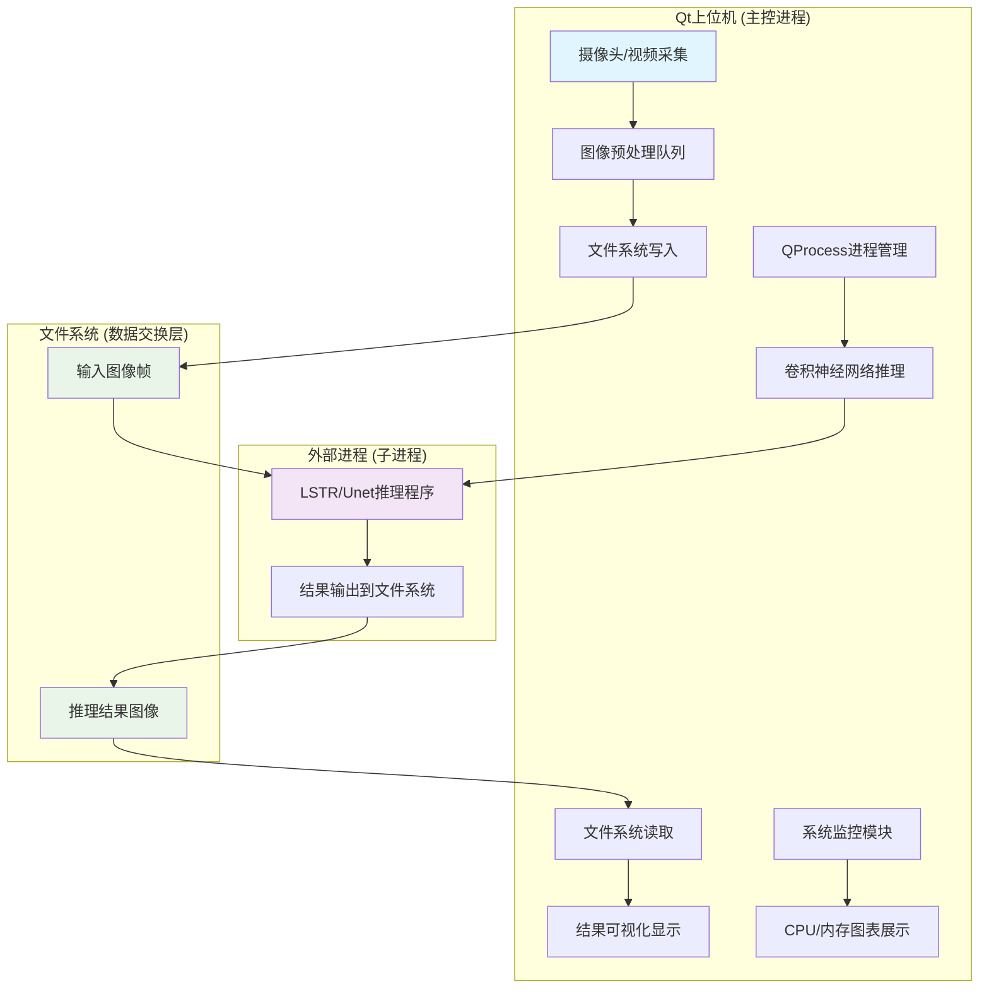
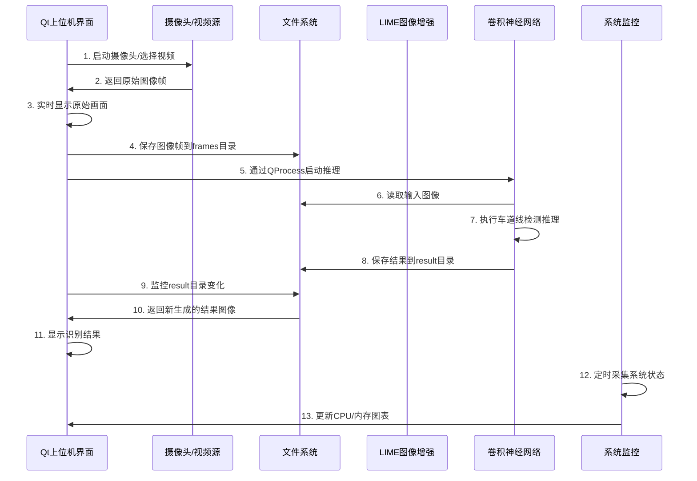

# 模块间协作与进程间通信机制

<!-- WIKI_NAV_START -->
> [!info] 视觉感知 Wiki 导航
> [[projects/linux视觉感知项目/index|项目首页]] · [[projects/Linux视觉感知项目/03 模型推理部署/4.1 LSTR模型架构与曲线解码|← 上一篇：3.2.4 卷积神经网络推理模块（LSTR 与 Unet）]] · [[projects/Linux视觉感知项目/02 LIME 低照度增强/3.1 算法原理：Retinex与光照图|下一篇：4.1.1 LIME 算法原理：Retinex 理论与光照图估计 →]]
<!-- WIKI_NAV_END -->

## 系统通信架构总览

Linux视觉感知处理系统采用**分层解耦**的设计思想，各核心模块（Qt上位机、LIME图像预处理、卷积神经网络推理）通过**文件系统**作为主要数据交换媒介，结合**QProcess进程管理**和**Qt信号槽机制**实现模块间协作。这种设计在无GPU的ARM FT2000/4平台上，既保证了模块独立性，又降低了系统耦合度。



## 进程间通信机制详解

### QProcess 进程管理与外部程序调用

Qt上位机通过`QProcess`类管理外部卷积神经网络推理进程，实现了主进程与推理进程的分离。这种设计避免了重计算任务阻塞UI线程，保证了界面响应性。

```cpp
// 在MainWindow构造函数中初始化进程
process2 = new QProcess;
process3 = new QProcess;
// 启动bash终端作为命令执行环境
process2->start("bash");
process3->start("bash");
process2->waitForStarted();
process3->waitForStarted();
```

**进程创建与初始化**：系统创建了两个QProcess实例：`process2`用于控制卷积神经网络程序执行，`process3`用于视频帧提取。两者都启动bash终端作为命令执行环境，为后续通过终端命令控制外部程序做准备。

```cpp
// 启动神经网络车道线识别功能
void MainWindow::yolop_process()
{
    // 通过终端命令控制神经网络程序执行
    process2->write("cd /home/kylin/桌面/project_v1.0/LSTR/build\n");
    process2->write("./LSTR ../videos/frames/\n");
    
    waitKey(10000); // 为了缓解识别期间CPU负荷大程序拥塞，设置延时
    for(int i = 1; i < INT_MAX; i++)
    {
        // 读取识别的图片并显示在上位机
        Mat r = imread("/home/kylin/桌面/project_v1.0/LSTR/result/" + to_string(i) + ".jpg");
        if(r.empty()) break;
        QImage rq = MatImageToQt(r);
        ui->resultView->setPixmap(QPixmap::fromImage(rq));
        waitKey(100);
    }
}
```

**进程控制流程**：`yolop_process()`函数展示了完整的进程控制链：通过`process2->write()`向bash终端写入命令，首先切换到LSTR程序目录，然后执行LSTR可执行文件并传入图像目录参数。程序设置了10秒延时（`waitKey(10000)`）以缓解推理期间的CPU拥塞，然后循环读取推理结果并实时显示。

**输出信息获取**：通过Qt信号槽机制连接进程的标准输出信号，实时获取并显示推理过程中的状态信息：

```cpp
// 打印终端输出信息
void MainWindow::readBashStandardOutputInfo()
{
    QByteArray _out = process2->readAllStandardOutput();
    if(!_out.isEmpty())
        ui->textBrowser->append("<font color=\"#FFFFFF\">" +QString::fromLocal8Bit(_out)+ "</font> ");
}
```

**信号连接**：在构造函数中建立了进程输出与界面显示的连接：
```cpp
connect(process2, SIGNAL(readyReadStandardOutput()), this, SLOT(readBashStandardOutputInfo()));
```

Sources: `上位机程序/Lane_Detection/mainwindow.cpp#L27-L53` `上位机程序/Lane_Detection/mainwindow.cpp#L123-L149`

### 文件系统作为模块间数据交换媒介

系统采用文件系统作为主要的数据交换媒介，这种设计在嵌入式无GPU场景下具有显著优势：**跨平台兼容性好**、**调试直观**、**数据持久化自然**。

**图像帧存储路径规划**：

| 数据类型 | 存储路径 | 用途 |
|---------|----------|------|
| 摄像头采集帧 | `/home/kylin/桌面/project_v1.0/frames/` | 实时摄像头图像存储 |
| 视频提取帧 | `/home/kylin/桌面/project_v1.0/LSTR/videos/frames/` | 本地视频文件提取的帧 |
| 推理结果 | `/home/kylin/桌面/project_v1.0/LSTR/result/` | 车道线识别后的结果图像 |
| 背景资源 | `上位机软件根目录/resources` | 界面背景图片等资源文件 |

**数据写入流程**：Qt上位机将摄像头采集的图像帧写入文件系统，供卷积神经网络程序读取：

```cpp
// 摄像头采集
void MainWindow::readFrame()
{
    cap.read(src_image);
    if(!src_image.empty())
    {
        QImage qsrc = MatImageToQt(src_image);
        ui->cameraView->setPixmap(QPixmap::fromImage(qsrc));
        Mat re;
        cv::resize(src_image, re, cv::Size(320,240), cv::INTER_AREA);
        imwrite("/home/kylin/桌面/project_v1.0/frames/"+ to_string(count) + ".jpg", re);
        // 统计图片数量
        count ++;
    }
}
```

**数据读取流程**：Qt上位机从文件系统读取推理结果进行显示：

```cpp
// 启动神经网络车道线识别功能后的结果读取
for(int i = 1; i < INT_MAX; i++)
{
    // 读取识别的图片并显示在上位机
    Mat r = imread("/home/kylin/桌面/project_v1.0/LSTR/result/" + to_string(i) + ".jpg");
    if(r.empty()) break;
    QImage rq = MatImageToQt(r);
    ui->resultView->setPixmap(QPixmap::fromImage(rq));
    waitKey(100);
}
```

**文件系统监控**：Qt上位机使用`QFileSystemModel`监控推理结果目录，实时显示新生成的识别结果：

```cpp
// 识别图片所在文件夹目录显示
m_model = new QFileSystemModel;
QString path = "/home/kylin/桌面/project_v1.0/LSTR/result/";
m_model->setRootPath(path);
ui->treeView->setModel(m_model);
ui->treeView->setRootIndex(m_model->index(path));
```

Sources: `上位机程序/Lane_Detection/mainwindow.cpp#L15-L20` `上位机程序/Lane_Detection/mainwindow.cpp#L151-L166` `上位机程序/Lane_Detection/mainwindow.cpp#L131-L139`

### 视频帧提取与FFmpeg集成

系统通过`process3`进程调用FFmpeg工具进行视频帧提取，实现了视频文件的高效处理：

```cpp
// 选择本地视频文件并播放
void MainWindow::on_Select_triggered()
{
    if (cap.isOpened())
    {
        QMessageBox::warning(this, "Warning!", "请关闭摄像头再操作!");
        return;
    }
    // 本地视频文件路径
    vid_dir = "/home/kylin/桌面/project_v1.0/videos/";
    // 打开文件夹
    QString filename2 = QFileDialog::getOpenFileName(this, tr("文件夹"), vid_dir, tr("video files(*.avi *.mp4 *.wmv);;images(*.png *jpg *bmp);;All files(*.*)"));
    if(filename2.isEmpty())
        QMessageBox::warning(this, "Warning!", "文件夹路径错误!");
    else
    {
        // 使用ffmpeg对视频采集画面帧
        process3->write("cd /home/kylin/桌面/project_v1.0/LSTR/videos/\n");
        process3->write("ffmpeg -i test.mp4 -vf fps=10 frames/%d.jpg\n");
        waitKey(2000);
        // 启动视频播放器
        player=new QMediaPlayer;
        videowidget = ui->videowidget;
        videowidget->show();
        player->setVideoOutput(videowidget);
        // 设置需要打开的媒体文件
        player->setMedia(QUrl::fromLocalFile(filename2));
        player->play();
        if(player->state() == QMediaPlayer::StoppedState)
        {
           videowidget->close();
           return;
        }
    }
}
```

**FFmpeg命令解析**：
- `ffmpeg -i test.mp4 -vf fps=10 frames/%d.jpg`：从`test.mp4`视频文件中以每秒10帧的速率提取图像帧
- `-vf fps=10`：设置帧率为10fps
- `frames/%d.jpg`：输出文件格式为序列编号的JPEG图像

这种设计将视频解码的计算密集型任务交给专门的FFmpeg工具，避免了在Qt主进程中进行复杂的视频处理。

Sources: `上位机程序/Lane_Detection/mainwindow.cpp#L87-L121`

### 系统监控与进程间数据交换

系统监控模块通过`QProcess`读取Linux系统信息，实现了CPU和内存使用率的实时监控：

```cpp
/* 计算CPU占用率的值,通过读取/proc/stat中的数据进行计算 */
double sysinfolinuximpl::cpuLoadAverage()
{
    QProcess process;
    process.start("cat /proc/stat");
    process.waitForFinished();
    QString str = process.readLine();
    str.replace("\n","");
    str.replace(QRegExp("( ){1,}")," ");
    auto lst = str.split(" ");
    if(lst.size() > 3)
    {
        double use = lst[1].toDouble() + lst[2].toDouble() + lst[3].toDouble();
        double total = 0;
        for(int i = 1;i < lst.size();++i)
            total += lst[i].toDouble();
        if(total - pre_total > 0)
        {
            cpu_rate =(use - pre_user) / (total - pre_total) * 100.0;
            pre_total = total;
            pre_user = use;
        }
    }
    return cpu_rate;
}

/* 计算内存的值 */
double sysinfolinuximpl::get_mem_usage__()
{
    QProcess process;
    double free =0.0;
    double total =0.0;
    process.start("free -m"); // 使用free完成获取
    process.waitForFinished();
    process.readLine();
    QString str = process.readLine();
    str.replace("\n","");
    str.replace(QRegExp("( ){1,})," "); // 将连续空格替换为单个空格用于分割
    auto lst = str.split(" ");
    if(lst.size() > 6)
    {
        free = lst[6].toDouble();
        total = lst[1].toDouble();
        mem_rate = (total-free) / total * 100.0;
        return mem_rate;
    }
    return false;
}
```

**监控数据流**：`sysinfolinuximpl`类通过`QProcess`执行系统命令获取原始数据，然后解析计算得到CPU和内存使用率。这些数据通过Qt的信号槽机制传递给界面更新模块：

```cpp
/* 每隔1s执行一次此函数,其功能为接受sysinfolinuximpl计算的数据,并传输给receivedData_cpu */
void MainWindow::timerTimeOut()
{
    double cpuLoadAverage = sysinfo.cpuLoadAverage();
    double mem_used = sysinfo.get_mem_usage__();
    /* 产生随机 0~maxY 之间的数据 */
    receivedData_cpu(cpuLoadAverage);
    receivedDate_mem(mem_used);
}
```

**定时器机制**：系统使用`QTimer`定时器每秒触发一次监控数据采集和界面更新，实现了CPU/内存使用率的实时图表展示。

Sources: `上位机程序/Lane_Detection/sysinfolinuximpl.cpp#L12-L59` `上位机程序/Lane_Detection/mainwindow.cpp#L290-L299`

## 模块协作数据流

### 完整车道线检测数据流

系统的主要业务流程是车道线检测，其数据流涉及多个模块的协作：



### 两种神经网络推理模式的协作差异

系统支持LSTR和Unet两种不同的神经网络推理模式，它们与Qt上位机的协作方式略有不同：

| 特性 | LSTR (ONNX Runtime) | Unet (NCNN) |
|------|-------------------|-------------|
| **输入格式** | 图像 + 全零mask_tensor | 图像 (HWC→CHW转换) |
| **输出格式** | pred_logits + pred_curves | 像素级分割mask |
| **后处理** | 曲线参数还原为车道线点 | argmax类别选择 + 去padding |
| **可视化** | 绘制车道线曲线和填充区域 | 绿色覆盖分割区域 |
| **文件系统交互** | 读取frames目录，输出到result目录 | 读取单个图像文件，输出单个结果文件 |

**LSTR推理流程**：
```cpp
// LSTR推理核心代码
void LSTR::detect(Mat& srcimg)
{
    // 图像预处理
    resize(srcimg, dstimg, Size(this->inpWidth, this->inpHeight), INTER_LINEAR);
    this->normalize_(dstimg);
    
    // 构造双输入张量
    ort_inputs.push_back(Value::CreateTensor<float>(...)); // image tensor
    ort_inputs.push_back(Value::CreateTensor<float>(...)); // mask tensor
    
    // 执行推理
    vector<Value> ort_outputs = ort_session->Run(...);
    
    // 解析输出
    const float* pred_logits = ort_outputs[0].GetTensorMutableData<float>();
    const float* pred_curves = ort_outputs[1].GetTensorMutableData<float>();
    
    // 后处理：筛选有效车道线并绘制
}
```

**Unet推理流程**：
```cpp
// Unet推理核心代码
int main(int argc, char** argv)
{
    // 图像预处理
    src = cv::imread(argv[1]);
    // 等比例padding + resize到720x720
    // HWC→CHW数据布局转换
    
    // NCNN推理
    ncnn::Extractor ex = Unet.create_extractor();
    ex.input("in0", in);
    ncnn::Mat mask;
    ex.extract("out0", mask);
    
    // 后处理：argmax类别选择 + 去padding
    // 可视化：绿色覆盖分割区域
}
```

Sources: `卷积神经网络/卷积神经网络/LSTR_ONNX/main.cpp#L109-L204` `卷积神经网络/卷积神经网络/Unet_NCNN/src/unet.cpp#L16-L143`

## 信号槽机制与内部通信

### UI事件与进程控制的信号槽连接

Qt上位机通过信号槽机制实现了UI事件、定时器、进程输出之间的松耦合通信：

```cpp
// 在MainWindow构造函数中建立信号槽连接
/* 定义槽函数对应上位机功能 */
// 摄像头采集
connect(timer,SIGNAL(timeout()),this,SLOT(readFrame()));
// 开启摄像头
connect(ui->Open,SIGNAL(clicked()),this,SLOT(on_Open_triggered()));
// 关闭摄像头
connect(ui->Stop,SIGNAL(clicked()),this,SLOT(on_Stop_triggered()));
// 选择本地视频文件并播放
connect(ui->result,SIGNAL(clicked()),this,SLOT(on_Select_triggered()));
// 启动神经网络车道线识别功能
connect(ui->yolop_process,SIGNAL(clicked()),this,SLOT(yolop_process()));
// 打印终端输出信息
connect(process2, SIGNAL(readyReadStandardOutput()), this, SLOT(readBashStandardOutputInfo()));
// 控制硬件监视器刷新
connect(timer2, SIGNAL(timeout()), this, SLOT(timerTimeOut()));
```

**信号槽连接模式**：

| 信号源 | 信号 | 槽函数 | 功能描述 |
|--------|------|--------|----------|
| QTimer | timeout() | readFrame() | 定时读取摄像头帧 |
| QPushButton (Open) | clicked() | on_Open_triggered() | 打开摄像头 |
| QPushButton (Stop) | clicked() | on_Stop_triggered() | 关闭摄像头 |
| QPushButton (result) | clicked() | on_Select_triggered() | 选择视频文件 |
| QPushButton (yolop_process) | clicked() | yolop_process() | 启动推理 |
| QProcess (process2) | readyReadStandardOutput() | readBashStandardOutputInfo() | 读取进程输出 |
| QTimer (timer2) | timeout() | timerTimeOut() | 定时刷新监控数据 |

### 定时器与实时更新机制

系统使用两个定时器实现不同的实时更新需求：

```cpp
// 初始化定时器1，用于控制摄像头采集帧率
timer = new QTimer(this);
// 初始化定时器2，用于控制硬件监视器刷新率
timer2 = new QTimer(this);

// 启动定时器2，每秒刷新一次硬件监视器
timer2->start(1000);
```

**定时器职责**：
- `timer`：控制摄像头采集帧率，设置为3ms间隔（约333fps），但实际帧率受摄像头硬件限制
- `timer2`：控制硬件监视器刷新率，设置为1000ms间隔（1Hz），用于CPU/内存监控图表更新

Sources: `上位机程序/Lane_Detection/mainwindow.cpp#L22-L52` `上位机程序/Lane_Detection/mainwindow.cpp#L36`

## 系统监控与性能数据交换

### 系统信息采集机制

系统监控模块通过读取Linux虚拟文件系统获取硬件状态信息：

```cpp
// CPU使用率计算：读取/proc/stat文件
double sysinfolinuximpl::cpuLoadAverage()
{
    QProcess process;
    process.start("cat /proc/stat");
    process.waitForFinished();
    QString str = process.readLine();
    // 解析CPU时间：user + nice + system
    double use = lst[1].toDouble() + lst[2].toDouble() + lst[3].toDouble();
    // 计算总CPU时间
    double total = 0;
    for(int i = 1;i < lst.size();++i)
        total += lst[i].toDouble();
    // 计算CPU使用率百分比
    cpu_rate = (use - pre_user) / (total - pre_total) * 100.0;
}

// 内存使用率计算：执行free命令
double sysinfolinuximpl::get_mem_usage__()
{
    QProcess process;
    process.start("free -m");
    process.waitForFinished();
    // 解析第二行数据：total, used, free, shared, buff/cache, available
    free = lst[6].toDouble();  // available内存
    total = lst[1].toDouble(); // 总内存
    mem_rate = (total-free) / total * 100.0; // 计算内存使用率
}
```

### 监控数据到图表的映射

监控数据通过QtCharts组件实时可视化，采用滑动窗口显示最近51个数据点：

```cpp
// 监控数据更新函数
void MainWindow::timerTimeOut()
{
    double cpuLoadAverage = sysinfo.cpuLoadAverage();
    double mem_used = sysinfo.get_mem_usage__();
    // 更新CPU图表数据
    receivedData_cpu(cpuLoadAverage);
    // 更新内存图表数据
    receivedDate_mem(mem_used);
}

// CPU图表数据更新
void MainWindow::receivedData_cpu(double value)
{
    // 添加新数据点
    data_cpu.append(value);
    // 维护滑动窗口大小
    while (data_cpu.size() > maxSize) {
        data_cpu.removeFirst();
    }
    // 清空并重新绘制曲线
    series_cpu->clear();
    int xSpace = maxX / (maxSize - 1);
    for (int i = 0; i < data_cpu.size(); ++i) {
        series_cpu->append(xSpace * i, data_cpu.at(i));
    }
}
```

**图表配置参数**：
- `maxSize = 51`：最多显示51个数据点
- `maxX = 5000`：X轴最大值为5000（毫秒）
- `maxY = 100`：Y轴最大值为100（百分比）
- 刷新率：每秒更新一次

Sources: `上位机程序/Lane_Detection/sysinfolinuximpl.cpp#L12-L59` `上位机程序/Lane_Detection/mainwindow.cpp#L290-L345`

## 设计权衡与优化策略

### 文件系统作为通信媒介的权衡

**优势**：
- **解耦性强**：各模块独立开发、编译、调试
- **跨平台性**：文件系统操作在Linux/Windows/macOS上通用
- **持久化自然**：数据自动持久化，便于调试和复现
- **工具集成**：方便集成FFmpeg、ImageMagick等外部工具

**劣势**：
- **I/O延迟**：磁盘读写相比内存共享有显著延迟
- **资源占用**：频繁文件操作消耗系统资源
- **实时性受限**：不适合毫秒级实时性要求的应用

**优化策略**：
- 使用内存文件系统（tmpfs）减少磁盘I/O
- 采用批量文件操作减少系统调用次数
- 异步文件操作避免阻塞主线程

### QProcess与外部进程通信的权衡

**优势**：
- **隔离性好**：外部进程崩溃不影响主进程
- **资源独立**：每个进程有独立的地址空间
- **工具复用**：可复用现有命令行工具（如FFmpeg）
- **调试方便**：进程输出可直接显示在界面

**劣势**：
- **进程开销**：进程创建和销毁有系统开销
- **通信复杂**：需要解析文本输出获取结构化数据
- **同步问题**：需要处理进程启动、执行、完成的同步

**优化策略**：
- 使用进程池减少频繁创建销毁的开销
- 定义清晰的输入输出协议
- 异步进程管理避免阻塞UI线程

### 信号槽机制与内部通信的优化

**优势**：
- **类型安全**：编译时检查信号槽连接
- **松耦合**：发送者和接收者无需知道对方细节
- **线程安全**：支持跨线程通信
- **灵活性**：支持一对一、一对多、多对一连接

**性能考虑**：
- 信号槽连接有少量开销，适合低频事件
- 高频数据更新应考虑直接函数调用
- 避免在槽函数中执行耗时操作

Sources: `上位机程序/Lane_Detection/mainwindow.cpp#L27-L53` `上位机程序/Lane_Detection/mainwindow.cpp#L123-L149` `上位机程序/Lane_Detection/sysinfolinuximpl.cpp#L12-L59`

## 嵌入式平台优化考量

在ARM FT2000/4无GPU平台下，进程间通信和模块协作需要特别优化：

### 资源受限环境下的优化策略

**CPU资源优化**：
- 使用OpenMP并行处理减少单个模块执行时间
- 采用任务队列避免同时启动多个计算密集型任务
- 合理设置进程优先级

**内存资源优化**：
- 及时释放图像缓冲区
- 使用内存池减少频繁分配释放
- 监控内存使用避免OOM

**I/O资源优化**：
- 使用异步I/O避免阻塞
- 批量处理文件操作
- 考虑使用内存文件系统

### 实时性保障措施

**摄像头采集实时性**：
- 使用独立的采集线程
- 设置合适的缓冲区大小
- 采用丢帧策略避免拥塞

**推理过程实时性**：
- 预加载模型减少初始化时间
- 使用流水线处理提高吞吐量
- 异步结果显示避免阻塞

**界面响应实时性**：
- 长任务放入工作线程
- 使用事件循环处理UI事件
- 避免在主线程执行耗时操作

## 故障处理与容错机制

### 进程异常处理

**QProcess错误处理**：
```cpp
// 检查进程状态
if(process2->state() == QProcess::NotRunning)
{
    // 进程异常退出，处理错误
    QMessageBox::warning(this, "Error", "推理进程异常退出");
}

// 读取进程错误输出
connect(process2, SIGNAL(readyReadStandardError()), this, SLOT(readBashStandardErrorInfo()));
```

**外部程序启动失败处理**：
- 检查可执行文件是否存在
- 验证文件路径和权限
- 提供友好的错误提示

### 文件系统错误处理

**文件读写错误**：
- 检查文件是否存在
- 验证读写权限
- 处理磁盘空间不足情况

**路径配置错误**：
- 使用相对路径减少环境依赖
- 提供路径配置文件
- 自动检测和创建必要目录

### 资源竞争与死锁预防

**进程间资源竞争**：
- 使用文件锁保护共享资源
- 设计合理的资源访问顺序
- 超时机制避免无限等待

**内存泄漏预防**：
- 使用智能指针管理动态内存
- 定期检查内存使用情况
- 使用内存检测工具

## 扩展性与可维护性

### 模块接口设计

**统一接口规范**：
- 定义标准的输入输出格式
- 使用配置文件管理路径和参数
- 提供模块状态查询接口

**插件化架构**：
- 支持不同神经网络模型替换
- 支持不同图像预处理算法
- 支持不同硬件平台适配

### 配置管理

**路径配置**：
```json
{
  "input_frames_dir": "/home/kylin/frames/",
  "output_result_dir": "/home/kylin/result/",
  "model_path": "/home/kylin/models/",
  "ffmpeg_path": "/usr/bin/ffmpeg"
}
```

**性能配置**：
```json
{
  "camera_fps": 30,
  "inference_timeout": 10000,
  "monitor_interval": 1000,
  "max_display_points": 51
}
```

### 日志与调试

**日志系统**：
- 分级日志：DEBUG、INFO、WARNING、ERROR
- 模块标识：每个日志条目标识来源模块
- 性能统计：记录关键操作耗时

**调试支持**：
- 保存中间结果图像
- 输出详细处理流程
- 支持单步调试模式

## 总结

Linux视觉感知处理系统通过**文件系统**作为主要数据交换媒介，结合**QProcess进程管理**和**Qt信号槽机制**，实现了Qt上位机、LIME图像预处理、卷积神经网络推理等模块间的有效协作。这种架构设计在ARM FT2000/4无GPU平台上表现出良好的**解耦性**、**可维护性**和**扩展性**，同时通过合理的优化策略保障了系统的实时性和稳定性。

系统的模块间协作与进程间通信机制体现了嵌入式视觉处理系统的典型设计模式，为类似项目提供了有价值的参考。

<!-- WIKI_FOOTER_START -->
---
> [!tip] 继续阅读
> [[projects/linux视觉感知项目/index|项目首页]] · [[projects/Linux视觉感知项目/03 模型推理部署/4.1 LSTR模型架构与曲线解码|← 上一篇：3.2.4 卷积神经网络推理模块（LSTR 与 Unet）]] · [[projects/Linux视觉感知项目/02 LIME 低照度增强/3.1 算法原理：Retinex与光照图|下一篇：4.1.1 LIME 算法原理：Retinex 理论与光照图估计 →]]
<!-- WIKI_FOOTER_END -->
