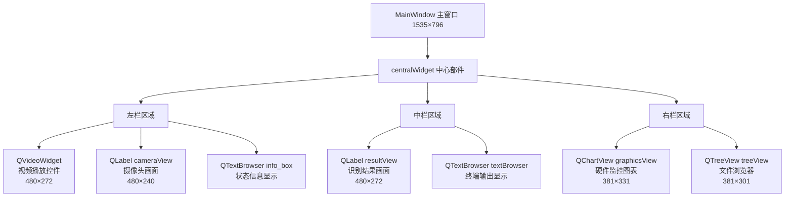
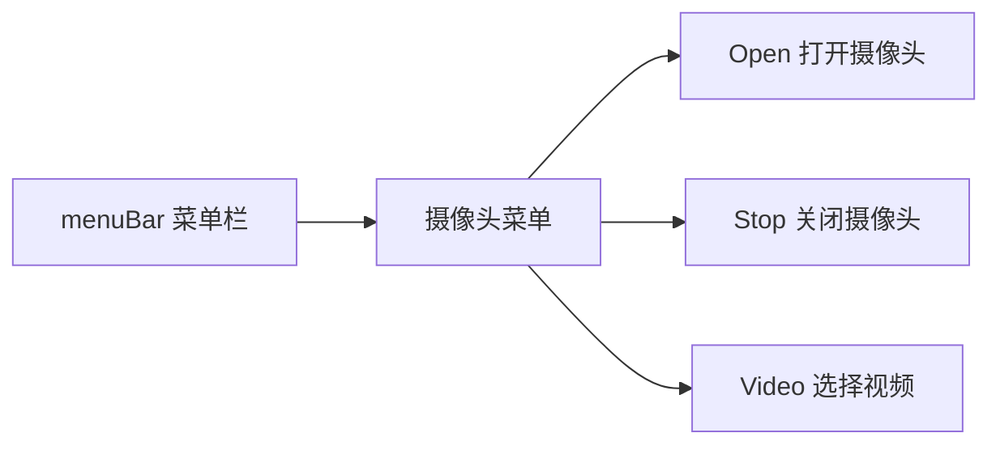
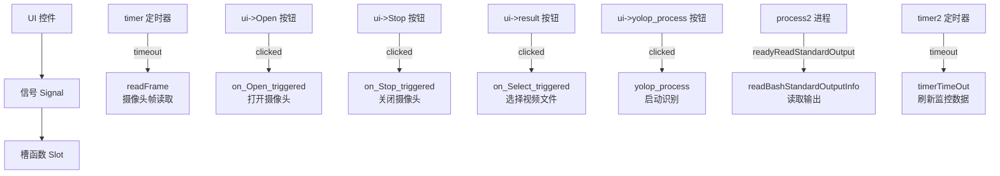

# Qt Designer 界面布局与 UI 控件映射

<!-- WIKI_NAV_START -->
> [!info] 视觉感知 Wiki 导航
> [[projects/linux视觉感知项目/index|项目首页]] · [[projects/Linux视觉感知项目/03 模型推理部署/4.6 两种方案对比：分割vs曲线|← 上一篇：5.3 两种检测方案对比：像素级分割 vs 参数化曲线检测]] · [[projects/Linux视觉感知项目/01 Qt 上位机/2.2 信号槽机制与交互|下一篇：6.1.2 信号槽机制：摄像头采集、视频播放与推理调度 →]]
<!-- WIKI_NAV_END -->

本页面详细解析 Linux 视觉感知处理系统中 Qt 上位机程序的界面设计原理与 UI 控件映射机制。通过 Qt Designer 可视化设计工具创建的界面布局，与 C++ 代码中的控件访问逻辑形成完整的映射关系，这是理解整个上位机程序架构的基础。

## 界面整体布局结构

Qt Designer 采用可视化的拖拽式设计方式，生成 `.ui` 文件存储界面布局信息。本项目的 `mainwindow.ui` 文件定义了主窗口的完整布局，采用**绝对定位布局**（基于坐标定位）而非相对布局（如 QVBoxLayout、QHBoxLayout），窗口尺寸设定为 1535×796 像素。

界面整体呈现**三栏式布局**：
- **左栏**：视频播放区域（上方）和摄像头画面区域（下方）
- **中栏**：识别结果展示区域（上方）和终端输出区域（下方）
- **右栏**：硬件监控图表（上方）和文件浏览器（下方）



## 核心 UI 控件详解

### 视频播放控件（QVideoWidget）

**控件名称**：`videowidget`
**位置坐标**：x=40, y=30（相对于父容器 `widget_2`）
**尺寸**：480×272 像素
**功能**：用于播放本地视频文件，支持常见的视频格式（AVI、MP4、WMV 等）

该控件使用 Qt Multimedia 模块的 `QMediaPlayer` 进行视频解码和播放控制。在代码中通过 `ui->videowidget` 访问，并设置默认背景图片 `file(1).jpeg`。

Sources: `上位机程序/Lane_Detection/mainwindow.ui#L15-L25`

### 摄像头画面显示控件（QLabel cameraView）

**控件名称**：`cameraView`
**位置坐标**：x=49, y=370
**尺寸**：480×240 像素
**功能**：实时显示摄像头采集的画面

使用 `QLabel` 控件作为图像显示容器，通过 `setPixmap()` 方法更新摄像头采集的图像帧。默认背景图片为 `camera(1).jpeg`，在摄像头关闭时显示。

Sources: `上位机程序/Lane_Detection/mainwindow.ui#L82-L98`

### 识别结果画面控件（QLabel resultView）

**控件名称**：`resultView`
**位置坐标**：x=600, y=30
**尺寸**：480×272 像素
**功能**：显示神经网络车道线识别的结果图像

该控件设置了 `scaledContents` 属性为 `true`，使图像自动缩放以适应控件大小。默认背景图片为 `network.jpg`，在无识别结果时显示。

Sources: `上位机程序/Lane_Detection/mainwindow.ui#L118-L140`

### 硬件监控图表控件（QChartView graphicsView）

**控件名称**：`graphicsView`
**位置坐标**：x=1130, y=30
**尺寸**：381×331 像素
**功能**：实时显示 CPU 和内存使用率的折线图

使用 Qt Charts 模块的 `QChartView` 控件，通过 `ui->graphicsView` 访问。在代码中初始化图表、坐标轴和数据序列，实现硬件资源的实时监控。

Sources: `上位机程序/Lane_Detection/mainwindow.ui#L56-L66`

### 终端输出显示控件（QTextBrowser textBrowser）

**控件名称**：`textBrowser`
**位置坐标**：x=600, y=370
**尺寸**：471×321 像素
**功能**：显示外部程序（如神经网络推理进程）的标准输出信息

该控件使用 `append()` 方法追加显示文本，并设置默认背景图片 `cmd.jpeg` 模拟终端界面。

Sources: `上位机程序/Lane_Detection/mainwindow.ui#L142-L152`

### 文件浏览器控件（QTreeView treeView）

**控件名称**：`treeView`
**位置坐标**：x=1130, y=390
**尺寸**：381×301 像素
**功能**：显示识别结果图片的文件目录结构

使用 `QFileSystemModel` 作为数据模型，绑定到 `QTreeView` 控件，实现文件系统的树形展示。

Sources: `上位机程序/Lane_Detection/mainwindow.ui#L205-L215`

## 按钮与菜单控件映射

### 功能按钮

界面包含两个主要功能按钮：

| 按钮名称 | 控件名称 | 位置坐标 | 尺寸 | 功能描述 |
|---------|---------|---------|------|---------|
| 视频文件 | `result` | x=420, y=320 | 111×31 | 选择本地视频文件并播放 |
| 车道线识别 | `yolop_process` | x=600, y=320 | 111×31 | 启动神经网络车道线识别功能 |

**样式设置**：两个按钮均设置背景颜色为灰色（rgb(193, 193, 193)），提供统一的视觉风格。

Sources: `上位机程序/Lane_Detection/mainwindow.ui#L155-L190`

### 菜单栏设计

菜单栏包含一个"摄像头"菜单，提供三个操作选项：



菜单项通过 `QAction` 定义，在代码中通过信号槽机制连接到对应的处理函数。

Sources: `上位机程序/Lane_Detection/mainwindow.ui#L220-L260`

## 信号槽映射机制

在 `mainwindow.cpp` 的构造函数中，建立了 UI 控件与功能函数之间的信号槽连接：



**连接代码示例**：
```cpp
// 摄像头采集定时器连接
connect(timer, SIGNAL(timeout()), this, SLOT(readFrame()));
// 按钮点击信号连接
connect(ui->Open, SIGNAL(clicked()), this, SLOT(on_Open_triggered()));
connect(ui->Stop, SIGNAL(clicked()), this, SLOT(on_Stop_triggered()));
connect(ui->result, SIGNAL(clicked()), this, SLOT(on_Select_triggered()));
connect(ui->yolop_process, SIGNAL(clicked()), this, SLOT(yolop_process()));
```

Sources: `上位机程序/Lane_Detection/mainwindow.cpp#L35-L50`

## 资源文件管理

项目使用 Qt 资源系统（`.qrc` 文件）管理界面图片资源，所有图片存放在 `resource/` 目录下：

| 资源文件 | 用途 | 使用控件 |
|---------|------|---------|
| `bk.png` | 主窗口背景 | QListView listView |
| `file(1).jpeg` | 视频播放默认背景 | QVideoWidget videowidget |
| `camera(1).jpeg` | 摄像头默认背景 | QLabel cameraView |
| `network.jpg` | 识别结果默认背景 | QLabel resultView |
| `cmd.jpeg` | 终端输出背景 | QTextBrowser textBrowser |

资源文件通过 `res.qrc` 文件注册，在代码中使用 `:/new/prefix1/resource/xxx` 路径访问。

Sources: `上位机程序/Lane_Detection/res.qrc#L1-L13`

## 控件访问方式总结

在 C++ 代码中，所有 UI 控件都通过 `ui->` 指针访问，该指针由 `ui_mainwindow.h` 自动生成：

```cpp
// 控件访问示例
ui->cameraView->setPixmap(QPixmap::fromImage(qsrc));  // 更新摄像头画面
ui->resultView->setPixmap(QPixmap::fromImage(rq));     // 更新识别结果
ui->info_box->append(tr("摄像头运行了 %1 s, 采集了 %2 张图像").arg(t).arg(count));
ui->textBrowser->append("<font color=\"#FFFFFF\">" + text + "</font> ");
ui->graphicsView->setChart(chart);                      // 设置图表
ui->treeView->setModel(m_model);                        // 设置文件模型
```

**关键点**：`ui->` 指针在 `setupUi(this)` 调用后初始化，所有控件此时才可用。析构函数中需要 `delete ui` 释放资源。

Sources: `上位机程序/Lane_Detection/mainwindow.cpp#L80-L85`

## 自定义控件集成

项目集成了两个自定义控件，通过 Qt Designer 的提升功能（Promote）实现：

1. **QChartView**：从 `QGraphicsView` 继承，需要包含 `<QtCharts>` 头文件
2. **QVideoWidget**：从 `QWidget` 继承，属于 Qt Multimedia Widgets 模块

这些控件在 `.ui` 文件的 `<customwidgets>` 部分声明，确保 Qt Designer 能正确识别和使用。

Sources: `上位机程序/Lane_Detection/mainwindow.ui#L285-L310`

## 下一步学习

理解 Qt Designer 界面布局与 UI 控件映射后，建议继续学习：

- [[projects/Linux视觉感知项目/01 Qt 上位机/2.2 信号槽机制与交互|信号槽机制：摄像头采集、视频播放与推理调度]] - 深入了解信号槽机制的具体实现
- [[projects/Linux视觉感知项目/01 Qt 上位机/2.4 CPU与内存实时监控|CPU / 内存实时监控与 QtCharts 图表展示]] - 学习硬件监控功能的实现细节
- [[projects/Linux视觉感知项目/01 Qt 上位机/2.5 Mat与QImage格式互转|OpenCV Mat 与 QImage 格式互转]] - 理解图像数据在不同格式间的转换机制

<!-- WIKI_FOOTER_START -->
---
> [!tip] 继续阅读
> [[projects/linux视觉感知项目/index|项目首页]] · [[projects/Linux视觉感知项目/03 模型推理部署/4.6 两种方案对比：分割vs曲线|← 上一篇：5.3 两种检测方案对比：像素级分割 vs 参数化曲线检测]] · [[projects/Linux视觉感知项目/01 Qt 上位机/2.2 信号槽机制与交互|下一篇：6.1.2 信号槽机制：摄像头采集、视频播放与推理调度 →]]
<!-- WIKI_FOOTER_END -->
