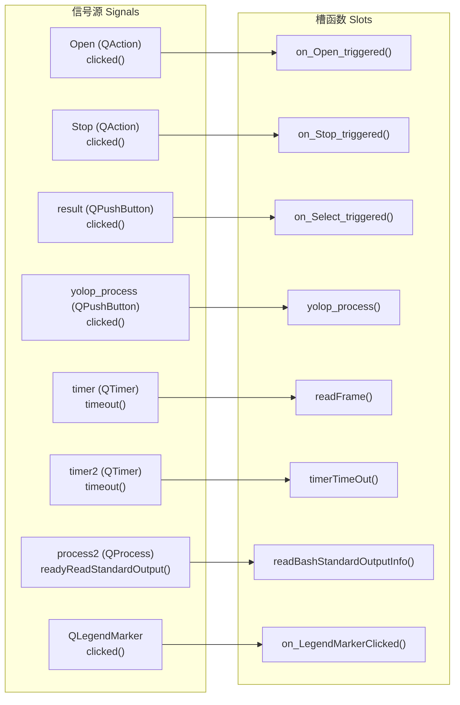
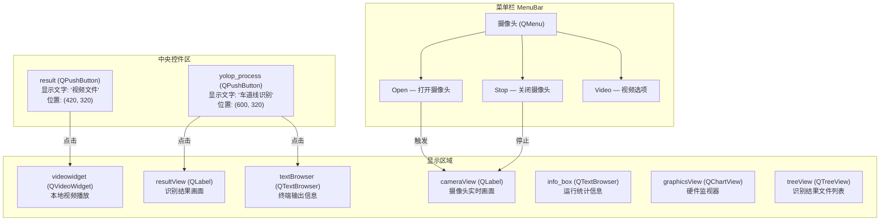
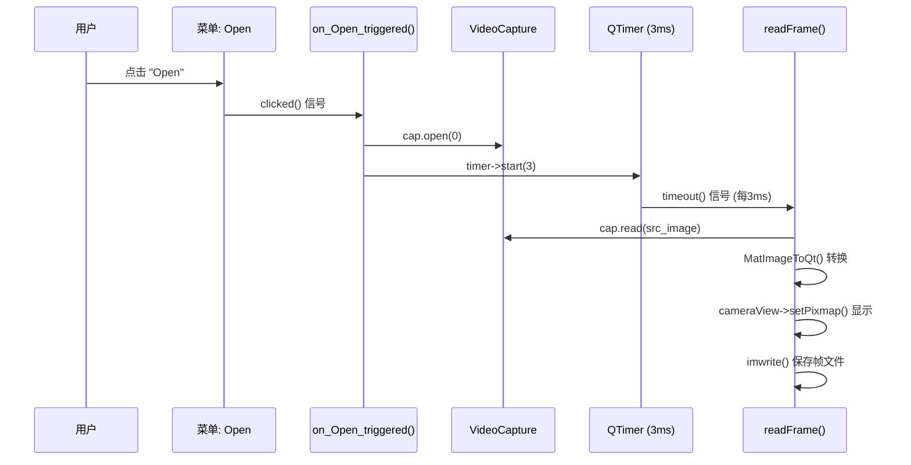
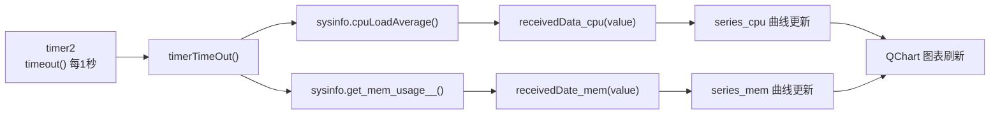
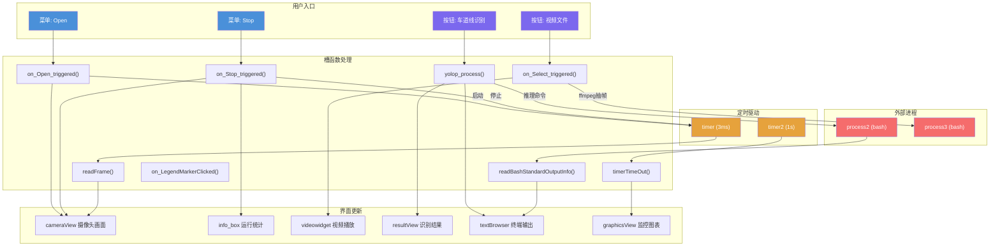

# 信号槽机制：摄像头采集、视频播放与推理调度

<!-- WIKI_NAV_START -->
> [!info] 视觉感知 Wiki 导航
> [[projects/linux视觉感知项目/index|项目首页]] · [[projects/Linux视觉感知项目/01 Qt 上位机/2.1 界面布局与UI控件|← 上一篇：6.1.1 Qt Designer 界面布局与 UI 控件映射]] · [[projects/Linux视觉感知项目/01 Qt 上位机/2.3 QProcess 进程管理|下一篇：6.2.1 QProcess 进程管理与外部推理程序调用 →]]
<!-- WIKI_NAV_END -->

本页系统解析 Qt 信号槽（Signal-Slot）机制在本项目中的实际应用，涵盖所有按钮点击、菜单触发、定时器驱动和跨进程通信的完整信号连接关系与数据流转路径。理解信号槽机制是掌握整个上位机程序交互逻辑的关键基础。

## 信号槽机制原理概述

Qt 的信号槽是一种**观察者模式**的实现，用于在对象之间进行松耦合的通信。发送方发出**信号（Signal）**，接收方通过**槽（Slot）**函数响应。两者通过 `connect()` 在运行时建立绑定关系，发送方无需知道接收方的具体类型。

在本项目中，信号槽承担了三大核心职责：**用户操作响应**（按钮/菜单点击）、**定时数据采集**（摄像头帧读取和硬件监控刷新）以及**异步进程通信**（外部推理程序的输出读取）。所有信号槽连接均在 `MainWindow` 构造函数中集中建立，形成了清晰的"星型"事件分发拓扑。

Sources: [mainwindow.cpp](mainwindow.cpp#L38-L52), [mainwindow.h](mainwindow.h#L1)

## 信号槽连接全景

本系统共建立了 **8 组信号槽连接**，可按功能域划分为三类：用户交互类、定时器驱动类和进程通信类。

下表汇总了全部连接的信号源对象、信号类型、槽函数及其功能描述：

| 信号源 | 信号 | 槽函数 | 功能描述 |
|--------|------|--------|----------|
| `ui->Open` (QAction) | `clicked()` | `on_Open_triggered()` | 打开摄像头并启动帧采集定时器 |
| `ui->Stop` (QAction) | `clicked()` | `on_Stop_triggered()` | 停止摄像头采集并显示统计信息 |
| `ui->result` (QPushButton) | `clicked()` | `on_Select_triggered()` | 选择本地视频文件并播放 |
| `ui->yolop_process` (QPushButton) | `clicked()` | `yolop_process()` | 启动神经网络车道线识别 |
| `timer` (QTimer) | `timeout()` | `readFrame()` | 定时读取摄像头帧并保存 |
| `timer2` (QTimer) | `timeout()` | `timerTimeOut()` | 定时刷新 CPU/内存监控数据 |
| `process2` (QProcess) | `readyReadStandardOutput()` | `readBashStandardOutputInfo()` | 读取推理程序终端输出 |
| `QLegendMarker` | `clicked()` | `on_LegendMarkerClicked()` | 图表图例显隐切换 |

Sources: [mainwindow.cpp](mainwindow.cpp#L38-L56)

## 两种连接方式：手动 connect 与自动绑定

本项目同时使用了两种信号槽连接机制，理解二者的区别对于掌握 Qt 事件系统至关重要。

**手动 `connect()` 连接**是本项目的主要方式。在构造函数中通过 `QObject::connect(sender, SIGNAL(...), receiver, SLOT(...))` 宏显式建立连接。这种方式的优点是**连接关系一目了然**，所有事件绑定集中在构造函数中声明，便于维护。

**`connectSlotsByName` 自动绑定**是 Qt 提供的隐式机制。当 `ui->setupUi()` 调用 `QMetaObject::connectSlotsByName(MainWindow)` 时，Qt 会扫描主窗口中所有子对象，若发现槽函数名符合 `on_<objectName>_<signalName>()` 的命名规范，则自动建立连接。例如 `ui->Open` 对象名为 `Open`，其 `clicked()` 信号会自动绑定到 `on_Open_triggered()` 槽函数。

这意味着 `on_Open_triggered()` 和 `on_Stop_triggered()` 两个槽函数实际上是**双重绑定**——既被 `connectSlotsByName` 自动连接，又在构造函数中被手动 `connect()`。由于 `clicked()` 信号触发时会调用所有已连接的槽函数，同一信号被连接两次意味着槽函数会被执行两次。本项目中这些槽函数均为**幂等操作**（重复执行结果相同），因此不会产生功能性错误，但这属于一种冗余连接。

Sources: [ui_mainwindow.h](ui_mainwindow.h#L172-L174), [mainwindow.cpp](mainwindow.cpp#L42-L44)

## 按钮与菜单控件的 UI 布局

系统界面中与交互直接相关的控件包含两类：菜单栏中的 **QAction** 和中央区域的 **QPushButton**。

这些控件在 `.ui` 文件中声明布局，由 Qt 的 `uic` 工具生成 `ui_mainwindow.h` 头文件。`setupUi()` 函数负责创建所有控件对象并设置其几何位置、样式和父子关系。值得注意的是，菜单栏中的 `Open`、`Stop`、`Video` 均为 **QAction** 类型（而非 QPushButton），它们通过 `menu->addAction()` 添加到"摄像头"菜单下。

Sources: [mainwindow.ui](mainwindow.ui#L248-L271), [ui_mainwindow.h](ui_mainwindow.h#L60-L85)

## 用户交互流程详解

### 打开摄像头：从菜单点击到实时画面

当用户点击菜单栏"摄像头 → Open"时，信号链如下触发：`QAction::clicked()` → `on_Open_triggered()` 槽函数执行。该函数完成三个操作：调用 `cap.open(0)` 打开默认摄像头设备；启动 `timer` 定时器，间隔设为 **3ms**（对应约 333Hz 的采集请求频率，实际受限于摄像头硬件帧率）；记录起始时间戳 `t` 并重置帧计数器 `count`。

`timer` 启动后，`QTimer` 每隔 3ms 发出 `timeout()` 信号，触发 `readFrame()` 槽函数。`readFrame()` 从摄像头读取一帧图像，通过 `MatImageToQt()` 将 OpenCV 的 `Mat` 格式转换为 Qt 的 `QImage`，在 `cameraView` 标签上显示画面，同时将缩放为 320×240 的帧保存到磁盘并递增 `count` 计数器。

Sources: [mainwindow.cpp](mainwindow.cpp#L59-L64), [mainwindow.cpp](mainwindow.cpp#L163-L173)

### 关闭摄像头：资源释放与运行统计

当用户点击"摄像头 → Stop"时，`on_Stop_triggered()` 槽函数依次执行：`timer->stop()` 停止定时器以中断 `readFrame()` 的周期调用；`cap.release()` 释放摄像头设备；`cameraView->clear()` 清空画面显示。最后通过 `getTickCount()` 计算运行时长（减去约 1.5s 的启动延迟补偿），将"运行时长"和"采集帧数"的统计信息追加显示到 `info_box` 文本框中。

Sources: [mainwindow.cpp](mainwindow.cpp#L67-L74)

### 选择本地视频文件：文件对话框与 ffmpeg 抽帧

当用户点击"视频文件"按钮时，`ui->result::clicked()` 信号触发 `on_Select_triggered()` 槽函数。该函数首先检查摄像头是否仍在运行（`cap.isOpened()`），若未关闭则弹出警告对话框并返回——这是一个**状态保护**逻辑，防止摄像头采集与视频播放的资源冲突。

通过安全检查后，函数弹出 `QFileDialog` 文件选择对话框，过滤器支持 `.avi`、`.mp4`、`.wmv` 等视频格式。用户选定文件后，通过 `process3`（预启动的 bash 进程）写入 `ffmpeg` 命令，以 10fps 的帧率将视频抽帧保存到指定目录。等待 2 秒后创建 `QMediaPlayer` 和 `QVideoWidget` 进行视频播放。

值得注意的是，`process3` 并未连接 `readyReadStandardOutput()` 信号，这意味着 ffmpeg 的执行过程**不会在界面上显示输出信息**，仅通过 `QMediaPlayer` 的视频播放提供视觉反馈。

Sources: [mainwindow.cpp](mainwindow.cpp#L77-L102)

### 启动车道线识别：跨进程推理与结果展示

当用户点击"车道线识别"按钮时，`ui->yolop_process::clicked()` 信号触发同名槽函数 `yolop_process()`。这是系统中最复杂的交互流程，涉及**跨进程调用**和**异步结果轮询**两个阶段。

**第一阶段：进程命令写入。** 函数通过 `process2->write()` 向预启动的 bash 终端发送两条命令：`cd` 切换到 LSTR 构建目录，`./LSTR ../videos/frames/` 启动神经网络推理程序。随后 `waitKey(10000)` 强制等待 10 秒，这是一个**粗糙的阻塞式等待**，目的是缓解推理期间的 CPU 负荷拥塞。这种写法会在等待期间阻塞主线程的事件循环，导致界面无法响应用户操作。

**第二阶段：结果图片轮询。** 以 `for` 循环从序号 1 开始递增，尝试读取推理结果目录中的 `.jpg` 文件。通过 `imread()` 加载图片后，使用 `MatImageToQt()` 转换并在 `resultView` 标签上显示，每次显示间隔 `waitKey(100)` 毫秒。当 `imread()` 返回空 Mat（文件不存在）时循环终止。

与 `yolop_process()` 并行运行的是 `process2` 的输出监听。`process2` 的 `readyReadStandardOutput()` 信号已连接到 `readBashStandardOutputInfo()` 槽函数，每当推理程序向标准输出写入内容时，该信号即被触发，将输出内容以白色字体追加到 `textBrowser` 中显示。

Sources: [mainwindow.cpp](mainwindow.cpp#L105-L120), [mainwindow.cpp](mainwindow.cpp#L123-L128)

## 定时器驱动的非交互数据流

系统中存在两个独立的定时器信号槽链路，它们不依赖用户点击操作，而是**在构造时自动启动**，形成持续运行的数据采集和刷新循环。

**Timer 1（摄像头帧采集）** 的生命周期由 Open/Stop 按钮控制：`on_Open_triggered()` 中启动（3ms 间隔），`on_Stop_triggered()` 中停止。其 `timeout()` → `readFrame()` 链路是摄像头画面实时显示的核心驱动。

**Timer 2（硬件监控刷新）** 在构造函数中直接启动（1000ms 间隔），贯穿整个程序生命周期。其 `timeout()` → `timerTimeOut()` 链路每秒触发一次，调用 `sysinfolinuximpl` 对象的 `cpuLoadAverage()` 和 `get_mem_usage__()` 方法获取 CPU 和内存使用率，再分别传递给 `receivedData_cpu()` 和 `receivedDate_mem()` 两个数据处理函数，刷新 QChart 图表中的实时曲线。

`receivedData_cpu()` 和 `receivedDate_mem()` 采用滑动窗口算法：数据追加到 `QList<double>` 容器中，当数据量超过 `maxSize`（51 个点）时移除最早的元素，然后清空并重新绘制整条曲线。X 轴最大值为 5000（对应约 83 分钟的监控时长），Y 轴范围为 0-100（百分比）。

Sources: [mainwindow.cpp](mainwindow.cpp#L36), [mainwindow.cpp](mainwindow.cpp#L133-L139), [mainwindow.cpp](mainwindow.cpp#L141-L168)

## 图表图例交互：动态绑定模式

硬件监视器图表还有一组特殊的信号槽连接——图例标记（`QLegendMarker`）的点击事件。与按钮/菜单在 UI 文件中声明不同，这组连接在 `InitChart()` 函数中通过 `foreach` 循环**动态建立**。

每当 `InitChart()` 执行时，遍历 `chart->legend()->markers()` 返回的所有图例标记，先断开旧连接（`disconnect`），再重新建立 `clicked()` → `on_LegendMarkerClicked()` 的连接。这种"先断后连"的模式避免了重复绑定导致的槽函数多次执行。

`on_LegendMarkerClicked()` 槽函数通过 `sender()` 获取触发信号的 `QLegendMarker` 对象，使用 `qobject_cast` 进行类型转换后，切换对应曲线序列（CPU 或内存）的可见性，并将隐藏曲线的图例标记降低透明度至 50%（`alpha = 0.5`），实现视觉上的"灰化"效果。

Sources: [mainwindow.cpp](mainwindow.cpp#L214-L218), [mainwindow.cpp](mainwindow.cpp#L315-L349)

## 信号槽连接总结与程序退出

下图以数据流视角展示了整个系统的信号槽拓扑，从用户操作入口到最终的界面更新：

程序退出时，`MainWindow` 析构函数仅执行 `delete ui`，自动释放由 `setupUi()` 创建的所有 UI 控件。定时器、进程和图表对象因设置了 `this` 作为父对象（`new QTimer(this)`）或被 `ui` 持有，会在 Qt 的父子对象树销毁机制下自动回收。`QProcess` 对象的 bash 子进程在 `QProcess` 析构时会收到终止信号。

Sources: [mainwindow.cpp](mainwindow.cpp#L56-L58), [main.cpp](projects/linux视觉感知项目/源码/上位机程序/Lane_Detection/main.cpp#L1-L12)

## 关键设计模式与改进建议

**已采用的设计模式：**

| 模式 | 体现 | 优势 |
|------|------|------|
| 观察者模式 | 信号槽连接 | 发送方与接收方解耦 |
| 单一职责 | 每个槽函数处理一个功能 | 逻辑清晰、可独立测试 |
| 状态保护 | `on_Select_triggered()` 中检查摄像头状态 | 防止资源冲突 |
| 滑动窗口 | `receivedData_cpu/mem` 数据管理 | 控制内存占用 |

**可改进的架构问题：**

| 问题 | 当前实现 | 建议方案 |
|------|----------|----------|
| 主线程阻塞 | `waitKey(10000)` 阻塞事件循环 | 使用 `QProcess::finished()` 信号异步等待 |
| 双重绑定 | `on_Open_triggered()` 被 connect 和 connectSlotsByName 同时绑定 | 移除构造函数中的冗余 `connect()` 或重命名槽函数 |
| 硬编码路径 | 视频/图片路径写死为 `/home/kylin/桌面/...` | 使用配置文件或命令行参数 |
| 结果轮询 | `yolop_process()` 中用 for 循环轮询文件 | 使用 `QFileSystemWatcher` 监控目录变化 |
