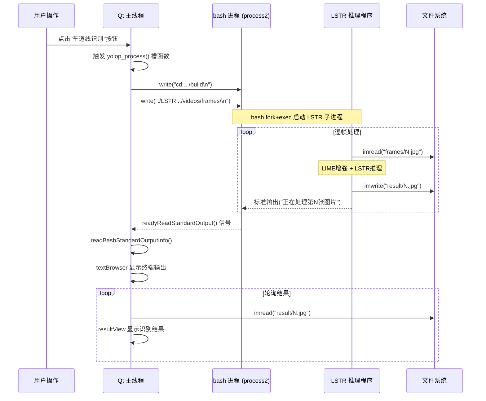

# QProcess 进程管理与外部推理程序调用

<!-- WIKI_NAV_START -->
> [!info] 视觉感知 Wiki 导航
> [[projects/linux视觉感知项目/index|项目首页]] · [[projects/Linux视觉感知项目/01 Qt 上位机/2.2 信号槽机制与交互|← 上一篇：6.1.2 信号槽机制：摄像头采集、视频播放与推理调度]] · [[projects/Linux视觉感知项目/01 Qt 上位机/2.4 CPU与内存实时监控|下一篇：6.2.2 CPU / 内存实时监控与 QtCharts 图表展示 →]]
<!-- WIKI_NAV_END -->

在视觉感知处理系统中，摄像头采集、图像预处理（LIME 低照度增强）和神经网络推理都是计算密集型操作。如果将这些耗时任务直接放在 Qt 主线程中执行，界面会因阻塞而冻结，用户体验极差。本系统采用 Qt 的 **QProcess** 类在独立进程中启动外部推理程序，实现了 UI 响应与计算任务的解耦。本文将从架构设计、进程初始化、命令下发、输出读取到文件系统数据交换，完整解析 QProcess 在本项目中的工程实现。

## 为什么需要 QProcess：架构决策与问题分析

Qt 应用默认运行在单线程的事件循环中。当用户点击"车道线识别"按钮时，若直接在主线程中执行 LSTR 模型推理（单张图约 0.18s，批量处理数百帧图像需要数十秒甚至更长时间），界面将完全失去响应。**QProcess 的核心价值在于将重计算任务委托给操作系统级别的独立进程**，Qt 主线程仅负责"发号施令"和"接收结果"，两者通过文件系统和标准输出管道进行异步通信。

本项目中 QProcess 承担了两类外部任务调度：

| 用途 | 进程对象 | 外部程序 | 触发方式 | 通信机制 |
|------|----------|----------|----------|----------|
| 神经网络车道线识别 | `process2` | LSTR 可执行程序（基于 ONNX Runtime） | 用户点击"车道线识别"按钮 | bash 命令 + 标准输出管道 + 文件系统 |
| 视频帧提取 | `process3` | ffmpeg 视频处理工具 | 用户选择本地视频文件 | bash 命令写入 |

Sources: [mainwindow.h](mainwindow.h#L76-L78)

## 进程对象声明与头文件依赖

在 `MainWindow` 类的私有成员中，声明了两个 QProcess 指针：

```cpp
/* 终端进程控制 */
QProcess* process2;
QProcess* process3;
```

`process2` 专门用于控制 LSTR 卷积神经网络程序的执行，`process3` 则用于通过 ffmpeg 对本地视频文件按指定帧率提取画面帧。两个进程分别服务于系统数据流中的不同环节，互不干扰。

头文件中需要包含 `<QProcess>` 以使用该类：

```cpp
#include <QProcess>
```

Sources: [mainwindow.h](mainwindow.h#L12)

## 进程初始化：启动 Bash 终端并等待就绪

在 `MainWindow` 构造函数中，两个 QProcess 对象被实例化并启动为 bash 终端进程：

```cpp
//创建进程2用于控制卷积神经网络程序执行
process2 = new QProcess;
//创建进程3用于对本地视频文件按一定帧率提取视频帧
process3 = new QProcess;
//开启进程终端并等待指令
process2->start("bash");
process3->start("bash");
process2->waitForStarted();
process3->waitForStarted();
```

这里的初始化策略值得深入理解。**QProcess 并非直接启动 LSTR 程序，而是先启动一个 bash 终端**。这是因为后续需要通过 `write()` 方法向 bash 管道写入多条 shell 命令（如 `cd` 切换目录、再执行目标程序），而直接调用 `QProcess::start("./LSTR")` 只能执行单条命令，无法灵活控制工作目录和命令序列。

`waitForStarted()` 是一个**阻塞调用**，它会等待 bash 进程完全启动后才返回。由于这发生在构造函数中（即界面初始化阶段），短暂的阻塞对用户体验没有明显影响。

Sources: [mainwindow.cpp](mainwindow.cpp#L29-L34)

## 启动推理任务：yolop_process() 槽函数详解

当用户界面上的"车道线识别"按钮（`yolop_process`）被点击时，Qt 的信号槽机制触发 `yolop_process()` 槽函数，启动完整的推理流程：

```cpp
void MainWindow::yolop_process()
{
    //通过终端命令控制神经网络程序执行
    process2->write("cd /home/kylin/桌面/project_v1.0/LSTR/build\n");
    process2->write("./LSTR ../videos/frames/\n");

    waitKey(10000);//为了缓解识别期间CPU负荷大程序拥塞，设置延时
    for(int i = 1; i < INT_MAX; i++)
    {
        //读取识别的图片并显示在上位机
        Mat r = imread("/home/kylin/桌面/project_v1.0/LSTR/result/" + to_string(i) + ".jpg");
        if(r.empty()) break;
        QImage rq = MatImageToQt(r);
        ui->resultView->setPixmap(QPixmap::fromImage(rq));
        waitKey(100);
    }
}
```

该函数的执行流程可分为三个阶段：

**阶段一：命令下发**。通过 `process2->write()` 向已启动的 bash 进程写入两条命令——先 `cd` 切换到 LSTR 的 build 目录，再执行 `./LSTR` 并传入待识别图片的文件夹路径。注意每条命令末尾的 `\n` 是必需的，它模拟了用户在终端中按下回车键。

**阶段二：等待推理**。`waitKey(10000)` 设置了 10 秒的延时，目的是缓解推理期间 CPU 高负荷带来的程序拥塞问题。这是一个工程权衡——理论上应该使用异步回调机制精确等待推理完成，但项目采用了简单的延时方案。

**阶段三：结果轮询与显示**。通过一个 `for` 循环，以 `1, 2, 3, ...` 的顺序依次尝试读取 LSTR 输出目录中的识别结果图片。当 `imread()` 返回空 Mat 时（即文件不存在），说明所有结果已读完，循环终止。每张识别结果图经过 `MatImageToQt()` 格式转换后显示在上位机的 `resultView` 控件上。

Sources: [mainwindow.cpp](mainwindow.cpp#L92-L108)

## 视频帧提取：process3 的使用

`process3` 在用户选择本地视频文件时被使用，通过 ffmpeg 工具从视频中按固定帧率提取画面帧：

```cpp
void MainWindow::on_Select_triggered()
{
    // ...
    //使用ffmpeg对视频采集画面帧
    process3->write("cd /home/kylin/桌面/project_v1.0/LSTR/videos/\n");
    process3->write("ffmpeg -i test.mp4 -vf fps=10 frames/%d.jpg\n");
    waitKey(2000);
    // ...启动视频播放器...
}
```

这里 `process3` 的使用模式与 `process2` 完全一致：先通过 `write()` 写入 `cd` 命令切换目录，再写入 ffmpeg 命令以 10fps 的帧率从 `test.mp4` 中提取画面帧并保存为编号图片。`waitKey(2000)` 等待 2 秒让 ffmpeg 完成提取后再启动视频播放器。

提取出的帧图片存放于 `frames/` 目录，后续会被 `process2` 启动的 LSTR 程序读取和处理。**两个进程通过文件系统形成了隐式的数据管道**。

Sources: [mainwindow.cpp](mainwindow.cpp#L81-L87)

## 标准输出的异步读取：信号槽联动

推理程序运行过程中会产生丰富的标准输出信息（如"正在处理第 N 张图片"、"处理完成,共用时 X 秒"等）。Qt 的信号槽机制使得这些输出能够被实时捕获并显示在上位机界面中：

```cpp
connect(process2, SIGNAL(readyReadStandardOutput()), 
        this, SLOT(readBashStandardOutputInfo()));
```

当 `process2`（即 bash 进程，它转发了 LSTR 子进程的输出）有新的标准输出时，Qt 事件循环自动触发 `readyReadStandardOutput()` 信号，对应的槽函数随即执行：

```cpp
void MainWindow::readBashStandardOutputInfo()
{
    QByteArray _out = process2->readAllStandardOutput();
    if(!_out.isEmpty())
        ui->textBrowser->append("<font color=\"#FFFFFF\">" 
            + QString::fromLocal8Bit(_out) + "</font> ");
}
```

该函数从进程的标准输出缓冲区读取全部可用数据，通过 `fromLocal8Bit()` 进行编码转换（处理中文字符），然后以白色字体追加显示到上位机的终端输出区域（`textBrowser`）。这个设计让用户无需切换到命令行窗口，就能在 GUI 中实时观察推理进度。

Sources: [mainwindow.cpp](mainwindow.cpp#L48-L49), [mainwindow.cpp](mainwindow.cpp#L110-L115)

## 外部推理程序的内部逻辑

被 QProcess 调用的 LSTR 接收一个图片文件夹路径作为命令行参数，其 `main()` 函数展示了完整的处理流程：

```cpp
int main(int argc, char** argv)
{
    if (argc != 2) {
        fprintf(stderr, "Usage: %s [imagepath]\n", argv[0]);
        return -1;
    }
    LSTR mynet;
    const char* filefolderpath = argv[1];
    for(int i = 1; i < INT_MAX; i++)
    {
        cv::Mat m = cv::imread(filefolderpath + to_string(i) + ".jpg", 1);
        if (m.empty()) break;
        Mat d;
        cv::resize(m, d, cv::Size(360,204));
        l = new LIME::lime(d);
        d = l->enhance(d);       // LIME低照度增强
        Mat dstimg = mynet.detect(d);  // LSTR车道线识别
        cv::imwrite("../result/" + to_string(i) + ".jpg", dstimg);
        delete l;
    }
    return 0;
}
```

对每张图片，LSTR 程序依次执行：**读取 → 缩放 → LIME 低照度增强 → ONNX Runtime 模型推理 → 保存识别结果到 `result/` 目录**。该程序通过标准输出打印处理进度，这些信息通过 bash 管道回传到 Qt 主程序的 `readBashStandardOutputInfo()` 槽函数中。

值得注意的是，**Qt 主程序和 LSTR 推理程序之间的数据交换完全基于文件系统**：Qt 程序将摄像头采集的图片写入 `frames/` 目录，LSTR 程序从该目录读取图片并输出结果到 `result/` 目录，Qt 程序再从 `result/` 目录读取识别结果进行显示。

Sources: [LSTR/main.cpp](projects/linux视觉感知项目/源码/上位机程序/Lane_Detection/LSTR/main.cpp#L208-L246)

## 完整数据流架构

下图展示了 QProcess 在系统数据流中的位置，以及 Qt 主程序、bash 进程与外部推理程序之间的协作关系：



## QProcess 在性能监控中的另一面

除了驱动推理程序外，QProcess 还在系统性能监控模块中扮演了短暂调用的角色。`sysinfolinuximpl` 类中，每次采集 CPU 和内存数据时都会**临时创建** QProcess 实例来执行系统命令：

```cpp
double sysinfolinuximpl::cpuLoadAverage()
{
    QProcess process;
    process.start("cat /proc/stat");
    process.waitForFinished();
    QString str = process.readLine();
    // ... 解析CPU数据 ...
}

double sysinfolinuximpl::get_mem_usage__()
{
    QProcess process;
    process.start("free -m");
    process.waitForFinished();
    process.readLine();
    QString str = process.readLine();
    // ... 解析内存数据 ...
}
```

这里采用了与推理程序不同的 QProcess 使用模式——**"用完即弃"的短生命周期调用**。每次采集时创建一个新的 QProcess，启动 `cat /proc/stat` 或 `free -m` 命令，通过 `waitForFinished()` 同步等待结果，读取一行输出后立即结束。这种模式适合执行速度快、无需持续交互的系统命令，但由于每次都要 fork 新进程，开销略高于长连接方式。

两个函数通过 `timer2` 定时器每秒调用一次，采集的数据通过自定义信号传递给 MainWindow 中的 QChart 图表进行实时绘制。

Sources: [sysinfolinuximpl.cpp](sysinfolinuximpl.cpp#L11-L29), [sysinfolinuximpl.cpp](sysinfolinuximpl.cpp#L31-L51)

## QProcess 两种使用模式对比

本项目中 QProcess 展示了两种截然不同的工程用法，各有其适用场景：

| 维度 | 长连接模式（process2/process3） | 短调用模式（sysinfolinuximpl） |
|------|-------------------------------|-------------------------------|
| **生命周期** | 与 MainWindow 共存亡 | 函数内临时创建，函数结束即销毁 |
| **启动方式** | `start("bash")` 启动交互式终端 | `start("cat /proc/stat")` 直接执行命令 |
| **命令交互** | 多次 `write()` 写入命令序列 | 单次 `start()` 执行单条命令 |
| **结果获取** | 异步信号 `readyReadStandardOutput()` | 同步等待 `waitForFinished()` |
| **适用场景** | 耗时长、需持续交互的任务 | 快速执行、一次性的系统查询 |
| **代表应用** | LSTR 推理、ffmpeg 视频提取 | CPU/内存占用率采集 |

## 工程注意事项与潜在改进方向

当前实现中有几个值得关注的工程点：

**硬编码路径问题**。所有文件路径（如 `/home/kylin/桌面/project_v1.0/...`）均硬编码在源码中，降低了程序的可移植性。工程实践中应使用配置文件或命令行参数来指定路径。

**同步延时代替异步回调**。`yolop_process()` 中使用 `waitKey(10000)` 硬等待 10 秒，这不是一个可靠的同步机制。更稳健的做法是监听 LSTR 进程的 `finished()` 信号，或通过文件系统监控（如 `QFileSystemWatcher`）来检测结果文件的生成。

**进程生命周期管理**。构造函数中启动的 bash 进程在 `MainWindow` 析构时并未显式终止，依赖于父对象的自动清理机制。生产环境中应调用 `process->kill()` 或 `process->terminate()` 确保子进程被正确回收。

**文件轮询效率**。`yolop_process()` 通过循环 `imread()` 试探文件是否存在来检测新结果，这是一种低效的轮询模式。`QFileSystemWatcher` 可以监听目录变化事件，实现更高效的文件监控。

Sources: [mainwindow.cpp](mainwindow.cpp#L29-L34), [mainwindow.cpp](mainwindow.cpp#L92-L108)

## 延伸阅读

本页面聚焦于 QProcess 的进程调度机制。关于上位机中的其他核心功能，请参考：

- [摄像头采集与视频帧读取](6-she-xiang-tou-cai-ji-yu-shi-pin-zheng-du-qu)——理解 `readFrame()` 中摄像头数据的来源
- [Mat 与 QImage 图像格式转换](8-mat-yu-qimage-tu-xiang-ge-shi-zhuan-huan)——了解 `MatImageToQt()` 的内部实现
- [CPU 与内存性能监控模块](9-cpu-yu-nei-cun-xing-neng-jian-kong-mo-kuai)——深入 QProcess 在系统监控中的应用
- [LSTR 模型部署与后处理流程](19-lstr-mo-xing-bu-shu-yu-hou-chu-li-liu-cheng)——理解被调用的 LSTR 推理程序的完整逻辑
