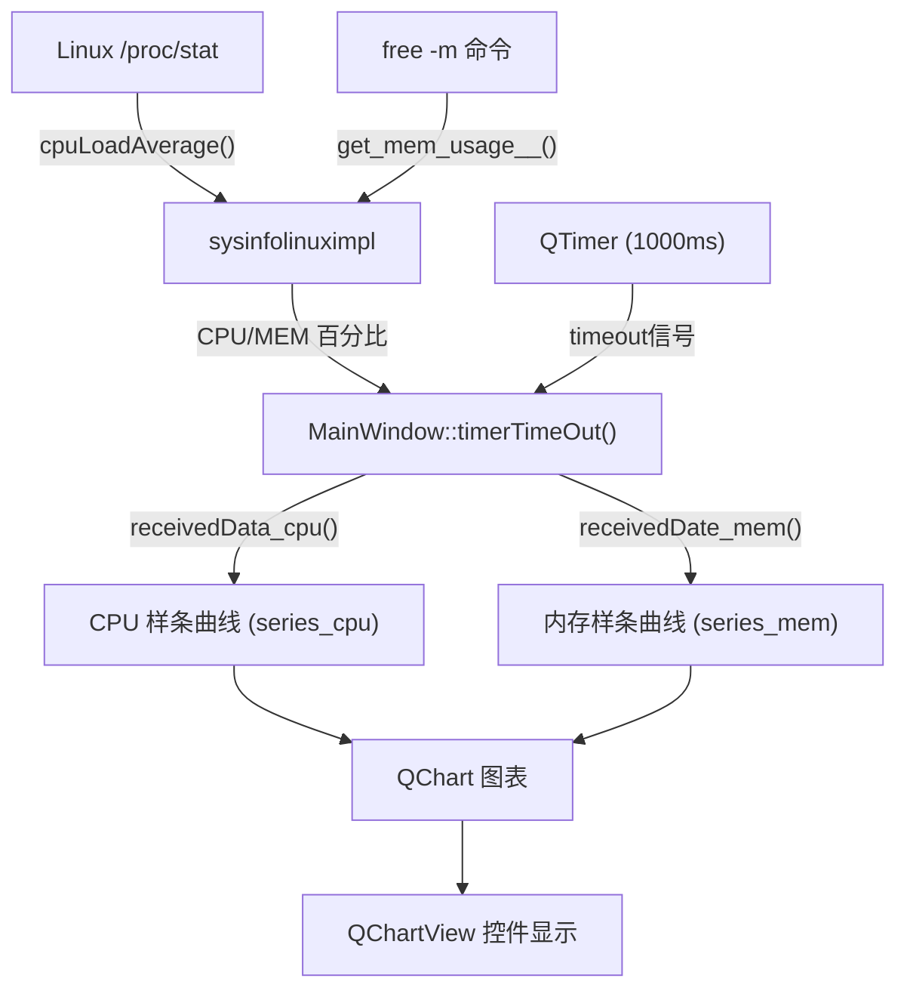
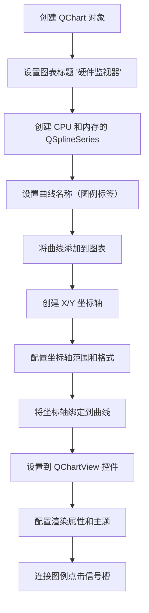
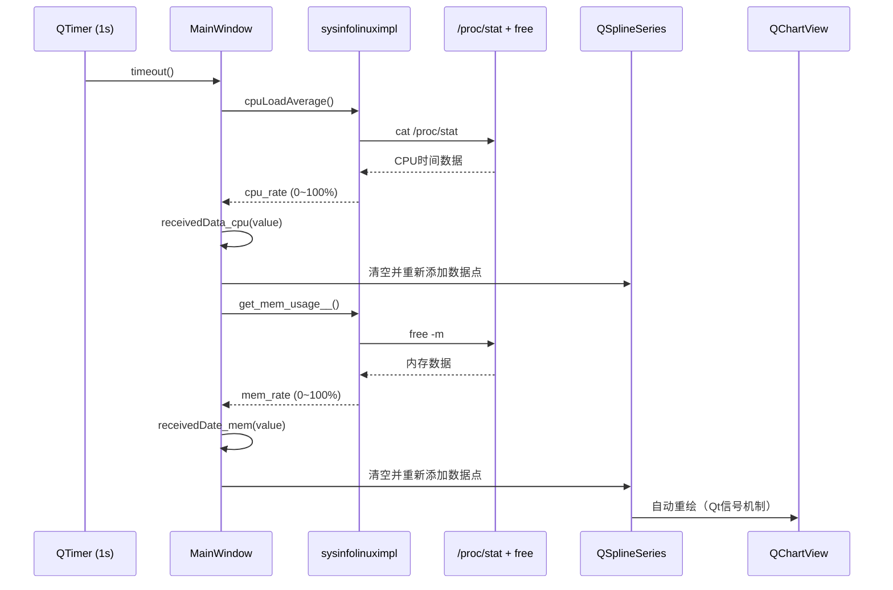

# CPU / 内存实时监控与 QtCharts 图表展示

<!-- WIKI_NAV_START -->
> [!info] 视觉感知 Wiki 导航
> [[projects/linux视觉感知项目/index|项目首页]] · [[projects/Linux视觉感知项目/01 Qt 上位机/2.3 QProcess 进程管理|← 上一篇：6.2.1 QProcess 进程管理与外部推理程序调用]] · [[projects/Linux视觉感知项目/01 Qt 上位机/2.5 Mat与QImage格式互转|下一篇：6.2.3 OpenCV Mat 与 QImage 格式互转 →]]
<!-- WIKI_NAV_END -->

本文档深入剖析 Linux 视觉感知处理系统上位机程序中的**系统资源实时监控功能**。该功能通过读取 Linux `/proc` 虚拟文件系统和执行系统命令获取 CPU、内存使用数据，结合 Qt Charts 模块实现动态曲线图表的实时展示，为开发者提供系统运行状态的直观可视化窗口。

## 系统监控架构概览

本系统的硬件监视器采用**定时轮询 + 数据滑窗 + 图表绑定**的三层架构设计。核心数据源来自 Linux 内核的 `/proc/stat`（CPU 使用率）和 `free -m`（内存使用率），通过 `sysinfolinuximpl` 类封装数据采集逻辑，再由 `MainWindow` 中的定时器驱动周期性更新，最终将数据渲染到 QtCharts 的样条曲线（QSplineSeries）上。



## sysinfolinuximpl 类：数据采集层

`sysinfolinuximpl` 类是系统资源监控的底层数据采集组件，采用纯 Linux 平台实现，提供 CPU 使用率和内存使用率两个核心接口。该类的设计理念是**封装平台差异**，将 `/proc` 文件系统和系统命令的解析逻辑隔离在独立类中，便于上层业务代码调用。

Sources: `上位机程序/Lane_Detection/sysinfolinuximpl.h#L1-L24`

### 类成员设计

类头文件定义了以下关键成员：

| 成员变量 | 类型 | 默认值 | 说明 |
|---------|------|--------|------|
| `pre_user` | double | 0 | 上一次采样的 CPU 用户态时间累计值 |
| `pre_total` | double | 0 | 上一次采样的 CPU 总时间累计值 |
| `cpu_rate` | double | 0.0 | 计算得到的 CPU 使用率百分比 |
| `mem_rate` | double | 0.0 | 计算得到的内存使用率百分比 |

Sources: `上位机程序/Lane_Detection/sysinfolinuximpl.h#L13-L20`

### CPU 使用率计算原理

`cpuLoadAverage()` 函数通过执行 `cat /proc/stat` 命令读取内核统计信息。`/proc/stat` 文件的第一行格式为 `cpu user nice system idle iowait irq softirq steal`，其中各字段均为自系统启动以来的**累计时钟节拍数**。

CPU 使用率的计算公式基于**差分法**：在两次采样之间计算增量比值，避免了绝对值的偏差问题：

$$\text{CPU 使用率} = \frac{\Delta(user + nice + system)}{\Delta(\text{所有状态之和})} \times 100\%$$

源码中将 `lst[1]`、`lst[2]`、`lst[3]` 分别对应 user、nice、system 三个用户态/系统态指标相加作为 `use`，然后累加所有状态字段得到 `total`，通过与上一次采样值的差值计算百分比：

```cpp
double use = lst[1].toDouble() + lst[2].toDouble() + lst[3].toDouble();
double total = 0;
for(int i = 1;i < lst.size();++i)
    total += lst[i].toDouble();
if(total - pre_total > 0)
{
    cpu_rate = (use - pre_user) / (total - pre_total) * 100.0;
    pre_total = total;
    pre_user = use;
}
```

Sources: `上位机程序/Lane_Detection/sysinfolinuximpl.cpp#L12-L33`

### 内存使用率计算原理

`get_mem_usage__()` 函数通过执行 `free -m` 命令获取内存信息（单位为 MB）。该命令输出的第二行为内存统计数据，包含 `total`、`used`、`free`、`shared`、`buff/cache`、`available` 等字段。

实现中采用连续空格替换和字符串分割的策略解析命令输出。内存使用率计算公式为：

$$\text{内存使用率} = \frac{total - free}{total} \times 100\%$$

其中 `lst[1]` 对应 total（总内存），`lst[6]` 对应 free（空闲内存）：

```cpp
free = lst[6].toDouble();
total = lst[1].toDouble();
mem_rate = (total - free) / total * 100.0;
```

> **注意**：该实现使用 `free` 字段而非 `available` 字段，这在某些内核版本中可能导致内存使用率偏高，因为 `available` 才是真正可用的内存估算值。实际项目中可根据需求调整字段索引。

Sources: `上位机程序/Lane_Detection/sysinfolinuximpl.cpp#L35-L58`

## QtCharts 图表集成架构

QtCharts 模块为本系统提供了丰富的 2D 图表可视化能力。集成过程中需要在项目配置、头文件引入、控件声明三个层面进行配置。

### 项目配置

在 `.pro` 项目文件中，需要在 `QT` 变量中添加 `charts` 模块，这是使用 QtCharts 功能的前提条件：

```
QT += core gui multimedia multimediawidgets charts
```

Sources: `上位机程序/Lane_Detection/1102demo3.pro#L8`

### 头文件与命名空间

在 `mainwindow.h` 中引入 QtCharts 头文件，并使用 `QT_CHARTS_USE_NAMESPACE` 宏开启 `QtCharts` 命名空间：

```cpp
#include <QtCharts>
QT_CHARTS_USE_NAMESPACE
```

这样可以避免在代码中反复书写 `QtCharts::` 前缀，简化了图表相关类（如 `QChart`、`QSplineSeries`、`QValueAxis` 等）的使用。

Sources: `上位机程序/Lane_Detection/mainwindow.h#L24-L27`

### 核心数据结构设计

`MainWindow` 类中定义了支撑图表功能的核心成员变量：

| 成员变量 | 类型 | 作用 |
|---------|------|------|
| `maxSize` | int | 数据队列最大长度，设置为 51 |
| `maxX` | int | X 轴最大范围，设置为 5000 |
| `maxY` | int | Y 轴最大范围，设置为 100（对应百分比） |
| `axisX` / `axisY` | QValueAxis* | X 轴和 Y 轴对象 |
| `data_cpu` | QList\<double\> | CPU 使用率历史数据队列 |
| `data_mem` | QList\<double\> | 内存使用率历史数据队列 |
| `series_cpu` | QSplineSeries* | CPU 使用率样条曲线 |
| `series_mem` | QSplineSeries* | 内存使用率样条曲线 |
| `chart` | QChart* | 图表对象容器 |
| `chartView` | QChartView* | 图表视图控件 |

Sources: `上位机程序/Lane_Detection/mainwindow.h#L82-L115`

## 图表初始化流程

`InitChart()` 函数在 `MainWindow` 构造函数中被调用，负责完成图表的完整初始化配置。该函数执行以下步骤：



### 创建曲线序列

系统创建了两条样条曲线（`QSplineSeries`），分别用于展示 CPU 和内存的实时数据。样条曲线相比折线图（`QLineSeries`）具有**平滑插值**特性，能够在数据点之间生成光滑过渡，更适合展示连续变化的系统资源指标：

```cpp
series_cpu = new QSplineSeries();
series_mem = new QSplineSeries();
series_cpu->setName("CPU");
series_mem->setName("内存");
```

Sources: `上位机程序/Lane_Detection/mainwindow.cpp#L235-L242`

### 坐标轴配置

坐标轴采用 `QValueAxis` 数值轴，X 轴代表时间维度（以数据点索引×间距计算），Y 轴代表占用率百分比（0~100）：

| 轴 | 范围 | 标题 | 刻度数 | 次刻度数 |
|---|------|------|--------|----------|
| X 轴 | 0 ~ 5000 | "刷新率1秒/次" | 3 | 3 |
| Y 轴 | 0 ~ 100 | "占用率" | 默认 | 默认 |

```cpp
axisX->setRange(0, maxX);           // 0 ~ 5000
axisX->setTitleText("刷新率1秒/次");
axisX->setLabelFormat("%i");         // 整数格式
axisY->setRange(0, maxY);           // 0 ~ 100
axisY->setTitleText("占用率");
```

坐标轴创建后需要绑定到曲线序列，使两条曲线共享同一坐标系：

```cpp
chart->setAxisX(axisX, series_cpu);
chart->setAxisY(axisY, series_cpu);
chart->setAxisX(axisX, series_mem);
chart->setAxisY(axisY, series_mem);
```

Sources: `上位机程序/Lane_Detection/mainwindow.cpp#L247-L267`

### 图表视图与渲染配置

初始化的最后阶段将图表设置到 UI 中的 `QChartView` 控件，并配置渲染属性：

```cpp
ui->graphicsView->setChart(chart);
ui->graphicsView->setRenderHint(QPainter::Antialiasing);  // 抗锯齿
ui->graphicsView->setAttribute(Qt::WA_TranslucentBackground); // 透明背景
chart->setTheme(QChart::ChartThemeLight);  // 浅色主题
```

`QChartView` 控件在 UI 文件中以自定义控件形式声明，基础类型为 `QGraphicsView`，通过 `<customwidgets>` 节点注册：

```xml
<customwidget>
  <class>QChartView</class>
  <extends>QGraphicsView</extends>
  <header>qchartview.h</header>
</customwidget>
```

该控件在界面中的位置为坐标 (1130, 30)，尺寸为 381×331 像素，位于主窗口右上区域。

Sources: `上位机程序/Lane_Detection/mainwindow.cpp#L268-L277`，`上位机程序/Lane_Detection/mainwindow.ui#L39-L47`

## 数据更新机制

### 定时器驱动架构

系统使用 `QTimer` 定时器以 **1000 毫秒（1 秒）** 的间隔周期性触发数据更新。定时器在 `MainWindow` 构造函数中启动，`timeout` 信号连接到 `timerTimeOut()` 槽函数：

```cpp
timer2 = new QTimer(this);
timer2->start(1000);
connect(timer2, SIGNAL(timeout()), this, SLOT(timerTimeOut()));
```

Sources: `上位机程序/Lane_Detection/mainwindow.cpp#L27-L48`

### 数据获取与分发

`timerTimeOut()` 函数作为数据调度中心，调用 `sysinfolinuximpl` 对象的两个采集接口，然后将结果分发给对应的图表更新函数：

```cpp
void MainWindow::timerTimeOut()
{
    double cpuLoadAverage = sysinfo.cpuLoadAverage();
    double mem_used = sysinfo.get_mem_usage__();
    receivedData_cpu(cpuLoadAverage);
    receivedDate_mem(mem_used);
}
```

`sysinfo` 是 `MainWindow` 中声明的 `sysinfolinuximpl` 类实例，由于声明了 `friend sysinfolinuximpl` 友元关系，两个类可以互相访问私有成员。

Sources: `上位机程序/Lane_Detection/mainwindow.cpp#L283-L289`，`上位机程序/Lane_Detection/mainwindow.h#L75`

### 数据队列管理与图表刷新

`receivedData_cpu()` 和 `receivedDate_mem()` 函数采用相同的**滑动窗口**模式管理数据队列。该模式维护一个固定大小的队列，当新数据到来且队列已满时，移除最早的数据点，确保图表始终展示最近 51 个采样点的数据。

X 轴上数据点的间距通过 `maxX / (maxSize - 1)` 计算，即 `5000 / 50 = 100`，因此每个数据点在 X 轴上间隔 100 个单位：

```cpp
void MainWindow::receivedData_cpu(double value)
{
    data_cpu.append(value);
    while (data_cpu.size() > maxSize) {
        data_cpu.removeFirst();
    }
    series_cpu->clear();
    int xSpace = maxX / (maxSize - 1);  // 100
    for (int i = 0; i < data_cpu.size(); ++i) {
        series_cpu->append(xSpace * i, data_cpu.at(i));
    }
}
```

每次更新时先清空曲线所有数据点再重新添加，这是 QtCharts 的标准更新模式。虽然存在效率优化空间（如使用 `replace()` 方法），但在当前数据规模（51 个点）下性能影响可忽略。

Sources: `上位机程序/Lane_Detection/mainwindow.cpp#L290-L327`

## 图例交互功能

图表的图例（Legend）支持点击交互，用户可以通过点击图例标签切换对应曲线的显示/隐藏状态。该功能通过在 `InitChart()` 中为每个图例标记（`QLegendMarker`）连接 `clicked()` 信号实现：

```cpp
foreach (QLegendMarker* marker, chart->legend()->markers())
{
    QObject::connect(marker, SIGNAL(clicked()), this, SLOT(on_LegendMarkerClicked()));
}
```

`on_LegendMarkerClicked()` 槽函数实现了曲线可见性切换，并通过调整颜色的 Alpha 通道值（0.5 为半透明）来视觉化反馈隐藏状态：

```cpp
marker->series()->setVisible(!marker->series()->isVisible());
marker->setVisible(true);
qreal alpha = 1.0;
if (!marker->series()->isVisible())
    alpha = 0.5;
// 应用透明度到标签画刷、填充画刷和画笔
```

Sources: `上位机程序/Lane_Detection/mainwindow.cpp#L278-L280`，`上位机程序/Lane_Detection/mainwindow.cpp#L329-L386`

## 时序交互流程

整个监控系统的数据流转遵循以下时序：



## 关键设计决策分析

| 设计决策 | 实现选择 | 替代方案 | 权衡考量 |
|---------|---------|---------|---------|
| 数据采集方式 | QProcess 执行命令 | 直接读取 `/proc` 文件 | QProcess 更安全但有进程创建开销；直接读取性能更好但需处理文件 I/O |
| 采样间隔 | 1000ms | 更短间隔（如 100ms） | 1 秒间隔平衡了实时性和系统开销；更短间隔会导致图表过于密集 |
| 曲线类型 | QSplineSeries | QLineSeries | 样条曲线更平滑但可能在极端值处产生过冲；折线更精确但视觉效果生硬 |
| 数据更新策略 | 清空+重建 | 增量更新 (replace) | 清空重建实现简单；增量更新性能更好但需管理索引偏移 |
| 数据队列大小 | 51 个点 | 更多/更少点数 | 51 个点对应约 51 秒的历史数据，在当前图表宽度下密度适中 |

## 潜在优化方向

1. **进程优化**：当前 `QProcess` 每次采样都创建新进程读取 `/proc/stat`，可改为直接使用 `QFile` 读取文件，避免进程创建开销
2. **增量更新**：使用 `QSplineSeries::replace()` 替代 `clear() + append()` 模式
3. **数据持久化**：将监控数据写入日志文件，便于后期分析系统性能瓶颈
4. **告警机制**：当 CPU 或内存使用率超过阈值时触发告警，与车道线检测调度联动

## 相关页面导航

- 上一步了解 Qt 界面布局设计：[[projects/Linux视觉感知项目/01 Qt 上位机/2.1 界面布局与UI控件|Qt Designer 界面布局与 UI 控件映射]]
- 了解信号槽机制如何驱动整体调度：[[projects/Linux视觉感知项目/01 Qt 上位机/2.2 信号槽机制与交互|信号槽机制：摄像头采集、视频播放与推理调度]]
- 了解 QProcess 进程管理的更多细节：[[projects/Linux视觉感知项目/01 Qt 上位机/2.3 QProcess 进程管理|QProcess 进程管理与外部推理程序调用]]
- 下一步学习图像格式转换：[[projects/Linux视觉感知项目/01 Qt 上位机/2.5 Mat与QImage格式互转|OpenCV Mat 与 QImage 格式互转]]
- 从系统架构角度理解上位机程序定位：[[projects/Linux视觉感知项目/01 Qt 上位机/2.1 界面布局与UI控件|Qt 上位机程序：界面控制与系统监控]]

<!-- WIKI_FOOTER_START -->
---
> [!tip] 继续阅读
> [[projects/linux视觉感知项目/index|项目首页]] · [[projects/Linux视觉感知项目/01 Qt 上位机/2.3 QProcess 进程管理|← 上一篇：6.2.1 QProcess 进程管理与外部推理程序调用]] · [[projects/Linux视觉感知项目/01 Qt 上位机/2.5 Mat与QImage格式互转|下一篇：6.2.3 OpenCV Mat 与 QImage 格式互转 →]]
<!-- WIKI_FOOTER_END -->
