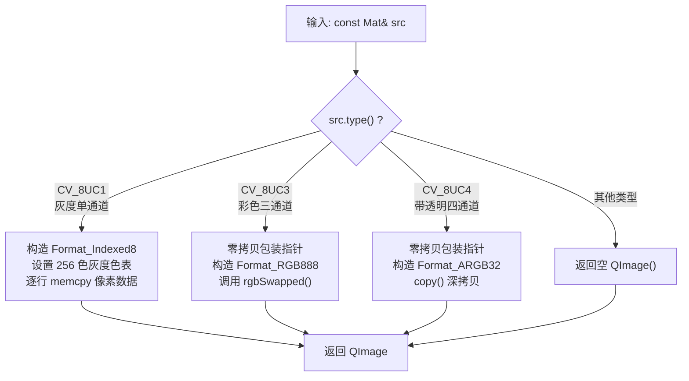
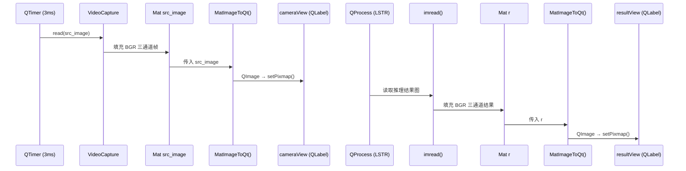

# OpenCV Mat 与 QImage 格式互转

<!-- WIKI_NAV_START -->
> [!info] 视觉感知 Wiki 导航
> [[projects/linux视觉感知项目/index|项目首页]] · [[projects/Linux视觉感知项目/01 Qt 上位机/2.4 CPU与内存实时监控|← 上一篇：6.2.2 CPU / 内存实时监控与 QtCharts 图表展示]] · [[projects/Linux视觉感知项目/03 模型推理部署/4.7 嵌入式平台优化策略|下一篇：7.1 ARM FT2000/4 平台特性与无 GPU 场景下的优化策略 →]]
<!-- WIKI_NAV_END -->

在本系统的 Qt 上位机中，OpenCV 负责摄像头采集与图像处理，而 Qt 负责界面显示。两者各自定义了独立的图像数据结构——`cv::Mat` 和 `QImage`——且**内存布局与颜色通道顺序完全不同**。`MatImageToQt` 函数承担了这两套体系之间的格式"翻译"工作，是摄像头画面实时显示和识别结果回传显示的核心桥梁。

## 为什么需要格式转换

OpenCV 的 `cv::Mat` 以 **BGR** 通道顺序存储像素，内存行优先但支持自定义步长（`step`），并以 `type()` 编码区分通道数与数据深度。Qt 的 `QImage` 则以 **RGB** 顺序存储，通过 `Format` 枚举指定像素格式，并提供 `scanLine()` 接口逐行访问像素。

下表总结了两种图像容器在本项目中的关键差异：

| 维度 | cv::Mat | QImage |
|------|---------|--------|
| 通道顺序 | BGR / BGRA | RGB / ARGB |
| 灰度格式 | `CV_8UC1` | `Format_Indexed8` |
| 彩色格式 | `CV_8UC3` | `Format_RGB888` |
| 透明通道格式 | `CV_8UC4` | `Format_ARGB32` |
| 内存步长 | `src.step`（字节数） | 自动对齐 |
| 像素访问 | `data` 指针 + `step` | `scanLine(row)` |

由于两者通道顺序相反，直接将 Mat 的原始字节交给 QImage 会导致**红蓝通道互换**（天空变橙、红色物体变蓝），因此三通道路径必须执行通道交换。

Sources: [mainwindow.h](mainwindow.h#L5-L6)

## MatImageToQt 函数总体架构

`MatImageToQt` 是 `MainWindow` 类的公有成员函数，声明于 `mainwindow.h`，定义于 `mainwindow.cpp`。它接收一个 `const Mat&` 参数，根据 `src.type()` 分三条路径处理，返回对应的 `QImage` 对象：



三种路径的设计逻辑截然不同：灰度图需要手动逐行复制数据，三通道图利用零拷贝包装后做通道交换，四通道图则依赖 `copy()` 脱离 Mat 生命周期。理解这三条路径的差异，是掌握本函数的关键。

Sources: [mainwindow.cpp](mainwindow.cpp#L168-L222)

## 分支一：灰度图处理（CV_8UC1）

当输入图像是 8 位无符号单通道——即灰度图——时，函数执行以下步骤：

1. **构造空 QImage**：指定宽高和 `Format_Indexed8` 格式，该格式每个像素用一个字节索引色表中的颜色。
2. **设置 256 色灰度色表**：循环 256 次，将索引 `i` 映射为 `qRgb(i, i, i)`，形成从纯黑到纯白的线性灰度渐变。
3. **逐行复制像素数据**：通过 `scanLine(row)` 获取 QImage 第 `row` 行的目标地址，从 Mat 的 `data` 首地址开始，每次拷贝 `src.cols` 个字节。

```cpp
QImage qImage(src.cols, src.rows, QImage::Format_Indexed8);
qImage.setColorCount(256);
for(int i = 0; i < 256; i++) {
    qImage.setColor(i, qRgb(i, i, i));
}
uchar *pSrc = src.data;
for(int row = 0; row < src.rows; row++) {
    uchar *pDest = qImage.scanLine(row);
    memcmp(pDest, pSrc, src.cols);   // ⚠ 注意：此处应为 memcpy
    pSrc += src.step;
}
```

这段代码有一个**已知缺陷**：第 195 行使用了 `memcmp`（比较函数）而非 `memcpy`（拷贝函数）。`memcmp` 的返回值被丢弃，实际并未执行数据拷贝。在当前项目中灰度路径不是主要使用场景（摄像头采集输出为三通道彩色图），因此该问题未在运行时暴露，但如果传入灰度图会导致输出为全黑图像。修复方法是将 `memcmp` 替换为 `memcpy`。

`pSrc += src.step` 这一行体现了 Mat 的步长机制：`src.step` 是每行的字节数，可能大于 `src.cols`（因为内存对齐），因此不能简单用 `cols` 做行偏移。

Sources: [mainwindow.cpp](mainwindow.cpp#L171-L199)

## 分支二：三通道彩色图处理（CV_8UC3）

这是本项目中**使用频率最高**的路径——摄像头采集的帧和推理结果图均为 BGR 三通道格式。处理策略与灰度分支截然不同：

```cpp
const uchar *pSrc = (const uchar*)src.data;
QImage qImage(pSrc, src.cols, src.rows, src.step, QImage::Format_RGB888);
return qImage.rgbSwapped();
```

这里采用了**零拷贝包装 + 通道交换**的两步策略。QImage 的构造函数接受一个外部数据指针，直接将 Mat 的 `data` 包装为 QImage，不复制任何像素数据。`src.step` 参数告诉 QImage 每行的实际字节数（包含对齐填充），确保像素寻址正确。

然而零拷贝意味着 QImage 和 Mat 共享同一块内存。如果 Mat 被释放或修改，QImage 会变成悬空引用。`rgbSwapped()` 的作用不仅是交换红蓝通道（将 BGR 转为 RGB），还**隐式执行了一次深拷贝**，使返回的 QImage 拥有独立内存，从而与 Mat 的生命周期解耦。

Sources: [mainwindow.cpp](mainwindow.cpp#L202-L209)

## 分支三：四通道带透明图处理（CV_8UC4）

对于带 Alpha 透明通道的 RGBA 图像，处理方式如下：

```cpp
const uchar *pSrc = (const uchar*)src.data;
QImage qImage(pSrc, src.cols, src.rows, src.step, QImage::Format_ARGB32);
return qImage.copy();
```

与三通道路径类似，先零拷贝包装 Mat 数据。OpenCV 的 `CV_8UC4` 内存布局为 BGRA，而 Qt 的 `Format_ARGB32` 期望 ARGB——两者在内存中的字节顺序实际上是相同的（均为小端序下的 Alpha-第三通道-第二通道-第一通道），因此不需要像三通道那样额外做通道交换。

这里使用 `copy()` 而非 `rgbSwapped()` 来执行深拷贝，因为它只需要断开与 Mat 的共享内存关系，不需要交换通道。`copy()` 返回一个拥有独立像素数据的新 QImage。

Sources: [mainwindow.cpp](mainwindow.cpp#L212-L218)

## 函数在系统中的调用场景

`MatImageToQt` 在本项目中有两个调用点，分别对应两条不同的图像显示管线：



**摄像头实时显示管线**：`QTimer` 每 3ms 触发一次 `readFrame()` 槽函数，调用 `cap.read(src_image)` 从摄像头读取帧，经 `MatImageToQt` 转换后通过 `setPixmap(QPixmap::fromImage(qsrc))` 显示在 `cameraView` 标签上。由于 QML 的 QLabel 通过 `setPixmap` 接受 `QPixmap`，因此需要 `QPixmap::fromImage()` 再做一层转换。

**推理结果显示管线**：`yolop_process()` 启动 LSTR 推理后，循环读取结果目录中的图片，同样经过 `MatImageToQt` 转换后显示在 `resultView` 标签上。与摄像头管线不同的是，这里每 100ms 读取一张，等待推理程序逐步生成结果。

Sources: [mainwindow.cpp](mainwindow.cpp#L127-L140), [mainwindow.cpp](mainwindow.cpp#L152-L165)

## 内存模型深度解析

理解 `MatImageToQt` 需要掌握三个关键的内存概念：

**步长（step）机制**：OpenCV 的 `Mat` 在内存对齐时，每行的实际字节数可能大于 `像素数 × 通道数`。例如一个 640×480 的三通道图像，`cols × 3 = 1920`，但 `step` 可能为 1920 或更大的对齐值。三通道和四通道分支中 QImage 构造函数的第四个参数 `src.step` 正是为此而设——它告诉 QImage 正确的行跨度，避免图像错位或内存越界。

**零拷贝与生命周期**：QImage 的 `(data, width, height, format)` 构造函数不会拷贝数据，而是直接包装外部指针。这意味着在三通道路径中，`rgbSwapped()` 返回的 QImage 是安全的（已深拷贝），但构造函数返回的临时 QImage 如果不立即使用则是危险的——如果 Mat 的 `data` 在 QImage 之前释放，就会产生悬空指针。当前代码中 `rgbSwapped()` 的调用恰好避免了这个问题。

**色表（Color Table）机制**：`Format_Indexed8` 格式的 QImage 不直接存储 RGB 值，而是存储 8 位索引，通过色表映射到实际颜色。灰度分支中 `setColorCount(256)` 设置色表有 256 个条目，`setColor(i, qRgb(i,i,i))` 将索引 `i` 映射为 RGB `(i,i,i)`，形成标准灰度映射。这种设计比每个像素存 3 字节 RGB 节省了 2/3 的内存。

## 三种路径对比总结

| 维度 | CV_8UC1 灰度 | CV_8UC3 彩色 | CV_8UC4 透明 |
|------|-------------|-------------|-------------|
| 像素格式 | `Format_Indexed8` | `Format_RGB888` | `Format_ARGB32` |
| 是否零拷贝 | 否，逐行拷贝 | 先零拷贝后 rgbSwapped 深拷贝 | 先零拷贝后 copy 深拷贝 |
| 通道交换 | 不需要（单通道） | 需要，通过 `rgbSwapped()` | 不需要（字节序兼容） |
| 是否使用 step | 手动 `pSrc += src.step` | 传入 QImage 构造函数 | 传入 QImage 构造函数 |
| 项目中实际使用 | 否（摄像头输出为彩色） | **是**（摄像头帧 + 推理结果） | 否（无透明通道场景） |
| 已知问题 | `memcmp` 应为 `memcpy` | 无 | 无 |

## 与上下文页面的衔接

本页聚焦于 Mat 到 QImage 的**格式转换函数本身**。在实际系统中，这个转换被嵌入两条图像显示管线中——摄像头采集管线和推理结果管线。关于摄像头如何通过 `VideoCapture` 和 `QTimer` 实现帧采集，可参阅 [摄像头采集与视频帧读取](6-she-xiang-tou-cai-ji-yu-shi-pin-zheng-du-qu)；关于推理结果如何通过 `QProcess` 调用外部程序并回传显示，可参阅 [QProcess 调用外部推理程序](7-qprocess-diao-yong-wai-bu-tui-li-cheng-xu)。转换后的 QImage 最终通过 `QPixmap::fromImage` 变为 `QPixmap` 设置到 `QLabel` 上，这涉及 Qt 的绘制管线，属于 [Qt 程序入口与事件循环原理](4-qt-cheng-xu-ru-kou-yu-shi-jian-xun-huan-yuan-li) 中事件驱动渲染的范畴。
