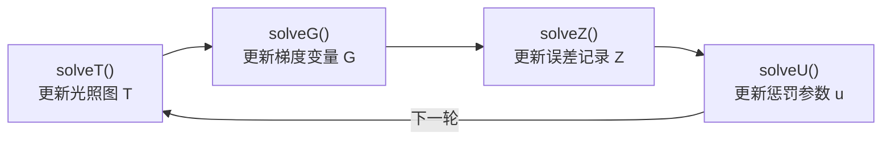
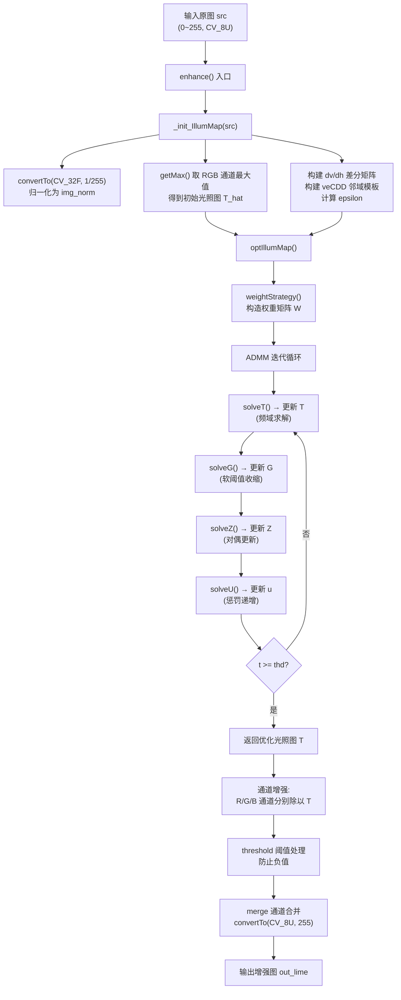

# LIME 算法原理：Retinex 理论与光照图估计

<!-- WIKI_NAV_START -->
> [!info] 视觉感知 Wiki 导航
> [[projects/linux视觉感知项目/index|项目首页]] · [[projects/Linux视觉感知项目/00 项目总览/1.6 模块间协作与进程通信|← 上一篇：3.3 模块间协作与进程间通信机制]] · [[projects/Linux视觉感知项目/02 LIME 低照度增强/3.2 ADMM优化框架|下一篇：4.1.2 ADMM 优化框架：T/G/Z 子问题求解与 FFT 频域加速 →]]
<!-- WIKI_NAV_END -->

本页聚焦于 **LIME（Low-Light Image Enhancement via Illumination Map Estimation）** 算法的数学原理与光照图估计过程。LIME 是本项目中车道线识别链路的预处理核心——摄像头采集 → **LIME 低照度增强** → 神经网络推理 → Qt 显示——其目标是在无 GPU 的 ARM 开发板上，将夜间低照度图像恢复到适合神经网络推理的亮度水平。

## 从 Retinex 到 LIME：低照度增强的理论基础

理解 LIME 算法的第一步是理解经典的 **Retinex 图像形成模型**。该模型将一幅观测图像分解为两个分量的逐像素乘积：**照射分量（Illumination）** 和 **反射分量（Reflectance）**。

$$
L(x) = T(x) \cdot R(x)
$$

其中 $L(x)$ 是观测到的低照度图像，$T(x)$ 是该像素处的光照强度（即光照图），$R(x)$ 是场景的真实反射率。低照度增强的本质问题就是：**给定 $L(x)$，如何求出 $T(x)$，进而恢复出 $R(x) = L(x) / T(x)$**。

LIME 论文的核心贡献在于提出了一个系统化的光照图估计与优化框架。不同于传统 Retinex 方法直接假设光照图的空间平滑性，LIME 通过 **三步策略** 实现更精确的光照图估计：首先从原始图像的 RGB 通道最大值构造一个粗糙的初始光照图 $T_{hat}$，然后通过带权重正则项的优化模型将 $T_{hat}$ 精炼为最终光照图 $T$，最后用优化后的 $T$ 对每个颜色通道做增强。

在本项目的实现中，这条流程被完整映射为三个核心函数调用链：`enhance()` → `_init_IllumMap()` → `optIllumMap()`。

Sources: [lime.cpp](lime.cpp#L66-L70), [lime.h](projects/linux视觉感知项目/源码/图像预处理（加速前+加速后）/Lime/include/lime.h#L9-L57)

## 初始光照图构造：getMax 的物理意义

初始光照图 $T_{hat}$ 的构造基于一个直觉性假设：**在低照度场景中，图像中每个像素的 RGB 三通道最大值可以近似表示该位置的光照强度**。如果一个像素在某个颜色通道上亮度很低，但在另一通道上亮度尚可，则该处的光照强度应由较亮通道决定。

在代码实现中，`getMax()` 函数执行的就是这个操作：

```cpp
cv::Mat lime::getMax(const cv::Mat& bgr) {
    // 拆分 BGR 三通道
    cv::split(bgr, img_norm_rgb);
    // 对每个像素取三通道的最大值
    temp_mat.at<float>(i,j) = MAX(MAX(g, b), r);
    return temp_mat;
}
```

这个函数被 `_init_IllumMap()` 调用，返回的结果赋给类成员 `T_hat`——即 **粗糙的初始光照图**。$T_{hat}$ 作为后续 ADMM 优化的基准参考点，保证优化后的光照图 $T$ 不会偏离初始估计太远。

Sources: [lime.cpp](lime.cpp#L98-L113), [lime.cpp](lime.cpp#L73-L95)

## 光照图优化的数学模型

LIME 将光照图精炼问题建模为如下 **带约束的优化目标函数**：

$$
\min_{T} \left\| T - T_{hat} \right\|_F^2 + \alpha \left\| W \odot \nabla T \right\|_1
$$

该目标函数包含两个关键项：

| 项 | 数学表达 | 物理含义 | 代码对应 |
|---|---|---|---|
| **保真项** | $\left\| T - T_{hat} \right\|_F^2$ | 优化后的 $T$ 不能偏离初始估计 $T_{hat}$ 太远 | `solveT()` 中的 `2 * T_hat` |
| **正则项** | $\alpha \left\| W \odot \nabla T \right\|_1$ | 光照图应在平坦区域平滑、在边缘处保留结构 | `weightStrategy()` 构造的 $W$ |

其中 $\nabla T$ 是光照图的梯度（包括水平和垂直两个方向），$W$ 是权重矩阵，$\odot$ 表示逐元素乘法，$\alpha$ 是平衡参数（代码中设为 1）。

**保真项** 的作用是防止优化后的光照图偏离初始估计太远，保证增强的稳定性。**正则项** 的作用是通过 L1 范数约束梯度，使光照图在保持边缘结构的同时实现区域平滑。权重矩阵 $W$ 的引入使得边缘区域受到较轻的平滑约束，平坦区域受到较强的平滑约束。

Sources: [lime.cpp](lime.cpp#L32-L34), [lime.h](projects/linux视觉感知项目/源码/图像预处理（加速前+加速后）/Lime/include/lime.h#L25-L28)

## 权重矩阵 W 的构造策略

权重矩阵 $W$ 的构造逻辑是 LIME 实现中一个精巧的设计。它基于初始光照图 $T_{hat}$ 在两个方向上的梯度来决定每个像素位置的平滑程度：

```cpp
void lime::weightStrategy(){
    cv::Mat dTv = dv * T_hat;          // 竖直方向梯度
    cv::Mat dTh = T_hat * dh;          // 水平方向梯度
    cv::Mat Wv = 1 / (cv::abs(dTv) + 1);  // 竖直方向权重
    cv::Mat Wh = 1 / (cv::abs(dTh) + 1);  // 水平方向权重
    cv::vconcat(Wv, Wh, W);                // 合并为完整权重图
}
```

其核心规律是：**梯度变化大 → 分母大 → 权重小 → 约束轻；梯度变化小 → 分母小 → 权重大 → 约束重**。这意味着：

- **平坦区域**（如天空、路面）：权重大，后面对梯度的收缩阈值更大，平滑效果更强
- **边缘区域**（如车道线、物体轮廓）：权重小，后面对梯度的收缩阈值更小，边缘保留更好

注意 $W$ 在 `optIllumMap()` 的 while 循环 **之前** 只计算一次，基于初始光照图 $T_{hat}$ 的固定结构作为后续迭代的参考。

Sources: [lime.cpp](lime.cpp#L257-L263)

## ADMM 优化框架与子问题分解

由于目标函数中 L1 范数的存在使得直接求解困难，LIME 采用 **ADMM（Alternating Direction Method of Multipliers，交替方向乘子法）** 将原问题分解为多个易解的子问题。引入辅助变量 $G$ 和拉格朗日乘子 $Z$ 后，增广拉格朗日函数被分解为以下子问题的迭代求解：



每轮迭代严格按 **T → G → Z → U** 的顺序执行，因为存在数据依赖：`solveG()` 需要新的 `T`，`solveZ()` 需要新的 `T` 和 `G`，`solveU()` 供下一轮使用。这个循环的总轮数由收敛阈值 `thd` 控制，在第一轮迭代后通过 Frobenius 范数估计。

Sources: [lime.cpp](lime.cpp#L284-L314)

### 子问题一：solveT — 求解光照图 T

`solveT()` 是整个 ADMM 迭代中最复杂的子问题，负责在频域中求解更新后的光照图。其核心步骤可以概括为：

**步骤 1 — 构造目标变化图 X**：将当前的梯度变量 $G$ 和拉格朗日乘子 $Z$ 组合为目标梯度：

$$
X = G - Z/u
$$

**步骤 2 — 拆分双方向梯度**：$X$ 是 $2 \times row$ 的矩阵，上半部分是竖直方向目标（`Xv`），下半部分是水平方向目标（`Xh`）。

**步骤 3 — 合成二维指导图**：通过差分矩阵将双方向梯度要求重新整理为二维修改建议：

$$
temp = D_v \cdot X_v + X_h \cdot D_h
$$

**步骤 4 — 平衡"稳"与"改"**：将修改建议与初始光照图结合，形成频域求解的分子：

$$
numerator = \mathcal{F}(2 \cdot T_{hat} + u \cdot temp)
$$

其中 $2 \cdot T_{hat}$ 保证稳定性（不偏离初始估计），$u \cdot temp$ 纳入当前轮的修改需求。

**步骤 5 — 频域求解**：利用离散傅里叶变换（DFT）将耦合问题转换到频域求解：

$$
T_{temp} = \mathcal{F}^{-1}\left(\frac{numerator}{denominator + 2}\right)
$$

分母中的 `veCDD` 是拉普拉斯邻域模板（中心为 4，四邻域为 -1），与惩罚参数 $u$ 相乘后构成频域中的正则化因子。

**步骤 6 — 归一化安全护栏**：将光照图值域限制到 $[0.2, 1]$，防止后续增强时 $T$ 过小导致过度增强或 $T$ 过大导致增强不足。

```cpp
normalize(T_temp, T_temp, 0.2, 1, CV_MINMAX);
```

Sources: [lime.cpp](lime.cpp#L148-L175)

### 子问题二：solveG — 梯度收缩

`solveG()` 执行 **软阈值收缩** 操作，将光照图梯度中不重要的细节分量"压掉"，同时保留显著边缘。其数学本质是对当前梯度 $dT = \nabla T$ 与目标 $X = dT + Z/u$ 执行 L1 范数近端映射：

```cpp
cv::Mat lime::solveG(cv::Mat T, cv::Mat Z, float u, cv::Mat W){
    cv::Mat dT = derivative(T);
    cv::Mat epsilon = alpha * W / u;      // 逐点自适应阈值
    cv::Mat X = dT + Z / u;
    cv::Mat S_ce = cv::max(cv::abs(X) - epsilon, 0);  // 软阈值
    cv::Mat O = sign(X).mul(S_ce);                      // 保留符号
    return O;
}
```

软阈值操作的关键在于阈值 $\epsilon = \alpha \cdot W / u$：由于 $W$ 在边缘处小、平坦处大，因此 **平坦区域的收缩阈值更大（平滑更强），边缘区域的收缩阈值更小（边缘保留更好）**。这正是权重矩阵 $W$ 发挥作用的地方。

Sources: [lime.cpp](lime.cpp#L217-L243)

### 子问题三与四：solveZ 与 solveU

`solveZ()` 是拉格朗日乘子的对偶更新，记录当前真实梯度与收缩后梯度之间的差异：

$$
Z \leftarrow Z + u \cdot (\nabla T - G)
$$

这相当于一个"误差记账本"，将每轮的约束违反量累积起来，在下一轮迭代中引导 $T$ 和 $G$ 更好地满足约束条件。

`solveU()` 简单地递增惩罚参数：

$$
u \leftarrow \rho \cdot u
$$

其中 $\rho = 2$（代码中设定）。$u$ 的递增使得每一轮迭代的约束越来越"严格"，推动算法收敛。

Sources: [lime.cpp](lime.cpp#L246-L254)

## 收敛控制机制

ADMM 迭代的总轮数 `thd` 通过如下方式估计：在第一轮迭代结束后，计算当前梯度残差的 Frobenius 范数，然后用对数关系估计总轮数：

```cpp
if(t == 0){
    float temp = Frobenius(derivative(T) - G);
    thd = ceil(2 * log(temp / epsilon));
}
```

其中 `epsilon` 在初始化阶段计算为 `Frobenius(T_hat) * 0.001`。这个估计基于 ADMM 收敛理论——残差以 $O(1/t)$ 的速率衰减，取对数后得到的迭代次数足以保证算法收敛到合理精度。

Sources: [lime.cpp](lime.cpp#L299-L308), [lime.cpp](lime.cpp#L83)

## 从光照图到增强图像：最终增强流程

获得优化后的光照图 $T$ 后，增强操作的核心就是 **逐通道除法**：

$$
R(x) = \frac{L(x)}{T(x)}
$$

在 `enhance()` 函数中，这一过程被展开为三个颜色通道的独立操作：

```cpp
auto g = img_norm_g / T;  // 绿色通道增强
auto b = img_norm_b / T;  // 蓝色通道增强
auto r = img_norm_r / T;  // 红色通道增强
```

**暗处 $T$ 小，除法结果大，提亮效果强；亮处 $T$ 大，除法结果接近原值，增强幅度小**。这正是 LIME 算法实现自适应低照度增强的核心机制。

增强后的通道经过阈值处理（防止负值）、通道合并和格式转换（`CV_32F` → `CV_8U`），最终输出增强图像。

Sources: [lime.cpp](lime.cpp#L317-L347)

## 算法端到端数据流总览

下图展示了 LIME 算法从输入到输出的完整数据流：



## 核心数据结构与参数速查

| 成员 / 变量 | 类型 | 含义 | 取值 / 来源 |
|---|---|---|---|
| `img_norm` | `cv::Mat` CV_32F | 归一化后的输入图像 | 原图 ÷ 255 |
| `T_hat` | `cv::Mat` CV_32F | 初始光照图（粗糙版） | `getMax()` 取 RGB 最大值 |
| `T` | `cv::Mat` CV_32F | 优化后光照图（局部变量） | ADMM 迭代输出 |
| `G` | `cv::Mat` CV_32F | 收缩后的梯度变量 | `solveG()` 软阈值输出 |
| `Z` | `cv::Mat` CV_32F | 拉格朗日乘子 / 误差记录 | `solveZ()` 累积更新 |
| `u` | `float` | 惩罚参数（迭代严格程度） | 初始 1，每轮 ×2 |
| `W` | `cv::Mat` CV_32F | 权重矩阵 | `weightStrategy()` 一次计算 |
| `dv` / `dh` | `cv::Mat` CV_32F | 竖直 / 水平差分矩阵 | `Dev(row, 1)` / `Dev(col, -1)` |
| `veCDD` | `cv::Mat` CV_32F | 拉普拉斯邻域模板 | 中心 4，四邻域 -1 |
| `epsilon` | `float` | 收敛阈值 | `Frobenius(T_hat) × 0.001` |
| `thd` | `float` | 迭代总轮数 | `ceil(2 × log(残差 / ε))` |
| `alpha` | `float` | 正则项平衡系数 | 1 |
| `rho` | `float` | 惩罚参数增长率 | 2 |
| `gamma` | `float` | Gamma 校正系数 | 0.7（滤波模式 0.8） |

Sources: [lime.h](projects/linux视觉感知项目/源码/图像预处理（加速前+加速后）/Lime/include/lime.h#L11-L56), [lime.cpp](lime.cpp#L18-L63)

## 在系统链路中的定位

LIME 算法在本项目中位于图像采集与神经网络推理之间，起到"桥梁"作用。摄像头采集的低照度原始图像，经过 LIME 增强后亮度和对比度显著提升，使得后续的 Unet / LSTR 车道线识别网络能够在夜间场景下获得足够清晰的输入。

关于 LIME 算法中各子函数的逐行代码解析，请参阅 [LIME 核心函数逐行解析](11-lime-he-xin-han-shu-zhu-xing-jie-xi)；关于 ADMM 迭代优化的详细收敛分析，请参阅 [ADMM 迭代优化与收敛控制](12-admm-die-dai-you-hua-yu-shou-lian-kong-zhi)；关于该算法在 ARM 平台上的性能优化策略，请参阅后续的性能优化章节。
