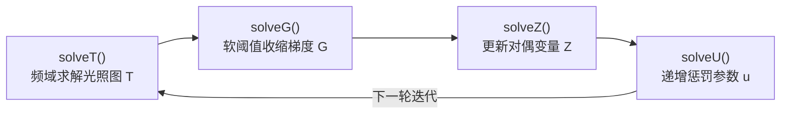
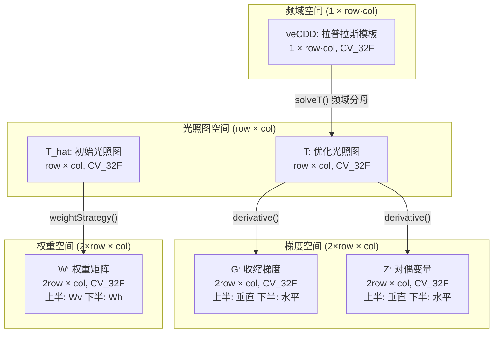

# ADMM 优化框架：T/G/Z 子问题求解与 FFT 频域加速

<!-- WIKI_NAV_START -->
> [!info] 视觉感知 Wiki 导航
> [[projects/linux视觉感知项目/index|项目首页]] · [[projects/Linux视觉感知项目/02 LIME 低照度增强/3.1 算法原理：Retinex与光照图|← 上一篇：4.1.1 LIME 算法原理：Retinex 理论与光照图估计]] · [[projects/Linux视觉感知项目/02 LIME 低照度增强/3.3 收敛策略与参数调优|下一篇：4.1.3 收敛策略与关键参数调优（alpha、rho、归一化范围） →]]
<!-- WIKI_NAV_END -->

本页聚焦于 LIME 低照度增强算法中 **ADMM（Alternating Direction Method of Multipliers，交替方向乘子法）** 迭代优化框架的详细解析与收敛控制策略。ADMM 是 LIME 算法将光照图估计问题从难解的 L1 正则化优化转化为可高效求解的子问题迭代的核心方法论。理解 ADMM 的工作原理和收敛行为，是深入掌握 LIME 算法数学本质的关键，也是后续进行 [ARM NEON 向量化加速](14-arm-neon-xiang-liang-hua-jia-su) 和 [OpenMP 多线程并行加速](15-openmp-duo-xian-cheng-bing-xing-jia-su) 优化的理论基础。

## 从优化目标到 ADMM：为何需要迭代求解

LIME 算法的光照图优化问题被建模为一个带 L1 正则项的凸优化目标：

$$
\min_{T} \left\| T - T_{hat} \right\|_F^2 + \alpha \left\| W \odot \nabla T \right\|_1
$$

其中保真项 $\|T - T_{hat}\|_F^2$ 确保优化后的光照图不偏离初始估计太远，正则项 $\alpha \|W \odot \nabla T\|_1$ 通过 L1 范数约束梯度实现边缘保持的平滑效果。由于 L1 范数的存在使得直接求导令梯度为零的方法失效（L1 范数在零点不可导），LIME 采用 ADMM 框架将原问题分解为多个易解的子问题。ADMM 的核心思想是引入辅助变量 $G$ 和拉格朗日乘子 $Z$，将约束优化问题转化为无约束的增广拉格朗日函数，然后通过交替更新各变量实现求解。

Sources: [lime.cpp](lime.cpp#L32-L34), [lime.cpp](lime.cpp#L284-L314)

## ADMM 迭代框架：四个子问题的交替求解

ADMM 迭代严格按照 **T → G → Z → U** 的顺序执行四个子问题，每轮迭代构成一个完整的优化步。这种严格的顺序执行源于子问题之间的数据依赖关系：`solveG()` 需要最新的 `T`，`solveZ()` 需要最新的 `T` 和 `G`，`solveU()` 更新的惩罚参数 `u` 供下一轮迭代使用。



在 `optIllumMap()` 函数中，这个迭代循环被实现为一个 `while(true)` 循环，直到迭代次数达到预估的收敛阈值 `thd` 后退出：

```cpp
while (true){
    T = solveT(G, Z, u);       // 子问题1: 更新光照图
    G = solveG(T, Z, u, W);    // 子问题2: 收缩梯度
    Z = solveZ(T, G, Z, u);    // 子问题3: 更新对偶变量
    u = solveU(u);             // 子问题4: 递增惩罚参数
    // ... 收敛判断 ...
}
```

初始化时，`T` 为全零矩阵（尺寸 `row × col`），`G` 和 `Z` 为全零矩阵（尺寸 `2×row × col`，存储垂直和水平两个方向的梯度/对偶变量），惩罚参数 `u` 初始值为 1。

Sources: [lime.cpp](lime.cpp#L295-L335)

## 子问题一：solveT — 频域求解光照图

`solveT()` 是整个 ADMM 迭代中计算量最大、数学推导最复杂的子问题，负责在频域中高效求解更新后的光照图 $T$。其目标函数为：

$$
\min_T \|T - T_{hat}\|_F^2 + \frac{u}{2} \|\nabla T - G + Z/u\|_F^2
$$

对 $T$ 求导令其为零，得到线性方程组 $(2I + u\nabla^T\nabla)T = 2T_{hat} + u\nabla^T(G - Z/u)$。由于 $\nabla^T\nabla$ 是循环边界条件下的循环矩阵，它可以在 DFT 基下对角化，从而将矩阵求逆转化为逐元素除法，复杂度从 $O(n^3)$ 降至 $O(n^2 \log n)$。

代码实现分为六个步骤：

**步骤 1 — 构造目标变化图 X：** 将当前梯度变量 $G$ 和拉格朗日乘子 $Z$ 组合为目标梯度。

**步骤 2 — 拆分双方向梯度：** $X$ 是 $2 \times row$ 的矩阵，上半部分是垂直方向目标 `Xv`，下半部分是水平方向目标 `Xh`。

**步骤 3 — 合成二维指导图：** 通过差分矩阵将双方向梯度要求重新整理为二维修改建议 `temp = dv*Xv + Xh*dh`。

**步骤 4 — 平衡"稳"与"改"：** 将修改建议与初始光照图结合，`numerator = FFT(2·T_hat + u·temp)`，其中 $2 \cdot T_{hat}$ 保证稳定性，$u \cdot temp$ 纳入当前轮的修改需求。

**步骤 5 — 频域求解：** `T_temp = IFFT(numerator / (denominator + 2))`，分母中的 `veCDD` 是拉普拉斯邻域模板（中心为 4，四邻域为 -1），与惩罚参数 $u$ 相乘后构成频域中的正则化因子。

**步骤 6 — 归一化安全护栏：** `normalize(T_temp, T_temp, 0.2, 1, CV_MINMAX)` 将光照图值域限制到 $[0.2, 1]$，下界 0.2 防止后续增强时除法产生数值爆炸，上界 1 确保光照图不超过原始亮度。

在优化版本 `lime_opt.cpp` 中，`solveT()` 使用自实现的 `fft2_neon()` 替代 OpenCV 的 `cv::dft()`，利用 NEON 指令集加速蝶形运算，进一步提升了频域求解的性能。

Sources: [lime.cpp](lime.cpp#L148-L190), [lime_opt.cpp](lime_opt.cpp#L400-L440)

## 子问题二：solveG — 加权软阈值收缩

`solveG()` 执行 **加权软阈值操作（Weighted Soft Thresholding）**，这是 Total Variation 正则化的标准求解步骤。其数学本质是对当前梯度 $dT = \nabla T$ 与组合目标 $X = dT + Z/u$ 执行 L1 范数近端映射：

$$
G = \text{sign}(X) \odot \max(|X| - \epsilon, 0)
$$

其中自适应阈值 $\epsilon = \alpha \cdot W / u$。软阈值操作的关键在于阈值的逐点自适应性：由于权重矩阵 $W$ 在边缘处小、平坦处大，因此 **平坦区域的收缩阈值更大（平滑更强），边缘区域的收缩阈值更小（边缘保留更好）**。

```cpp
cv::Mat epsilon = alpha * W / u;                    // 逐点自适应阈值
cv::Mat X = dT + Z / u;                              // 组合输入
cv::Mat S_ce = cv::max(cv::abs(X) - epsilon, 0);    // 软阈值收缩
cv::Mat O = sign(X).mul(S_ce);                       // 保留符号
```

当梯度 $|\nabla T|$ 小于阈值 $\alpha \cdot W/u$ 时，$G$ 被置为 0，实现去噪/平滑效果；当梯度大于阈值时，$G$ 保留梯度信息但减去阈值，保留真正的边缘结构。

Sources: [lime.cpp](lime.cpp#L217-L255)

## 子问题三与四：solveZ 与 solveU — 对偶更新与惩罚递增

`solveZ()` 是拉格朗日乘子的对偶更新，记录当前真实梯度与收缩后梯度之间的差异：

$$
Z \leftarrow Z + u \cdot (\nabla T - G)
$$

其中 $(\nabla T - G)$ 是原始约束 $\nabla T = G$ 的残差。$Z$ 相当于一个"误差记账本"，将每轮的约束违反量累积起来，在下一轮迭代中引导 $T$ 和 $G$ 更好地满足约束条件。当优化收敛时，$\nabla T \approx G$，残差趋近于零，$Z$ 不再变化。

`solveU()` 简单地递增惩罚参数：

$$
u \leftarrow \rho \cdot u
$$

其中 $\rho = 2$（代码中设定的 `rho` 成员变量）。惩罚参数 $u$ 的递增策略是 ADMM 的标准做法：初期 $u$ 较小，允许较大的原始残差，重点优化目标函数；后期 $u$ 增大，强制满足约束 $\nabla T = G$，保证可行性。$\rho = 2$ 是论文推荐的经验值——增长过快会导致数值不稳定，过慢则收敛缓慢。

Sources: [lime.cpp](lime.cpp#L246-L264)

## 收敛控制机制：预估式迭代次数估计

ADMM 迭代的收敛控制采用了一种**预估式策略**，而非传统的"残差小于阈值则退出"的判据。这种设计的核心优势在于避免了每次迭代都计算范数的额外开销。

收敛阈值 `epsilon` 在初始化阶段计算为初始光照图 $T_{hat}$ 的 Frobenius 范数的千分之一：

```cpp
epsilon = Frobenius(T_hat) * 0.001;
```

在首次迭代（$t = 0$）结束后，代码计算当前梯度残差的 Frobenius 范数，然后通过公式估算总迭代次数：

```cpp
if(t == 0){
    float temp = Frobenius(derivative(T) - G);
    thd = ceil(2 * log(temp / epsilon));
}
t += 1;
if(t >= thd) break;
```

这个估计基于 ADMM 的理论收敛速率——残差以 $O(1/t)$ 的速率衰减，取对数后得到的迭代次数足以保证算法收敛到合理精度。公式 `thd = ceil(2·ln(残差/ε))` 的物理含义是：假设残差从初始值衰减到目标阈值 $\epsilon$ 所需的迭代次数约为残差比值的对数的常数倍。因子 2 是一个安全系数，确保算法在预估轮数内充分收敛。

| 参数 | 含义 | 计算方式 | 典型值 |
|------|------|----------|--------|
| `epsilon` | 收敛目标阈值 | `Frobenius(T_hat) × 0.001` | 与图像亮度相关 |
| `thd` | 预估迭代总轮数 | `ceil(2 × ln(残差/ε))` | 通常 5-15 轮 |
| `rho` | 惩罚参数增长率 | 固定值 | 2 |
| `u` | 惩罚参数 | 初始 1，每轮 ×ρ | 1, 2, 4, 8, ... |

Sources: [lime.cpp](lime.cpp#L83), [lime.cpp](lime.cpp#L299-L312)

## 数据结构与内存布局

ADMM 迭代涉及的中间变量具有特定的内存布局设计，理解这些布局对于后续的性能优化至关重要。



梯度变量 `G` 和对偶变量 `Z` 的行数为 `2×row`，这是因为它们存储的是垂直和水平两个方向的梯度/对偶变量，通过 `derivative()` 函数中的 `cv::vconcat(v, h, matrix_C)` 上下拼接而成。`veCDD` 是一维向量化的拉普拉斯算子，包含五个非零元素 `[4, -1, -1, -1, -1]`，对应循环边界条件下的二维离散拉普拉斯核。

Sources: [lime.cpp](lime.cpp#L95-L102), [lime.cpp](lime.cpp#L145-L152)

## ADMM 收敛行为分析

ADMM 在 LIME 光照图优化问题上的收敛行为可以通过以下几个维度理解：

**收敛速率：** ADMM 理论上以 $O(1/t)$ 的速率收敛，其中 $t$ 为迭代次数。这意味着在初始阶段残差下降较快，后期逐渐趋缓。预估公式 `thd = ceil(2·ln(残差/ε))` 正是基于这一理论特性设计的。

**惩罚参数的影响：** $u$ 以几何级数 $\rho = 2$ 增长，使得每一轮迭代的约束越来越"严格"。初期 $u$ 较小时，算法侧重于最小化目标函数（保真项 + 正则项），允许约束 $\nabla T = G$ 存在较大违反；后期 $u$ 较大时，算法强制满足约束，保证解的可行性。这种"先松后紧"的策略是 ADMM 收敛的关键。

**权重矩阵的作用：** 权重矩阵 $W = 1/(|\nabla T_{hat}| + 1)$ 在优化过程中保持不变（基于初始光照图 $T_{hat}$ 的固定结构）。它在边缘区域赋予较小的权重，使得软阈值操作的阈值较低，从而保留边缘信息；在平坦区域赋予较大的权重，增强平滑效果。这种结构感知的权重策略是 LIME 算法能够在平滑噪声的同时保留边缘结构的关键设计。

**数值稳定性保障：** `solveT()` 中的 `normalize(T_temp, T_temp, 0.2, 1, CV_MINMAX)` 将光照图约束在 $[0.2, 1]$ 范围内，防止数值发散。这个安全护栏确保了即使在极端低照度场景下，后续的 Retinex 除法 $R = L/T$ 的最大放大倍数也不超过 $1/0.2 = 5$ 倍。

Sources: [lime.cpp](lime.cpp#L257-L273), [lime.cpp](lime.cpp#L262-L264)

## 优化版本中的 ADMM 差异

对比基础版本 `lime.cpp` 和优化版本 `lime_opt.cpp`，ADMM 迭代框架本身（四个子问题的数学逻辑和收敛控制策略）保持完全一致，差异仅体现在底层计算的加速方式上：

| 对比维度 | 基础版本 (lime.cpp) | 优化版本 (lime_opt.cpp) |
|---------|-------------------|----------------------|
| FFT 实现 | `cv::dft()` OpenCV 内置 | `fft2_neon()` 自实现 + NEON 加速 |
| `getMax` | 逐像素三重比较 | NEON `vmaxq_f32` 4 路并行 + OpenMP 4 象限并行 |
| `Frobenius` | 标量循环累加 | NEON `vmulq_f32` + `vaddq_f32` 向量累加 |
| `Mat2Vec` | 标量循环拷贝 | NEON `vld1q_f32`/`vst1q_f32` 4 元素批量传输 |
| ADMM 迭代逻辑 | 未修改 | 未修改 |
| 收敛控制逻辑 | 未修改 | 未修改 |

这种设计体现了**算法逻辑与计算实现分离**的工程原则——ADMM 的数学框架和收敛策略是算法层面的设计，不受底层硬件加速方式的影响。

Sources: [lime_opt.cpp](lime_opt.cpp#L400-L440), [lime_opt.cpp](lime_opt.cpp#L100-L250)

## 函数调用关系与性能热点

下表总结了 ADMM 迭代中各函数的调用关系和计算复杂度，为理解性能瓶颈和优化优先级提供参考：

| 函数 | 调用者 | 调用次数 | 复杂度 | 性能影响 |
|------|--------|---------|--------|---------|
| `solveT` | `optIllumMap` | thd 次 | O(row·col·log(row·col)) | **最高**（FFT） |
| `solveG` | `optIllumMap` | thd 次 | O(2·row·col) | 高（软阈值） |
| `solveZ` | `optIllumMap` | thd 次 | O(2·row·col) | 中 |
| `solveU` | `optIllumMap` | thd 次 | O(1) | 低 |
| `derivative` | solveT/solveG/solveZ | 3·thd 次 | O(row·col) | 高（矩阵乘法） |
| `Frobenius` | optIllumMap | 1 次 | O(row·col) | 低 |

`solveT()` 是性能瓶颈所在——它在每次迭代中执行两次 FFT 变换（正变换和逆变换），涉及复数运算和大量内存访问。`solveG()` 中的逐元素软阈值操作虽然简单，但因高频调用（thd 次 × 每次 O(2·row·col) 个元素）也值得关注。`derivative()` 被三个子问题共同调用（每轮 3 次），其矩阵乘法的优化对整体性能有显著影响。
