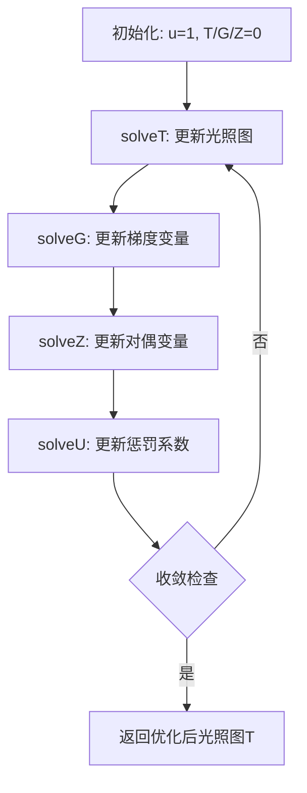

# 收敛策略与关键参数调优（alpha、rho、归一化范围）

<!-- WIKI_NAV_START -->
> [!info] 视觉感知 Wiki 导航
> [[projects/linux视觉感知项目/index|项目首页]] · [[projects/Linux视觉感知项目/02 LIME 低照度增强/3.2 ADMM优化框架|← 上一篇：4.1.2 ADMM 优化框架：T/G/Z 子问题求解与 FFT 频域加速]] · [[projects/Linux视觉感知项目/02 LIME 低照度增强/3.5 NEON SIMD向量化加速|下一篇：4.2.1 NEON SIMD 指令集优化详解（getMax、Frobenius、FFT 蝶形运算） →]]
<!-- WIKI_NAV_END -->

本文档深入解析LIME算法中ADMM优化框架的收敛策略和关键参数调优方法。在低照度图像增强中，**alpha**控制梯度约束强度、**rho**调节惩罚系数增长、**归一化范围**确保光照图安全下界，三者共同决定了算法的收敛速度、增强效果和数值稳定性。理解这些参数的相互作用，是优化LIME算法性能的关键。

## ADMM迭代框架与收敛机制

LIME算法采用ADMM（交替方向乘子法）框架求解光照图优化问题。整个迭代过程在`optIllumMap()`函数中组织，每轮严格执行`T→G→Z→u`的更新顺序，确保ADMM算法的正确性。

**迭代流程图**：


收敛机制基于两个关键计算：
1. **收敛阈值计算**：`epsilon = Frobenius(T_hat) * 0.001`，其中`T_hat`是初始光照图的Frobenius范数。这确保了收敛阈值与图像内容自适应。
2. **迭代次数阈值**：`thd = ceil(2 * log(temp / epsilon))`，其中`temp = Frobenius(derivative(T) - G)`。这基于梯度残差的对数衰减估计迭代次数。

Sources: `图像预处理（加速前+加速后）/Lime_NEON+OpenMP/lime_opt.cpp#L542-L573`

## 关键参数详解

### alpha参数：梯度约束强度

**定义与作用**：
`alpha`参数控制梯度约束的强度，在`solveG()`函数中用于计算带权软阈值。其默认值为1，在代码中表现为：

```cpp
cv::Mat epsilon = alpha * W / u;
```

**数学意义**：
在ADMM框架中，`alpha`影响梯度稀疏约束的阈值大小。`W`是边缘感知权重矩阵，由`weightStrategy()`计算得到，其计算公式为：
```cpp
Wv = 1 / (abs(dTv) + 1);
Wh = 1 / (abs(dTh) + 1);
```
其中`dTv`和`dTh`分别是初始光照图`T_hat`的纵向和横向梯度。

**调优影响**：
- **alpha过大**：梯度阈值增大，导致更多梯度被抑制为零，结果过度平滑，可能丢失重要边缘细节。
- **alpha过小**：梯度阈值减小，噪声抑制不足，增强结果可能出现振铃伪影或噪声放大。
- **alpha=1**：在大多数场景下提供良好的平衡，既保持边缘锐度又有效抑制噪声。

Sources: `图像预处理（加速前+加速后）/Lime_NEON+OpenMP/lime_opt.cpp#L476-L502`

### rho参数：惩罚系数增长因子

**定义与作用**：
`rho`参数控制惩罚系数`u`的增长速率，在`solveU()`函数中实现：
```cpp
float lime::solveU(float u) {
    return u * rho;
}
```
默认值为2，意味着每轮迭代惩罚系数翻倍。

**数学意义**：
在ADMM算法中，惩罚系数`u`（也称为`rho`）控制约束满足的力度。随着迭代进行，`u`按`rho`因子增长，逐渐加强约束的强制性，促使算法收敛。

**调优影响**：
- **rho过大**：惩罚系数增长过快，可能导致算法过早收敛到局部最优，错过全局最优解。
- **rho过小**：惩罚系数增长缓慢，需要更多迭代次数才能收敛，计算开销增大。
- **rho=2**：经验值，在收敛速度和稳定性之间取得良好平衡。

**收敛速度关系**：
每轮迭代后，惩罚系数按`u_{k+1} = rho * u_k`更新。经过`t`轮迭代后，惩罚系数为`u_t = rho^t * u_0`。当`rho=2`时，惩罚系数呈指数增长，这符合ADMM理论中逐渐加强约束的策略。

Sources: `图像预处理（加速前+加速后）/Lime_NEON+OpenMP/lime_opt.cpp#L510-L513`

### 归一化范围：光照图安全边界

**定义与作用**：
在`solveT()`函数中，优化后的光照图`T_temp`需要归一化到特定范围：
```cpp
normalize(T_temp, T_temp, 0.2, 1, CV_MINMAX);
```
这确保光照图值在[0.2, 1]范围内。

**数学意义**：
- **下界0.2**：防止光照图值接近零，避免在`image / T`操作时产生数值不稳定或溢出。
- **上界1**：保持光照图的物理意义，值不超过1（归一化图像的最大可能值）。
- **CV_MINMAX**：使用最小-最大归一化方法，保持值分布形状。

**调优影响**：
- **下界过大（如0.5）**：增强效果减弱，暗区域提亮不足。
- **下界过小（如0.05）**：数值稳定性风险增加，可能导致增强结果出现噪声放大或伪影。
- **上界调整**：通常保持1，因为图像已归一化到[0,1]范围。

**实际应用中的考量**：
归一化范围的选择需要平衡增强效果和数值稳定性。在低照度场景中，过小的下界可能导致噪声被过度放大，而过大的下界则削弱增强效果。经验值0.2在大多数场景下表现良好。

Sources: `图像预处理（加速前+加速后）/Lime_NEON+OpenMP/lime_opt.cpp#L426`

## 参数间相互作用与系统行为

三个关键参数在ADMM框架中相互影响，形成复杂的系统行为：

**参数交互矩阵**：
| 参数组合 | 收敛速度 | 增强效果 | 数值稳定性 | 计算开销 |
|---------|---------|---------|-----------|---------|
| **alpha大 + rho大** | 快 | 过度平滑 | 稳定 | 低 |
| **alpha大 + rho小** | 中 | 过度平滑 | 稳定 | 中 |
| **alpha小 + rho大** | 快 | 噪声放大 | 风险高 | 低 |
| **alpha小 + rho小** | 慢 | 噪声放大 | 风险高 | 高 |
| **alpha适中 + rho适中** | 中 | 平衡 | 稳定 | 中 |

**收敛与效果的平衡**：
1. **快速收敛需求**：增大`rho`（如3-4）和适度减小`alpha`（如0.8），但需监控增强质量。
2. **增强质量优先**：使用适中`alpha`（1-1.2）和`rho`（2），配合多次迭代。
3. **数值稳定性优先**：保持`alpha≥1`，`rho≤2.5`，归一化下界≥0.15。

**归一化范围的影响**：
归一化范围主要影响最终增强结果，而`alpha`和`rho`主要影响优化过程。三者共同决定：
- 增强图像的对比度和亮度
- 细节保持程度
- 噪声抑制效果
- 迭代收敛速度

## 参数调优实践指南

### 基于场景的参数调整策略

**场景1：低照度但细节丰富（如夜间街道）**：
- **目标**：保持细节，避免过度平滑
- **推荐参数**：`alpha=1.0-1.2`，`rho=2.0`，归一化下界=0.2
- **原理**：适中的`alpha`平衡噪声抑制和细节保持，标准`rho`确保稳定收敛。

**场景2：极低照度（如昏暗室内）**：
- **目标**：最大化提亮，可接受一定平滑
- **推荐参数**：`alpha=0.8-1.0`，`rho=2.0-2.5`，归一化下界=0.15-0.2
- **原理**：稍小的`alpha`允许更强的噪声抑制，稍大的`rho`加速收敛。

**场景3：高噪声低照度（如夜间监控）**：
- **目标**：强力噪声抑制，可牺牲部分细节
- **推荐参数**：`alpha=1.2-1.5`，`rho=2.0`，归一化下界=0.2-0.25
- **原理**：较大的`alpha`增强梯度约束，抑制噪声，归一化下界提供额外安全边界。

### 参数调整工作流程

1. **基准测试**：使用默认参数（`alpha=1`, `rho=2`, 归一化下界=0.2）运行，记录结果质量和性能指标。
2. **单参数调整**：
   - 固定`rho=2`和归一化下界=0.2，调整`alpha`在0.8-1.5范围。
   - 固定`alpha=1`和归一化下界=0.2，调整`rho`在1.5-3.0范围。
   - 固定`alpha=1`和`rho=2`，调整归一化下界在0.1-0.3范围。
3. **组合优化**：基于单参数结果，尝试参数组合，监控收敛速度和增强质量。
4. **验证测试**：在不同场景图像上验证参数组合的泛化能力。

### 性能与质量的权衡

**性能优化方向**：
- **减少迭代次数**：增大`rho`（如3）可减少迭代次数，但可能影响质量。
- **加速单次迭代**：优化`solveT()`中的FFT计算（使用NEON优化版本）。
- **并行化**：OpenMP并行处理不同颜色通道或图像分块。

**质量优化方向**：
- **精细调节`alpha`**：根据图像噪声水平动态调整，高噪声增大`alpha`。
- **自适应归一化**：根据图像内容动态调整归一化范围，如对比度高的图像可使用较小下界。
- **多尺度处理**：对不同分辨率区域使用不同参数组合。

## 代码实现中的关键细节

### 收敛阈值计算逻辑

```cpp
// 初始化收敛阈值
epsilon = Frobenius(T_hat) * 0.001;

// 迭代开始时计算迭代次数阈值
if(t == 0) {
    float temp = Frobenius(derivative(T) - G);
    thd = ceil(2 * log(temp / epsilon));
}
```

**重要说明**：
1. `epsilon`基于初始光照图`T_hat`的范数，确保阈值与图像内容自适应。
2. `thd`的计算基于梯度残差的对数衰减，这是ADMM收敛性的理论保证。
3. 使用`ceil()`确保至少1次迭代，避免提前终止。

Sources: `图像预处理（加速前+加速后）/Lime_NEON+OpenMP/lime_opt.cpp#L558-L562`

### 带权软阈值实现

```cpp
cv::Mat lime::solveG(cv::Mat T, cv::Mat Z, float u, cv::Mat W) {
    cv::Mat dT = derivative(T);
    cv::Mat epsilon = alpha * W / u;
    cv::Mat X = dT + Z / u;
    
    // 符号矩阵计算
    cv::Mat mat_temp(row_temp, col_temp, CV_32F);
    // ... 符号计算逻辑 ...
    
    // 带权软阈值操作
    cv::Mat S_ce = cv::max(cv::abs(X) - epsilon, 0);
    cv::Mat O = mat_temp.mul(S_ce);
    return O;
}
```

**关键点**：
- `epsilon = alpha * W / u`：阈值与权重`W`成正比，与惩罚系数`u`成反比。
- 随着迭代进行，`u`增大，阈值减小，软阈值操作更激进。
- 权重`W`使阈值在边缘区域较小（保留细节），在平坦区域较大（抑制噪声）。

Sources: `图像预处理（加速前+加速后）/Lime_NEON+OpenMP/lime_opt.cpp#L476-L502`

## 常见问题与解决方案

### 问题1：收敛速度过慢
**可能原因**：
- `rho`过小，惩罚系数增长缓慢
- 初始`u`过小，约束力度不足
- 图像噪声水平高，需要更多迭代

**解决方案**：
- 增大`rho`至2.5-3.0
- 适当增大初始`u`值（如2.0）
- 预处理去噪，或增大`alpha`增强约束

### 问题2：增强结果过度平滑
**可能原因**：
- `alpha`过大，梯度约束过强
- 归一化下界过大，限制提亮效果

**解决方案**：
- 减小`alpha`至0.8-1.0
- 适当减小归一化下界（不低于0.15）
- 检查权重矩阵`W`的计算是否合理

### 问题3：数值不稳定或溢出
**可能原因**：
- 归一化下界过小，导致除法放大噪声
- `alpha`过小，约束不足
- 图像本身包含极端像素值

**解决方案**：
- 增大归一化下界至0.2以上
- 增大`alpha`增强约束
- 预处理截断极端像素值

### 问题4：收敛过早，结果不佳
**可能原因**：
- `rho`过大，惩罚系数增长过快
- 收敛阈值计算错误

**解决方案**：
- 减小`rho`至2.0或更小
- 检查`epsilon`和`thd`的计算逻辑
- 增加最大迭代次数限制

## 最佳实践总结

1. **默认参数优先**：从`alpha=1`, `rho=2`, 归一化下界=0.2开始，这是经过验证的平衡点。
2. **场景驱动调整**：根据图像特性和应用需求调整参数，而非盲目优化。
3. **单变量测试**：调整参数时一次只改变一个变量，观察影响后再调整其他参数。
4. **监控收敛过程**：记录迭代次数和残差变化，理解参数对收敛行为的影响。
5. **质量与性能平衡**：根据实际需求在增强效果和计算开销之间找到最佳平衡点。
6. **边界条件保护**：确保归一化下界足够大（≥0.15），避免数值问题。
7. **自适应策略**：考虑实现自适应参数调整，根据图像内容动态优化参数。

## 与其他页面的关联

本文档聚焦于收敛策略和参数调优，是LIME算法深度剖析系列的一部分。相关页面包括：

- [[projects/Linux视觉感知项目/02 LIME 低照度增强/3.1 算法原理：Retinex与光照图|LIME 算法原理：Retinex 理论与光照图估计]]：了解LIME算法的理论基础
- [[projects/Linux视觉感知项目/02 LIME 低照度增强/3.2 ADMM优化框架|ADMM 优化框架：T/G/Z 子问题求解与 FFT 频域加速]]：深入理解ADMM框架的数学原理
- [[projects/Linux视觉感知项目/02 LIME 低照度增强/3.5 NEON SIMD向量化加速|NEON SIMD 指令集优化详解]]：了解算法实现的性能优化技术
- [[projects/Linux视觉感知项目/02 LIME 低照度增强/3.6 OpenMP多线程并行|OpenMP 多线程并行策略]]：掌握并行化实现细节

通过理解这些参数调优策略，开发者能够更好地优化LIME算法在不同场景下的表现，平衡增强效果、收敛速度和计算效率，实现高质量的低照度图像增强。

<!-- WIKI_FOOTER_START -->
---
> [!tip] 继续阅读
> [[projects/linux视觉感知项目/index|项目首页]] · [[projects/Linux视觉感知项目/02 LIME 低照度增强/3.2 ADMM优化框架|← 上一篇：4.1.2 ADMM 优化框架：T/G/Z 子问题求解与 FFT 频域加速]] · [[projects/Linux视觉感知项目/02 LIME 低照度增强/3.5 NEON SIMD向量化加速|下一篇：4.2.1 NEON SIMD 指令集优化详解（getMax、Frobenius、FFT 蝶形运算） →]]
<!-- WIKI_FOOTER_END -->
