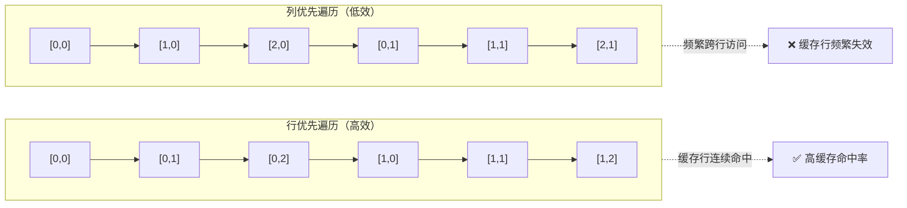
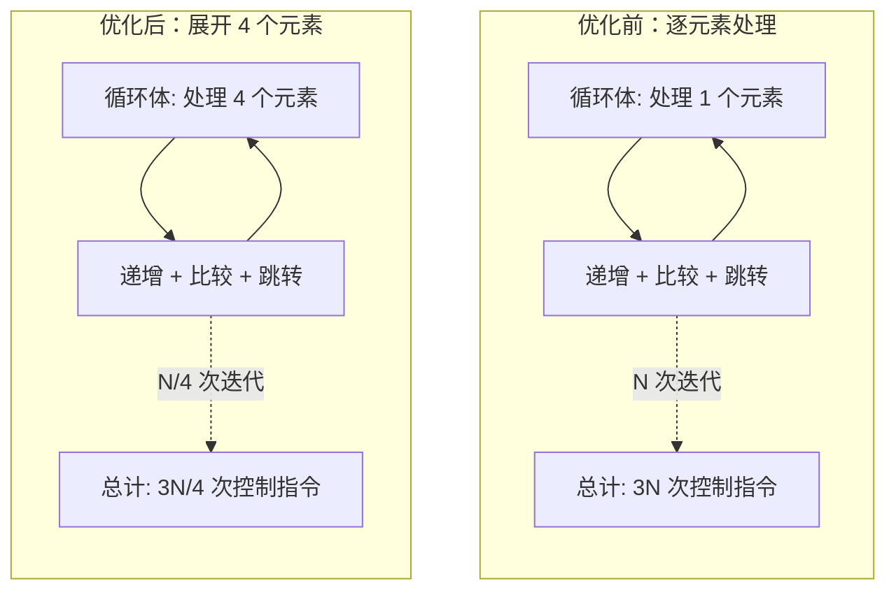

# 循环重排与缓存优化技巧

<!-- WIKI_NAV_START -->
> [!info] 视觉感知 Wiki 导航
> [[projects/linux视觉感知项目/index|项目首页]] · [[projects/Linux视觉感知项目/02 LIME 低照度增强/3.6 OpenMP多线程并行|← 上一篇：4.2.2 OpenMP 多线程并行策略（色彩通道分离与图像分块处理）]] · [[projects/Linux视觉感知项目/02 LIME 低照度增强/3.7 优化前后性能对比|下一篇：4.2.4 优化前后性能对比与加速比分析 →]]
<!-- WIKI_NAV_END -->

本页聚焦于 LIME 低照度增强算法在 CPU 侧的两项基础优化技术：**循环重排（Loop Reordering）** 与 **循环展开（Loop Unrolling）**。这两项优化不依赖特定硬件指令集，属于纯粹的代码结构层面的性能改进，同时也是后续 [ARM NEON 向量化加速](14-arm-neon-xiang-liang-hua-jia-su) 和 [OpenMP 多线程并行加速](15-openmp-duo-xian-cheng-bing-xing-jia-su) 的前置基础。理解这两项技术，是读懂整个 LIME 优化链路的第一步。

## 优化背景：为什么需要循环级优化

LIME 算法的实现中存在大量对图像矩阵的逐像素遍历操作。以一张 720×720 的图像为例，单次双层嵌套 for 循环遍历就需要执行 518,400 次操作。在飞腾 FT2000 开发板（ARM 架构、无 GPU 加速）上运行时，这些循环的效率直接决定了预处理能否满足实时性要求。

原始代码中存在两类典型的性能瓶颈：一是**内存访问模式不匹配**，导致 CPU 缓存（Cache）命中率低下；二是**循环控制开销占比过高**，每次迭代的比较、跳转指令占据了大量时钟周期。循环重排解决第一个问题，循环展开解决第二个问题，两者共同为后续的 NEON 向量化和 OpenMP 并行化铺平道路。

## 循环重排：匹配内存布局的遍历顺序

### 原理：行优先存储与缓存行

C/C++ 中的二维数组（包括 OpenCV 的 `cv::Mat`）采用**行优先（Row-Major）**存储，即同一行的元素在内存中是连续排列的。CPU 缓存系统以**缓存行（Cache Line）**为单位加载数据，典型的缓存行大小为 64 字节，可容纳 16 个 `float` 值。当程序访问某个内存地址时，CPU 会将该地址所在的整个缓存行一次性加载到 L1 缓存中。

如果内层循环遍历的方向与内存存储方向一致，后续访问可以直接命中已加载的缓存行；反之，如果内层循环跨行访问，每次迭代都会触发缓存行失效（Cache Miss），需要从更慢的 L2/L3 缓存甚至主存重新加载数据。



### 项目实例：`reshape1D` 函数的循环顺序问题

在原始代码中，`reshape1D` 函数负责将一维向量重构回二维矩阵。该函数的外层循环遍历列索引，内层循环遍历行索引，而目标矩阵 `mat_temp` 是按行优先存储的，这导致内层循环每次写入的目标地址都跨越了整行的长度。

**优化前的代码**——外层遍历列、内层遍历行，写入地址不连续：

```cpp
// 外层遍历列 i，内层遍历行 j
for(int i = 0; i < col; i++){
    for(int j = 0; j < row; j++){
        // 目标矩阵 mat_temp 按行优先存储
        // 当 j 变化时，写入地址 (j, i) 在内存中跳跃 col 个 float
        mat_temp.at<float>(j, i) = mat.at<float>(0, i*row + j);
    }
}
```

`mat_temp.at<float>(j, i)` 的内存偏移量为 `j * col + i`，当内层循环变量 `j` 从 0 递增到 `row-1` 时，每次写入的地址跳跃了 `col * sizeof(float)` 字节，这与缓存行的连续加载方向完全不一致。Sources: [lime.cpp](lime.cpp#L204-L214)

在优化后的版本中，虽然该函数的循环顺序未做调整（因为其数据源是一维向量，转置写入的逻辑本身决定了这种遍历顺序），但在其他关键函数中，循环重排的理念被全面应用。例如在 `getMax` 函数中，外层循环遍历行、内层循环遍历列，严格匹配 `cv::Mat` 的行优先存储布局。Sources: [lime_opt.cpp](lime_opt.cpp#L103-L170)

### 循环重排的核心原则

| 原则 | 说明 |
|------|------|
| **内层循环遍历连续维度** | 对于行优先存储的矩阵，内层循环应遍历列索引（`j`），确保相邻迭代访问连续内存 |
| **外层循环遍历跳跃维度** | 外层循环遍历行索引（`i`），每次跳转一整行，这是不可避免的开销 |
| **数据存储顺序与遍历顺序一致** | 源数据和目标数据的遍历方向应保持一致，避免双向跳跃 |
| **优先使用指针访问** | `mat.ptr<float>(i) + j` 比 `mat.at<float>(i, j)` 减少了一次地址计算 |

## 循环展开：减少控制开销、为向量化铺路

### 原理：循环控制的隐性成本

每次 for 循环迭代都包含三个隐性操作：**递增循环变量**、**比较是否到达边界**、**条件跳转到循环体头部**。对于一个迭代次数为 N 的循环，这三项操作各执行 N 次，共产生 3N 条指令开销。当循环体内的实际计算量很小时（如单次只处理一个像素），这些控制指令的占比可达 30% 以上。

**循环展开（Loop Unrolling）** 通过在循环体内手动展开多次迭代，将每次循环处理的数据量从 1 个提升到 k 个，从而使循环总次数从 N 降低到 N/k，循环控制开销也随之降低到原来的 1/k。同时，展开后的代码可以充分利用 ARM NEON 的 128 位宽向量寄存器，单条指令同时处理 4 个 32 位浮点数。



### 项目实例一：`Mat2Vec` 函数的循环展开

`Mat2Vec` 函数负责将二维矩阵展平为一维向量，是 `solveT` 函数在频域变换前的必经步骤。原始代码逐元素复制，优化后每次加载和存储 4 个 `float` 值。

**优化前**——逐元素遍历，循环控制开销高：

```cpp
for(int i = 0; i < row; i++){
    for(int j = 0; j < col; j++){
        mat_one.at<float>(0, i*col+j) = mat.at<float>(i, j);
    }
}
// 总迭代次数: row × col，每次处理 1 个 float
```

Sources: [lime.cpp](lime.cpp#L194-L200)

**优化后**——展开为每次处理 4 个元素，配合 NEON 加载指令：

```cpp
for (int i = 0; i < num_elements; i += 4)  // 步长为 4
{
    // 一次性加载 4 个 float（128 位）
    float32x4_t vec_src = vld1q_f32(mat.ptr<float>(0) + i);
    // 一次性存储 4 个 float
    vst1q_f32(mat_one.ptr<float>(0) + i, vec_src);
}
// 总迭代次数: num_elements / 4，每次处理 4 个 float
```

Sources: [lime_opt.cpp](lime_opt.cpp#L449-L457)

此优化将循环迭代次数减少到原来的 1/4，同时消除了矩阵转置后逐元素索引计算的开销。由于矩阵转置后行优先存储，一维遍历本身就是连续的，因此循环展开与内存布局完美配合。

### 项目实例二：`getMax` 函数的展开与向量化

`getMax` 函数对每个像素取 RGB 三通道的最大值，是光照图初始化的核心计算。原始代码逐像素调用 `MAX` 宏，优化后内层循环每次处理 4 个像素。

**优化前**——逐像素标量计算：

```cpp
for(int i = 0; i < row; i++){
    for(int j = 0; j < col; j++){
        temp_mat.at<float>(i,j) = MAX(
            MAX(img_norm_g.at<float>(i,j), img_norm_b.at<float>(i,j)),
            img_norm_r.at<float>(i,j));
    }
}
```

Sources: [lime.cpp](lime.cpp#L107-L112)

**优化后**——内层循环展开为步长 4，配合 NEON 向量最大值指令：

```cpp
for(int i = 0; i < row; i++){
    for(int j = 0; j < col; j += 4){  // 步长为 4
        // 加载 4 个绿色通道像素
        float32x4_t g = vld1q_f32(img_norm_g.ptr<float>(i) + j);
        // 加载 4 个蓝色通道像素
        float32x4_t b = vld1q_f32(img_norm_b.ptr<float>(i) + j);
        // 加载 4 个红色通道像素
        float32x4_t r = vld1q_f32(img_norm_r.ptr<float>(i) + j);
        // 单条指令计算 4 组 RGB 最大值
        float32x4_t max_val = vmaxq_f32(g, vmaxq_f32(b, r));
        // 存储结果
        vst1q_f32(temp_mat.ptr<float>(i) + j, max_val);
    }
}
```

Sources: [lime_opt.cpp](lime_opt.cpp#L118-L127)

这里 `j += 4` 实现了循环展开，而 `vld1q_f32`、`vmaxq_f32`、`vst1q_f32` 是 NEON 指令（详见 [ARM NEON 向量化加速](14-arm-neon-xiang-liang-hua-jia-su)），两者结合使单次迭代处理 4 个像素，循环控制开销降低 75%。

### 项目实例三：FFT 蝶形运算中的展开

在自实现的快速傅里叶变换函数 `fft2` 中，蝶形运算的核心内层循环也采用了步长为 2 的展开，每次并行处理 2 个蝶形运算单元：

```cpp
for (int i = 0; i < steplength / 2; i += 2)  // 步长为 2
{
    Index0 = steplength * step + i;
    Index1 = steplength * step + i + steplength / 2;
    // 使用 NEON 指令并行加载 2 组复数数据
    temp_real = vld1_f32(...);
    temp_imag = vld1_f32(...);
    // 执行 2 组蝶形乘法
    // ...
}
```

Sources: [lime_opt.cpp](lime_opt.cpp#L349-L373)

FFT 蝶形运算中复数乘法的计算量较大，循环展开不仅减少了控制开销，更关键的是让编译器能够更好地调度指令流水线，提高指令级并行度（ILP）。

## 两种优化的协同关系

循环重排和循环展开并非独立使用，而是构成了一条递进的优化链路。循环重排确保数据在内存中被正确地、连续地访问，为循环展开提供了高效的内存带宽基础；循环展开则在连续访问的基础上，减少循环控制开销，并将数据访问模式调整为适合 NEON 向量寄存器宽度的步长。


| 优化层次 | 解决的问题 | 典型手段 | 性能收益来源 |
|----------|-----------|---------|-------------|
| 循环重排 | 缓存行频繁失效 | 调整内外层循环顺序 | 提升 L1 缓存命中率 |
| 循环展开 | 循环控制开销占比高 | 步长从 1 改为 4 | 减少 75% 的跳转指令 |
| NEON 向量化 | 单条指令只处理 1 个数据 | 使用 128 位向量寄存器 | 单指令处理 4 个 float |
| OpenMP 并行 | 单核利用率不足 | 多线程分块处理 | 利用 4 核处理器 |

## 性能效果汇总

经过循环重排和循环展开优化后，LIME 算法中被优化函数的执行效率显著提升。以下是从原始版本到最终优化版本的整体性能对比：

| 优化阶段 | 主要手段 | 运行时间 | 加速比 |
|----------|---------|---------|--------|
| 原始版本 | 无优化，使用 `cv::dft` | 1.6305s | 1.00× |
| 傅里叶函数重构 | 自实现 FFT + 循环展开 | 1.031s | 1.58× |
| 叠加 NEON + OpenMP | 全面向量化 + 多线程 | 0.314s | 5.19× |

循环重排和循环展开作为第一阶段的优化，为后续的 NEON 和 OpenMP 优化奠定了基础。没有正确的内存访问模式和适当的展开步长，NEON 指令无法高效地加载连续数据，OpenMP 线程也无法获得良好的数据局部性。

## 下一步阅读

循环重排和循环展开解决了数据访问模式和循环控制开销的问题，但尚未充分利用 ARM 处理器的向量计算能力。接下来可以深入了解：

- [ARM NEON 向量化加速](14-arm-neon-xiang-liang-hua-jia-su)——理解 NEON 指令如何在循环展开的基础上实现单指令多数据并行
- [OpenMP 多线程并行加速](15-openmp-duo-xian-cheng-bing-xing-jia-su)——了解如何将优化后的单核代码扩展到多核并行

如需回顾 LIME 算法本身的实现逻辑，请参阅 [LIME 核心函数逐行解析](11-lime-he-xin-han-shu-zhu-xing-jie-xi)。
