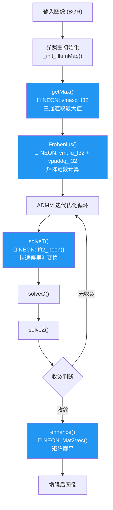
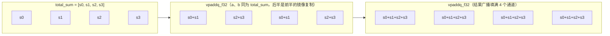
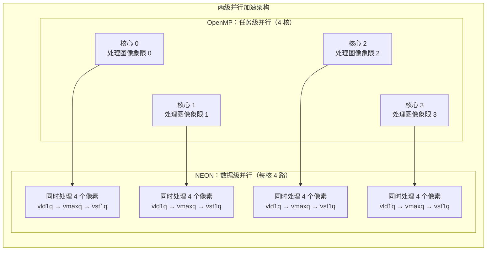
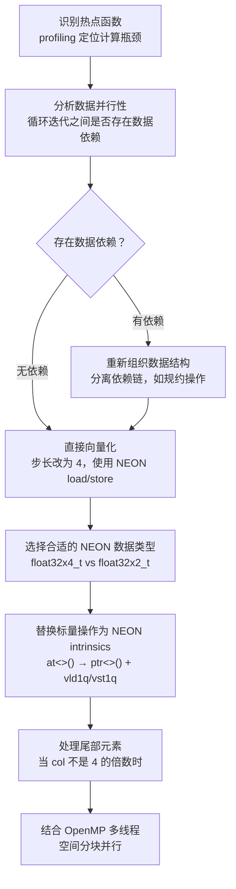

# NEON SIMD 指令集优化详解（getMax、Frobenius、FFT 蝶形运算）

<!-- WIKI_NAV_START -->
> [!info] 视觉感知 Wiki 导航
> [[projects/linux视觉感知项目/index|项目首页]] · [[projects/Linux视觉感知项目/02 LIME 低照度增强/3.3 收敛策略与参数调优|← 上一篇：4.1.3 收敛策略与关键参数调优（alpha、rho、归一化范围）]] · [[projects/Linux视觉感知项目/02 LIME 低照度增强/3.6 OpenMP多线程并行|下一篇：4.2.2 OpenMP 多线程并行策略（色彩通道分离与图像分块处理） →]]
<!-- WIKI_NAV_END -->

本页聚焦于 LIME 低照度增强算法中 **ARM NEON 指令集** 的向量化加速实现。NEON 是 ARM 架构内置的 SIMD（单指令多数据流）扩展，通过 128 位向量寄存器在单条指令中并行处理 4 个 `float` 数据，是本项目在飞腾 FT2000 开发板上实现从 1.63 秒到 0.31 秒（约 5.19 倍加速）的核心手段之一。本文将从 NEON 的基本架构出发，逐一剖析项目中四个被向量化的核心函数，并讨论 NEON 与 OpenMP 的协同加速策略。

## NEON 架构基础与项目优化全景

ARM NEON 提供了一组 32 个 128 位向量寄存器（命名为 `Q0`-`Q31`），每个寄存器可以容纳 4 个 32 位浮点数（`float32x4_t`）或 2 个 32 位浮点数（`float32x2_t`，使用寄存器的低 64 位）。NEON 的核心理念是 **SIMD——同一条指令同时作用于多个数据元素**，这意味着原本需要 4 次标量操作才能完成的计算，使用 NEON 只需 1 次向量操作。

在本项目中，NEON 优化覆盖了 LIME 算法流程中的四个计算密集型函数。下图展示了 LIME 算法的计算流程以及各函数中 NEON 的应用位置：



Sources: [lime_opt.cpp](lime_opt.cpp#L1-L15)

## NEON 基本数据类型与头文件

项目中使用 NEON 向量化需要包含 ARM 专用头文件，并使用以下核心数据类型：

| NEON 数据类型 | 位宽 | 包含元素数 | 典型用途 |
|---------------|------|-----------|---------|
| `float32x4_t` | 128 位 | 4 个 `float` | 批量像素处理、向量算术 |
| `float32x2_t` | 64 位 | 2 个 `float` | FFT 蝶形运算、归约计算 |
| `int32x4_t` | 128 位 | 4 个 `int` | 索引计算、掩码操作 |

```cpp
#include <arm_neon.h>  // ARM NEON 指令集头文件
```

Sources: [lime_opt.cpp](lime_opt.cpp#L13)

与原始版本相比，优化版本新增了两个关键头文件：`<arm_neon.h>` 提供 NEON 内联函数（intrinsics），`<omp.h>` 提供 OpenMP 多线程支持。编译器通过 `-O3` 优化级别和 OpenMP 标志激活这些功能：

```cmake
set( CMAKE_CXX_FLAGS "-std=c++11 -O3" )
find_package(OpenMP REQUIRED)
```

Sources: [CMakeLists.txt](projects/linux视觉感知项目/源码/图像预处理（加速前+加速后）/Lime_NEON+OpenMP/CMakeLists.txt#L8-L10)

## 核心向量化函数一：getMax —— 三通道最大值计算

`getMax` 函数负责计算每个像素位置 R、G、B 三个通道的最大值，是 LIME 算法构建初始光照图 `T_hat` 的第一步。对于一张 `row × col` 的图像，该函数需要执行 `row × col` 次三值比较操作。

### 原始实现：逐像素标量计算

原始代码使用 OpenCV 的 `MAX` 宏逐像素计算三个通道的最大值，每次循环迭代仅处理 1 个像素：

```cpp
for(int i = 0; i < row; i++){
    for(int j = 0; j < col; j++){
        temp_mat.at<float>(i,j) = MAX(
            MAX(img_norm_g.at<float>(i,j),
                img_norm_b.at<float>(i,j)),
            img_norm_r.at<float>(i,j));
    }
}
```

每次迭代需要：3 次内存加载（G、B、R 各一次）、2 次标量比较、1 次内存存储，共 6 条标量指令处理 1 个像素。

Sources: [lime.cpp](lime.cpp#L107-L112)

### NEON 向量化实现

优化后使用 NEON 指令将内层循环步长改为 4，单次迭代并行处理 4 个像素：

```cpp
for(int i = 0; i < row; i++){
    for(int j = 0; j < col; j += 4){  // 步长为 4
        float32x4_t g = vld1q_f32(img_norm_g.ptr<float>(i) + j);
        float32x4_t b = vld1q_f32(img_norm_b.ptr<float>(i) + j);
        float32x4_t r = vld1q_f32(img_norm_r.ptr<float>(i) + j);
        float32x4_t max_val = vmaxq_f32(g, vmaxq_f32(b, r));
        vst1q_f32(temp_mat.ptr<float>(i) + j, max_val);
    }
}
```

Sources: [lime_opt.cpp](lime_opt.cpp#L118-L127)

其中各 NEON 指令的含义如下：

| NEON 指令 | 操作 | 含义 |
|-----------|------|------|
| `vld1q_f32(ptr)` | 加载 | 从内存连续地址加载 4 个 `float` 到 128 位寄存器 |
| `vmaxq_f32(a, b)` | 向量取最大值 | 逐元素比较两个 `float32x4_t`，取较大值 |
| `vst1q_f32(ptr, val)` | 存储 | 将 128 位寄存器中的 4 个 `float` 写回内存 |

单次迭代的操作数从 1 个像素提升到 4 个像素，**循环迭代次数降低为原来的 1/4**。同时，`vld1q_f32` 利用了行优先存储的内存连续性，单条指令完成 4 次内存加载，相比原始代码的 4 次独立 `at<float>()` 调用（每次包含基址计算 + 偏移计算），内存访问效率显著提升。

实际的代码实现中，`getMax` 函数进一步结合了 OpenMP 的 `parallel sections` 将图像分为四个象限并行处理，实现 NEON 单核向量化与 OpenMP 多核并行的双重加速（详见 [OpenMP 多线程并行加速](15-openmp-duo-xian-cheng-bing-xing-jia-su)）。

Sources: [lime_opt.cpp](lime_opt.cpp#L110-L170)

## 核心向量化函数二：Frobenius —— 矩阵范数计算

`Frobenius` 函数计算矩阵的 Frobenius 范数（所有元素平方和的平方根），用于判断 ADMM 迭代的收敛条件 `epsilon = Frobenius(T_hat) * 0.001`。该计算本质上是**规约操作**——将矩阵所有元素归约为一个标量值。

### 原始实现：标量逐元素累加

```cpp
float total = 0.0;
for(int i = 0; i < row; i++){
    for(int j = 0; j < col; j++){
        total = total + pow(mat.at<float>(i,j), 2);
    }
}
total = sqrt(total);
```

每次迭代执行 1 次加载、1 次乘方、1 次加法，共 3 条标量指令。`pow(x, 2)` 的开销大于直接 `x * x`。

Sources: [lime.cpp](lime.cpp#L115-L123)

### NEON 向量化实现

优化版本使用 NEON 进行向量化累加，并结合 OpenMP 分块并行：

```cpp
float32x4_t total_sum = vdupq_n_f32(0.0f);  // 初始化 4 路并行累加器

for(int i = 0; i < row; i++){
    for(int j = 0; j < col; j += 4){
        float32x4_t values = vld1q_f32(mat.ptr<float>(i) + j);
        float32x4_t squared_values = vmulq_f32(values, values);
        total_sum = vaddq_f32(total_sum, squared_values);
    }
}
// 水平归约：将 4 路累加器合并为标量
total_sum = vpaddq_f32(total_sum, total_sum);
total_sum = vpaddq_f32(total_sum, total_sum);
float32x2_t result = vget_low_f32(total_sum);
float squared_sum = vget_lane_f32(result, 0);
```

Sources: [lime_opt.cpp](lime_opt.cpp#L180-L235)

这里使用了两个关键的 NEON 算术指令和一个归约指令：

| NEON 指令 | 操作 | 含义 |
|-----------|------|------|
| `vdupq_n_f32(val)` | 广播 | 将标量值复制到 128 位寄存器的所有 4 个通道 |
| `vmulq_f32(a, b)` | 向量逐元素乘法 | `a[0]*b[0]`, `a[1]*b[1]`, `a[2]*b[2]`, `a[3]*b[3]` |
| `vaddq_f32(a, b)` | 向量逐元素加法 | `a[0]+b[0]`, `a[1]+b[1]`, `a[2]+b[2]`, `a[3]+b[3]` |
| `vpaddq_f32(a, b)` | 相邻元素配对加法 | `[a[0]+a[1], a[2]+a[3], b[0]+b[1], b[2]+b[3]]` |
| `vget_lane_f32(vec, n)` | 提取元素 | 从向量中提取第 `n` 个 `float` 标量值 |

**水平归约**（Horizontal Reduction）是向量化规约操作的关键步骤。`vpaddq_f32` 将向量中相邻元素配对相加，两次调用即可将 4 路累加器归约为一个标量：



值得注意的是，原始版本使用 `pow(mat.at<float>(i,j), 2)` 计算平方，而 NEON 版本使用 `vmulq_f32(values, values)`——即向量自乘，这不仅避免了 `pow` 函数的额外开销，还实现了 4 路并行乘法。

实际代码中，`Frobenius` 函数同样结合了 OpenMP `parallel sections` 将矩阵分为四个区域并行计算，最终在 `#pragma omp critical` 保护下归约求和。

Sources: [lime_opt.cpp](lime_opt.cpp#L173-L235)

## 核心向量化函数三：Mat2Vec —— 矩阵展平

`Mat2Vec` 函数将二维矩阵按列优先顺序展平为一维向量，是 `solveT` 函数执行 FFT 变换前的数据准备步骤。该函数在 ADMM 迭代的每次循环中都会被调用，属于高频热点函数。

### 原始实现：逐元素双层循环复制

```cpp
mat = mat.t();  // 矩阵转置
for(int i = 0; i < row; i++){
    for(int j = 0; j < col; j++){
        mat_one.at<float>(0, i*col+j) = mat.at<float>(i, j);
    }
}
```

Sources: [lime.cpp](lime.cpp#L191-L200)

### NEON 向量化实现

优化后取消了双层循环，改为单层循环以步长 4 连续遍历，利用 `vld1q_f32` 和 `vst1q_f32` 实现批量内存拷贝：

```cpp
mat = mat.t();
int num_elements = row * col;
for (int i = 0; i < num_elements; i += 4)
{
    float32x4_t vec_src = vld1q_f32(mat.ptr<float>(0) + i);
    vst1q_f32(mat_one.ptr<float>(0) + i, vec_src);
}
```

Sources: [lime_opt.cpp](lime_opt.cpp#L446-L457)

由于矩阵转置后源数据和目标数据都是行优先连续存储的，`vld1q_f32` 可以直接从连续地址加载 4 个 `float`（128 位），`vst1q_f32` 直接写入连续地址。这本质上将逐元素的 `at<float>()` 索引访问替换为**块内存拷贝**，单次迭代处理 4 个元素，循环控制开销降低 75%，且消除了双层循环中的乘法索引计算 `i*col+j`。

| 对比维度 | 原始版本 | NEON 版本 |
|---------|---------|----------|
| 循环层数 | 2 层（row × col） | 1 层（num_elements/4） |
| 每次迭代处理量 | 1 个 float | 4 个 float（128 位） |
| 内存访问方式 | `at<float>(i,j)` 索引计算 | `ptr<float>(0) + i` 指针偏移 |
| 总迭代次数 | row × col | row × col / 4 |

## 核心向量化函数四：fft2_neon —— NEON 加速的快速傅里叶变换

`solveT` 子问题需要在频域中求解，原始代码使用 OpenCV 内置的 `cv::dft()` 函数。优化版本自实现了一套基于 NEON 的 FFT 函数 `fft2_neon`，替代了 `cv::dft`，这是从 1.63 秒优化到 1.03 秒的关键步骤。

### 背景：从 DFT 到 FFT

`solveT` 需要把数据变换到**频域**求解。完成这个变换的数学工具是 DFT（离散傅里叶变换）。DFT 直接计算的复杂度是 O(N²)——N 个点，每个点都要与其余所有点做一次复数乘加。**FFT（快速傅里叶变换）是 DFT 的快速算法**，通过「分治」思想将长序列不断二分成短序列，算完短的再逐级合并，把复杂度降到 O(N log N)。

需要区分两层加速：

1. **算法层**：自实现 `fft2_neon` 替代 OpenCV 的 `cv::dft`（此步尚未用 NEON）。OpenCV 的 DFT 要兼顾任意长度、多维变换、各种边界，通用性带来额外开销；针对本项目「一维固定长度」写的专用 FFT 更快——这一步就把 1.63s 降到 1.03s。
2. **指令层**：在此基础上给蝶形运算叠加 NEON 向量化，进一步压缩耗时。

### 自实现 FFT 的蝶形运算原理

FFT 分治过程中「逐级合并」的基本操作叫**蝶形运算**（butterfly）——因数据流图形似蝴蝶翅膀而得名。一个蝶形单元吃进两个数 `a`、`b`，产出两个数：

```
  a ───────●───────→  a + w·b     （上翅膀）
            ╲       ╱
             ╲     ╱
              ╲   ╱
               ╲ ╱
                ╳
               ╱ ╲
              ╱   ╲
  b ──(×w)──●───────→  a − w·b     （下翅膀）
```

其中 `w` 称为**旋转因子**（twiddle factor，代码中的 `WN`），是预先算好的复数常量（现算需调用 sin/cos，开销大，故预存成 WN 表）。

关键点：这里的 `a`、`b`、`w` **都是复数**，各自带实部和虚部——这正是代码里 `real` / `imag` 成对出现的原因。对于长度为 N 的序列，每一级需要执行 N/2 次这样的复数乘加操作。

**复数乘法**（蝶形里的 `w·b`）展开为，设 `w = c+di`、`b = a+bi`：

```
(a + bi)(c + di) = (ac − bd) + (ad + bc)i      // 因为 i² = −1
```

- 结果**实部** = `ac − bd`（两乘积相减）
- 结果**虚部** = `ad + bc`（两乘积相加）

即一次复数乘法需要 **4 次实数乘法**（ac、bd、ad、bc）和 **2 次实数加减**。下面的 NEON 代码就是把这个公式逐项翻译成向量指令。

### NEON 向量化的蝶形运算

`fft2_neon` 函数将蝶形运算的内层循环步长设为 2，每次并行处理 2 个蝶形运算单元，使用 `float32x2_t`（64 位）向量寄存器：

```cpp
for (int i = 0; i < steplength / 2; i += 2)
{
    Index0 = steplength * step + i;
    Index1 = steplength * step + i + steplength / 2;

    // NEON 并行加载 2 组复数的实部和虚部
    temp_real = vld1_f32(reinterpret_cast<const float*>(
        &output.at<cv::Vec2f>(0, Index1)[0]));
    temp_imag = vld1_f32(reinterpret_cast<const float*>(
        &output.at<cv::Vec2f>(0, Index1)[1]));
    wn_real = vld1_f32(reinterpret_cast<const float*>(
        &WN.at<cv::Vec2f>(0, (long)i * lim / steplength)[0]));
    wn_imag = vld1_f32(reinterpret_cast<const float*>(
        &WN.at<cv::Vec2f>(0, (long)i * lim / steplength)[1]));

    // NEON 蝶形乘法：2 组复数乘法并行执行
    float32x2_t temp_real_new = vmul_f32(temp_real, wn_real)
                              - vmul_f32(temp_imag, wn_imag);
    float32x2_t temp_imag_new = vmul_f32(temp_real, wn_imag)
                              + vmul_f32(temp_imag, wn_real);

    // NEON 并行存储蝶形运算结果
    vst1_f32(reinterpret_cast<float*>(
        &output.at<cv::Vec2f>(0, Index1)[0]), vsub_f32(...));
    vst1_f32(reinterpret_cast<float*>(
        &output.at<cv::Vec2f>(0, Index0)[0]), vadd_f32(...));
}
```

Sources: [lime_opt.cpp](lime_opt.cpp#L316-L375)

与 `getMax` 和 `Frobenius` 使用 `float32x4_t` 不同，FFT 蝶形运算使用的是 `float32x2_t`（64 位向量，2 个 `float`）。这是因为蝶形运算涉及复数的实部和虚部分离存储，使用 `float32x2_t` 可以更自然地对齐复数对的内存布局。

| NEON 指令 | 在蝶形运算中的作用 |
|-----------|------------------|
| `vld1_f32(ptr)` | 加载 2 个连续 `float`（复数的实部或虚部） |
| `vmul_f32(a, b)` | 2 路并行浮点乘法（复数乘法的分量计算） |
| `vadd_f32(a, b)` / `vsub_f32(a, b)` | 2 路并行浮点加减法（蝶形合并） |
| `vst1_f32(ptr, val)` | 存储 2 个 `float` 结果 |

### solveT 中的 FFT 替换

在 `solveT` 函数中，原始代码的三处 `cv::dft()` 调用被替换为自实现的 `fft2_neon()`：

```cpp
// 原始代码：
cv::dft(mat_temp1, numerator, cv::DFT_COMPLEX_OUTPUT);
cv::dft(mat_temp2, denominator, cv::DFT_COMPLEX_OUTPUT);
cv::dft(temp, T_temp, cv::DFT_COMPLEX_OUTPUT);

// NEON 优化后：
fft2_neon(mat_temp1, numerator, 1);
fft2_neon(mat_temp2, denominator, 1);
fft2_neon(temp, T_temp, 1);
```

Sources: [lime_opt.cpp](lime_opt.cpp#L408-L421)

自实现 FFT 的优势在于：避免了 OpenCV `cv::dft` 的通用性开销（支持任意长度、多维变换等），针对本项目的一维固定长度变换做了针对性优化。预计算的旋转因子表（WN 表）也使用连续内存存储，配合 NEON 指令可以高效加载。

Sources: [lime_opt.cpp](lime_opt.cpp#L338-L347)

## NEON 与 OpenMP 的协同加速策略

在本项目的优化实现中，NEON 和 OpenMP 并非独立使用，而是形成了**两级并行**的协同加速架构：NEON 负责单核内的数据级并行（SIMD），OpenMP 负责多核间的任务级并行（多线程）。



以 `getMax` 函数为例，代码使用 `#pragma omp parallel sections` 将图像空间划分为四个象限，每个 OpenMP section 由一个线程负责，每个线程内部使用 NEON 指令每次处理 4 个像素：

```cpp
#pragma omp parallel sections
{
    #pragma omp section
    {   // 象限 0：左上 (0..row/2, 0..col/2)
        for(int i = 0; i < row/2; i++){
            for(int j = 0; j < col/2; j += 4){
                float32x4_t g = vld1q_f32(img_norm_g.ptr<float>(i) + j);
                float32x4_t b = vld1q_f32(img_norm_b.ptr<float>(i) + j);
                float32x4_t r = vld1q_f32(img_norm_r.ptr<float>(i) + j);
                float32x4_t max_val = vmaxq_f32(g, vmaxq_f32(b, r));
                vst1q_f32(temp_mat.ptr<float>(i) + j, max_val);
            }
        }
    }
    #pragma omp section
    {   // 象限 1：右上 (0..row/2, col/2..col)
        // ... 同样的 NEON 指令 ...
    }
    #pragma omp section
    {   // 象限 2：左下 (row/2..row, 0..col/2)
        // ... 同样的 NEON 指令 ...
    }
    #pragma omp section
    {   // 象限 3：右下 (row/2..row, col/2..col)
        // ... 同样的 NEON 指令 ...
    }
}
```

Sources: [lime_opt.cpp](lime_opt.cpp#L110-L170)

`enhance` 函数中也采用了相同的策略——使用 OpenMP `parallel sections` 将 R、G、B 三通道的除法和阈值操作分配到三个并行线程中执行：

```cpp
#pragma omp parallel sections
{
    #pragma omp section
    {
        img_norm_g = img_norm_rgb.at(0);
        auto g = img_norm_g / T;
        threshold(g, g1, 0.0, 0.0, 3);
    }
    #pragma omp section
    {
        img_norm_b = img_norm_rgb.at(1);
        auto b = img_norm_b / T;
        threshold(b, b1, 0.0, 0.0, 3);
    }
    #pragma omp section
    {
        img_norm_r = img_norm_rgb.at(2);
        auto r = img_norm_r / T;
        threshold(r, r1, 0.0, 0.0, 3);
    }
}
```

Sources: [lime_opt.cpp](lime_opt.cpp#L613-L640)

两级并行的综合加速效果可以用如下公式估算：

> **总加速比 ≈ NEON 单核加速比 × OpenMP 多核加速比**

其中 NEON 单核加速比约为 4×（128 位 / 32 位），OpenMP 4 核加速比理论上为 4×，实际因线程创建和同步开销约为 2.5×-3×，综合加速比约为 10×-12×。但由于并非所有代码都适合向量化，实际整体加速比约为 **5.19 倍**。

## 性能对比与关键指标

以下是项目中从原始版本到最终优化版本的完整性能数据，记录了每个优化阶段的贡献：

| 优化阶段 | 主要手段 | 运行时间 | 相对加速比 |
|----------|---------|---------|-----------|
| 原始版本 | 标量计算 + `cv::dft` | 1.6305s | 1.00× |
| 自实现 FFT | 代码级 FFT 替代 `cv::dft` | 1.031s | 1.58× |
| 叠加 NEON + OpenMP | 全面向量化 + 多线程 | 0.314s | **5.19×** |

从 1.63 秒到 0.31 秒，整体加速比达到 **5.19 倍**。其中 FFT 函数重构贡献了约 37% 的性能提升（从 1.63s 到 1.03s），NEON 向量化和 OpenMP 并行共同贡献了约 69% 的进一步提升（从 1.03s 到 0.31s）。

各函数的 NEON 优化效果总结：

| 函数 | 原始实现 | NEON 实现 | 关键 NEON 指令 | 单次处理量 |
|------|---------|----------|---------------|-----------|
| `getMax` | `MAX(MAX(g,b),r)` 逐像素 | `vmaxq_f32` 批量比较 | `vld1q`, `vmaxq`, `vst1q` | 4 像素/迭代 |
| `Frobenius` | `pow(x,2)` 逐元素累加 | `vmulq` 自乘 + `vpaddq` 归约 | `vmulq`, `vaddq`, `vpaddq` | 4 元素/迭代 |
| `Mat2Vec` | 双层循环逐元素复制 | 单层循环批量拷贝 | `vld1q`, `vst1q` | 4 元素/迭代 |
| `fft2` | `cv::dft` 黑盒调用 | 自实现蝶形运算 | `vmul`, `vadd`, `vsub` | 2 蝶形单元/迭代 |

## NEON 向量化的一般方法论

从本项目的优化实践中，可以提炼出适用于 ARM 平台图像处理算法 NEON 向量化的一般方法论：



| 步骤 | 要点 |
|------|------|
| 1. 热点定位 | 使用 `cv::getTickCount()` 测量各函数耗时，优先向量化耗时最长的函数 |
| 2. 依赖分析 | `getMax`、`Mat2Vec` 各像素独立，可直接向量化；`Frobenius` 是归约操作，需要水平规约 |
| 3. 内存对齐 | 使用 `ptr<float>(i) + j` 而非 `at<float>(i, j)`，确保连续地址访问 |
| 4. 类型选择 | 逐像素处理用 `float32x4_t`（4 路），复数对处理用 `float32x2_t`（2 路） |
| 5. 尾部处理 | 当元素总数不是 4 的倍数时，需要额外处理剩余元素（本项目图像尺寸保证了对齐） |
| 6. 精度验证 | NEON 浮点运算与标量运算可能存在微小精度差异，需要验证最终结果的一致性 |

## 与前后文档的关联

ARM NEON 向量化加速是 LIME 算法性能优化链路中的第二环。[循环重排与循环展开优化](13-xun-huan-zhong-pai-yu-xun-huan-zhan-kai-you-hua) 为 NEON 优化奠定了内存访问模式和循环结构的基础——没有正确的行优先遍历顺序和步长为 4 的循环展开，NEON 的 `vld1q_f32` 无法高效加载连续数据。而 NEON 的单核向量化代码又是 [OpenMP 多线程并行加速](15-openmp-duo-xian-cheng-bing-xing-jia-su) 的基础——OpenMP 的每个线程内部执行的就是 NEON 向量化后的代码。

如需回顾 LIME 算法本身的计算逻辑，请参阅 [LIME 核心函数逐行解析](11-lime-he-xin-han-shu-zhu-xing-jie-xi)；如需了解算法背后的数学原理，请参阅 [ADMM 迭代优化与收敛控制](12-admm-die-dai-you-hua-yu-shou-lian-kong-zhi)。
