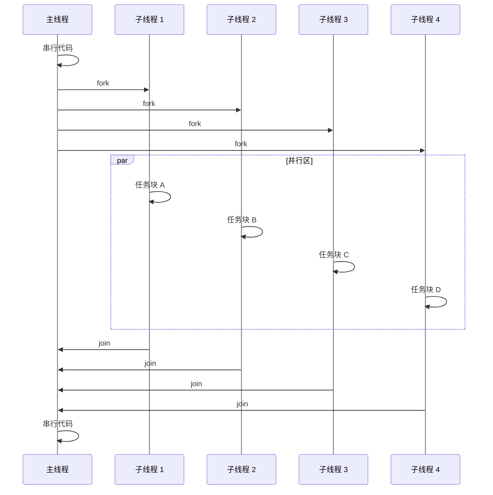
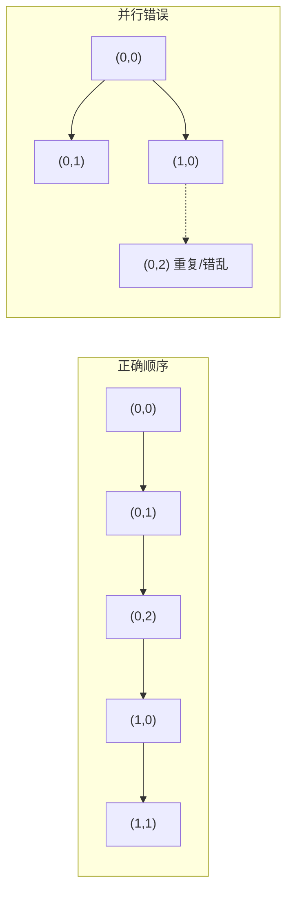
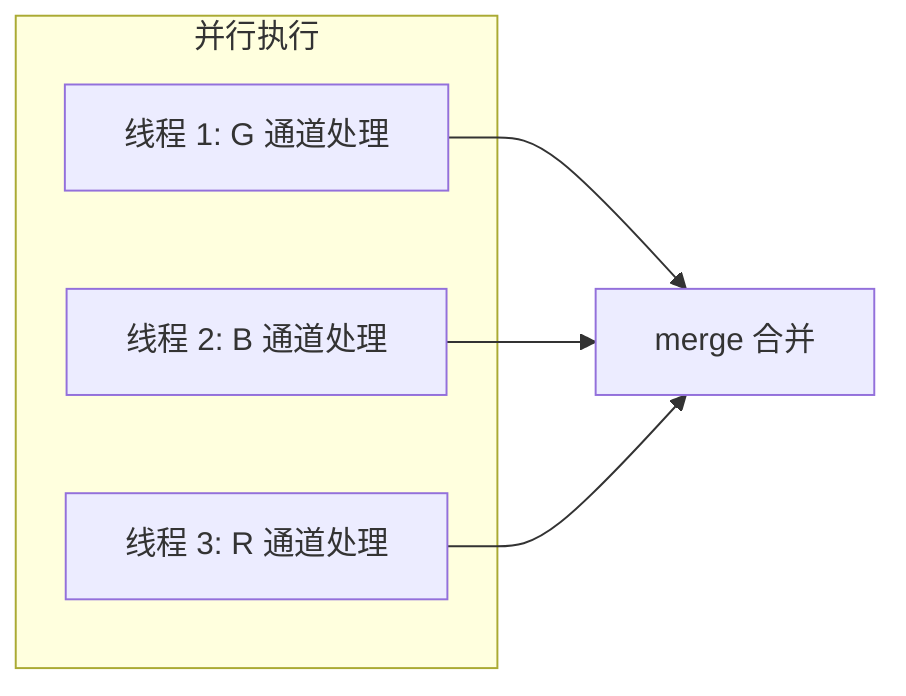
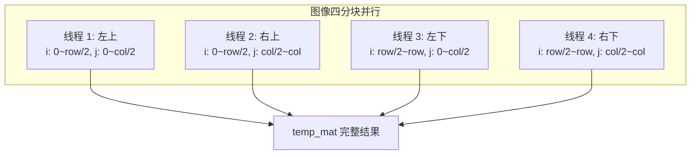
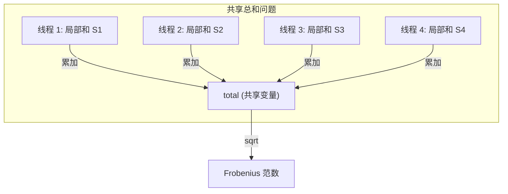
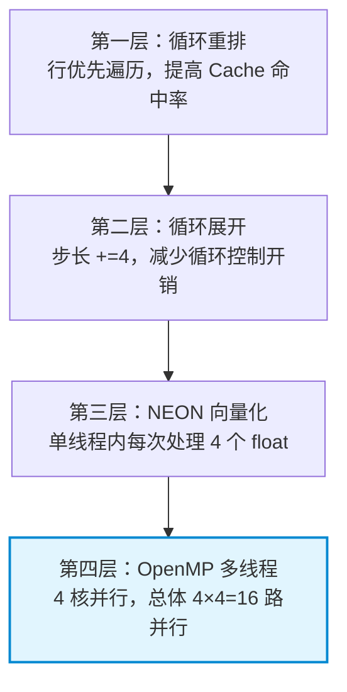

# OpenMP 多线程并行策略（色彩通道分离与图像分块处理）

<!-- WIKI_NAV_START -->
> [!info] 视觉感知 Wiki 导航
> [[projects/linux视觉感知项目/index|项目首页]] · [[projects/Linux视觉感知项目/02 LIME 低照度增强/3.5 NEON SIMD向量化加速|← 上一篇：4.2.1 NEON SIMD 指令集优化详解（getMax、Frobenius、FFT 蝶形运算）]] · [[projects/Linux视觉感知项目/02 LIME 低照度增强/3.4 循环重排与缓存优化|下一篇：4.2.3 循环重排与缓存优化技巧 →]]
<!-- WIKI_NAV_END -->

本文档深入解析 LIME 低照度增强算法中 **OpenMP 多线程并行加速**的技术实现。OpenMP 作为四层优化体系（循环重排 → 循环展开 → NEON 向量化 → OpenMP 多线程）中的最后一环，将已经向量化优化过的热点任务进一步分配给多个 CPU 核并行执行，是本项目在天乾 C216F 四核开发板上实现性能跃升的关键一环。

## OpenMP 基本原理与 Fork-Join 模型

**OpenMP（Open Multi-Processing）** 是一种共享内存并行编程 API，通过在源代码中插入 `#pragma omp` 编译指令，让开发者将串行代码便捷地并行化，从而利用多核处理器的计算能力。其核心执行模型是 **fork-join**：程序启动时只有主线程运行，当遇到并行指令时派生（fork）出若干子线程并行执行，并行区结束后子线程汇合（join）回主线程。



本项目运行的天乾 C216F 教育开发板搭载四核处理器，OpenMP 线程数一般取 **4**，刚好对应四个物理核心。线程数并非越多越好——超过核心数后会引入线程调度和上下文切换的额外开销，反而降低性能。

Sources: [lime_opt.cpp](lime_opt.cpp#L12-L13), [Linux视觉感知处理原作者文档.md](Linux视觉感知处理原作者文档.md#L609-L644)

## OpenMP 核心指令速查

在本项目的代码实现中，使用了以下三种最核心的 OpenMP 编译指令。理解它们的语义是正确应用多线程并行的前提。

| 指令 | 格式 | 含义 | 本项目用途 |
|:---:|:---:|:---|:---|
| `parallel` | `#pragma omp parallel` | 创建并行区，多个线程同时执行 | 基础并行框架 |
| `sections` | `#pragma omp parallel sections` | 将独立代码块分配给不同线程执行 | 通道分离、图像分块 |
| `section` | `#pragma omp section` | 在 `sections` 内标记一个独立任务块 | 定义每个通道/分块的处理逻辑 |
| `for` | `#pragma omp parallel for` | 将 for 循环迭代分配给多个线程 | 像素级遍历（分块增强） |
| `critical` | `#pragma omp critical` | 保护临界区，同一时刻只允许一个线程进入 | 共享变量累加保护 |

Sources: [lime_opt.cpp](lime_opt.cpp#L113-L168), [lime_opt.cpp](lime_opt.cpp#L180-L232), [lime_opt.cpp](lime_opt.cpp#L586-L608)

## 为什么不是所有 for 循环都能直接并行

这是 OpenMP 实践中最容易犯错的地方。项目代码中存在大量通过 for 循环遍历像素点的操作，循环体内部的索引计算与外层循环变量直接关联。以 `Mat2Vec()` 函数为例：

```cpp
cv::Mat lime::Mat2Vec(cv::Mat mat) {
    mat = mat.t();
    int row_temp = mat.rows;
    int col_temp = mat.cols;
    cv::Mat mat_one(1, row_temp * col_temp, CV_32F);
    for (int i = 0; i < row_temp; i++) {
        for (int j = 0; j < col_temp; j++) {
            mat_one.at<float>(0, i * col_temp + j) = mat.at<float>(i, j);
        }
    }
    return mat_one;
}
```

如果对这段代码的外层循环加上 `#pragma omp parallel for`，由于线程调度的时间不确定性，可能出现外层循环进入下一个迭代而内层循环尚未完成的情况，导致**内存访问顺序错乱**——某些像素被重复访问，某些像素被跳过。对于图像处理而言，这种错误直接导致输出图像出现伪影或程序崩溃。



因此，**OpenMP 应当合理地运用在数据耦合相关性较低的代码段**。本项目通过分析 LIME 算法的数据流，识别出了三类适合并行化的场景：色彩通道分离、图像空间分块、共享总和累加。

Sources: [lime.cpp](lime.cpp#L187-L201), [Linux视觉感知处理原作者文档.md](Linux视觉感知处理原作者文档.md#L648-L680)

## 并行策略一：色彩通道分离（enhance 函数）

`enhance()` 函数是 LIME 算法的图像增强入口。其中对 RGB 三通道的处理逻辑是：分别读取每个通道 → 除以光照图 T → 阈值截断。**三个通道彼此完全独立，不存在任何数据耦合关系**，是天然的任务并行场景。




优化前的串行代码依次处理三个通道，总耗时等于三个通道处理时间之和。优化后，三个通道由三个线程同时处理，理论上总耗时等于最长的那个通道处理时间。

**优化前（串行）：**

```cpp
cv::Mat lime::enhance(cv::Mat &src) {
    // ... 初始化 ...
    cv::split(img_norm, img_norm_rgb);
    img_norm_g = img_norm_rgb.at(0);
    img_norm_b = img_norm_rgb.at(1);
    img_norm_r = img_norm_rgb.at(2);
    cv::Mat T = optIllumMap();

    auto g = img_norm_g / T;   // 串行：先处理 G
    auto b = img_norm_b / T;   // 再处理 B
    auto r = img_norm_r / T;   // 最后处理 R
    // ... 阈值 + 合并 ...
}
```

**优化后（OpenMP 并行）：**

```cpp
cv::Mat lime::enhance(cv::Mat &src) {
    // ... 初始化 ...
    cv::split(img_norm, img_norm_rgb);
    cv::Mat T = optIllumMap();
    cv::Mat g1, b1, r1;

    #pragma omp parallel sections          // 创建并行区
    {
        #pragma omp section                // 线程 1 处理 G 通道
        {
            img_norm_g = img_norm_rgb.at(0);
            auto g = img_norm_g / T;
            threshold(g, g1, 0.0, 0.0, 3);
        }
        #pragma omp section                // 线程 2 处理 B 通道
        {
            img_norm_b = img_norm_rgb.at(1);
            auto b = img_norm_b / T;
            threshold(b, b1, 0.0, 0.0, 3);
        }
        #pragma omp section                // 线程 3 处理 R 通道
        {
            img_norm_r = img_norm_rgb.at(2);
            auto r = img_norm_r / T;
            threshold(r, r1, 0.0, 0.0, 3);
        }
    }
    // ... merge 合并 ...
}
```

三个 section 各自拥有独立的局部变量 `g`/`b`/`r` 和输出矩阵 `g1`/`b1`/`r1`，写入目标完全不重叠，不存在数据竞争风险。

Sources: [lime_opt.cpp](lime_opt.cpp#L576-L618), [lime.cpp](lime.cpp#L317-L347), [Linux视觉感知处理原作者文档.md](Linux视觉感知处理原作者文档.md#L680-L750)

## 并行策略二：图像空间分块（getMax 函数）

`getMax()` 函数负责逐像素比较 RGB 三个通道的最大值来构建初始光照图。每个像素的计算只涉及当前位置的三个通道值，与相邻像素完全无关，因此可以按空间位置将图像划分为多个独立区域并行处理。

本项目采用**四分块策略**——将图像按行和列各切一半，划分为左上、右上、左下、右下四个象限，每个象限由一个独立线程处理：



四个线程各自写入 `temp_mat` 矩阵中**不重叠的区域**，因此无需任何锁机制：

```cpp
cv::Mat lime::getMax(const cv::Mat& bgr) {
    cv::Mat temp_mat(row, col, CV_32F, cv::Scalar::all(0.0));
    // ... split 通道 ...

    #pragma omp parallel sections
    {
        #pragma omp section  // 左上象限
        {
            for (int i = 0; i < row / 2; i++) {
                for (int j = 0; j < col / 2; j += 4) {
                    // NEON: 一次加载 4 个 float, 并行比较, 写回
                    float32x4_t g = vld1q_f32(img_norm_g.ptr<float>(i) + j);
                    float32x4_t b = vld1q_f32(img_norm_b.ptr<float>(i) + j);
                    float32x4_t r = vld1q_f32(img_norm_r.ptr<float>(i) + j);
                    float32x4_t max_val = vmaxq_f32(g, vmaxq_f32(b, r));
                    vst1q_f32(temp_mat.ptr<float>(i) + j, max_val);
                }
            }
        }
        #pragma omp section  // 右上象限 { ... }
        #pragma omp section  // 左下象限 { ... }
        #pragma omp section  // 右下象限 { ... }
    }
    return temp_mat;
}
```

这里体现了 **NEON + OpenMP 的叠加效应**：每个线程内部使用 NEON 指令一次处理 4 个像素，四个线程同时运行，相当于 16 路并行处理。

| 优化层次 | 并行宽度 | 说明 |
|:---|:---:|:---|
| 仅 OpenMP 四分块 | 4× | 4 个线程各处理 1/4 图像 |
| 仅 NEON 向量化 | 1×4 | 单线程内每次处理 4 个像素 |
| **NEON + OpenMP 叠加** | **4×4 = 16** | **4 线程 × 每线程每次 4 像素** |

Sources: [lime_opt.cpp](lime_opt.cpp#L103-L170), [Linux视觉感知处理原作者文档.md](Linux视觉感知处理原作者文档.md#L750-L800)

## 并行策略三：共享总和保护（Frobenius 函数）

`Frobenius()` 函数计算矩阵的 Frobenius 范数（所有元素平方和的平方根）。与 `getMax()` 不同，它面临的是经典的**共享变量累加问题**——四个分块各自计算平方和后需要合并到同一个 `total` 变量。



如果多个线程同时执行 `total += local_sum`，由于"读取-修改-写回"不是原子操作，可能导致数据竞争（一个线程的写入被另一个线程覆盖）。本项目使用了两种解决方案：

**方案一：`#pragma omp critical` 临界区保护（文档示例方案）**

```cpp
float lime::Frobenius(cv::Mat mat) {
    float total = 0.0;
    #pragma omp parallel sections
    {
        #pragma omp section { /* 左上: 局部累加到 total */ }
        #pragma omp section { /* 右上: 局部累加到 total */ }
        #pragma omp section { /* 左下: 局部累加到 total */ }
        #pragma omp section { /* 右下: 局部累加到 total */ }
    }
    #pragma omp critical          // 临界区保护：同一时刻只有一个线程进入
    { totalsum += total; }
    totalsum = sqrt(totalsum);
    return totalsum;
}
```

**方案二：NEON 向量累加 + `critical` 保护（实际优化方案）**

实际代码中，每个分块内部使用 NEON 进行并行平方和向量累加，最终通过 `critical` 保护将向量结果归约到标量：

```cpp
float lime::Frobenius(cv::Mat mat) {
    float32x4_t total_sum = vdupq_n_f32(0.0f);  // NEON 累加器

    #pragma omp parallel sections
    {
        #pragma omp section  // 左上象限
        {
            for (int i = 0; i < row / 2; i++) {
                for (int j = 0; j < col / 2; j += 4) {
                    float32x4_t values = vld1q_f32(mat.ptr<float>(i) + j);
                    float32x4_t squared = vmulq_f32(values, values);
                    total_sum = vaddq_f32(total_sum, squared);
                }
            }
        }
        #pragma omp section  // 右上象限 { ... }
        #pragma omp section  // 左下象限 { ... }
        #pragma omp section  // 右下象限 { ... }
    }

    #pragma omp critical     // 保护向量归约，防止数据竞争
    {
        total_sum = vpaddq_f32(total_sum, total_sum);  // 横向两两相加
        total_sum = vpaddq_f32(total_sum, total_sum);  // 再次横向相加
    }

    float squared_sum = vget_lane_f32(vget_low_f32(total_sum), 0);
    return squared_sum;  // 注意：此处返回的是平方和，取 sqrt 在调用处处理
}
```

| 场景 | 是否需要同步机制 | 原因 |
|:---|:---:|:---|
| `getMax()` 四分块 | **不需要** | 各线程写入矩阵的不同区域，互不干扰 |
| `Frobenius()` 四分块 | **需要 `critical`** | 各线程需要累加到同一个共享变量 |
| `enhance()` 通道分离 | **不需要** | G/B/R 各自写入独立的输出矩阵 |

Sources: [lime_opt.cpp](lime_opt.cpp#L173-L237), [Linux视觉感知处理原作者文档.md](Linux视觉感知处理原作者文档.md#L680-L720)

## 并行策略四：分块并行 for（xinlime.cpp 方案）

除了 `parallel sections` 的四分块策略外，项目还在 `xinlime.cpp` 中探索了另一种更简洁的并行模式——`#pragma omp parallel for` 循环级并行。这种方式不需要手动划分象限，由 OpenMP 运行时自动将循环迭代分配给各线程。

**getMax() 的 for 并行化：**

```cpp
cv::Mat lime::getMax(const cv::Mat& bgr) {
    cv::Mat temp_mat(row, col, CV_32F, cv::Scalar::all(0.0));
    // ... split 通道 ...

    #pragma omp parallel for               // 自动将行循环分配给多线程
    for (int i = 0; i < row; i++) {
        for (int j = 0; j < col; j++) {
            temp_mat.at<float>(i, j) = fmax(img_norm_g.at<float>(i, j),
                fmax(img_norm_b.at<float>(i, j), img_norm_r.at<float>(i, j)));
        }
    }
    return temp_mat;
}
```

**enhance() 的分块 for 并行化：**

```cpp
cv::Mat lime::enhance(cv::Mat &src) {
    // ... 初始化 ...
    int blockSize = 128;
    cv::Mat out_img = cv::Mat::zeros(row, col, CV_32F);

    #pragma omp parallel for               // 自动分配块循环迭代
    for (int i = 0; i < row; i += blockSize) {
        for (int j = 0; j < col; j += blockSize) {
            int blockRows = std::min(blockSize, row - i);
            int blockCols = std::min(blockSize, col - j);
            cv::Mat block = img_norm(cv::Rect(j, i, blockCols, blockRows));
            float blockMax = cv::norm(block, cv::NORM_INF);
            if (blockMax < 0.5) {
                block = block / T_hat;      // 低亮度区域增强
            }
            block.copyTo(out_img(cv::Rect(j, i, blockCols, blockRows)));
        }
    }
    out_img.convertTo(out_lime, CV_8U, 255);
    return out_lime;
}
```

`parallel for` 与 `parallel sections` 的本质区别在于：**`sections` 是任务并行**（不同代码块做不同的事），**`for` 是数据并行**（同一段代码处理不同的数据）。对于图像像素级遍历这种高度规则的循环，`parallel for` 写法更简洁，且 OpenMP 运行时可以自动做负载均衡。

| 并行模式 | 指令 | 适用场景 | 本项目使用位置 |
|:---|:---|:---|:---|
| 任务并行 | `parallel sections` | 不同代码块做不同操作 | `enhance()` 通道分离、`getMax()` 四分块、`Frobenius()` 累加 |
| 数据并行 | `parallel for` | 同一代码块处理不同数据 | `xinlime.cpp` 的 `getMax()` 和分块增强 |

Sources: [xinlime.cpp](xinlime.cpp#L76-L84), [xinlime.cpp](xinlime.cpp#L96-L118)

## CMake 构建配置

要在项目中启用 OpenMP，需要在 CMakeLists.txt 中正确配置编译器标志和链接选项。对比优化前后的 CMake 配置，差异一目了然：

**优化前（无 OpenMP）：**

```cmake
set(CMAKE_CXX_FLAGS "-std=c++11")
find_package(OpenCV REQUIRED)
add_executable(lime lime.cpp)
target_link_libraries(lime ${OpenCV_LIBS})
```

**优化后（启用 OpenMP）：**

```cmake
set(CMAKE_CXX_FLAGS "-std=c++11 -O3")          # -O3 开启最高优化级别
find_package(OpenCV REQUIRED)
find_package(OpenMP REQUIRED)                    # 查找 OpenMP
if (OPENMP_FOUND)
    message("OPENMP FOUND")
    set(CMAKE_C_FLAGS "${CMAKE_C_FLAGS} ${OpenMP_C_FLAGS}")
    set(CMAKE_CXX_FLAGS "${CMAKE_CXX_FLAGS} ${OpenMP_CXX_FLAGS}")
    set(CMAKE_EXE_LINKER_FLAGS "${CMAKE_EXE_LINKER_FLAGS} ${OpenMP_EXE_LINKER_FLAGS}")
else ()
    message(FATAL_ERROR "OpenMP Not Found!")
endif ()
add_executable(lime lime_opt.cpp)
target_link_libraries(lime ${OpenCV_LIBS})
```

关键配置说明：

| 配置项 | 作用 |
|:---|:---|
| `find_package(OpenMP REQUIRED)` | 探测系统中的 OpenMP 库，`REQUIRED` 表示找不到则构建失败 |
| `${OpenMP_CXX_FLAGS}` | 由 CMake 自动探测，通常为 `-fopenmp`（GCC/Clang） |
| `${OpenMP_EXE_LINKER_FLAGS}` | 链接阶段需要链接 OpenMP 运行时库 |
| `-O3` 编译选项 | 开启最高级别编译优化，与 OpenMP 配合效果最佳 |

Sources: [CMakeLists.txt (优化版)](projects/linux视觉感知项目/源码/图像预处理（加速前+加速后）/Lime_NEON+OpenMP/CMakeLists.txt#L1-L41), [CMakeLists.txt (原版)](projects/linux视觉感知项目/源码/图像预处理（加速前+加速后）/Lime/CMakeLists.txt#L1-L26)

## 四层优化体系中的 OpenMP 定位

OpenMP 多线程并行是 LIME 算法四层优化体系的最后一层。理解它与其他三层的叠加关系，才能在面试中清晰地讲述优化思路。



每一层优化都是在前一层的基础上进行的，形成递进式的性能提升：

1. **循环重排**：让内存访问顺序匹配矩阵的行优先存储布局，提升 CPU 缓存命中率
2. **循环展开**：将步长改为 `+=4`，减少循环计数器更新和分支判断的开销，同时为 NEON 处理 4 个 float 做准备
3. **NEON 向量化**：在单线程内将标量运算替换为 SIMD 向量运算，一次处理 4 个 32 位浮点数
4. **OpenMP 多线程**：将已经向量化的任务分配给 4 个 CPU 核并行执行，最终实现 16 路并行

| 优化层次 | 并行宽度 | 加速原理 |
|:---|:---:|:---|
| 循环重排 | 1 | 缓存命中率提升，减少内存访问延迟 |
| 循环展开 | 1 | 减少循环控制开销，提升指令级并行 |
| NEON 向量化 | 4 | SIMD 一次处理 4 个 float |
| OpenMP 多线程 | 4 | 4 个 CPU 核并行执行 |
| **四层叠加** | **4×4 = 16** | **缓存友好 + 指令并行 + 向量并行 + 线程并行** |

Sources: [lime_opt.cpp](lime_opt.cpp#L1-L689), [lime.cpp](lime.cpp#L1-L418)

## OpenMP 与 pthread 的选型对比

本项目选择 OpenMP 而非 pthread 进行多线程开发，是基于任务特征的合理决策：

| 对比维度 | OpenMP | pthread |
|:---|:---|:---|
| 编程范式 | 编译指令声明式 | API 调用命令式 |
| 线程管理 | 自动创建/销毁/同步 | 手动管理全部生命周期 |
| 代码侵入性 | 低（加一行 pragma 即可） | 高（需要大量样板代码） |
| 适用场景 | 数据并行（循环、分块） | 复杂任务调度、生产者-消费者模型 |
| 学习曲线 | 平缓 | 陡峭（需理解锁、条件变量等） |
| 本项目适配度 | ★★★★★ | ★★★☆☆ |

LIME 算法中的并行需求本质上是**数据并行**——多个像素/通道的处理逻辑完全相同，只是操作的数据不同。OpenMP 的声明式编程模型恰好匹配这种场景，开发者只需在热点代码前加一行 `#pragma omp` 即可实现并行化，无需重构整个程序架构。
