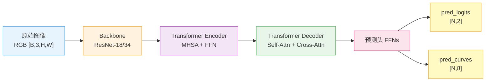

# LSTR 模型架构与参数化曲线输出解码

<!-- WIKI_NAV_START -->
> [!info] 视觉感知 Wiki 导航
> [[projects/linux视觉感知项目/index|项目首页]] · [[projects/Linux视觉感知项目/02 LIME 低照度增强/3.7 优化前后性能对比|← 上一篇：4.2.4 优化前后性能对比与加速比分析]] · [[projects/Linux视觉感知项目/03 模型推理部署/4.2 ONNX Runtime推理流程|下一篇：5.1.2 ONNX Runtime 推理流程：模型加载、输入预处理与推理执行 →]]
<!-- WIKI_NAV_END -->

本页面聚焦 LSTR（Lane Segment TRansformer）网络的**内部架构设计**与**参数化车道线检测原理**。我们将从第一性原理出发：为什么传统逐像素分割方案在嵌入式端存在效率瓶颈，LSTR 如何通过端到端参数化输出解决这一问题，以及其四大模块（Backbone → Encoder → Decoder → 预测头）各自承担什么职责。本文不涉及 [LSTR 模型部署与后处理流程](19-lstr-mo-xing-bu-shu-yu-hou-chu-li-liu-cheng) 中的 ONNX Runtime 推理细节和可视化代码。

## 为什么需要 LSTR：从 Unet 的瓶颈说起

在本项目中，[Unet 语义分割模型](16-unet-wang-luo-jie-gou-yu-yu-yi-fen-ge-yuan-li) 代表的是**逐像素语义分割路线**——模型输出一张与输入等大的掩码图（mask），每个像素点标注"是不是车道线"。这条路线的精度很高，但在飞腾 FT2000/4 这种没有 GPU 的嵌入式开发板上，其推理链非常重：特征提取 → 像素级分类 → 逐像素后处理 → 特征点聚合。实测数据显示 Unet 优化前单图推理耗时约 17.386s，即使优化后仍需约 4.676s，仅能达到 4～5 帧。

项目文档明确指出了问题的根源：在部署硬件没有强大 GPU 算力的情况下，难以在短时间内完成特征点的提取聚合。为了解决这个问题，项目引入了基于 Transformer 的 LSTR 网络，采用**端到端参数化检测路线**——模型不输出像素掩码，而是直接输出每条车道线的**存在性分数**和**曲线参数**。这种设计使得 LSTR 优化前单图推理约 1.953s，优化后压缩至约 0.182s，加速比达 10.36 倍，可以达到 7～10 帧的实时性能。

Sources: [Linux视觉感知处理原作者文档.md](Linux视觉感知处理原作者文档.md#L1701-L1754)

## LSTR 的核心思想：端到端参数化检测

理解 LSTR 的关键在于把握"端到端"和"参数化"这两个核心概念。

**"端到端"意味着**：输入是一张道路图像，输出直接就是车道线的结构化结果（存在性 + 曲线参数），中间不需要走传统方案中"分割 → 聚类 → 拟合"的多步链路。项目文档将其概括为：LSTR 引入了车道线拟合多项式参数，使识别过程中简化了对车道线的特征提取和融合过程。

**"参数化"意味着**：模型不是逐像素地告诉你"这个点是车道线"，而是输出一组数学参数，程序用这些参数通过曲线方程恢复出车道线上的离散点。打个比方：Unet 像一个画家逐点描线，LSTR 像一个数学家直接给你公式。

为什么 Transformer 特别适合车道线检测？因为车道线有一个天然特点——**细长、连续、具有整体趋势**。局部看，它可能断裂、被遮挡、受光照影响；但从全局看，仍然是一条连续结构。LSTR 通过 Transformer 的全局注意力机制，能够捕捉车道线的长距离连续性，把远处和近处、被遮挡和未遮挡的片段联系起来。

Sources: [Linux视觉感知处理原作者文档.md](Linux视觉感知处理原作者文档.md#L1707-L1721), [Linux视觉感知处理系统.md](Linux视觉感知处理系统.md#L4762-L4789)

## LSTR 四大模块架构总览

LSTR 采用经典的"特征提取 → 编码 → 解码 → 预测"四阶段架构，整体流程可概括为：从原始图像提取低分辨率高语义特征；通过 Encoder 捕捉特征的全局关联；通过 Decoder 结合初始查询与编码特征，生成车道级特征；由预测头输出车道线曲线参数，完成检测。



以下逐一展开每个模块的结构与输入输出。

Sources: [Linux视觉感知处理原作者文档.md](Linux视觉感知处理原作者文档.md#L1713-L1721)

### 模块一：Backbone（特征提取骨干网络）

Backbone 的职责是将高分辨率原始图像转换为低分辨率、高语义的特征图。LSTR 采用**预训练的 ResNet-18 或 ResNet-34** 作为骨干网络，移除最后的全连接层，仅保留卷积层、池化层与 BatchNorm 层。

| 属性 | 说明 |
|---|---|
| **输入** | 原始 RGB 图像，维度 `[B, 3, H₀, W₀]`，本项目中预处理 resize 到 360×640 |
| **输出** | 低分辨率语义特征图 F，维度 `[B, C, H, W]`（C 如 256，H/W 为下采样后尺寸如 23×40） |
| **下采样倍数** | 通常 8～16 倍，由 ResNet 的池化层决定 |
| **特征语义** | 包含车道线的局部纹理、轮廓及场景上下文（如路面、护栏区分） |

Backbone 输出的特征图将直接作为 Transformer Encoder 的输入原料。直白地说，Backbone 负责把"像素世界"变成"特征世界"。

Sources: [Linux视觉感知处理原作者文档.md](Linux视觉感知处理原作者文档.md#L1725-L1766)

### 模块二：Transformer Encoder（全局关联编码器）

Encoder 的核心组件是多层**多头自注意力（MHSA）+ 前馈网络（FFN）**。其核心作用是将 Backbone 输出的特征图转化为"带空间位置信息的序列"，通过自注意力机制捕捉车道线的长距离连续性。

| 属性 | 说明 |
|---|---|
| **输入 — 特征序列 S** | 来源：Backbone 输出的特征图 F，展平为序列 `[B, H×W, C]` |
| **输入 — 位置编码 Eₚ** | 预定义的正弦/余弦绝对位置编码，维度 `[B, H×W, C]`，补充空间位置信息 |
| **输出 — 编码序列 Sₑ** | 全局关联编码序列，维度 `[B, H×W, C]`，每个元素融合了全局其他位置的关联信息 |

这里的关键机制是：二维特征图先被展平为一维序列，再加上正弦/余弦位置编码（避免序列平铺后丢失像素位置关系），然后通过多层自注意力让每个空间位置都能"看到"其他所有位置的信息。例如，左车道远端的一个片段可以通过注意力关注到右车道近端的片段，从而建立全局的空间关联。

直白地说，Encoder 负责让模型从"看局部"变成"看整体"。

Sources: [Linux视觉感知处理原作者文档.md](Linux视觉感知处理原作者文档.md#L1768-L1809)

### 模块三：Transformer Decoder（车道级特征解码器）

Decoder 是 LSTR 架构中最精妙的部分。其核心组件是多层**自注意力（Self-Attention）+ 交叉注意力（Cross-Attention）+ FFN**，要解决车道检测中三个核心难题：预测数量不确定、车道位置区分、关联图像特征。

| 属性 | 说明 |
|---|---|
| **输入 — 初始查询序列 S_q** | 人工初始化的全零或随机张量，维度 `[B, N, C]`，N 为预设最大车道数 |
| **输入 — 学习位置编码 E_LL** | 可学习参数矩阵，维度 `[B, N, C]`，建模"左1车道""中间车道""右1车道"的语义差异 |
| **输入 — 编码器输出 Sₑ** | 来自 Encoder 的全局编码序列，维度 `[B, H×W, C]`，作为 Cross-Attention 的 K/V |
| **输出 — 车道级解码序列 S_d** | 维度 `[B, N, C]`，每个元素对应一条潜在车道的全局特征 |

Decoder 的注意力机制有明确分工：

- **Self-Attention**：处理 S_q 内部的 N 个查询之间的关联——让不同候选槽位互相区分，避免重复检测同一条车道
- **Cross-Attention**：让每个查询 S_q 与编码器输出 Sₑ 交互——让每个候选槽位去图像全局特征中"寻找"自己对应的车道

N（预设最大车道数）需要提前根据场景设定。例如城市道路可设 N=5，高速路设 N=7。在本项目的代码实现中，候选槽位 0 对应右侧车道，槽位 5 对应左侧车道。

直白地说，Decoder 负责从全图信息里提炼出"左车道""右车道""其他候选车道"这种车道级表示。

Sources: [Linux视觉感知处理原作者文档.md](Linux视觉感知处理原作者文档.md#L1811-L1865), [Linux视觉感知处理系统.md](Linux视觉感知处理系统.md#L5463-L5469)

### 模块四：车道线预测头（含 FFNs）

预测头的核心组件是**前馈网络（FFNs）+ 置信度过滤模块 + 匈牙利损失计算单元**（训练阶段）。其职责是将 Decoder 输出的车道级高维特征映射成可用的检测结果。

| 属性 | 说明 |
|---|---|
| **输入** | 解码序列 S_d，维度 `[B, N, C]` |
| **输出 — pred_logits** | 每个候选槽位的分类分数，维度 `[N, 2]`（类别 0=背景，类别 1=有效车道） |
| **输出 — pred_curves** | 每条候选车道的曲线参数，维度 `[N, 8]`（8 个曲线方程参数） |

FFNs 的核心作用是将高维特征（C 维）映射为低维曲线参数（K=8 维），实现"特征 → 参数"的转换。置信度过滤模块对 FFNs 输出的置信度进行平滑插值，避免低光噪声导致的车道线断裂。

Sources: [Linux视觉感知处理原作者文档.md](Linux视觉感知处理原作者文档.md#L1867-L1917), [Linux视觉感知处理系统.md](Linux视觉感知处理系统.md#L4825-L4834)

## 输入输出深度解析

理解了四大模块之后，我们需要从整体上把握 LSTR 模型的输入和输出——这是连接"模型原理"和"部署代码"的桥梁。

### 双输入模型

从项目源码和文档可以确认，LSTR ONNX 模型是**双输入模型**：

| 输入 | 形状 | 说明 |
|---|---|---|
| RGB 图像张量 | `[1, 3, H, W]` | 经过 resize、归一化、CHW 格式转换后的图像数据 |
| 辅助 mask_tensor | `[1, 1, H, W]` | 初始化为全零的辅助张量 |

代码中 `detect()` 函数显式构造了这两个输入形状并送入 `Run()` 接口：

```cpp
array<int64_t, 4> input_shape_{ 1, 3, this->inpHeight, this->inpWidth };
array<int64_t, 4> mask_shape_{ 1, 1, this->inpHeight, this->inpWidth };
// ...两个张量都被 push_back 到 ort_inputs 中
ort_session->Run(..., ort_inputs.data(), 2, ...);
```

mask_tensor 的存在与模型训练阶段的设计有关，在部署推理时保持全零即可。如果不传这个输入，模型接口会不匹配，推理会失败。

Sources: [projects/linux视觉感知项目/源码/卷积神经网络/卷积神经网络/LSTR_ONNX/main.cpp](projects/linux视觉感知项目/源码/卷积神经网络/卷积神经网络/LSTR_ONNX/main.cpp#L118-L129)

### 双输出的核心语义

模型的两个输出是 LSTR 参数化检测的核心：

**`pred_logits` —— 车道存在性判断**

pred_logits 是一个二维张量，形状为 `[N, 2]`，其中 N 是候选槽位数量（如 7），2 代表两个类别（背景 vs 有效车道）。程序对每个候选槽位取 argmax，如果最大值对应的类别索引为 1，则该槽位被判定为有效车道。

```cpp
for (int i = 0; i < logits_h; i++) {
    float max_logits = -10000;
    int max_id = -1;
    for (int j = 0; j < logits_w; j++) {
        const float data = pred_logits[i * logits_w + j];
        if (data > max_logits) { max_logits = data; max_id = j; }
    }
    if (max_id == 1) { good_detections.push_back(i); }  // 有效车道
}
```

**`pred_curves` —— 车道曲线参数**

pred_curves 是一个二维张量，形状为 `[N, 8]`，其中每行的 8 个浮点数是一条车道线的曲线方程参数。这些参数**不是直接的像素坐标**，而是需要通过数学公式恢复出离散点的系数。

Sources: [projects/linux视觉感知项目/源码/卷积神经网络/卷积神经网络/LSTR_ONNX/main.cpp](projects/linux视觉感知项目/源码/卷积神经网络/卷积神经网络/LSTR_ONNX/main.cpp#L131-L168)

## 参数化曲线方程详解

这是 LSTR 理解中最重要的数学部分。pred_curves 输出的每组 8 个参数（`p[0]` 到 `p[7]`）通过以下两步恢复出 50 个离散点：

### 第一步：采样 y 坐标

```
y = p[0] + log_space[k] × (p[1] - p[0])
```

其中 `log_space[k]` 是从预加载的 `log_space.bin` 文件中读取的 50 个采样位置（范围在 0 到 1 之间的非均匀分布值）。这一步的作用是在 `p[0]`（y 起点）和 `p[1]`（y 终点）之间按 log_space 指定的比例插值出 50 个 y 坐标。

### 第二步：计算 x 坐标

```
x = p[2] / (y - p[3])² + p[4] / (y - p[3]) + p[5] + p[6] × y - p[7]
```

这个公式是一个**有理函数 + 线性项的组合**，具有足够的表达能力来拟合各种形状的车道线——包括直线、缓弯、急弯。其中：
- `p[2] / (y - p[3])²` 和 `p[4] / (y - p[3])` 提供了在 `y = p[3]` 处的奇异性，可以表达车道线的急剧变化
- `p[5]` 是偏移量
- `p[6] × y` 提供线性倾斜分量
- `p[7]` 是最终修正项

### 第三步：坐标映射

最后，将归一化的 `(x, y)` 映射回原图像素坐标：

```
pixel_x = int(x × img_width)
pixel_y = int(y × img_height)
```

每条有效车道恢复出 50 个离散点，程序可以用这些点绘制车道线。

Sources: [projects/linux视觉感知项目/源码/卷积神经网络/卷积神经网络/LSTR_ONNX/main.cpp](projects/linux视觉感知项目/源码/卷积神经网络/卷积神经网络/LSTR_ONNX/main.cpp#L156-L165)

### log_space.bin 的作用

`log_space.bin` 文件中存储了 50 个预定义的浮点数，用作曲线方程中 y 方向的**采样基准**。这些值不是等间距的——它们在远处（图像上端）采样更密集，在近处（图像下端）采样更稀疏，这种非均匀分布符合车道线透视投影的特点：远处的车道线变化更微妙，需要更多采样点来精确表达。

```cpp
log_space = new float[len_log_space];  // len_log_space = 50
FILE* fp = fopen("../log_space.bin", "rb");
fread(log_space, sizeof(float), len_log_space, fp);
```

如果不加载这个文件，曲线方程就缺少采样基准，车道线点的恢复就会失败。这在 [LSTR 模型部署与后处理流程](19-lstr-mo-xing-bu-shu-yu-hou-chu-li-liu-cheng) 中会进一步展开。

Sources: [projects/linux视觉感知项目/源码/卷积神经网络/卷积神经网络/LSTR_ONNX/main.cpp](projects/linux视觉感知项目/源码/卷积神经网络/卷积神经网络/LSTR_ONNX/main.cpp#L79-L83)

## LSTR 与 Unet 的本质对比

| 维度 | Unet | LSTR |
|---|---|---|
| **技术路线** | 逐像素语义分割 | 端到端参数化检测 |
| **输出形式** | 与输入等大的掩码图（mask） | 车道存在性分数 + 曲线参数 |
| **后处理复杂度** | 重：argmax → 连通域 → 聚合 → 拟合 | 轻：筛选 → 曲线恢复 → 画点 |
| **推理速度（优化后）** | 约 4.676s / 图，4～5 帧 | 约 0.182s / 图，7～10 帧 |
| **权重文件大小** | 约 46.8MB | 约 12MB |
| **识别范围** | 广：覆盖本车道及旁边车道 | 聚焦：对当前行驶车道更准 |
| **遮挡鲁棒性** | 较好：能分辨障碍物并过滤 | 较差：车辆遮挡时易偏离轨迹 |
| **适用场景** | 市区多车道、道路分支复杂 | 高速路、山路等窄道稀疏场景 |

需要特别强调的是：LSTR 结果图中出现的**绿色车道区域不是模型直接输出的**，而是程序根据左右车道线点集用 `fillConvexPoly` 填充出来的可视化结果。这一点在面试中经常被误解。

Sources: [Linux视觉感知处理原作者文档.md](Linux视觉感知处理原作者文档.md#L2317-L2368), [Linux视觉感知处理系统.md](Linux视觉感知处理系统.md#L5473-L5501)

## 模型转换：从 PyTorch 到 ONNX

项目部署使用的 ONNX 模型基于论文《End-to-end Lane Shape Prediction with Transformers》作者的 GitHub 仓库中训练好的 pth 模型文件，通过 PyTorch 的 `torch.onnx.export` 工具转换而来：

```python
model_path = 'lstr_360x640.pth'
device = torch.device('cpu')
model_statedict = torch.load(model_path, map_location=device)
model.load_state_dict(model_statedict)
model.to(device)
model.eval()  # 保证 BN 和 Dropout 使用训练时的统计量

input_data = torch.randn(1, 3, 360, 640, device=device)
torch.onnx.export(model, input_data, 'lstr_360x640.onnx',
                  opset_version=9, verbose=True,
                  input_names=['input'], output_names=['output'])
```

使用 `model.eval()` 确保 BatchNorm 层使用全部训练数据的均值和方差，Dropout 层使用所有网络连接。转换后的 ONNX 模型文件名为 `lstr_360x640.onnx`，其中 360×640 对应模型的输入分辨率。

Sources: [Linux视觉感知处理原作者文档.md](Linux视觉感知处理原作者文档.md#L1919-L1949)

## LSTR 在项目中的集成位置

LSTR 不是独立运行的算法模块，而是嵌入在完整的项目数据流中。在 [projects/linux视觉感知项目/源码/上位机程序/Lane_Detection/LSTR/main.cpp](projects/linux视觉感知项目/源码/上位机程序/Lane_Detection/LSTR/main.cpp#L208-L245) 的集成版本中，完整的处理流水线是：


在这个流水线中，LIME 负责提升低光照图像的质量（参见 [LIME 算法原理与光照图估计](10-lime-suan-fa-yuan-li-yu-guang-zhao-tu-gu-ji)），LSTR 负责从增强后的图像中检测车道线。两者职责完全不同——LIME 不检测车道线，LSTR 不做图像增强。

Sources: [projects/linux视觉感知项目/源码/上位机程序/Lane_Detection/LSTR/main.cpp](projects/linux视觉感知项目/源码/上位机程序/Lane_Detection/LSTR/main.cpp#L208-L245), [Linux视觉感知处理系统深度学习文档.md](Linux视觉感知处理系统深度学习文档.md#L368-L398)

## 关键概念速查表

| 概念 | 含义 | 代码对应 |
|---|---|---|
| **Backbone** | ResNet-18/34 特征提取器 | ONNX 模型内部 |
| **Encoder** | MHSA 全局关联建模 | ONNX 模型内部 |
| **Decoder** | 查询机制提炼车道级特征 | ONNX 模型内部 |
| **FFNs** | 高维特征 → 曲线参数映射 | ONNX 模型内部 |
| **pred_logits** | 车道存在性分类分数 `[N,2]` | `ort_outputs[0]` |
| **pred_curves** | 车道曲线方程参数 `[N,8]` | `ort_outputs[1]` |
| **log_space** | y 方向采样基准（50 个值） | `log_space.bin` |
| **mask_tensor** | 全零辅助输入张量 | `vector<float> mask_tensor` |
| **normalize_()** | 图像归一化为 CHW float 张量 | `LSTR::normalize_()` |
| **绿色区域** | 程序后处理填充，非模型输出 | `fillConvexPoly()` |
