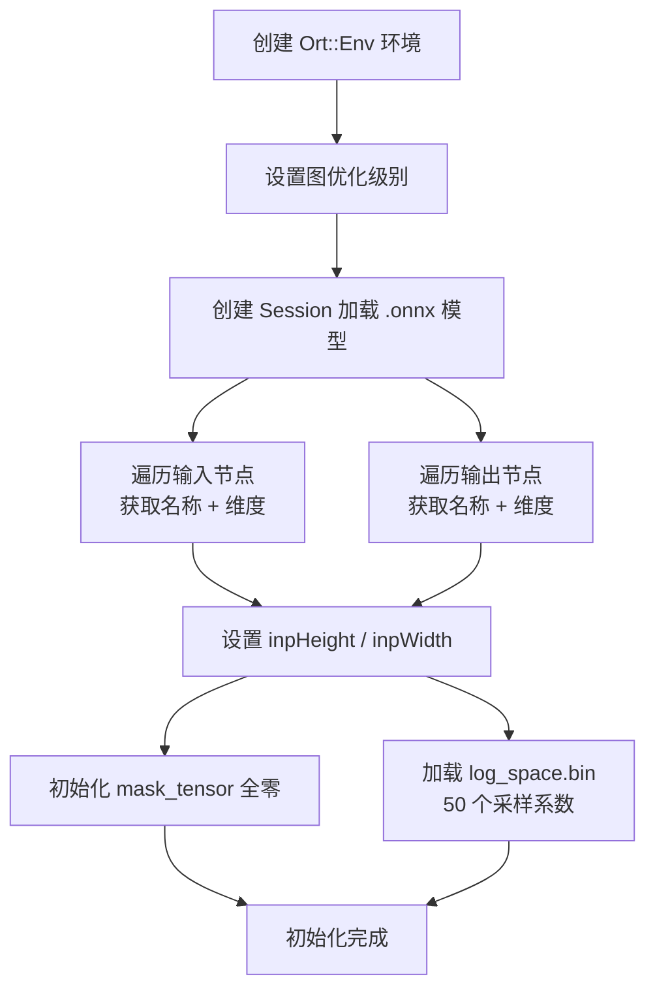
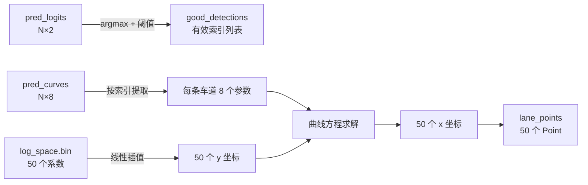
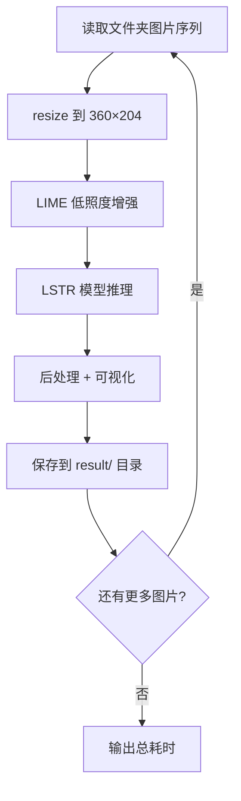

# ONNX Runtime 推理流程：模型加载、输入预处理与推理执行

<!-- WIKI_NAV_START -->
> [!info] 视觉感知 Wiki 导航
> [[projects/linux视觉感知项目/index|项目首页]] · [[projects/Linux视觉感知项目/03 模型推理部署/4.1 LSTR模型架构与曲线解码|← 上一篇：5.1.1 LSTR 模型架构与参数化曲线输出解码]] · [[projects/Linux视觉感知项目/03 模型推理部署/4.3 log_space与双输入机制|下一篇：5.1.3 双输入机制与 log_space.bin 预计算数据 →]]
<!-- WIKI_NAV_END -->

本页面深入解析 LSTR 车道线检测模型在 ARM 嵌入式平台上的 ONNX Runtime 部署全流程，涵盖从模型加载、推理执行到输出后处理的完整技术链路。与 [Unet 模型部署](17-unet-mo-xing-qing-liang-hua-yu-ncnn-bu-shu) 的像素级分割方案不同，LSTR 采用**参数化端到端检测**，其后处理逻辑从曲线参数恢复空间坐标点，是理解本系统深度学习部署的关键补充。

## 部署架构总览

LSTR 模型的部署采用 **PyTorch → ONNX → ONNX Runtime** 的双阶段转换链路。训练阶段生成的 `.pth` 权重文件先转换为 ONNX 通用中间格式，再由 ARM 平台上的 ONNX Runtime C++ 推理引擎完成端侧推理。整个部署过程涉及三个核心源文件：

| 文件角色 | 路径 | 功能定位 |
|---|---|---|
| 独立推理程序 | [main.cpp](projects/linux视觉感知项目/源码/卷积神经网络/卷积神经网络/LSTR_ONNX/main.cpp) | 单张图片检测与可视化 |
| 集成推理程序 | [main.cpp](projects/linux视觉感知项目/源码/上位机程序/Lane_Detection/LSTR/main.cpp) | LIME 增强 + 批量帧处理 |
| 构建配置 | [CMakeLists.txt](projects/linux视觉感知项目/源码/卷积神经网络/卷积神经网络/LSTR_ONNX/CMakeLists.txt) | 编译链接 ONNX Runtime 动态库 |

集成版本的 LSTR 程序通过 [QProcess](7-qprocess-diao-yong-wai-bu-tui-li-cheng-xu) 被 Qt 上位机调用，形成 **Qt 控制 → LIME 增强 → LSTR 推理 → 结果回传显示** 的完整闭环。

Sources: [main.cpp](projects/linux视觉感知项目/源码/卷积神经网络/卷积神经网络/LSTR_ONNX/main.cpp#L1-L223), [main.cpp](projects/linux视觉感知项目/源码/上位机程序/Lane_Detection/LSTR/main.cpp#L1-L246), [CMakeLists.txt](projects/linux视觉感知项目/源码/卷积神经网络/卷积神经网络/LSTR_ONNX/CMakeLists.txt#L1-L20)

## 模型格式转换：PyTorch → ONNX

部署的第一步是将训练好的 PyTorch 模型转换为 ONNX 格式。这一过程的关键在于保持模型处于 `eval` 模式以固化 BatchNorm 的均值/方差，并冻结 Dropout 行为：

```python
model_path = 'lstr_360x640.pth'
device = torch.device('cpu')
model_statedict = torch.load(model_path, map_location=device)
model.load_state_dict(model_statedict)
model.to(device)
model.eval()  # 固化 BN 和 Dropout

input_data = torch.randn(1, 3, 360, 640, device=device)
input_names = ['input']
output_names = ['output']
torch.onnx.export(model, input_data, 'lstr_360x640.onnx',
                  opset_version=9, verbose=True,
                  input_names=input_names, output_names=output_names)
```

转换后的 `lstr_360x640.onnx` 模型固定输入尺寸为 **[1, 3, 360, 640]**（BCHW 格式），输出两个张量：`pred_logits` 和 `pred_curves`。这个尺寸与飞腾 FT2000/4 开发板的算力匹配，在精度与速度之间取得平衡。

Sources: [Linux视觉感知处理原作者文档.md](Linux视觉感知处理原作者文档.md#L1919-L1947)

## ONNX Runtime 会话初始化

LSTR 类的构造函数完成推理引擎的全部初始化工作。这个过程可以分为**模型加载 → 节点发现 → 维度提取 → 辅助数据加载**四个阶段。



### 环境与会话创建

ONNX Runtime 的初始化遵循严格的对象生命周期：先创建全局 `Env`，再创建与具体模型绑定的 `Session`。图优化级别设为 `ORT_ENABLE_BASIC`，在保证推理正确性的前提下启用基础算子融合优化。

```cpp
Env env = Env(ORT_LOGGING_LEVEL_ERROR, "LSTR");
sessionOptions.SetGraphOptimizationLevel(ORT_ENABLE_BASIC);
ort_session = new Session(env, model_path, sessionOptions);
```

`ORT_LOGGING_LEVEL_ERROR` 级别抑制了调试信息输出，适合嵌入式生产环境。`ORT_ENABLE_BASIC` 优化级别会执行常量折叠、冗余节点消除等基础优化，而不做可能改变精度的激进融合。

Sources: [main.cpp](projects/linux视觉感知项目/源码/卷积神经网络/卷积神经网络/LSTR_ONNX/main.cpp#L34-L50)

### 输入输出节点发现

构造函数通过遍历模型的输入输出节点，自动获取节点名称和张量维度。这一机制使得代码无需硬编码节点信息，增强了模型版本更换时的兼容性：

```cpp
// 输入节点遍历
for (int i = 0; i < numInputNodes; i++) {
    Ort::AllocatedStringPtr input_name_Ptr =
        ort_session->GetInputNameAllocated(i, allocator);
    inputNodeNameAllocatedStrings.push_back(std::move(input_name_Ptr));
    input_names.push_back(inputNodeNameAllocatedStrings.back().get());
    Ort::TypeInfo input_type_info = ort_session->GetInputTypeInfo(i);
    auto input_tensor_info = input_type_info.GetTensorTypeAndShapeInfo();
    auto input_dims = input_tensor_info.GetShape();
    input_node_dims.push_back(input_dims);
}
```

节点名称的管理使用 `AllocatedStringPtr` 智能指针，通过 `std::move` 转移所有权到 `inputNodeNameAllocatedStrings` 容器，确保内存生命周期与 Session 一致。最终提取的维度信息存储在 `input_node_dims` 和 `output_node_dims` 中，后续推理阶段直接引用。

Sources: [main.cpp](projects/linux视觉感知项目/源码/卷积神经网络/卷积神经网络/LSTR_ONNX/main.cpp#L51-L77)

### 辅助数据加载

构造函数还完成两项关键初始化：

**输入尺寸确定**：从模型元数据中提取 `inpHeight=360`、`inpWidth=640`，同时分配 `mask_tensor`（360×640 全零向量）。`mask_tensor` 是 LSTR 模型的第二个输入，虽然全零但不可省略——模型的 Transformer 解码器在训练时使用了 mask 机制，推理时传入全零表示"不遮挡任何区域"。

**log_space.bin 加载**：预先计算好的 50 个浮点数，用于将曲线参数映射为均匀分布的采样 y 坐标。这些数值在训练阶段确定，以二进制文件形式随模型一起分发。

```cpp
this->mask_tensor.resize(this->inpHeight * this->inpWidth, 0.0);
log_space = new float[len_log_space];
FILE* fp = fopen("../log_space.bin", "rb");
fread(log_space, sizeof(float), len_log_space, fp);
fclose(fp);
```

Sources: [main.cpp](projects/linux视觉感知项目/源码/卷积神经网络/卷积神经网络/LSTR_ONNX/main.cpp#L76-L83)

## 推理前处理：图像归一化与张量构造

`detect()` 方法接收 OpenCV `Mat` 格式的原始图像，完成从图像到推理输入张量的转换。这一过程包含三个关键步骤。

### 图像缩放

原始图像首先被缩放到模型要求的固定尺寸：

```cpp
resize(srcimg, dstimg, Size(this->inpWidth, this->inpHeight), INTER_LINEAR);
```

采用双线性插值（`INTER_LINEAR`）在速度和质量之间取得平衡。缩放后图像尺寸为 640×360，与模型训练时的输入一致。

Sources: [main.cpp](projects/linux视觉感知项目/源码/卷积神经网络/卷积神经网络/LSTR_ONNX/main.cpp#L111-L116)

### ImageNet 标准归一化

`normalize_()` 函数将像素值从 `[0, 255]` 映射到 ImageNet 预训练模型的标准分布。归一化公式为：

**normalized = (pixel / 255.0 - mean) / std**

其中均值和标准差分别为：

| 通道 | R | G | B |
|---|---|---|---|
| mean | 0.485 | 0.456 | 0.406 |
| std | 0.229 | 0.224 | 0.225 |

代码使用 HWC→CHW 的手动转置，将 OpenCV 的 `[H, W, C]` 布局转换为模型要求的 `[C, H, W]` 布局：

```cpp
void LSTR::normalize_(Mat img) {
    for (int c = 0; c < 3; c++)         // 通道优先
        for (int i = 0; i < row; i++)    // 遍历行
            for (int j = 0; j < col; j++)// 遍历列
                this->input_image_[c * row * col + i * col + j] =
                    (pix / 255.0 - mean[c]) / std[c];
}
```

三重循环的遍历顺序（通道 → 行 → 列）确保了 CHW 布局的正确性。归一化后的数据存储在 `input_image_` 向量中，直接作为 ONNX Runtime 的输入张量数据源。

Sources: [main.cpp](projects/linux视觉感知项目/源码/卷积神经网络/卷积神经网络/LSTR_ONNX/main.cpp#L91-L107)

### 输入张量构造

LSTR 模型需要**两个输入张量**——这与大多数单输入模型不同，是 Transformer 架构的特征：

```cpp
// 图像张量：[1, 3, 360, 640]
ort_inputs.push_back(Value::CreateTensor<float>(
    allocator_info, input_image_.data(), input_image_.size(),
    input_shape_.data(), input_shape_.size()));

// 掩码张量：[1, 1, 360, 640]，全零
ort_inputs.push_back(Value::CreateTensor<float>(
    allocator_info, mask_tensor.data(), mask_tensor.size(),
    mask_shape_.data(), mask_shape_.size()));
```

两个张量共享同一 CPU 内存分配器（`MemoryInfo::CreateCpu`），采用零拷贝方式将数据指针直接传给推理引擎，避免额外的内存复制开销。

Sources: [main.cpp](projects/linux视觉感知项目/源码/卷积神经网络/卷积神经网络/LSTR_ONNX/main.cpp#L118-L127)

## 推理执行与输出解析

推理调用只需一行代码，但其背后是 ONNX Runtime 对整个 Transformer 计算图的执行：

```cpp
vector<Value> ort_outputs = ort_session->Run(
    RunOptions{ nullptr },
    input_names.data(), ort_inputs.data(), 2,    // 2 个输入
    output_names.data(), output_names.size());   // 2 个输出
```

推理完成后，从输出张量中提取两个关键结果：

| 输出 | 变量名 | 含义 | 维度 |
|---|---|---|---|
| 输出 0 | `pred_logits` | 每条候选车道线的分类置信度 | [N, 2]（N 条候选，2 类：无效/有效） |
| 输出 1 | `pred_curves` | 每条候选车道线的曲线参数 | [N, 8]（N 条候选，8 个参数） |

```cpp
const float* pred_logits = ort_outputs[0].GetTensorMutableData<float>();
const float* pred_curves = ort_outputs[1].GetTensorMutableData<float>();
```

`pred_logits` 的每行有 2 个值，分别对应"无效车道"（index 0）和"有效车道"（index 1）的 logit 分数。`pred_curves` 的每行有 8 个浮点参数，定义了一条车道线的数学曲线。

Sources: [main.cpp](projects/linux视觉感知项目/源码/卷积神经网络/卷积神经网络/LSTR_ONNX/main.cpp#L129-L136)

## 后处理核心：从参数到车道线点

后处理是 LSTR 部署中最核心的环节，负责将模型输出的抽象参数转化为可视化的车道线点。整个过程分为三步：**有效车道筛选 → 曲线参数还原 → 空间坐标映射**。



### 第一步：有效车道筛选

对每条候选车道线的 logits 做 argmax，判断最大值对应的类别索引。若 `max_id == 1`（即"有效车道"类别的分数最高），则保留该车道线：

```cpp
for (int i = 0; i < logits_h; i++) {
    float max_logits = -10000;
    int max_id = -1;
    for (int j = 0; j < logits_w; j++) {
        const float data = pred_logits[i * logits_w + j];
        if (data > max_logits) {
            max_logits = data;
            max_id = j;
        }
    }
    if (max_id == 1) {
        good_detections.push_back(i);  // 保留有效车道索引
    }
}
```

这里使用 argmax 而非 softmax+阈值，是因为 LSTR 训练时使用了匈牙利匹配损失，模型输出的 logits 已经隐含了置信度排序。`max_id == 1` 的判断相当于一个二分类决策边界。

Sources: [main.cpp](projects/linux视觉感知项目/源码/卷积神经网络/卷积神经网络/LSTR_ONNX/main.cpp#L139-L168)

### 第二步：曲线参数到坐标点的还原

这是 LSTR 后处理的数学核心。模型为每条有效车道输出 8 个曲线参数 `p[0]~p[7]`，通过以下公式将参数还原为 50 个空间坐标点：

**y 坐标**（线性插值）：

```
y = p[0] + log_space[k] × (p[1] - p[0])
```

**x 坐标**（有理函数模型）：

```
x = p[2] / (y - p[3])² + p[4] / (y - p[3]) + p[5] + p[6] × y - p[7]
```

其中 `log_space[k]` 是预加载的 50 个采样系数（值域 `[0, 1]`），用于在 `p[0]`（y 起点）和 `p[1]`（y 终点）之间生成等间隔的 y 坐标。x 坐标的计算使用了一个**双曲型有理函数**，包含二次项 `p[2]/(y-p[3])²`、一次项 `p[4]/(y-p[3])`、常数项 `p[5]`、线性项 `p[6]·y` 和偏移项 `p[7]`。

这个公式的设计源于 LSTR 论文的核心思想：**用参数化曲线模型替代逐像素检测**。双曲型函数天然适合描述车道线在透视投影下的形态——近处宽、远处窄的扇形收敛特征。

```cpp
const float *p_lane_data = pred_curves + i * curves_w;
vector<Point> lane_points(len_log_space);  // 50 个点
for (int k = 0; k < len_log_space; k++) {
    const float y = p_lane_data[0] + log_space[k] * (p_lane_data[1] - p_lane_data[0]);
    const float x = p_lane_data[2] / powf(y - p_lane_data[3], 2.0)
                  + p_lane_data[4] / (y - p_lane_data[3])
                  + p_lane_data[5] + p_lane_data[6] * y - p_lane_data[7];
    lane_points[k] = Point(int(x * img_width), int(y * img_height));
}
```

最后一步将归一化坐标 `[0, 1]` 映射回原始图像像素坐标。

Sources: [main.cpp](projects/linux视觉感知项目/源码/卷积神经网络/卷积神经网络/LSTR_ONNX/main.cpp#L155-L167)

## 后处理可视化：车道线绘制与区域填充

筛选出有效车道线并生成坐标点后，后处理进入可视化阶段。这一阶段包含**车道分类、区域填充、点绘制**三个层次。

### 车道分类：左/右侧识别

LSTR 模型预设了多条候选车道线（通常 N=7），每条有固定的位置语义。代码中通过硬编码的索引进行左右分类：

```cpp
for (int i = 0; i < good_detections.size(); i++) {
    if (good_detections[i] == 0) right_lane.push_back(i);  // 索引 0 = 右侧
    if (good_detections[i] == 5) left_lane.push_back(i);   // 索引 5 = 左侧
}
```

索引 0 和 5 分别对应模型解码器中预设的右侧和左侧车道查询位置。这种基于位置的分类方式是 Transformer 解码器"查询槽"（query slot）设计的直接体现——每个查询槽在训练过程中学会了检测特定位置的车道线。

Sources: [main.cpp](projects/linux视觉感知项目/源码/卷积神经网络/卷积神经网络/LSTR_ONNX/main.cpp#L171-L183)

### 绿色车道区域填充

当左右车道线同时被检测到时，代码构造一个**凸多边形区域**表示可行驶区域：

```cpp
if (right_lane.size() == left_lane.size()) {
    Mat lane_segment_img = visualization_img.clone();
    vector<Point> points = lanes[right_lane[0]];
    reverse(points.begin(), points.end());               // 右侧点反转
    points.insert(points.begin(),                         // 左侧点拼接
                  lanes[left_lane[0]].begin(),
                  lanes[left_lane[0]].end());
    fillConvexPoly(lane_segment_img, points, Scalar(0, 255, 0));  // 绿色填充
    addWeighted(visualization_img, 0.4, lane_segment_img, 0.6, 0, visualization_img);
}
```

构造逻辑是：先取右侧车道线的 50 个点并反转顺序，再将左侧车道线的 50 个点拼接在前，形成一个闭合的 100 个点的多边形。`fillConvexPoly` 用绿色填充该区域，`addWeighted` 以 4:6 的比例将绿色区域半透明叠加到原图上。

**重要辨析**：绿色车道区域完全是后处理构造的结果，不是模型的直接输出。模型只输出曲线参数，视觉上的"车道区域"是开发者通过几何计算人为添加的。

Sources: [main.cpp](projects/linux视觉感知项目/源码/卷积神经网络/卷积神经网络/LSTR_ONNX/main.cpp#L184-L196)

### 车道线点绘制

最后，用彩色圆点绘制每条有效车道线的 50 个采样点：

```cpp
for (int i = 0; i < lanes.size(); i++) {
    for (int j = 0; j < lanes[i].size(); j++) {
        circle(visualization_img, lanes[i][j], 3, lane_colors[good_detections[i]], -1);
    }
}
```

8 种预定义颜色（`lane_colors`）根据车道线索引着色，半径 3 像素、填充绘制（`-1`），确保在 360×640 分辨率下清晰可见。

Sources: [main.cpp](projects/linux视觉感知项目/源码/卷积神经网络/卷积神经网络/LSTR_ONNX/main.cpp#L197-L204)

## 两种部署模式对比

项目中存在两个版本的 LSTR 部署程序，服务于不同的使用场景：

| 维度 | 独立版 | 集成版 |
|---|---|---|
| 源文件 | [LSTR_ONNX/main.cpp](projects/linux视觉感知项目/源码/卷积神经网络/卷积神经网络/LSTR_ONNX/main.cpp#L207-L223) | [LSTR/main.cpp](projects/linux视觉感知项目/源码/上位机程序/Lane_Detection/LSTR/main.cpp#L208-L245) |
| 输入方式 | 单张图片路径硬编码 | 文件夹路径由命令行参数传入 |
| 预处理 | 无 LIME 增强 | 集成 LIME 低照度增强 |
| 处理模式 | 单次推理 | 循环批量处理 `INT_MAX` 帧 |
| 输出方式 | `imshow` 窗口显示 + `imwrite` 保存 | `imwrite` 保存到 `result/` 目录 |
| 调用方 | 直接运行 | Qt 上位机通过 QProcess 调用 |
| 图像预处理 | resize 到模型输入尺寸 | resize 到 360×204 后 LIME 增强 |

集成版的处理流水线为：



Qt 上位机在 [mainwindow.cpp](mainwindow.cpp#L124-L141) 中通过 QProcess 向 bash 终端写入命令来启动 LSTR 程序，等待处理完成后从 `result/` 目录逐帧读取识别结果并显示到界面上。

Sources: [main.cpp](projects/linux视觉感知项目/源码/卷积神经网络/卷积神经网络/LSTR_ONNX/main.cpp#L207-L223), [main.cpp](projects/linux视觉感知项目/源码/上位机程序/Lane_Detection/LSTR/main.cpp#L208-L245), [mainwindow.cpp](mainwindow.cpp#L124-L141)

## 编译与依赖配置

LSTR 的编译通过 CMake 管理，核心依赖项包括 OpenCV、ONNX Runtime 动态库和系统线程库：

```cmake
cmake_minimum_required(VERSION 3.12)
project(LSTR)
set(CMAKE_CXX_STANDARD 11)
set(ONNXRUNTIME_LIB ${PROJECT_SOURCE_DIR}/lib/libonnxruntime.so)

find_package(OpenCV REQUIRED)
include_directories(${OpenCV_INCLUDE_DIRS})
include_directories(${PROJECT_SOURCE_DIR}/include)

add_executable(LSTR main.cpp)
target_link_libraries(LSTR
    libpthread.so
    libncurses.so
    ${OpenCV_LIBS}
    ${ONNXRUNTIME_LIB})
```

ONNX Runtime 以预编译的 `libonnxruntime.so.1.16.0` 动态库形式提供，存放于 [lib/](卷积神经网络/卷积神经网络/LSTR_ONNX/lib/) 目录。头文件位于 [include/](卷积神经网络/卷积神经网络/LSTR_ONNX/include/) 目录，包含完整的 ONNX Runtime C++ API。`libpthread.so` 和 `libncurses.so` 是 ONNX Runtime 运行时的系统依赖。

Sources: [CMakeLists.txt](projects/linux视觉感知项目/源码/卷积神经网络/卷积神经网络/LSTR_ONNX/CMakeLists.txt#L1-L20)

## LSTR 后处理 vs Unet 后处理

理解 LSTR 与 Unet 在后处理上的差异，是把握两种车道线检测方案本质区别的关键：

| 对比维度 | LSTR 后处理 | Unet 后处理 |
|---|---|---|
| 模型输出类型 | 曲线参数（8 个 float/车道） | 逐像素分割掩码（H×W 分数图） |
| 核心操作 | 参数代入曲线方程 → 坐标点 | argmax → 二值化 → 轮廓提取 |
| 计算复杂度 | O(N × 50)，N 为有效车道数 | O(H × W)，与图像面积成正比 |
| 输出形态 | 稀疏坐标点（50 点/车道） | 密集像素掩码 |
| 车道区域来源 | 后处理几何构造（`fillConvexPoly`） | 分割掩码本身 |
| 空间精度 | 参数化平滑，抗噪性强 | 逐像素，受噪声影响较大 |
| 多车道处理 | 位置槽（slot）天然区分 | 需后处理聚类分离 |

LSTR 的后处理计算量远小于 Unet，这是其推理速度快（0.18s vs 4.68s）的重要原因之一——不仅模型本身更轻量，后处理开销也显著更低。

## 性能数据

在飞腾 FT2000/4 ARM 开发板上的实测性能如下：

| 指标 | LSTR（优化前） | LSTR（优化后） | 加速比 |
|---|---|---|---|
| 平均推理用时 | 1.953s | **0.182s** | 10.7× |
| 权重文件大小 | 124.7MB | **12MB** | 10.4× |
| 准确率 | 97.4% | 90.7% | -6.9% |

优化后的 LSTR 可达到 **5~7 帧/秒** 的处理速度，满足低速场景下的实时性要求。准确率的小幅下降在可控范围内，不影响车道线检测的核心功能。

Sources: [Linux视觉感知处理原作者文档.md](Linux视觉感知处理原作者文档.md#L2315-L2348)

## 常见部署问题排查

| 问题现象 | 根因分析 | 排查方法 |
|---|---|---|
| 推理直接崩溃 | `mask_tensor` 未传入或形状错误 | 检查 `ort_inputs` 是否包含 2 个张量 |
| 输出全为零 | 输入未正确归一化 | 打印 `input_image_` 前几个值，验证范围 |
| 车道线位置偏移 | 坐标映射时未乘以原图尺寸 | 检查 `x*img_width` 和 `y*img_height` |
| 无车道线被检测到 | `max_id` 阈值逻辑错误 | 打印 `max_id` 值，确认有效车道筛选 |
| `log_space.bin` 加载失败 | 文件路径错误或文件缺失 | 检查 `fopen` 返回值 |
| 绿色区域形状异常 | 左右车道点集拼接顺序错误 | 验证 `reverse` + `insert` 的执行顺序 |
| 识别结果出现锯齿 | `len_log_space` 采样点过少 | 可增大采样密度（当前为 50） |
