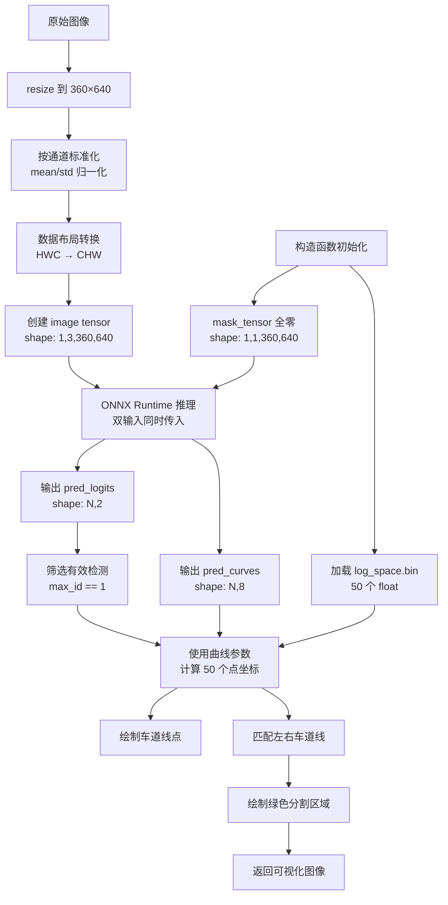

# 双输入机制与 log_space.bin 预计算数据

<!-- WIKI_NAV_START -->
> [!info] 视觉感知 Wiki 导航
> [[projects/linux视觉感知项目/index|项目首页]] · [[projects/Linux视觉感知项目/03 模型推理部署/4.2 ONNX Runtime推理流程|← 上一篇：5.1.2 ONNX Runtime 推理流程：模型加载、输入预处理与推理执行]] · [[projects/Linux视觉感知项目/03 模型推理部署/4.4 Unet编码器-解码器架构|下一篇：5.2.1 Unet 编码器-解码器架构与 skip connection →]]
<!-- WIKI_NAV_END -->

本页面深入解析 LSTR 车道线检测模型的双输入机制设计原理与 `log_space.bin` 预计算数据的作用。通过分析代码实现，理解为什么 LSTR 模型需要两个输入张量，以及如何通过预计算优化曲线采样的性能。

## 双输入机制的设计背景

LSTR（Lane Detection with Set Transformer）是一种基于 Transformer 的车道线检测模型，与传统语义分割模型不同，它采用参数化曲线输出而非像素级分割。这种设计决定了其输入结构的独特性：**除了常规的图像输入外，还需要一个全零的掩码张量作为模型的第二个输入**。

从 ONNX Runtime 的模型加载代码可以明确看到，模型定义了两个输入节点：

```cpp
// LSTR_ONNX/main.cpp 第 51-64 行
size_t numInputNodes = ort_session->GetInputCount();  // 获取输入节点数量（结果为2）
for (int i = 0; i < numInputNodes; i++)
{
    // ... 获取输入节点名称和维度信息
    input_node_dims.push_back(input_dims);  // 收集每个输入的维度
}
```

这种双输入设计源于 LSTR 模型的训练架构：在训练阶段，模型可能使用掩码张量作为注意力机制的辅助输入或解码器的初始化状态；在推理阶段，虽然掩码张量不包含实际信息，但必须保持与训练时一致的输入结构，否则 ONNX Runtime 会因输入维度不匹配而报错。

Sources: `卷积神经网络\卷积神经网络\LSTR_ONNX\main.cpp#L51-L64`

## 双输入张量的具体构成

### 第一个输入：图像张量（image tensor）

图像张量是模型的主要输入，包含经过预处理的图像数据。其构建过程包括三个关键步骤：

**尺寸调整**：原始图像被调整为模型要求的固定尺寸（360×640），使用双线性插值保持图像质量：
```cpp
// LSTR_ONNX/main.cpp 第 114-115 行
resize(srcimg, dstimg, Size(this->inpWidth, this->inpHeight), INTER_LINEAR);
```

**通道标准化**：按照 ImageNet 数据集的统计特性进行归一化处理，将像素值从 [0, 255] 映射到标准化范围：
```cpp
// LSTR_ONNX/main.cpp 第 103 行
this->input_image_[c * row * col + i * col + j] = (pix / 255.0 - mean[c]) / std[c];
```
其中均值 `mean = {0.485, 0.456, 0.406}`，标准差 `std = {0.229, 0.224, 0.225}`。

**数据布局转换**：将 OpenCV 的 HWC（高度-宽度-通道）格式转换为模型要求的 CHW（通道-高度-宽度）格式：
```cpp
// HWC 格式：img.ptr<uchar>(i)[j * 3 + c]
// CHW 格式：input_image_[c * row * col + i * col + j]
```

最终图像张量的形状为 `[1, 3, 360, 640]`（批次维度为1，3个颜色通道，360行，640列）。

Sources: `卷积神经网络\卷积神经网络\LSTR_ONNX\main.cpp#L114-L115`, `卷积神经网络\卷积神经网络\LSTR_ONNX\main.cpp#L103`, `卷积神经网络\卷积神经网络\LSTR_ONNX\main.cpp#L96-L106`

### 第二个输入：掩码张量（mask tensor）

掩码张量是一个全零的单通道张量，其形状为 `[1, 1, 360, 640]`。在构造函数中初始化：

```cpp
// LSTR_ONNX/main.cpp 第 78 行
this->mask_tensor.resize(this->inpHeight * this->inpWidth, 0.0);  // 全零初始化
```

在推理时，两个输入被同时传入 ONNX Runtime：
```cpp
// LSTR_ONNX/main.cpp 第 123-127 行
vector<Value> ort_inputs;
ort_inputs.push_back(Value::CreateTensor<float>(allocator_info, input_image_.data(), 
    input_image_.size(), input_shape_.data(), input_shape_.size()));
ort_inputs.push_back(Value::CreateTensor<float>(allocator_info, mask_tensor.data(), 
    mask_tensor.size(), mask_shape_.data(), mask_shape_.size()));
```

`input_shape_` 定义为 `{1, 3, inpHeight, inpWidth}`，`mask_shape_` 定义为 `{1, 1, inpHeight, inpWidth}`。

Sources: `卷积神经网络\卷积神经网络\LSTR_ONNX\main.cpp#L78`, `卷积神经网络\卷积神经网络\LSTR_ONNX\main.cpp#L123-L127`

## log_space.bin 预计算数据的作用

### 设计动机：优化曲线采样性能

LSTR 模型输出的 `pred_curves` 包含每条车道线的 8 个参数，需要通过数学公式将这些参数转换为 50 个离散的像素坐标点。如果每次推理都重新计算这些采样点的对数空间分布，将造成不必要的计算开销。

`log_space.bin` 文件存储了 50 个预计算的浮点数，这些值在 [0, 1] 区间内按对数尺度分布。对数分布的特点是：**在曲线起始端（接近 y 最小值）采样更密集，在曲线末端采样更稀疏**。这符合车道线在图像中的分布规律——近处车道线变化更剧烈，需要更精细的采样；远处车道线相对平缓，稀疏采样即可。

### 预计算数据的加载与存储

在 LSTR 类的构造函数中，一次性加载这些预计算数据：

```cpp
// LSTR_ONNX/main.cpp 第 79-82 行
log_space = new float[len_log_space];  // len_log_space = 50
FILE* fp = fopen("../log_space.bin", "rb");
fread(log_space, sizeof(float), len_log_space, fp);  // 读取50个float
fclose(fp);
```

这些数据存储在堆内存中，通过 `log_space` 指针访问。在析构函数中释放：
```cpp
// LSTR_ONNX/main.cpp 第 87-90 行
LSTR::~LSTR() {
    delete[] log_space;
    log_space = NULL;
}
```

Sources: `卷积神经网络\卷积神经网络\LSTR_ONNX\main.cpp#L79-L82`, `卷积神经网络\卷积神经网络\LSTR_ONNX\main.cpp#L87-L90`

### 曲线参数到像素坐标的转换

LSTR 模型输出两个张量：`pred_logits`（形状 `[N, 2]`）用于判断每个候选车道是否有效，`pred_curves`（形状 `[N, 8]`）包含每条车道的 8 个参数。

对于有效检测（`max_id == 1`），使用以下公式计算 50 个车道线点：

```cpp
// LSTR_ONNX/main.cpp 第 155-165 行
for (int k = 0; k < len_log_space; k++) {
    // y 坐标在 p[0] 和 p[1] 之间按对数空间插值
    const float y = p_lane_data[0] + log_space[k] * (p_lane_data[1] - p_lane_data[0]);
    
    // x 坐标用有理函数拟合（二次反比例函数 + 线性项）
    const float x = p_lane_data[2] / powf(y - p_lane_data[3], 2.0) 
                  + p_lane_data[4] / (y - p_lane_data[3]) 
                  + p_lane_data[5] + p_lane_data[6] * y - p_lane_data[7];
    
    // 归一化坐标转为像素坐标
    lane_points[k] = Point(int(x * img_width), int(y * img_height));
}
```

这里的 `log_space[k]` 提供了在 y 轴范围 [p[0], p[1]] 内的 50 个采样位置，通过线性插值计算出每个采样点的 y 坐标。然后使用复杂的有理函数模型计算对应的 x 坐标。

Sources: `卷积神经网络\卷积神经网络\LSTR_ONNX\main.cpp#L155-L165`

## 双输入机制的推理流程

完整的双输入推理流程如下图所示：



## 设计权衡与工程考量

### 为什么需要预计算 log_space？

| 方案 | 计算量 | 内存占用 | 代码复杂度 |
|------|--------|----------|------------|
| **每次推理重新计算** | 50 次 `log()` 调用 | 临时变量 | 需要在推理循环中计算 |
| **预计算加载** | 0 次（仅文件读取） | 50 个 float（200字节） | 构造函数一次性加载 |

对于实时车道线检测（通常要求 25+ FPS），避免每次推理的重复计算至关重要。预计算方案将计算开销转移到初始化阶段，推理时只需简单的数组访问。

### 双输入的兼容性要求

LSTR 模型在训练时可能使用了掩码张量作为辅助输入（例如用于注意力掩码或解码器初始化），因此推理时必须保持相同的输入结构。即使掩码张量在推理时不包含有用信息，省略它会导致：

1. **ONNX Runtime 输入验证失败**：模型定义了 2 个输入，只提供 1 个会报错
2. **维度不匹配**：输出形状可能与训练时不一致
3. **数值精度问题**：某些模型层可能依赖输入张量的存在性

### 内存管理注意事项

预计算数据的内存管理需要特别注意：

1. **堆分配与释放**：`log_space` 使用 `new float[50]` 分配，必须在析构函数中用 `delete[]` 释放
2. **文件读取错误处理**：当前代码未检查 `fopen` 和 `fread` 的返回值，部署时应添加错误检查
3. **线程安全**：`log_space` 指针在推理期间只读，可以安全地在多线程环境中使用

## 与 Unet 模型的对比

| 特性 | LSTR 双输入机制 | Unet 单输入机制 |
|------|----------------|----------------|
| **输入数量** | 2 个（图像 + 掩码） | 1 个（图像） |
| **掩码用途** | 模型结构要求，推理时全零 | 无需掩码 |
| **预计算数据** | log_space.bin（50 个 float） | 无 |
| **输出类型** | 参数化曲线（8 个参数） | 像素级分割掩码 |
| **后处理复杂度** | 曲线采样 + 点集绘制 | argmax + 去 padding |
| **性能特点** | 推理速度快，后处理轻 | 推理较慢，后处理重 |

## 常见问题与调试指南

### Q1：为什么 log_space.bin 不能省略？

如果省略 `log_space.bin`，代码将无法计算车道线点坐标。`log_space` 数组提供了 y 轴方向的采样位置，没有这些位置信息，曲线参数无法转换为可视化点集。

### Q2：掩码张量可以全零，为什么不能省略？

ONNX Runtime 严格验证输入数量和形状。模型定义了 2 个输入，必须提供 2 个形状匹配的张量。省略掩码张量会导致推理失败。

### Q3：如何验证双输入是否正确工作？

1. 检查模型输入节点数量：`ort_session->GetInputCount()` 应返回 2
2. 验证输入形状：`input_node_dims[0]` 应为 `[1,3,360,640]`，`input_node_dims[1]` 应为 `[1,1,360,640]`
3. 运行推理后检查输出：`pred_logits` 应为 `[N,2]`，`pred_curves` 应为 `[N,8]`

### Q4：log_space.bin 的值是如何生成的？

`log_space.bin` 是离线预计算的，通常使用类似以下代码生成：
```python
import numpy as np
log_space = np.logspace(0, 1, 50) / 10.0  # 在 [0.1, 1.0] 区间生成50个对数采样点
log_space.tofile('log_space.bin')
```

这些值在 [0, 1] 区间内按对数尺度分布，确保车道线近处密集采样，远处稀疏采样。

## 下一步学习建议

了解双输入机制后，建议继续学习：

1. **LSTR 模型架构与参数化曲线输出解码**：深入理解模型如何从图像特征预测曲线参数
2. **ONNX Runtime 推理流程：模型加载、输入预处理与推理执行**：掌握完整的推理部署流程
3. **两种检测方案对比：像素级分割 vs 参数化曲线检测**：对比 LSTR 与 Unet 的技术特点与应用场景

通过理解双输入机制，你已掌握 LSTR 模型部署的关键工程细节。这种预计算优化和结构兼容性设计，体现了嵌入式端侧部署中"以空间换时间"和"保持训练推理一致性"的重要原则。

<!-- WIKI_FOOTER_START -->
---
> [!tip] 继续阅读
> [[projects/linux视觉感知项目/index|项目首页]] · [[projects/Linux视觉感知项目/03 模型推理部署/4.2 ONNX Runtime推理流程|← 上一篇：5.1.2 ONNX Runtime 推理流程：模型加载、输入预处理与推理执行]] · [[projects/Linux视觉感知项目/03 模型推理部署/4.4 Unet编码器-解码器架构|下一篇：5.2.1 Unet 编码器-解码器架构与 skip connection →]]
<!-- WIKI_FOOTER_END -->
