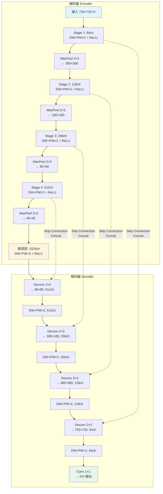
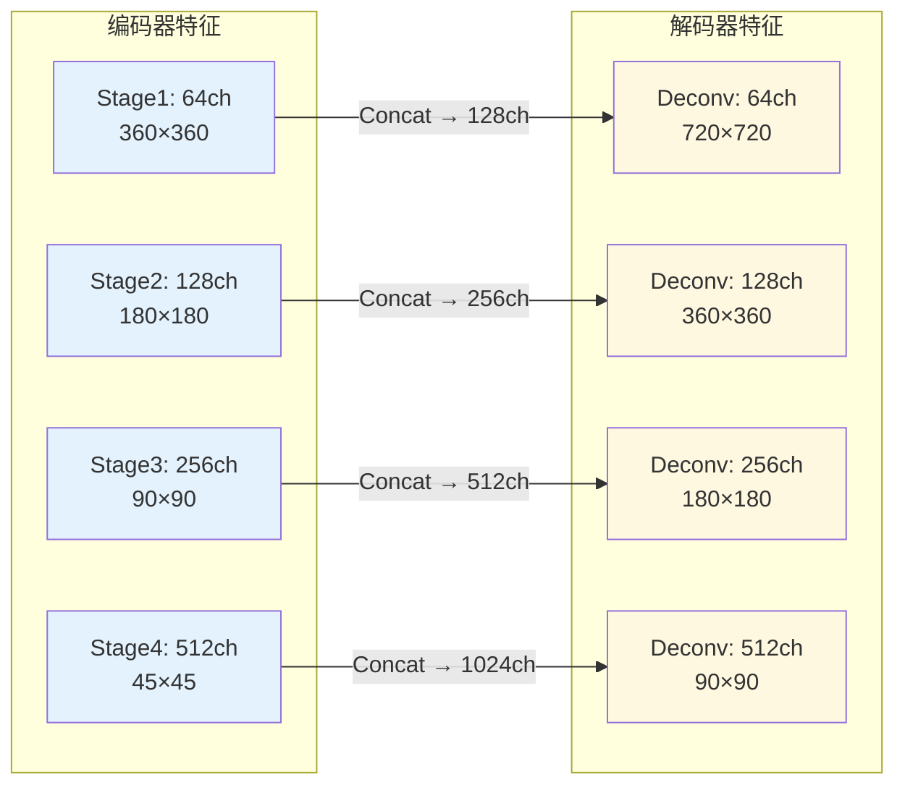

# Unet 编码器-解码器架构与 skip connection

<!-- WIKI_NAV_START -->
> [!info] 视觉感知 Wiki 导航
> [[projects/linux视觉感知项目/index|项目首页]] · [[projects/Linux视觉感知项目/03 模型推理部署/4.3 log_space与双输入机制|← 上一篇：5.1.3 双输入机制与 log_space.bin 预计算数据]] · [[projects/Linux视觉感知项目/03 模型推理部署/4.5 NCNN部署与HWC-CHW转换|下一篇：5.2.2 NCNN 模型部署：HWC 到 CHW 数据布局转换与 argmax 后处理 →]]
<!-- WIKI_NAV_END -->

本页系统讲解项目中 Unet 语义分割网络的核心原理，包括语义分割与车道线检测的适配关系、Unet 的 U 形编码器-解码器架构、跳跃连接的特征融合机制、深度可分离卷积的轻量化策略，以及模型输出的 argmax 后处理逻辑。内容覆盖从算法原理到 NCNN 参数文件中可验证的网络结构映射。

## 语义分割与车道线检测的关系

在计算机视觉中，任务粒度从粗到细可以划分为三个层次：**图像分类**判断整张图属于哪个类别，**目标检测**在图中用矩形框标出物体位置，而**语义分割**则对图像中的**每一个像素**进行分类，输出与原图等大的像素级标签图。对于车道线检测任务，语义分割的输出就是一张 mask，其中每个像素被标记为"背景"或"车道线"。

车道线具有**细长、连续、对位置和边界高度敏感**的特点。如果使用目标检测的矩形框来表示车道线，会丢失大量形状和位置细节；如果只做图像分类，则完全无法定位车道线。语义分割逐像素判别的特性，天然适合这种需要精确边界的目标。正如原作者文档所述："Unet 结构形似 U，被大量应用在分割领域，编码器负责提特征，解码器负责恢复空间分辨率，跳跃连接用来融合位置信息和上下文信息，最终输出像素级分割图。"

Sources: [Linux视觉感知处理原作者文档.md](Linux视觉感知处理原作者文档.md#L1192-L1199)

## Unet 整体架构：U 形编码器-解码器

Unet 的整体结构呈字母 **U** 形，由三大部分组成：左侧的**编码器（Encoder / 下采样路径）**、右侧的**解码器（Decoder / 上采样路径）**、以及连接左右两侧的**跳跃连接（Skip Connection）**。这一结构是在 FCN（全卷积网络）基础上的改进，解决了 FCN 无法同时利用上下文信息和位置信息的问题。



Sources: [Linux视觉感知处理原作者文档.md](Linux视觉感知处理原作者文档.md#L1194-L1223), [model.ncnn.param](model.ncnn.param#L1-L57)

## 编码器：逐级下采样提取语义特征

编码器的作用是从原始像素中**逐级提炼越来越抽象的语义特征**。每个编码器阶段包含两次卷积（本项目使用深度可分离卷积 DW+PW 替代普通 3×3 卷积）加 ReLU 激活，随后通过 2×2 最大池化将特征图尺寸减半、通道数翻倍。

以本项目 NCNN 参数文件 [model.ncnn.param](model.ncnn.param#L1-L57) 为依据，编码器各阶段的通道数变化如下：

| 阶段 | 输入通道 | 输出通道 | 池化后尺寸 | 对应参数文件层名 |
|:---:|:---:|:---:|:---:|:---|
| Stage 1 | 3 | 64 | 360×360 | `convdw_45` → `convrelu_0` → `convdw_46` → `convrelu_1` → `maxpool2d_23` |
| Stage 2 | 64 | 128 | 180×180 | `convdw_47` → `convrelu_2` → `convdw_48` → `convrelu_3` → `maxpool2d_24` |
| Stage 3 | 128 | 256 | 90×90 | `convdw_49` → `convrelu_4` → `convdw_50` → `convrelu_5` → `maxpool2d_25` |
| Stage 4 | 256 | 512 | 45×45 | `convdw_51` → `convrelu_6` → `convdw_52` → `convrelu_7` → `maxpool2d_26` |
| 瓶颈层 | 512 | 1024 | 45×45 | `convdw_53` → `convrelu_8` → `convdw_54` → `convrelu_9` |

经过四次下采样，特征图从 720×720 缩小到 45×45，空间分辨率降低了 16 倍，但通道数从 3 增加到 1024。这意味着特征图的每个位置都编码了丰富的高层语义信息，能够判断"这里大概是什么"，但丢失了"具体在哪里"的精确位置信息。

Sources: [model.ncnn.param](model.ncnn.param#L3-L31)

## 解码器：逐级上采样恢复空间分辨率

解码器的作用与编码器相反——它将低分辨率、高语义的特征图**逐步恢复到原始输入尺寸**，为每个像素生成分类结果。每个解码器阶段包含三个关键操作：

1. **转置卷积上采样（Deconvolution）**：将特征图尺寸翻倍、通道数减半。参数文件中的 `deconv_19` 到 `deconv_22` 分别将 1024→512→256→128→64 通道，尺寸从 45×45 逐步恢复到 720×720。
2. **跳跃连接拼接（Concat）**：将编码器同级的特征图与上采样后的特征图在通道维度拼接。参数文件中的 `cat_0` 到 `cat_3` 对应四次跳跃连接。
3. **卷积融合（DW+PW）**：对拼接后的特征图做两次卷积加 ReLU，融合来自编码器的细节信息和来自解码器的语义信息。

| 阶段 | Deconv 输出 | Concat 后通道 | 融合后通道 | 对应参数文件层名 |
|:---:|:---:|:---:|:---:|:---|
| Decode 1 | 512ch, 90×90 | 512+512=1024 | 512 | `deconv_19` → `cat_0` → `convrelu_10/11` |
| Decode 2 | 256ch, 180×180 | 256+256=512 | 256 | `deconv_20` → `cat_1` → `convrelu_12/13` |
| Decode 3 | 128ch, 360×360 | 128+128=256 | 128 | `deconv_21` → `cat_2` → `convrelu_14/15` |
| Decode 4 | 64ch, 720×720 | 64+64=128 | 64 | `deconv_22` → `cat_3` → `convrelu_16/17` |

Sources: [model.ncnn.param](model.ncnn.param#L32-L55)

## 跳跃连接：融合深层语义与浅层细节

**跳跃连接是 Unet 区别于普通编码器-解码器网络的核心设计。** 编码器一路下采样虽然能学到强语义特征，但会丢失大量空间细节——边界变得模糊、位置变得不确定。而车道线检测恰恰对细节、边界、位置和连续性高度敏感。

跳跃连接的机制很直接：将编码器每个阶段的特征图（通过 `Split` 层保存副本）直接传递给解码器对应层级，与上采样后的特征图在通道维度拼接。在参数文件中，`splitncnn_0` 到 `splitncnn_3` 四个 Split 层分别在编码器 Stage 1~4 处保存了特征图副本，供解码器的 `cat_0` 到 `cat_3` 使用。



浅层特征（Stage 1、2）包含丰富的边缘、纹理等空间细节，深层特征（Stage 3、4）包含高级语义信息。跳跃连接让解码器**同时拥有"深层语义"和"浅层细节"**，从而生成边界清晰、位置准确的分割结果。去掉跳跃连接后，分割结果的车道线边缘会明显变得粗糙和不连续。

Sources: [model.ncnn.param](model.ncnn.param#L8-L9), [model.ncnn.param](model.ncnn.param#L14-L15), [model.ncnn.param](model.ncnn.param#L20-L21), [model.ncnn.param](model.ncnn.param#L26-L27), [model.ncnn.param](model.ncnn.param#L33), [model.ncnn.param](model.ncnn.param#L39), [model.ncnn.param](model.ncnn.param#L45), [model.ncnn.param](model.ncnn.param#L51)

## 输出层与像素级分类

网络的最后一步是通过 `conv_18`——一个 1×1 卷积层——将 64 通道的特征图映射为 **2 个通道**，对应本项目的二分类分割（背景 vs 车道线）。2 通道的输出不是一张现成的黑白图，而是每个像素对两个类别的**分数图（logits）**。

在部署代码 [unet.cpp](unet.cpp#L99-L109) 中，对每个像素执行 **argmax** 操作——比较两个通道的分数值，取较大值对应的类别索引作为该像素的最终标签：

```cpp
// unet.cpp L99-L109: 逐像素 argmax
float tmp = srcdata[0*mask.w*mask.h+i*mask.w+j];
int maxk = 0;
for (int k = 0; k < mask.c; k++) {
  if (tmp < srcdata[k*mask.w*mask.h+i*mask.w+j]) {
    tmp = srcdata[k*mask.w*mask.h+i*mask.w+j];
    maxk = k;
  }
}
data[i*INPUT_WIDTH + j] = maxk;
```

`mask.c` 为通道数（本项目为 2），`maxk` 为 0 表示背景像素，为 1 表示车道线像素。最终生成的灰度 mask 经过 `cv_img *= 255` 缩放后，通过 `cv::Mat::setTo` 将原图中标记为车道线的像素叠加为绿色，完成可视化。

Sources: [model.ncnn.param](model.ncnn.param#L56), [unet.cpp](unet.cpp#L99-L109), [unet.cpp](unet.cpp#L133-L138)

## 深度可分离卷积：轻量化的核心策略

原始 Unet 使用标准 3×3 卷积，其参数量为 `kernel_h × kernel_w × in_channels × out_channels`。随着网络加深、通道数增加，参数量会快速膨胀——本项目原始 Unet 训练 1000 轮后权重文件达 **124MB**。

为了适配 FT2000/4 ARM 开发板的算力限制，项目借鉴 MobileNet 的思想，将标准卷积替换为**深度可分离卷积（Depthwise Separable Convolution）**，分两步完成：

**第一步：Depthwise 卷积（DW）**——每个输入通道独立做 3×3 卷积，通道之间不混合，参数量为 `3 × 3 × in_channels`。在参数文件中表现为 `ConvolutionDepthWise` 层，例如 `convdw_45` 的参数 `7=3` 表示 groups 数等于输入通道数 3。

**第二步：Pointwise 卷积（PW）**——用 1×1 卷积完成通道融合，将输入通道数映射为期望的输出通道数，参数量为 `1 × 1 × in_channels × out_channels`。在参数文件中表现为 `Convolution` 层，例如 `convrelu_0` 的参数 `0=64` 表示输出 64 通道。

| 对比维度 | 标准卷积 | 深度可分离卷积 |
|:---|:---|:---|
| 参数量 | `K² × Cin × Cout` | `K² × Cin + Cin × Cout` |
| 计算量 | 高 | 约为标准卷积的 `1/K² + 1/Cout` |
| 典型压缩比（K=3） | 1× | 约 8~9× |
| 本项目效果 | 124MB 权重 | **24.2MB** 权重 |

轻量化后，DICE 指标从 0.930 下降到 0.845，推理时间从 1.59s 降到 1.06s。这是嵌入式场景中**精度、速度、模型体积**三方权衡的典型体现。

Sources: [model.ncnn.param](model.ncnn.param#L4-L7), [Linux视觉感知处理原作者文档.md](Linux视觉感知处理原作者文档.md#L1225-L1295)

## 输入预处理与 HWC→CHW 转换

NCNN 推理前的预处理是部署中的关键环节。在 [unet.cpp](unet.cpp#L36-L77) 中，预处理流程分为四步：

1. **保持宽高比填充**：判断输入图像的宽高关系，通过 `cv::copyMakeBorder` 在短边方向填充黑色像素，使图像变为正方形。同时记录填充边界的像素偏移量，供后处理时裁剪。
2. **缩放到模型输入尺寸**：使用 `cv::resize` 将填充后的正方形图像缩放到 720×720，插值方法为 `INTER_CUBIC`。
3. **归一化到 [0,1]**：通过 `convertTo(image, CV_32FC3, 1/255.0)` 将像素值从 [0,255] 映射到浮点 [0,1]。
4. **HWC → CHW 布局转换**：OpenCV 的 `Mat` 布局为 HWC（行×列×通道），而 NCNN 要求 CHW（通道×行×列）。代码通过三重循环完成数据重排：`data[k*H*W + i*W + j] = srcdata[i*W*3 + j*3 + k]`。

这一步的数据布局转换是理解整个部署代码的关键——如果布局不对，NCNN 会将错误的数据排布解释为错误的特征图，导致推理结果完全无意义。

Sources: [unet.cpp](unet.cpp#L36-L77)

## 后处理：去除填充并可视化

推理完成后，输出的 `ncnn::Mat mask` 尺寸为 720×720×2（宽×高×通道）。后处理除了前面介绍的 argmax 外，还需要**去除预处理时添加的填充边界**：

```cpp
// unet.cpp L112-L116: 裁剪填充区域
if ((left > 0) && (right > 0) && ((j < left) || (j >= INPUT_WIDTH - right)))
  data[i*INPUT_WIDTH + j] = 0;
if ((top > 0) && (bottom > 0) && ((i < top) || (i >= INPUT_HEIGHT - bottom)))
  data[i*INPUT_WIDTH + j] = 0;
```

预处理阶段记录的 `top`、`bottom`、`left`、`right` 偏移量在此处被用来将填充区域的像素标签强制设为 0（背景），确保最终结果只包含原始图像有效区域的分割信息。可视化阶段，标签为 1 的像素被叠加为绿色（`cv::Scalar(0,255,0)`），生成最终的车道线分割效果图。

Sources: [unet.cpp](unet.cpp#L110-L116), [unet.cpp](unet.cpp#L133-L138)

## NCNN 模型文件与完整层结构

本项目的 Unet 模型以 NCNN 格式存储，分为两个文件：

| 文件 | 作用 | 对应内容 |
|:---|:---|:---|
| `model.ncnn.param` | 网络结构定义 | 54 层、58 个 blob，描述每一层的类型、输入输出和参数 |
| `model.ncnn.bin` | 模型权重数据 | 各层的卷积核权重和偏置参数 |

`.param` 文件的首行为魔数 `7767517`，第二行 `54 58` 表示 54 个层和 58 个 blob。每一行定义一个层，格式为：`层类型 层名 输入blob数 输出blob数 输入blob名 输出blob名 [参数]`。完整的 54 层结构如下：

| 层号 | 层类型 | 层名 | 功能 |
|:---:|:---|:---|:---|
| 1 | Input | `in0` | 输入 720×720×3 |
| 2-5 | DW+PW×2 | `convdw_45`→`convrelu_1` | Encoder Stage 1: 3→64ch |
| 6 | Split | `splitncnn_0` | 保存 64ch 副本供跳跃连接 |
| 7 | Pooling | `maxpool2d_23` | 720→360 |
| 8-11 | DW+PW×2 | `convdw_47`→`convrelu_3` | Encoder Stage 2: 64→128ch |
| 12 | Split | `splitncnn_1` | 保存 128ch 副本 |
| 13 | Pooling | `maxpool2d_24` | 360→180 |
| 14-17 | DW+PW×2 | `convdw_49`→`convrelu_5` | Encoder Stage 3: 128→256ch |
| 18 | Split | `splitncnn_2` | 保存 256ch 副本 |
| 19 | Pooling | `maxpool2d_25` | 180→90 |
| 20-23 | DW+PW×2 | `convdw_51`→`convrelu_7` | Encoder Stage 4: 256→512ch |
| 24 | Split | `splitncnn_3` | 保存 512ch 副本 |
| 25 | Pooling | `maxpool2d_26` | 90→45 |
| 26-29 | DW+PW×2 | `convdw_53`→`convrelu_9` | 瓶颈层: 512→1024ch |
| 30 | Deconvolution | `deconv_19` | 上采样 45→90, 1024→512ch |
| 31 | Concat | `cat_0` | 跳跃连接拼接 512+512=1024ch |
| 32-33 | DW+PW×2 | `convdw_55`→`convrelu_11` | Decode 1: 1024→512ch |
| 34 | Deconvolution | `deconv_20` | 上采样 90→180, 512→256ch |
| 35 | Concat | `cat_1` | 跳跃连接拼接 256+256=512ch |
| 36-37 | DW+PW×2 | `convdw_57`→`convrelu_13` | Decode 2: 512→256ch |
| 38 | Deconvolution | `deconv_21` | 上采样 180→360, 256→128ch |
| 39 | Concat | `cat_2` | 跳跃连接拼接 128+128=256ch |
| 40-41 | DW+PW×2 | `convdw_59`→`convrelu_15` | Decode 3: 256→128ch |
| 42 | Deconvolution | `deconv_22` | 上采样 360→720, 128→64ch |
| 43 | Concat | `cat_3` | 跳跃连接拼接 64+64=128ch |
| 44-45 | DW+PW×2 | `convdw_61`→`convrelu_17` | Decode 4: 128→64ch |
| 46 | Convolution | `conv_18` | 1×1卷积 64→2ch 输出 |

Sources: [model.ncnn.param](model.ncnn.param#L1-L57)

## DICE 评估指标

DICE 系数是衡量分割质量的核心指标，取值范围 [0,1]，计算公式为：

**DICE = 2 × |预测 ∩ 真实| / (|预测| + |真实|)**

DICE 越接近 1 表示预测结果与真实标注越吻合。相比普通像素准确率，DICE 对正样本（车道线像素）的检测更敏感，且在样本严重不平衡（背景远多于车道线）的场景下仍然有效。本项目的实验数据显示，原始 Unet 的 DICE 为 0.930，深度可分离卷积轻量化后为 0.845——精度有所下降，但模型从 124MB 缩小到 24.2MB，推理时间从 1.59s 降到 1.06s，实现了嵌入式部署的可行性。
