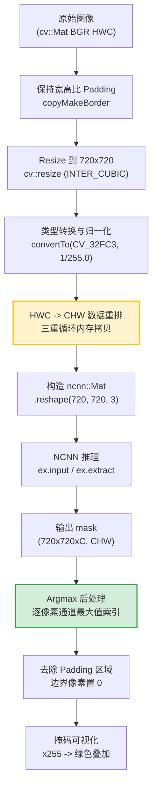
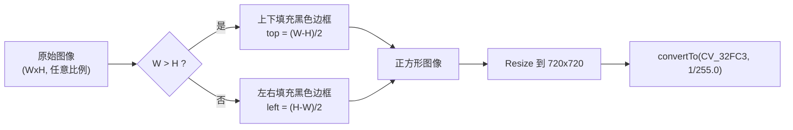
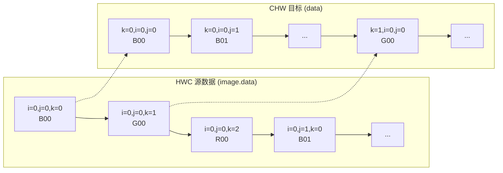
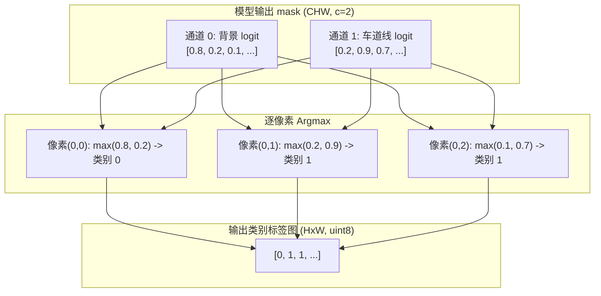

# NCNN 模型部署：HWC 到 CHW 数据布局转换与 argmax 后处理

<!-- WIKI_NAV_START -->
> [!info] 视觉感知 Wiki 导航
> [[projects/linux视觉感知项目/index|项目首页]] · [[projects/Linux视觉感知项目/03 模型推理部署/4.4 Unet编码器-解码器架构|← 上一篇：5.2.1 Unet 编码器-解码器架构与 skip connection]] · [[projects/Linux视觉感知项目/03 模型推理部署/4.6 两种方案对比：分割vs曲线|下一篇：5.3 两种检测方案对比：像素级分割 vs 参数化曲线检测 →]]
<!-- WIKI_NAV_END -->

本页详细剖析 Unet 语义分割模型在 NCNN 推理框架上的部署实现，聚焦两个核心技术环节：**输入数据从 HWC 到 CHW 的布局转换**（解决 OpenCV 与 NCNN 之间的数据格式不匹配问题）和 **argmax 后处理**（将模型输出的多通道概率图转换为像素级类别标签）。这两步是语义分割模型部署中普遍存在的共性问题，掌握其原理对任何推理框架的模型集成都具有迁移价值。

---

## Unet 在系统中的定位

在完整的视觉感知数据流中，Unet_NCNN 模块位于 LIME 低照度增强之后、Qt 上位机显示之前，承担的核心职责是：**将经过预处理的图像送入轻量化后的 Unet 模型，在开发板端完成车道线像素级分割推理，并输出可视化结果**。整个系统的主线是：摄像头采集画面 -> LIME 低照度增强 -> 车道线识别模型推理 -> Qt 上位机显示。

---

## 模型轻量化与转换链路

### 为什么需要轻量化

经过 1000 轮训练后生成的 `.pth` 权重文件大小为 **124MB**（FP32 精度）。对于飞腾 FT2000/4 这类资源受限的嵌入式设备而言，大模型带来的问题不仅是存储占用，更包括参数访存压力大、推理速度慢。

轻量化的核心目标是：**让模型更小、更快，更适合在 FT2000/4 开发板上实时运行**。

本项目采用两种互补的轻量化手段：

| 方法 | 作用层面 | 核心思想 |
|------|----------|----------|
| **深度可分离卷积** | 模型结构 | 将普通卷积拆为 DW + PW 两步，减少参数量和计算量 |
| **FP16 量化** | 数值精度 | 将权重从 FP32 转为 FP16，减少存储和访存开销 |

### 深度可分离卷积效果对比

在 x86 平台上使用 Python 进行测试：

| 指标 | 原始 Unet | 深度可分离 Unet | 变化 |
|------|-----------|----------------|------|
| **DICE 系数** | 0.930 | 0.845 | -9.1% |
| **推理速度** | 1.59s | 1.06s | 快 1.5x |
| **权重文件大小** | 124MB | 24MB | 缩小 5.2x |

### 模型转换链路

从 PyTorch 训练模型到 NCNN 部署模型，需要经历三个阶段的格式转换：


**PNNX**（Pytorch to NCNN eXchanger）是腾讯开源的一站式模型转换与量化工具，转换命令示例：`./pnnx model.pt inputshape=[1,3,720,720]`

---

## 整体数据流总览

Unet_NCNN 的推理流程可以分为五个阶段：**图像预处理 -> 数据布局转换 -> NCNN 推理 -> argmax 后处理 -> 结果可视化**。



---

## HWC 与 CHW 数据布局：概念与原因

### 两种布局的定义

深度学习模型输入图像的数据在内存中以一维数组形式存储，但如何组织像素值取决于 **数据布局**（data layout）约定：

| 布局名称 | 全称 | 含义 | 典型使用者 |
|----------|------|------|-----------|
| **HWC** | Height-Width-Channel | 逐行扫描，每个像素的 3 个通道值连续存放 | OpenCV、PIL、TensorFlow（NHWC） |
| **CHW** | Channel-Height-Width | 先存完所有 R 通道，再存 G，最后存 B | NCNN、PyTorch、ONNX Runtime |

### 内存布局对比图

对于一张 3x3 的 RGB 图像，两种布局在内存中的排列如下：

```
HWC 布局 (OpenCV 默认):
+-----------------------------------------------------------+
| R00 G00 B00 | R01 G01 B01 | R02 G02 B02 |  <- 第 0 行   |
| R10 G10 B10 | R11 G11 B11 | R12 G12 B12 |  <- 第 1 行   |
| R20 G20 B20 | R21 G21 B21 | R22 G22 B22 |  <- 第 2 行   |
+-----------------------------------------------------------+
地址偏移: pixel(i,j,c) = i * W * 3 + j * 3 + c

CHW 布局 (NCNN 要求):
+---------------------------+
| R00 R01 R02               |  <- R 通道全部
| R10 R11 R12               |
| R20 R21 R22               |
+---------------------------+
| G00 G01 G02               |  <- G 通道全部
| G10 G11 G12               |
| G20 G21 G22               |
+---------------------------+
| B00 B01 B02               |  <- B 通道全部
| B10 B11 B12               |
| B20 B21 B22               |
+---------------------------+
地址偏移: pixel(i,j,k) = k * H * W + i * W + j
```

### 为什么需要转换

NCNN 作为专为移动端和嵌入式设备优化的推理框架，其内部 `ncnn::Mat` 采用 CHW 布局。这种布局使得卷积核可以直接对连续内存区域进行 SIMD 向量化运算（同一通道的像素值在内存中连续），有利于 ARM NEON 等 SIMD 指令集的加速。而 OpenCV 的 `CV_32FC3` 多通道浮点矩阵默认采用 HWC 布局——每个像素的 B、G、R 三个通道值在内存中紧邻存放。

当从 OpenCV 读取图像后直接传递给 NCNN 时，**必须进行 HWC -> CHW 的数据重排**，否则模型会将错误的像素值当作输入，导致推理结果完全错误。

---

## 图像预处理流水线详解

### 保持宽高比的 Padding



代码首先根据原始图像宽高比判断填充方向。关键设计是**同时记录了填充边界在缩放后的新坐标**：

```cpp
// 关键：按比例重新计算缩放后的边界坐标
top = (INPUT_HEIGHT*top)/width;
bottom = (INPUT_HEIGHT*bottom)/width;
left = (INPUT_WIDTH*left)/height;
right = (INPUT_WIDTH*right)/height;
```

接着使用 `cv::resize` 缩放到 720x720（INTER_CUBIC 双三次插值），然后通过 `convertTo(image, CV_32FC3, 1/255.0)` 归一化到 [0, 1] 范围。

---

## HWC 到 CHW 转换的核心实现

### 转换算法分析

代码使用一个三重嵌套循环完成 HWC -> CHW 的内存重排：

```cpp
float *srcdata = (float*)image.data;   // HWC 格式的源数据
float *data = new float[INPUT_WIDTH*INPUT_HEIGHT*3];  // CHW 格式的目标缓冲区
for (int i = 0; i < INPUT_HEIGHT; i++)       // 遍历行 (H)
   for (int j = 0; j < INPUT_WIDTH; j++)     // 遍历列 (W)
       for (int k = 0; k < 3; k++) {         // 遍历通道 (C)
          data[k*INPUT_HEIGHT*INPUT_WIDTH + i*INPUT_WIDTH + j]
              = srcdata[i*INPUT_WIDTH*3 + j*3 + k];
       }
```

### 地址映射公式

| 格式 | 像素 (i, j, k) 的地址偏移 | 说明 |
|------|---------------------------|------|
| **HWC 源** | `i x W x 3 + j x 3 + k` | 行优先，每行 W 个像素，每像素 3 通道 |
| **CHW 目标** | `k x H x W + i x W + j` | 通道优先，每个通道 HxW 个像素 |

### 转换过程的内存读写模式



### 构造 ncnn::Mat

```cpp
// 第一步：用数据指针构造一维 Mat
ncnn::Mat in(image.rows*image.cols*3, data);
// 第二步：reshape 为三维 Mat（不会拷贝数据，只重新解释维度）
in = in.reshape(720, 720, 3);
```

---

## NCNN 推理执行

```cpp
ncnn::Net Unet;
Unet.load_param("../models/model.ncnn.param");
Unet.load_model("../models/model.ncnn.bin");

ncnn::Extractor ex = Unet.create_extractor();
ex.set_light_mode(true);     // 推理后立即释放中间结果内存
ex.set_num_threads(4);       // 使用 4 线程并行推理

ex.input("in0", in);
ncnn::Mat mask;
ex.extract("out0", mask);
```

- **set_light_mode(true)**：每层推理完成后立即释放该层的输入数据，减少峰值内存占用
- **set_num_threads(4)**：匹配 FT2000/4 的四核 CPU
- 输出 `mask` 维度为 `(w=720, h=720, c=2)`，c=2 对应背景类和车道线类

---

## Argmax 后处理：从概率图到类别标签

### 问题定义

语义分割模型的原始输出是一个 **(C, H, W) 的三维张量**。对于每个像素位置 (i, j)，需要找出得分最高的类别索引：

$$\text{class}(i, j) = \arg\max_{k \in [0, C-1]} \text{mask}[k][i][j]$$

### 实现代码解析

```cpp
cv::Mat cv_img = cv::Mat::zeros(INPUT_WIDTH, INPUT_HEIGHT, CV_8UC1);
{
    float *srcdata = (float*)mask.data;
    unsigned char *data = cv_img.data;

    for (int i = 0; i < mask.h; i++)
       for (int j = 0; j < mask.w; j++) {
         float tmp = srcdata[0*mask.w*mask.h + i*mask.w + j];
         int maxk = 0;
         for (int k = 0; k < mask.c; k++) {
           if (tmp < srcdata[k*mask.w*mask.h + i*mask.w + j]) {
             tmp = srcdata[k*mask.w*mask.h + i*mask.w + j];
             maxk = k;
           }
         }
         data[i*INPUT_WIDTH + j] = maxk;

         // 去除填充边界
         if ((left > 0) && (right > 0) && ((j < left) || (j >= INPUT_WIDTH - right)))
           data[i*INPUT_WIDTH + j] = 0;
         if ((top > 0) && (bottom > 0) && ((i < top) || (i >= INPUT_HEIGHT - bottom)))
           data[i*INPUT_WIDTH + j] = 0;
       }
}
```

### Argmax 的执行过程图解



---

## 结果可视化

```cpp
cv_img *= 255;
cv::Mat result;
image.copyTo(result);
result.setTo(cv::Scalar(0, 255, 0), cv_img);
cv::imwrite("result.jpg", result);
```

---

## 性能瓶颈与优化建议

### 当前实现的瓶颈分析

| 瓶颈点 | 位置 | 原因 | 影响程度 |
|--------|------|------|----------|
| 手动 HWC->CHW 转换 | unet.cpp L56-L61 | 三重循环逐元素拷贝，无 SIMD 优化，缓存不友好 | **高** |
| Argmax 逐像素循环 | unet.cpp L89-L104 | 逐元素遍历，未利用 NEON 向量化 | 中 |
| `new float[]` 手动内存管理 | unet.cpp L55 | 每次推理都分配堆内存，无释放（内存泄漏） | 中 |

### 优化方案

**方案一：使用 ncnn::Mat::from_pixels 替代手动转换**

NCNN 框架内置了 `ncnn::Mat::from_pixels` 静态方法，内部使用 SIMD 优化：

```cpp
// 替代手动三重循环
ncnn::Mat in = ncnn::Mat::from_pixels(tmp1.data, ncnn::Mat::PIXEL_BGR2RGB, INPUT_WIDTH, INPUT_HEIGHT);
```

**方案二：使用 NEON 向量化优化 argmax**

```cpp
float32x4_t ch0 = vld1q_f32(&srcdata[0*H*W + offset]);
float32x4_t ch1 = vld1q_f32(&srcdata[1*H*W + offset]);
uint32x4_t mask_vec = vcgtq_f32(ch1, ch0);  // ch1 > ch0 则置全 1
```

**方案三：修复内存泄漏**

当前代码中 `data = new float[...]` 分配的内存在推理结束后从未释放。应使用 `std::vector<float>` 或在使用完毕后调用 `delete[] data`。

---

## PyTorch vs NCNN 框架对比

在 FT2000/4 开发板上，对同一张车道线场景图分别使用 PyTorch 和 NCNN 框架部署轻量化 Unet 模型：

| 指标 | PyTorch 框架 | NCNN 框架 | 优化比 |
|------|-------------|-----------|--------|
| **平均推理用时** | 17.386s | 4.676s | **371.8%**（快 3.7 倍） |
| **准确率** | 93.1% | 84.5% | -9.2% |

---

## 与 ONNX Runtime 部署方案的对比

| 对比维度 | NCNN (Unet) | ONNX Runtime (LSTR) |
|----------|-------------|---------------------|
| **数据布局** | CHW（需手动从 HWC 转换） | CHW（normalize_() 函数转换） |
| **转换方式** | 手动三重循环 | 手动三重循环 |
| **模型格式** | `.param` + `.bin`（NCNN 专有） | `.onnx`（标准交换格式） |
| **推理 API** | `Extractor::input()` / `extract()` | `Session::Run()` |
| **后处理** | argmax（像素级分类） | argmax + 曲线参数解码 |
| **SIMD 优化** | 可用 `from_pixels` 内置优化 | 无内置优化 |

两个子模块的数据转换逻辑本质相同——都是将 OpenCV 的 HWC 格式转为推理框架要求的 CHW 格式——这说明**数据布局转换是模型部署中一个绕不开的通用问题**。

---

## 关键概念速查表

| 概念 | 定义 | 在本项目中的体现 |
|------|------|-----------------|
| **HWC** | Height-Width-Channel 布局 | OpenCV `CV_32FC3` 的内存排列 |
| **CHW** | Channel-Height-Width 布局 | NCNN `ncnn::Mat` 的内存排列 |
| **Argmax** | 对每个空间位置在通道维度取最大值索引 | 将 2 通道 logit 图转为单通道类别标签图 |
| **Padding** | 将非正方形图像填充为正方形以保持宽高比 | `copyMakeBorder` + 边界坐标记录与裁剪 |
| **Light Mode** | NCNN 推理模式，层间推理完成后立即释放中间内存 | `ex.set_light_mode(true)` |
| **深度可分离卷积** | DW（逐通道卷积）+ PW（1x1 通道融合） | Unet 轻量化核心手段 |

---

## 常见破坏测试

| 破坏方式 | 预期后果 | 学到什么 |
|----------|----------|----------|
| 不补边直接 resize | 图像比例被拉伸，车道线畸变 | 保持比例需要 padding |
| 忘记 HWC 转 CHW | 推理结果完全错误 | OpenCV 与 NCNN 内存布局不同 |
| 不做 Argmax | 得不到像素级类别标签 | 输出是分数图，不是类别图 |
| 不去 Padding | 补边黑色区域被误识别为车道线 | 后处理要恢复原图有效区域 |
| 线程数设为 1 | 推理速度下降约 3-4 倍 | 多线程对 CPU 推理至关重要 |
| 跳过 FP16 量化 | 模型体积翻倍，推理变慢 | 量化是端侧部署的关键优化 |

---

## 下一步阅读建议

1. 若想了解 Unet 网络本身的架构设计，请阅读 [[projects/Linux视觉感知项目/03 模型推理部署/4.4 Unet编码器-解码器架构|Unet 编码器-解码器架构与 skip connection]]
2. 若想对比理解另一种检测方案，请阅读 [[projects/Linux视觉感知项目/03 模型推理部署/4.6 两种方案对比：分割vs曲线|两种检测方案对比：像素级分割 vs 参数化曲线检测]]
3. 若想深入了解模型轻量化技术，请阅读 [[projects/Linux视觉感知项目/04 系统集成与性能/5.2 模型轻量化与参数压缩|模型轻量化部署：深度可分离卷积与参数量压缩]]
4. 若正在准备面试中与本页相关的高频问题，请参考 [[projects/Linux视觉感知项目/05 面试与复习/6.4 LSTR与Unet部署面试要点|LSTR 与 Unet 模型部署面试要点]]

<!-- WIKI_FOOTER_START -->
---
> [!tip] 继续阅读
> [[projects/linux视觉感知项目/index|项目首页]] · [[projects/Linux视觉感知项目/03 模型推理部署/4.4 Unet编码器-解码器架构|← 上一篇：5.2.1 Unet 编码器-解码器架构与 skip connection]] · [[projects/Linux视觉感知项目/03 模型推理部署/4.6 两种方案对比：分割vs曲线|下一篇：5.3 两种检测方案对比：像素级分割 vs 参数化曲线检测 →]]
<!-- WIKI_FOOTER_END -->
