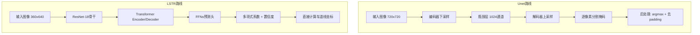
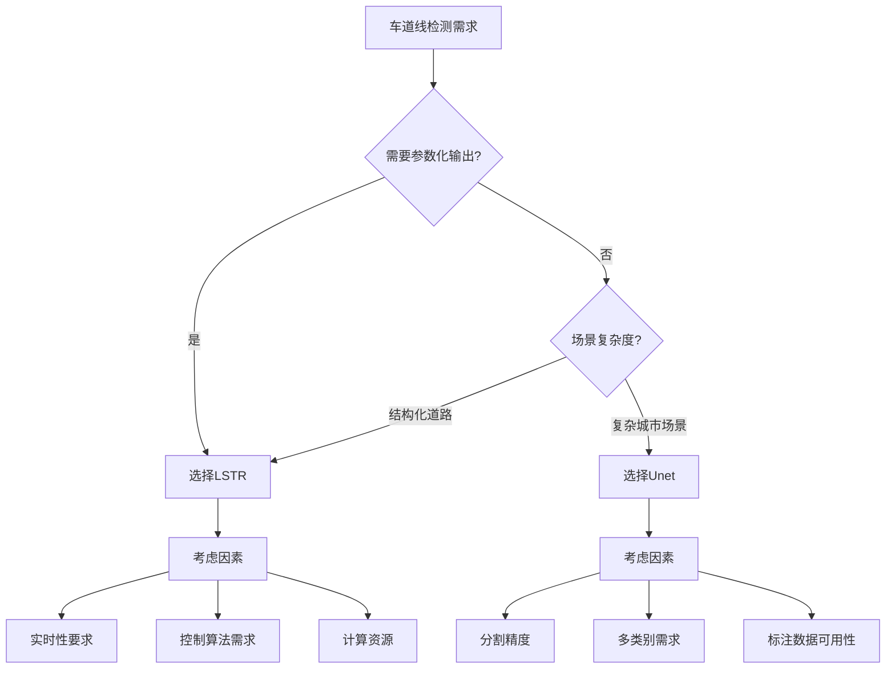

# 两种检测方案对比：像素级分割 vs 参数化曲线检测

<!-- WIKI_NAV_START -->
> [!info] 视觉感知 Wiki 导航
> [[projects/linux视觉感知项目/index|项目首页]] · [[projects/Linux视觉感知项目/03 模型推理部署/4.5 NCNN部署与HWC-CHW转换|← 上一篇：5.2.2 NCNN 模型部署：HWC 到 CHW 数据布局转换与 argmax 后处理]] · [[projects/Linux视觉感知项目/01 Qt 上位机/2.1 界面布局与UI控件|下一篇：6.1.1 Qt Designer 界面布局与 UI 控件映射 →]]
<!-- WIKI_NAV_END -->

本文档深入对比本项目中的两种车道线检测方案：**基于 Unet 的像素级语义分割**与**基于 LSTR 的参数化曲线检测**。两者代表了两种截然不同的技术路线，在模型输出语义、后处理复杂度、推理效率和适用场景上存在本质差异。理解这两种方案的设计权衡，是掌握本系统架构决策的关键。

## 核心设计哲学对比

从代码实现来看，两种方案遵循着不同的设计哲学。**Unet 采用"像素级画线"策略**，其模型输出直接对应图像中每个像素的分类结果，最终形成逐像素的分割掩码。**LSTR 则采用"参数化曲线拟合"策略**，模型输出的是描述车道线几何形态的数学参数，需要通过后处理计算才能还原成可视化的车道线点集。

这种根本差异源于两者对"车道线"这一概念的不同建模方式。Unet 将车道线视为图像中具有特定语义的像素区域，而 LSTR 将其视为可以用数学函数描述的几何曲线。

## 模型架构与推理框架差异

### LSTR：ONNX Runtime 参数化输出

LSTR 模型通过 ONNX Runtime 进行推理，采用**双输入、双输出**架构：

- **输入**：归一化图像数据（`[1, 3, 360, 640]`）+ 全零掩码张量（`[1, 1, 360, 640]`）
- **输出**：`pred_logits`（`[1, 7, 2]`，判断 7 个候选位置是否存在有效车道线）+ `pred_curves`（`[1, 7, 8]`，包含 7 个候选车道线的 8 个曲线参数）

曲线还原公式：`x = p[2]/(y-p[3])^2 + p[4]/(y-p[3]) + p[5] + p[6]*y - p[7]`

### Unet：NCNN 像素级分割

Unet 模型通过 NCNN 框架部署，采用**编码器-解码器架构**与**跳跃连接（skip connection）**：

- **输入**：单个张量（`[1, 3, 720, 720]`）
- **输出**：多通道分割掩码（`720x720xC`，C=2 对应背景和车道线）
- **结构特点**：大量使用深度可分离卷积（ConvolutionDepthWise），从 3 -> 64 -> 128 -> 256 -> 512 -> 1024 的编码路径

### 模型轻量化策略

两种模型都经历了轻量化改造：

| 技术维度 | Unet | LSTR |
|---------|------|------|
| **任务类型** | 语义分割（像素级） | 参数化检测（曲线级） |
| **骨干网络** | U 型编码-解码器 | ResNet-18 + Transformer |
| **部署框架** | NCNN（腾讯开源） | ONNX Runtime（微软） |
| **轻量化手段** | 深度可分离卷积 + FP16 量化 | ONNX 导出 + 图优化 |
| **输入尺寸** | 720x720 | 360x640 |
| **模型格式** | .ncnn.param + .ncnn.bin | .onnx |
| **后处理复杂度** | 高（需聚合像素区域） | 低（直接输出坐标） |

## 数据预处理与后处理流程对比

### 输入预处理

**LSTR 预处理流程**：
1. 尺寸调整为 360x640
2. ImageNet 标准均值和标准差归一化：`(pixel/255.0 - mean) / std`
3. HWC -> CHW 数据布局转换
4. 准备全零掩码张量作为第二个输入

**Unet 预处理流程**：
1. 保持宽高比 padding，resize 到 720x720 正方形
2. 简单除以 255.0 归一化到 [0,1]
3. HWC -> CHW 转换
4. 记录填充边界尺寸，用于后续去除

### 后处理复杂度

**LSTR 后处理**（7 步）：存在性判断 -> 有效检测筛选 -> 曲线参数提取 -> 点集生成（配合 log_space.bin） -> 坐标映射 -> 车道线分类 -> 可视化渲染

**Unet 后处理**（3 步）：多通道 argmax -> 填充边界去除 -> 掩码可视化

LSTR 的后处理明显更复杂，涉及数学计算和几何变换；而 Unet 的后处理相对简单，主要是分类决策和边界处理。

## 输出语义与信息密度对比

| 特性 | LSTR 输出 | Unet 输出 |
|------|----------|----------|
| **输出类型** | 参数化曲线描述 | 像素级分割掩码 |
| **信息形式** | 8 个浮点数参数描述一条车道线 | 720x720 的分类结果矩阵 |
| **信息密度** | 极高（8 个参数可描述任意形状） | 较低（每个像素独立决策，存在冗余） |
| **可解释性** | 参数具有明确几何意义 | 直观但缺乏参数化描述 |
| **输出维度** | 固定（7 个候选 x 8 个参数） | 固定（720x720 像素） |

## 性能特征与资源需求对比（实测数据）

### 优化前后性能对比

以下是两种模型在飞腾 FT2000/4 开发板上的完整性能对比数据，测试集包含 1000 帧低光照车道线图像：

| 指标 | Unet 优化前 | Unet 优化后 | 优化比 | LSTR 优化前 | LSTR 优化后 | 优化比 |
|------|-----------|-----------|--------|-----------|-----------|--------|
| **平均推理用时** | 17.386s | 4.676s | 371.8% | 1.953s | 0.182s | **1073.6%** |
| **权重文件大小** | 124MB | ~10MB（NCNN+量化） | ~12.4x | 124.7MB | 12MB | **10.4x** |
| **准确率** | 93.1%（DICE） | 84.5%（DICE） | -9.2% | 97.4% | 90.7% | -6.9% |

**关键洞察**：
- LSTR 的优化效果最为显著（10.7 倍加速），得益于端到端架构消除后处理开销 + ONNX Runtime 图优化
- Unet 的精度损失（-9.2%）主要来自深度可分离卷积对特征表达能力的削弱
- LSTR 的精度损失（-6.9%）主要来自 ONNX 转换和量化误差
- 两种模型的精度损失均处于可控范围，未对核心功能造成影响

### 深度可分离卷积效果对比

| 指标 | 原始 Unet | 深度可分离 Unet | 变化 |
|------|-----------|----------------|------|
| **DICE 系数** | 0.930 | 0.845 | -9.1% |
| **推理速度** | 1.59s | 1.06s | 快 1.5x |
| **权重文件大小** | 124MB | 24MB | 缩小 5.2x |

### 推理框架选型对比

| 选型维度 | NCNN（Unet 选用） | ONNX Runtime（LSTR 选用） |
|---------|-----------------|------------------------|
| **开源方** | 腾讯优图实验室 | 微软 |
| **核心定位** | 移动端/嵌入式极致优化 | 跨平台通用推理引擎 |
| **ARM 优化** | 深度 NEON 指令优化 | 图优化 + 多后端支持 |
| **依赖** | 无第三方依赖 | 需链接 libonnxruntime.so |
| **Transformer 支持** | 有限支持 | 原生支持 |
| **适用模型** | CNN 为主 | CNN + Transformer |

选择逻辑：Unet 是纯 CNN 架构，NCNN 对卷积算子的 NEON 优化成熟度最高；LSTR 包含 Transformer 自注意力机制，需要 ONNX Runtime 的原生支持。

## 应用场景与选择策略

### LSTR 适用场景

1. **实时车道保持辅助**：参数化输出可直接用于车辆控制算法
2. **结构化道路检测**：在高速公路等结构化道路上表现良好
3. **资源受限环境**：较低的输入分辨率和高效的后处理
4. **需要几何参数的场景**：如曲率计算、车道宽度估计

### Unet 适用场景

1. **复杂场景分割**：城市道路、交叉路口等复杂场景
2. **精细区域提取**：需要精确车道线区域边界的场景
3. **多类别分割**：同时分割车道线、人行道、车辆等
4. **语义理解任务**：需要像素级语义信息的场景

### 选择决策框架

### 选择建议

基于项目特点和平台约束：

1. **优先考虑 LSTR**：在 FT2000/4 ARM 平台上，LSTR 的效率优势更为明显（0.182s vs 4.676s）
2. **保留 Unet 作为备选**：在需要精细分割或复杂场景时使用
3. **动态选择策略**：可以根据场景复杂度或实时性要求动态切换方案
4. **混合使用**：在关键路段使用 LSTR 确保实时性，在复杂区域使用 Unet 确保精度

## 质量与精度权衡

| 对比维度 | LSTR (参数化曲线) | Unet (像素级分割) |
|----------|-------------------|-------------------|
| **输出语义** | 数学参数描述几何曲线 | 像素级分类掩码 |
| **后处理复杂度** | 高（参数解码和点集生成） | 低（主要为分类决策） |
| **计算效率** | 较高（0.182s/帧） | 较低（4.676s/帧） |
| **几何一致性** | 强（参数化保证） | 弱（依赖像素级决策） |
| **场景适应性** | 适合结构化道路 | 适合复杂城市场景 |
| **精度** | 90.7% | 84.5%（DICE） |
| **可解释性** | 参数具有明确几何意义 | 直观但缺乏参数化描述 |

两种方案并非互斥，而是互补。理解它们的差异和权衡，有助于在具体应用中做出更合理的技术选择。

## 下一步学习

1. **[[projects/Linux视觉感知项目/03 模型推理部署/4.1 LSTR模型架构与曲线解码|LSTR 模型架构与参数化曲线输出解码]]**
2. **[[projects/Linux视觉感知项目/03 模型推理部署/4.4 Unet编码器-解码器架构|Unet 编码器-解码器架构与 skip connection]]**
3. **[[projects/Linux视觉感知项目/04 系统集成与性能/5.2 模型轻量化与参数压缩|模型轻量化部署：深度可分离卷积与参数量压缩]]**
4. **[[projects/Linux视觉感知项目/05 面试与复习/6.5 系统设计决策与追问应对|系统设计决策与常见追问应对]]**

<!-- WIKI_FOOTER_START -->
---
> [!tip] 继续阅读
> [[projects/linux视觉感知项目/index|项目首页]] · [[projects/Linux视觉感知项目/03 模型推理部署/4.5 NCNN部署与HWC-CHW转换|← 上一篇：5.2.2 NCNN 模型部署：HWC 到 CHW 数据布局转换与 argmax 后处理]] · [[projects/Linux视觉感知项目/01 Qt 上位机/2.1 界面布局与UI控件|下一篇：6.1.1 Qt Designer 界面布局与 UI 控件映射 →]]
<!-- WIKI_FOOTER_END -->
