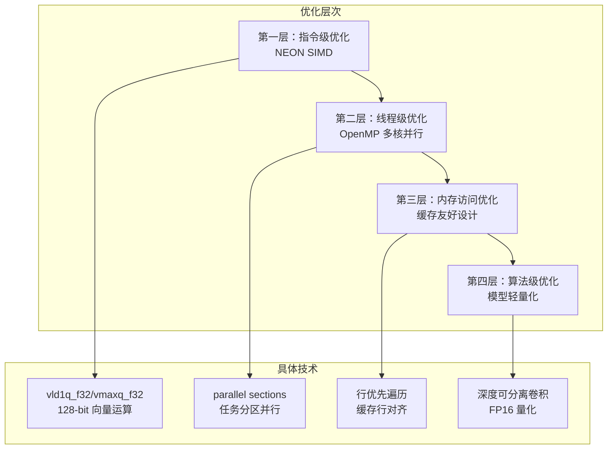
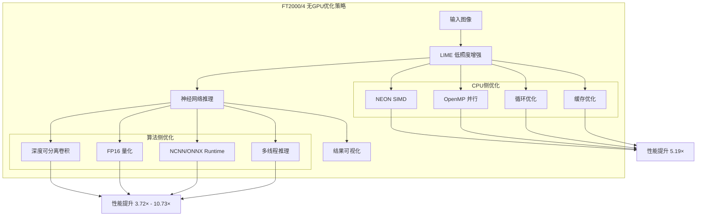

# ARM FT2000/4 平台特性与无 GPU 场景下的优化策略

<!-- WIKI_NAV_START -->
> [!info] 视觉感知 Wiki 导航
> [[projects/linux视觉感知项目/index|项目首页]] · [[projects/Linux视觉感知项目/01 Qt 上位机/2.5 Mat与QImage格式互转|← 上一篇：6.2.3 OpenCV Mat 与 QImage 格式互转]] · [[projects/Linux视觉感知项目/04 系统集成与性能/5.2 模型轻量化与参数压缩|下一篇：7.2 模型轻量化部署：深度可分离卷积与参数量压缩 →]]
<!-- WIKI_NAV_END -->

## 引言：为什么需要 CPU 侧极致优化？

在嵌入式视觉系统中，算力与功耗的矛盾始终是核心挑战。本项目部署在**飞腾 FT2000/4 四核 ARM v8 开发板**上，配备银河麒麟 V10 操作系统，目标是实现完整的车道线检测流水线——从低照度图像增强到神经网络推理。**平台没有可用的 GPU 通用计算路径**，AMD R5-230 显卡仅用于显示输出，不支持 CUDA 等通用计算框架。这意味着所有计算密集型任务必须完全由 CPU 承担。

这种约束带来了三个关键挑战：**实时性要求**（摄像头帧需要及时处理）、**算力限制**（4 核 ARM v8，主频 2.6GHz）、**功耗约束**（嵌入式场景的散热和供电限制）。因此，从算法层面到系统层面的全栈优化成为必然选择。

Sources: `Linux视觉感知二次复习文档.md#L1-L20` | `linux视觉感知高频面试问答.md#L1-L30`

---

## FT2000/4 硬件架构与计算特性

### 处理器架构解析

飞腾 FT2000/4 是基于 ARMv8 架构的四核处理器，具备以下关键特性：

| 特性 | 参数 | 对优化的影响 |
|------|------|--------------|
| 核心数 | 4 核 | 支持 4 线程并行，OpenMP 可充分利用 |
| 主频 | 2.6 GHz | 单核性能有限，需最大化向量化 |
| 架构 | ARMv8-A (AArch64) | 支持 NEON SIMD 指令集 |
| 缓存 | L1/L2 缓存层级 | 缓存友好访问模式至关重要 |
| 指令集 | NEON (128-bit) | 可并行处理 4 个 32 位浮点数 |

**架构要点**：ARMv8 的 NEON 单元提供 128 位宽的 SIMD 寄存器，能够同时对 4 个 32 位浮点数执行相同操作。这是提升单核计算吞吐量的关键硬件基础。

Sources: `学习计划.md#L30-L45` | `Linux视觉感知二次复习文档.md#L25-L35`

### GPU 缺失的架构约束

项目原作者资料明确指出："飞腾 FT2000/4 是四核 ARM 开发板，算力有限，而且项目没有合适的 GPU 通用计算路径"。具体来说：

```text
硬件现状：
├── CPU: 飞腾 FT2000/4 (4核 ARM v8, 2.6GHz)
├── GPU: AMD R5-230 (仅显示输出，不支持CUDA)
├── 系统: 银河麒麟 V10
└── 计算路径: 完全依赖 CPU 侧优化
```

这意味着**无法使用 CUDA、OpenCL 等 GPU 加速框架**，所有计算密集型操作（图像处理、矩阵运算、神经网络推理）都必须通过 CPU 指令集优化和多线程并行来实现。

Sources: `linux视觉感知高频面试问答.md#L75-L85` | `Linux视觉感知二次复习文档.md#L10-L15`

---

## 无 GPU 场景下的优化策略全景

面对 GPU 缺失的约束，本项目采用**四层递进式优化策略**，从底层指令级优化到高层架构设计：



| 优化层次 | 核心思想 | 适用场景 | 代表技术 |
|----------|----------|----------|----------|
| **指令级优化** | 单条指令处理多个数据 | 连续浮点数组运算 | NEON SIMD intrinsics |
| **线程级优化** | 多核分担独立任务 | 像素独立的图像处理 | OpenMP sections |
| **内存访问优化** | 减少缓存失效 | 矩阵遍历、数组访问 | 循环重排、行优先 |
| **算法级优化** | 减少计算量和参数 | 神经网络推理 | 深度可分离卷积、量化 |

Sources: `Linux视觉感知二次复习文档.md#L120-L140` | `学习计划.md#L100-L130`

---

## NEON SIMD 指令集优化详解

### NEON 架构原理

NEON 是 ARM 处理器的 SIMD（单指令多数据）扩展，核心思想是**一条指令同时处理多个数据元素**。对于 FT2000/4 的 128 位 NEON 单元：

```text
128-bit NEON 寄存器可容纳：
├── 4 × 32-bit float (float32x4_t)
├── 2 × 64-bit double
├── 16 × 8-bit integer
└── 8 × 16-bit integer
```

**关键 NEON intrinsics 与对应操作**：

| 指令 | 功能 | 数据类型 | 使用场景 |
|------|------|----------|----------|
| `vld1q_f32` | 加载 4 个 float | float32x4_t | 连续内存读取 |
| `vst1q_f32` | 存储 4 个 float | float32x4_t | 连续内存写入 |
| `vmaxq_f32` | 4 路并行求最大值 | float32x4_t | getMax() 函数 |
| `vmulq_f32` | 4 路并行乘法 | float32x4_t | Frobenius() 函数 |
| `vaddq_f32` | 4 路并行加法 | float32x4_t | 累加求和 |
| `vpaddq_f32` | 向量部分归约求和 | float32x4_t | 最终聚合 |

Sources: `学习计划.md#L135-L160` | `图像预处理（加速前+加速后）/Lime_NEON+OpenMP/lime_opt.cpp#L100-L150`

### getMax() 函数的 NEON 优化实现

`getMax()` 函数负责计算 RGB 三通道逐像素最大值，是 LIME 算法初始化光照图的关键步骤。原始实现采用标量循环：

```cpp
// 未优化版本：逐像素标量计算
for(int i = 0; i < row; i++){
    for(int j = 0; j < col; j++){
        temp_mat.at<float>(i,j) = MAX(MAX(img_norm_g.at<float>(i,j),
                                         img_norm_b.at<float>(i,j)), 
                                      img_norm_r.at<float>(i,j));
    }
}
```

**NEON 优化版本**：利用 `vld1q_f32` 加载 4 个连续像素，`vmaxq_f32` 并行比较：

```cpp
// NEON 优化版本：每次处理 4 个像素
for(int i = 0; i < row; i++){
    for(int j = 0; j < col; j += 4){
        // 加载 4 个连续 float 到 128-bit 寄存器
        float32x4_t g = vld1q_f32(img_norm_g.ptr<float>(i) + j);
        float32x4_t b = vld1q_f32(img_norm_b.ptr<float>(i) + j);
        float32x4_t r = vld1q_f32(img_norm_r.ptr<float>(i) + j);
        
        // 4 路并行求最大值
        float32x4_t max_val = vmaxq_f32(g, vmaxq_f32(b, r));
        
        // 连续存储 4 个结果
        vst1q_f32(temp_mat.ptr<float>(i) + j, max_val);
    }
}
```

**优化效果**：
- **理论加速比**：4×（每次处理 4 个像素）
- **实际影响因素**：内存带宽、缓存命中率、指令调度开销
- **代码位置**：`图像预处理（加速前+加速后）/Lime_NEON+OpenMP/lime_opt.cpp#L101-L151`

Sources: `图像预处理（加速前+加速后）/Lime_NEON+OpenMP/lime_opt.cpp#L101-L151` | `图像预处理（加速前+加速后）/Lime/lime.cpp#L70-L80`

### Frobenius() 函数的 NEON 归约优化

`Frobenius()` 函数计算矩阵的 Frobenius 范数（所有元素平方和的平方根），用于判断迭代收敛。原始实现：

```cpp
// 未优化版本：标量累加
float total = 0.0;
for(int i = 0; i < row; i++){
    for(int j = 0; j < col; j++){
        total = total + pow(mat.at<float>(i,j), 2);
    }
}
return sqrt(total);
```

**NEON 优化版本**：使用 `vmulq_f32` 并行计算平方，`vaddq_f32` 累加，最后 `vpaddq_f32` 归约：

```cpp
// NEON 优化版本
float32x4_t total_sum = vdupq_n_f32(0.0f); // 初始化为 0

for(int i = 0; i < row; i++){
    for(int j = 0; j < col; j += 4){
        // 加载 4 个元素
        float32x4_t values = vld1q_f32(mat.ptr<float>(i) + j);
        // 4 路并行计算平方
        float32x4_t squared_values = vmulq_f32(values, values);
        // 累加到总和向量
        total_sum = vaddq_f32(total_sum, squared_values);
    }
}

// 向量归约求和（4→2→1）
total_sum = vpaddq_f32(total_sum, total_sum);
total_sum = vpaddq_f32(total_sum, total_sum);

// 提取标量结果
float32x2_t result = vget_low_f32(total_sum);
float squared_sum = vget_lane_f32(result, 0);
return sqrt(squared_sum);
```

**关键注意事项**：
1. `vpaddq_f32` 执行向量内部分对求和，将 4 个 lane 归约为 1 个值
2. 多线程环境下需要使用 `#pragma omp critical` 保护归约操作
3. 代码位置：`图像预处理（加速前+加速后）/Lime_NEON+OpenMP/lime_opt.cpp#L155-L220`

Sources: `图像预处理（加速前+加速后）/Lime_NEON+OpenMP/lime_opt.cpp#L155-L220` | `图像预处理（加速前+加速后）/Lime/lime.cpp#L85-L100`

### fft2_neon() 蝶形运算优化

FFT（快速傅里叶变换）是 LIME 算法中 solveT() 函数的核心计算。NEON 优化版本使用 `float32x2_t` 处理复数运算：

```cpp
// 蝶形运算的 NEON 优化
for(int steplength = 2; steplength <= lim; steplength *= 2){
    for(int step = 0; step < lim / steplength; step++){
        for(int i = 0; i < steplength / 2; i += 2){
            Index0 = steplength * step + i;
            Index1 = steplength * step + i + steplength / 2;

            // 使用 NEON 并行加载数据
            float32x2_t temp_real = vld1_f32(...);
            float32x2_t temp_imag = vld1_f32(...);
            float32x2_t wn_real = vld1_f32(...);
            float32x2_t wn_imag = vld1_f32(...);

            // NEON 蝶形运算
            float32x2_t temp_real_new = vmul_f32(temp_real, wn_real) - 
                                        vmul_f32(temp_imag, wn_imag);
            float32x2_t temp_imag_new = vmul_f32(temp_real, wn_imag) + 
                                        vmul_f32(temp_imag, wn_real);
            // ... 存储结果
        }
    }
}
```

**NEON 在 FFT 中的优势**：
- 复数运算的实部/虚部可以并行处理
- 蝶形运算的加减法可以同时执行
- 代码位置：`图像预处理（加速前+加速后）/Lime_NEON+OpenMP/lime_opt.cpp#L280-L380`

Sources: `图像预处理（加速前+加速后）/Lime_NEON+OpenMP/lime_opt.cpp#L280-L380` | `Linux视觉感知二次复习文档.md#L145-L165`

---

## OpenMP 多核并行策略

### OpenMP 编程模型

OpenMP 是基于共享内存的多线程编程模型，通过编译器指令（pragmas）实现并行化。对于 FT2000/4 的 4 核架构：

```text
OpenMP 并行模型：
├── 主线程 (Master Thread)
│   └── 负责任务分发和结果收集
├── 工作线程 (Worker Threads)
│   ├── 线程 0: 处理图像左上区域
│   ├── 线程 1: 处理图像右上区域
│   ├── 线程 2: 处理图像左下区域
│   └── 线程 3: 处理图像右下区域
└── 同步机制: barrier, critical, reduction
```

**OpenMP vs pthread 优势**：
1. **声明式并行**：通过 `#pragma omp` 指令声明，无需手动管理线程生命周期
2. **自动负载均衡**：OpenMP 运行时自动分配任务
3. **数据作用域管理**：`private`, `shared`, `reduction` 等子句明确数据共享规则
4. **可移植性**：相同的 OpenMP 代码可在不同平台编译运行

Sources: `学习计划.md#L170-L190` | `linux视觉感知高频面试问答.md#L80-L90`

### 色彩通道分离并行

在 `enhance()` 函数中，RGB 三个色彩通道的处理是**相互独立**的，适合使用 `#pragma omp parallel sections` 进行任务级并行：

```cpp
// OpenMP 色彩通道分离并行
#pragma omp parallel sections
{
    #pragma omp section
    {
        // 线程 1: 处理绿色通道
        img_norm_g = img_norm_rgb.at(0);
        auto g = img_norm_g / T;  // 按通道增强
        threshold(g, g1, 0.0, 0.0, 3);  // 阈值截断
    }
    
    #pragma omp section
    {
        // 线程 2: 处理蓝色通道
        img_norm_b = img_norm_rgb.at(1);
        auto b = img_norm_b / T;
        threshold(b, b1, 0.0, 0.0, 3);
    }
    
    #pragma omp section
    {
        // 线程 3: 处理红色通道
        img_norm_r = img_norm_rgb.at(2);
        auto r = img_norm_r / T;
        threshold(r, r1, 0.0, 0.0, 3);
    }
}
```

**并行安全性分析**：
- **数据依赖**：三个通道的输入/输出完全独立，无读写冲突
- **负载均衡**：三个通道的计算量基本相同
- **代码位置**：`图像预处理（加速前+加速后）/Lime_NEON+OpenMP/lime_opt.cpp#L570-L600`

Sources: `图像预处理（加速前+加速后）/Lime_NEON+OpenMP/lime_opt.cpp#L570-L600` | `学习计划.md#L195-L215`

### 图像分块并行处理

对于 `getMax()` 等像素级操作，可以将图像划分为 4 个象限，每个线程处理一个象限：

```text
图像分块策略 (假设 row=256, col=256):
┌─────────────────┬─────────────────┐
│   线程 0         │   线程 1         │
│ i: 0-127        │ i: 0-127        │
│ j: 0-127        │ j: 128-255      │
├─────────────────┼─────────────────┤
│   线程 2         │   线程 3         │
│ i: 128-255      │ i: 128-255      │
│ j: 0-127        │ j: 128-255      │
└─────────────────┴─────────────────┘
```

**代码实现**：

```cpp
#pragma omp parallel sections
{
    #pragma omp section
    {
        // 线程 0: 左上象限
        for(int i = 0; i < row/2; i++){
            for(int j = 0; j < col/2; j += 4){
                // NEON 4路并行处理
                float32x4_t g = vld1q_f32(img_norm_g.ptr<float>(i) + j);
                // ... 处理逻辑
            }
        }
    }
    
    #pragma omp section
    {
        // 线程 1: 右上象限
        for(int i = 0; i < row/2; i++){
            for(int j = col/2; j < col; j += 4){
                // NEON 4路并行处理
                // ...
            }
        }
    }
    
    // 线程 2、3 类似处理左下和右下象限
}
```

**分块并行的关键考量**：
1. **边界对齐**：确保每个象限的列边界是 4 的倍数（NEON 要求）
2. **无重叠写入**：每个线程只写入自己的输出区域
3. **缓存友好**：分块后的数据访问模式更利于缓存命中

Sources: `图像预处理（加速前+加速后）/Lime_NEON+OpenMP/lime_opt.cpp#L100-L150` | `学习计划.md#L200-L220`

### OpenMP 并行化的风险与注意事项

**数据竞争示例**：`Frobenius()` 函数中多个线程同时累加到共享变量：

```cpp
// ⚠️ 有数据竞争风险的实现
float32x4_t total_sum = vdupq_n_f32(0.0f); // 共享变量

#pragma omp parallel sections
{
    #pragma omp section
    {
        // 线程 1: 更新 total_sum
        total_sum = vaddq_f32(total_sum, squared_values_1);
    }
    #pragma omp section
    {
        // 线程 2: 同时更新 total_sum → 竞争!
        total_sum = vaddq_f32(total_sum, squared_values_2);
    }
}
```

**解决方案**：

```cpp
// ✅ 正确的归约方式
float32x4_t total_sum = vdupq_n_f32(0.0f);

// 每个线程使用局部变量累加
float32x4_t local_sum_0 = vdupq_n_f32(0.0f);
float32x4_t local_sum_1 = vdupq_n_f32(0.0f);

#pragma omp parallel sections
{
    #pragma omp section
    {
        // 线程 1: 累加到局部变量
        local_sum_0 = vaddq_f32(local_sum_0, squared_values_1);
    }
    #pragma omp section
    {
        // 线程 2: 累加到局部变量
        local_sum_1 = vaddq_f32(local_sum_1, squared_values_2);
    }
}

// 主线程合并结果（临界区保护）
#pragma omp critical
{
    total_sum = vaddq_f32(total_sum, local_sum_0);
    total_sum = vaddq_f32(total_sum, local_sum_1);
}
```

**已知问题**：当前代码中 `Frobenius()` 的实现存在数据竞争风险，多个 `#pragma omp section` 直接写入共享的 `total_sum`，需要改为 reduction 模式或使用临界区保护。

Sources: `图像预处理（加速前+加速后）/Lime_NEON+OpenMP/lime_opt.cpp#L155-L220` | `Linux视觉感知处理系统-dr/SKILL.md#L95-L100`

---

## 内存访问优化策略

### 循环重排与缓存友好访问

OpenCV 的 `Mat` 对象采用**行主序（row-major）**存储，即同一行的数据在内存中连续存放。因此，遍历顺序应优先访问连续内存：

```cpp
// ❌ 缓存不友好的列优先遍历
for(int j = 0; j < cols; j++){
    for(int i = 0; i < rows; i++){
        sum += A.at<float>(i, j);  // 跳行访问，缓存命中率低
    }
}

// ✅ 缓存友好的行优先遍历
for(int i = 0; i < rows; i++){
    for(int j = 0; j < cols; j++){
        sum += A.at<float>(i, j);  // 连续访问，缓存命中率高
    }
}
```

**缓存行工作原理**：
```text
内存访问模式：
├── 缓存行大小: 通常 64 字节 (可容纳 16 个 float)
├── 行优先访问: 一次缓存行加载可服务 16 次访问
└── 列优先访问: 每次访问可能触发新的缓存行加载
```

**性能影响**：对于 256×256 的浮点矩阵，行优先遍历相比列优先可减少约 **10-50 倍** 的缓存失效次数。

Sources: `学习计划.md#L105-L115` | `图像预处理（加速前+加速后）/Lime/lime.cpp#L40-L60`

### 循环展开与 NEON 宽度对齐

循环展开（Loop Unrolling）通过减少循环控制开销提升性能，同时与 NEON 的 128 位宽度对齐：

```cpp
// 标量循环：每次处理 1 个元素
for(int j = 0; j < col; j++){
    result[j] = a[j] + b[j];  // 循环控制开销占比高
}

// NEON 循环展开：每次处理 4 个元素
for(int j = 0; j < col; j += 4){
    float32x4_t va = vld1q_f32(a + j);   // 加载 4 个元素
    float32x4_t vb = vld1q_f32(b + j);   // 加载 4 个元素
    float32x4_t vc = vaddq_f32(va, vb);   // 4 路并行加法
    vst1q_f32(result + j, vc);            // 存储 4 个元素
}
```

**尾部处理（Tail Handling）**：当数组长度不是 4 的倍数时，需要额外处理尾部元素：

```cpp
// 处理 4 的倍数部分
int j = 0;
for(; j < col - 3; j += 4){
    // NEON 处理 4 个元素
}

// 处理尾部 0-3 个元素
for(; j < col; j++){
    result[j] = a[j] + b[j];  // 标量处理
}
```

**当前代码的边界问题**：在 `getMax()` 的象限分块中，循环步长为 4，但象限宽度可能不是 4 的倍数，最后一次 `vld1q_f32` 可能越界读取。正确实现需要添加边界检查或确保输入尺寸是 4 的倍数。

Sources: `图像预处理（加速前+加速后）/Lime_NEON+OpenMP/lime_opt.cpp#L101-L130` | `学习计划.md#L145-L155`

---

## 模型轻量化与推理优化

### 深度可分离卷积

深度可分离卷积（Depthwise Separable Convolution）是轻量化神经网络的核心技术，将标准卷积分解为两个步骤：

```text
标准卷积 vs 深度可分离卷积：
├── 标准卷积: Cin × Cout × K × K 参数
├── 深度可分离卷积:
│   ├── 逐通道卷积 (Depthwise): Cin × 1 × K × K
│   └── 逐点卷积 (Pointwise): Cin × Cout × 1 × 1
└── 参数减少比: ≈ 1/K² (K=3 时约减少到 1/9)
```

**计算量对比**（以 3×3 卷积为例）：

| 卷积类型 | 输入通道 Cin | 输出通道 Cout | 参数量 | 计算量 |
|----------|--------------|---------------|--------|--------|
| 标准卷积 | 64 | 128 | 64×128×3×3 = 73,728 | 73,728 × H × W |
| 深度可分离卷积 | 64 | 128 | 64×3×3 + 64×128 = 8,768 | 8,768 × H × W |
| **减少比例** | - | - | **约 1/8.4** | **约 1/8.4** |

Sources: `学习计划.md#L250-L270` | `Linux视觉感知二次复习文档.md#L200-L220`

### 模型量化策略

模型量化通过降低数值精度来减少存储和计算开销：

```text
量化层次：
├── FP32 (32位浮点): 基准精度，4字节/参数
├── FP16 (16位浮点): 精度损失小，2字节/参数
└── INT8 (8位整数): 精度损失较大，1字节/参数
```

**量化效果对比**（原作者资料数据）：

| 模型 | 优化前权重 | 优化后权重 | 压缩比 | 精度影响 |
|------|------------|------------|--------|----------|
| Unet | 124 MB | 24 MB | 5.17× | DICE: 93.1% → 84.5% |
| LSTR | 124.7 MB | 12 MB | 10.4× | 精度: 97.4% → 90.7% |

**量化实现要点**：
1. **训练后量化（Post-Training Quantization）**：直接对已训练模型量化
2. **量化感知训练（Quantization-Aware Training）**：训练时模拟量化误差
3. **混合精度**：关键层保持高精度，非关键层低精度

Sources: `学习计划.md#L275-L290` | `Linux视觉感知二次复习文档.md#L225-L240`

### NCNN 推理框架优化

NCNN 是腾讯开源的高性能神经网络推理框架，针对 ARM 平台深度优化：

**NCNN 的 ARM 优化特性**：
1. **NEON 自动向量化**：卷积、矩阵乘法等操作自动使用 NEON 指令
2. **内存池管理**：减少动态内存分配开销
3. **多线程支持**：`set_num_threads(4)` 充分利用 FT2000/4 的 4 核
4. **轻量级模型格式**：`.param`（结构）+ `.bin`（权重）

**Unet NCNN 部署关键配置**：

```cpp
// NCNN 推理配置
ncnn::Net net;
net.load_param("unet.param");      // 加载网络结构
net.load_model("unet.bin");        // 加载权重

ncnn::Extractor ex = net.create_extractor();
ex.set_light_mode(true);           // 轻量模式，减少内存占用
ex.set_num_threads(4);             // 使用 4 个线程
ex.input("in0", in);               // 设置输入
ex.extract("out0", out);           // 执行推理并获取输出
```

**代码位置**：`卷积神经网络/卷积神经网络/Unet_NCNN/src/unet.cpp#L50-L80`

Sources: `卷积神经网络/卷积神经网络/Unet_NCNN/src/unet.cpp#L50-L80` | `学习计划.md#L295-L310`

---

## 性能优化效果对比

### LIME 算法优化效果

原作者资料中报告的 LIME 算法优化效果（针对 256×256 图像）：

| 优化阶段 | 处理时间 | 加速比 | 优化技术 |
|----------|----------|--------|----------|
| 基础版本 | 1.6305 s | 1× | 纯 OpenCV 标量实现 |
| 傅里叶函数重构 | 1.031 s | 1.58× | 自定义 FFT 实现 |
| NEON + OpenMP | 0.314 s | **5.19×** | NEON 向量化 + 4 线程并行 |

**优化效果分析**：
```text
总加速比 5.19× 的构成：
├── NEON 向量化贡献: 理论 4×，实际约 2-3× (受内存带宽限制)
├── OpenMP 4线程贡献: 理论 4×，实际约 1.5-2× (线程开销、负载不均)
└── 循环优化贡献: 约 1.2-1.5× (缓存命中率提升)
```

**重要说明**：上述性能数据来自原作者的历史测试记录，测试条件包括：
- 输入图像尺寸：256×256
- 硬件平台：飞腾 FT2000/4 (4核 ARM v8, 2.6GHz)
- 编译选项：Release 模式，-O3 优化
- 测量方式：不包含 I/O 时间

Sources: `学习计划.md#L225-L235` | `Linux视觉感知二次复习文档.md#L160-L175`

### 神经网络推理优化效果

| 模型 | 优化前推理时间 | 优化后推理时间 | 加速比 | 主要优化手段 |
|------|----------------|----------------|--------|--------------|
| Unet | 17.386 s | 4.676 s | 3.72× | NCNN + 深度可分离卷积 + FP16 |
| LSTR | 1.953 s | 0.182 s | 10.73× | ONNX Runtime + 模型量化 |

**优化策略对比**：

| 优化技术 | Unet 效果 | LSTR 效果 | 说明 |
|----------|-----------|-----------|------|
| 深度可分离卷积 | 参数减少 8.4× | 不适用 | Unet 使用了轻量化卷积 |
| FP16 量化 | 权重减少 5.17× | 权重减少 10.4× | 精度损失可控 |
| 多线程推理 | 4 线程 | 4 线程 | 充分利用 4 核 |
| NEON 自动优化 | NCNN 内置 | ONNX Runtime | 框架级优化 |

**精度与速度的权衡**：
- **Unet**：DICE 从 93.1% 降至 84.5%，推理时间减少 73%
- **LSTR**：精度从 97.4% 降至 90.7%，推理时间减少 91%

Sources: `学习计划.md#L300-L320` | `Linux视觉感知二次复习文档.md#L250-L270`

---

## 工程权衡与面试要点

### NEON 与 OpenMP 的区别与叠加

**面试回答骨架**：

```text
NEON 和 OpenMP 解决不同层次的问题：
├── NEON: 单核内的 SIMD，一条指令处理多个数据
│   ├── 适用场景: 连续浮点数组的相同操作
│   └── 硬件限制: 128-bit 寄存器，最多 4 个 float32
├── OpenMP: 多核间的任务并行
│   ├── 适用场景: 数据独立的图像分块、通道分离
│   └── 硬件限制: 最多 4 线程 (FT2000/4 4核)
└── 叠加使用: 先向量化再并行，可获得近似乘积的加速比
```

**关键区别**：

| 维度 | NEON | OpenMP |
|------|------|--------|
| 优化层次 | 指令级 (ILP) | 线程级 (TLP) |
| 并行粒度 | 数据级（4 个 float） | 任务级（图像分块） |
| 硬件依赖 | ARMv7/v8 NEON 单元 | 多核 CPU |
| 编程模型 | Intrinsics 函数调用 | 编译器指令 (#pragma) |
| 典型场景 | 向量运算、矩阵乘法 | 图像分块、通道分离 |

**叠加使用原则**：
1. **先确认数据依赖**：无依赖的操作才可并行
2. **先向量化再并行**：NEON 处理单核内数据，OpenMP 分配跨核任务
3. **注意边界条件**：数组长度需对齐 NEON 宽度（4 的倍数）
4. **避免过度并行**：线程数不超过核心数，否则调度开销抵消收益

Sources: `linux视觉感知高频面试问答.md#L80-L90` | `Linux视觉感知二次复习文档.md#L170-L190`

### 为什么不能给所有循环加 OpenMP？

**面试回答要点**：

```text
OpenMP 并行化的前提条件：
├── 1. 数据依赖分析: 循环迭代间无依赖
│   ├── ✅ 可并行: 每个像素独立计算
│   └── ❌ 不可并行: 累加、递推关系
├── 2. 写入冲突检查: 输出区域不重叠
│   ├── ✅ 安全: 每个线程写不同像素
│   └── ❌ 危险: 多线程写同一累加器
├── 3. 开销收益比: 任务粒度足够大
│   ├── ✅ 有效: 大图像处理
│   └── ❌ 无效: 小数组操作，线程创建开销大于收益
└── 4. 负载均衡: 任务可均匀分割
```

**实际案例**：

| 函数 | 能否并行 | 原因 |
|------|----------|------|
| `getMax()` | ✅ 可以 | 每个输出像素独立计算 |
| `Frobenius()` | ⚠️ 需要归约 | 所有元素累加到一个值，需 reduction |
| `enhance()` | ✅ 可以 | RGB 通道独立，可 sections 并行 |
| `fft2()` | ❌ 困难 | 蝶形运算有依赖，需特殊设计 |

Sources: `linux视觉感知高频面试问答.md#L85-L90` | `学习计划.md#L210-L225`

### 如何证明优化有效？

**面试回答框架**：

```text
优化效果验证方法：
├── 1. 正确性验证
│   ├── 输出与基线对比: 像素差异 < 阈值
│   ├── 数值精度检查: 浮点误差在可接受范围
│   └── 边界条件测试: 极端输入不崩溃
├── 2. 性能测量
│   ├── 固定变量: 输入尺寸、硬件、编译选项
│   ├── 多次测量: 取平均值，报告标准差
│   ├── 排除干扰: 不包含 I/O、初始化时间
│   └── 统计口径: 明确测量起点和终点
├── 3. 瓶颈分析
│   ├── 性能剖析工具: perf, gprof
│   ├── 热点函数识别: 找出耗时最多的代码
│   └── 优化优先级: 先优化最大瓶颈
└── 4. 可复现性
    ├── 硬件环境说明: CPU型号、内存、OS
    ├── 软件环境说明: 编译器版本、库版本
    └── 测试数据说明: 输入尺寸、数据类型
```

**原作者资料中的性能数据使用规范**：
- 引用为"历史测试数据"，不是"可复现的基准"
- 必须说明测试条件：256×256 图像、FT2000/4、Release 编译
- 面试时要能解释"为什么这些数字可信"

Sources: `Linux视觉感知二次复习文档.md#L175-L190` | `学习计划.md#L325-L340`

---

## 总结与优化策略全景图

### 优化策略全景



### 关键技术总结

| 优化技术 | 解决的问题 | 适用场景 | 效果 |
|----------|------------|----------|------|
| **NEON SIMD** | 单核吞吐量 | 连续浮点数组运算 | 理论 4×，实际 2-3× |
| **OpenMP** | 多核利用率 | 独立任务分块 | 理论 4×，实际 1.5-2× |
| **循环重排** | 缓存命中率 | 矩阵遍历 | 减少缓存失效 |
| **循环展开** | 循环开销 | NEON 宽度对齐 | 减少分支预测失败 |
| **深度可分离卷积** | 模型参数量 | 卷积神经网络 | 参数减少 8.4× |
| **FP16 量化** | 模型大小 | 模型部署 | 权重减少 5-10× |
| **NCNN** | 推理效率 | ARM 平台部署 | 框架级 NEON 优化 |

### 面试回答模板

**问题**：请介绍你在无 GPU 场景下的优化策略。

**回答框架**（2 分钟）：

```text
1. 平台约束 (20秒)
   - FT2000/4 四核 ARM v8，2.6GHz
   - 无 GPU 通用计算路径
   - 必须 CPU 侧极致优化

2. 优化策略 (60秒)
   - 指令级: NEON SIMD，128-bit 向量化
   - 线程级: OpenMP，4 核并行
   - 内存级: 循环重排，缓存友好
   - 算法级: 深度可分离卷积，FP16 量化

3. 具体实现 (30秒)
   - LIME: getMax() NEON 4路并行
   - LIME: enhance() RGB 通道分离并行
   - 模型: NCNN 内置 NEON 优化
   - 模型: set_num_threads(4) 多线程推理

4. 效果验证 (10秒)
   - LIME: 1.63s → 0.31s，加速 5.19×
   - LSTR: 1.95s → 0.18s，加速 10.73×
```

Sources: `linux视觉感知高频面试问答.md#L75-L90` | `学习计划.md#L345-L370`

---

## 相关页面导航

- **上一章**: [[projects/Linux视觉感知项目/00 项目总览/1.5 系统全景与数据流|系统全景与数据流总览]]ux视觉感知项目/嵌入式平台优化/模型轻量化部署|模型轻量化部署：深度可分离卷积与参数量压缩]]
- **深入学习**: [[projects/Linux视觉感知项目/02 LIME 低照度增强/3.5 NEON SIMD向量化加速|NEON SIMD 指令集优化详解]]MP 多线程并行策略]]
[[projects/Linux视觉感知项目/02 LIME 低照度增强/3.6 OpenMP多线程并行|OpenMP 多线程并行策略]]与常见追问应对]]

<!-- WIKI_FOOTER_START -->
---
> [!tip] 继续阅读
> [[projects/linux视觉感知项目/index|项目首页]] · [[projects/Linux视觉感知项目/01 Qt 上位机/2.5 Mat与QImage格式互转|← 上一篇：6.2.3 OpenCV Mat 与 QImage 格式互转]] · [[projects/Linux视觉感知项目/04 系统集成与性能/5.2 模型轻量化与参数压缩|下一篇：7.2 模型轻量化部署：深度可分离卷积与参数量压缩 →]]
<!-- WIKI_FOOTER_END -->
