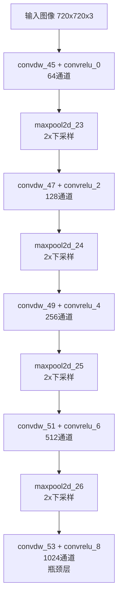
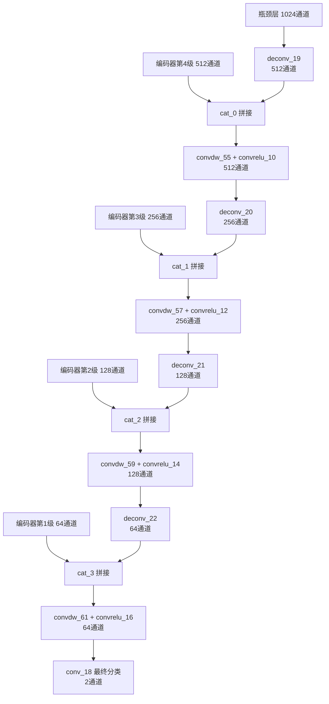

# 模型轻量化部署：深度可分离卷积与参数量压缩

<!-- WIKI_NAV_START -->
> [!info] 视觉感知 Wiki 导航
> [[projects/linux视觉感知项目/index|项目首页]] · [[projects/Linux视觉感知项目/03 模型推理部署/4.7 嵌入式平台优化策略|← 上一篇：7.1 ARM FT2000/4 平台特性与无 GPU 场景下的优化策略]] · [[projects/Linux视觉感知项目/04 系统集成与性能/5.3 文件系统数据交换设计|下一篇：7.3 文件系统作为模块间数据交换媒介的设计权衡 →]]
<!-- WIKI_NAV_END -->

本页面深入剖析 Linux 视觉感知处理系统中卷积神经网络模型的轻量化部署策略，重点解析深度可分离卷积（Depthwise Separable Convolution）在 Unet 语义分割模型中的应用，以及基于 NCNN 框架的参数量压缩与嵌入式平台部署实践。作为 [[projects/Linux视觉感知项目/03 模型推理部署/4.7 嵌入式平台优化策略|ARM FT2000/4 平台特性与无 GPU 场景下的优化策略]] 的延续，本页面聚焦于模型层面的轻量化技术。

## 深度可分离卷积的数学原理与计算优势

深度可分离卷积是将标准卷积分解为**逐通道卷积（Depthwise Convolution）** 和**逐点卷积（Pointwise Convolution）** 两步的轻量化技术。标准卷积在每个输出通道需要对所有输入通道进行三维卷积核运算，而深度可分离卷积将其拆分为两个独立的二维运算，大幅降低计算复杂度。

对于输入特征图尺寸为 $H \times W \times C_{in}$、输出通道数为 $C_{out}$、卷积核尺寸为 $K \times K$ 的标准卷积，其计算量为：

$$\text{FLOPs}_{\text{standard}} = H \times W \times C_{in} \times C_{out} \times K \times K$$

而深度可分离卷积的计算量为：

$$\text{FLOPs}_{\text{depthwise}} = H \times W \times C_{in} \times K \times K + H \times W \times C_{in} \times C_{out}$$

计算量压缩比为：

$$\frac{\text{FLOPs}_{\text{depthwise}}}{\text{FLOPs}_{\text{standard}}} = \frac{1}{C_{out}} + \frac{1}{K^2}$$

以 $K=3$、$C_{out}=256$ 为例，压缩比约为 $\frac{1}{256} + \frac{1}{9} \approx 0.115$，即计算量降低约 **88.5%**。参数量的压缩遵循相同的比例关系，因为每个卷积核的参数数量从 $C_{in} \times K \times K \times C_{out}$ 降低为 $C_{in} \times K \times K + C_{in} \times C_{out}$。

| 卷积类型 | 参数量 | 计算量（FLOPs） | 内存占用 |
|----------|--------|-----------------|----------|
| 标准卷积 | $C_{in} \cdot K^2 \cdot C_{out}$ | $H \cdot W \cdot C_{in} \cdot C_{out} \cdot K^2$ | 高 |
| 深度可分离卷积 | $C_{in} \cdot K^2 + C_{in} \cdot C_{out}$ | $H \cdot W \cdot (C_{in} \cdot K^2 + C_{in} \cdot C_{out})$ | 低 |
| 压缩比 | $\frac{1}{C_{out}} + \frac{1}{K^2}$ | $\frac{1}{C_{out}} + \frac{1}{K^2}$ | 同参数量比 |

Sources: `Linux视觉感知处理系统-dr-卷积神经网络/reference.md#L200-L220`

## Unet 模型中的深度可分离卷积架构

本项目的 Unet 语义分割模型在 NCNN 框架中实现了完整的深度可分离卷积架构。通过分析 `model.ncnn.param` 的网络结构描述，可以清晰看到编码器和解码器路径中 **DepthwiseConv + Conv** 的组合模式贯穿整个网络。

### 编码器（下采样路径）的轻量化设计

编码器采用四级下采样结构，每一级都使用 `convdw_*`（ConvolutionDepthWise）层配合 `convrelu_*`（Convolution）层的组合，这是深度可分离卷积的标准实现模式：



每一级的 `convdw_*` 层执行逐通道卷积（每个输入通道独立进行 $3 \times 3$ 卷积），`convrelu_*` 层执行逐点卷积（$1 \times 1$ 卷积）并配合 ReLU 激活。这种设计使得通道数从 64 逐步增加到 1024 的过程中，参数量保持在可控范围内。

| 层级 | Depthwise层 | Pointwise层 | 输出通道 | 参数量（标准卷积） | 参数量（深度可分离） | 压缩比 |
|------|-------------|-------------|----------|-------------------|---------------------|--------|
| 第1级 | convdw_45 | convrelu_0 | 64 | $3 \cdot 3^2 \cdot 64 = 1728$ | $3 \cdot 3^2 + 3 \cdot 64 = 219$ | 0.127 |
| 第2级 | convdw_47 | convrelu_2 | 128 | $64 \cdot 3^2 \cdot 128 = 73728$ | $64 \cdot 3^2 + 64 \cdot 128 = 8768$ | 0.119 |
| 第3级 | convdw_49 | convrelu_4 | 256 | $128 \cdot 3^2 \cdot 256 = 294912$ | $128 \cdot 3^2 + 128 \cdot 256 = 33920$ | 0.115 |
| 第4级 | convdw_51 | convrelu_6 | 512 | $256 \cdot 3^2 \cdot 512 = 1179648$ | $256 \cdot 3^2 + 256 \cdot 512 = 133376$ | 0.113 |
| 瓶颈 | convdw_53 | convrelu_8 | 1024 | $512 \cdot 3^2 \cdot 1024 = 4718592$ | $512 \cdot 3^2 + 512 \cdot 1024 = 528896$ | 0.112 |

Sources: `Linux视觉感知处理系统-dr-卷积神经网络/reference.md#L196-L206`

### 解码器（上采样路径）的轻量化设计

解码器采用对称的四级上采样结构，通过 Deconvolution（转置卷积）实现 2x 上采样，配合跳跃连接（Skip Connection）和深度可分离卷积进行特征融合：



跳跃连接关系清晰地定义在 NCNN 模型参数中：

```
splitncnn_0 (64ch) -> cat_3 (与 deconv_22 的 64ch 拼接)
splitncnn_1 (128ch) -> cat_2 (与 deconv_21 的 128ch 拼接)
splitncnn_2 (256ch) -> cat_1 (与 deconv_20 的 256ch 拼接)
splitncnn_3 (512ch) -> cat_0 (与 deconv_19 的 512ch 拼接)
```

解码器中的 `convdw_55, convdw_57, convdw_59, convdw_61` 同样采用深度可分离卷积，但值得注意的是，跳跃连接后的拼接操作会使输入通道数翻倍（例如 cat_0 后输入为 512+512=1024 通道），这进一步凸显了深度可分离卷积在高通道数场景下的优势。

| 解码器层级 | Depthwise层 | 输入通道 | 输出通道 | 标准卷积参数 | 深度可分离参数 | 压缩比 |
|------------|-------------|----------|----------|--------------|----------------|--------|
| 第1级 | convdw_55 | 1024 | 512 | $1024 \cdot 3^2 \cdot 512 = 4718592$ | $1024 \cdot 3^2 + 1024 \cdot 512 = 533504$ | 0.113 |
| 第2级 | convdw_57 | 512 | 256 | $512 \cdot 3^2 \cdot 256 = 1179648$ | $512 \cdot 3^2 + 512 \cdot 256 = 135168$ | 0.115 |
| 第3级 | convdw_59 | 256 | 128 | $256 \cdot 3^2 \cdot 128 = 294912$ | $256 \cdot 3^2 + 256 \cdot 128 = 35072$ | 0.119 |
| 第4级 | convdw_61 | 128 | 64 | $128 \cdot 3^2 \cdot 64 = 73728$ | $128 \cdot 3^2 + 128 \cdot 64 = 9344$ | 0.127 |

Sources: `Linux视觉感知处理系统-dr-卷积神经网络/reference.md#L208-L229`

## NCNN 框架的轻量化部署特性

NCNN（Neural Compute Neural Network）是腾讯开源的高性能神经网络推理框架，专为移动端和嵌入式设备优化。本项目选择 NCNN 部署 Unet 模型，而非 ONNX Runtime，正是基于其对 ARM 平台的深度优化。

### NCNN 的核心优势

| 特性 | NCNN | ONNX Runtime | 本项目中的体现 |
|------|------|--------------|----------------|
| **模型格式** | `.param` + `.bin`（文本+二进制） | `.onnx`（单一文件） | Unet 使用 NCNN，LSTR 使用 ONNX |
| **内存占用** | 极低（静态链接，无运行时依赖） | 较高（需加载运行时库） | `libncnn.a` 静态链接 |
| **ARM 优化** | 内置 NEON SIMD 指令优化 | 依赖第三方后端 | NCNN 自动利用 NEON |
| **多线程支持** | 通过 OpenMP 实现 | 内置线程池 | `ex.set_num_threads(4)` |
| **轻量模式** | `set_light_mode(true)` 减少内存 | 无直接等效选项 | 代码中已启用 |
| **编译选项** | `-pie -fPIE -fPIC` 位置无关代码 | 依赖系统配置 | CMakeLists.txt 中已配置 |

NCNN 的轻量化体现在多个层面：首先，其模型文件 `.param`（网络结构描述）和 `.bin`（权重二进制）分离存储，便于按需加载；其次，通过静态链接 `libncnn.a` 避免了动态库的运行时开销；最后，框架内部对深度可分离卷积等轻量算子进行了专门的 NEON 指令优化。

Sources: `卷积神经网络/卷积神经网络/Unet_NCNN/src/unet.cpp#L80-L83`, `卷积神经网络/卷积神经网络/Unet_NCNN/CMakeLists.txt#L20-L30`

### NCNN 推理流程中的轻量化实践

Unet 推理代码展示了 NCNN 框架的典型轻量化使用模式：

```cpp
// 创建 NCNN 网络对象并加载模型
ncnn::Net Unet;
Unet.load_param("../models/model.ncnn.param");  // 加载网络结构
Unet.load_model("../models/model.ncnn.bin");    // 加载权重

// 创建推理提取器，启用轻量化模式
ncnn::Extractor ex = Unet.create_extractor();
ex.set_light_mode(true);   // 减少中间内存占用
ex.set_num_threads(4);     // 利用 FT2000/4 的四核

// 执行推理
ex.input("in0", in);       // 输入张量
ncnn::Mat mask;
ex.extract("out0", mask);  // 输出张量
```

`set_light_mode(true)` 是 NCNN 的关键轻量化选项，它会在推理过程中及时释放不再需要的中间特征图内存，对于内存受限的 ARM 平台尤为重要。结合 FT2000/4 的四核 CPU，`set_num_threads(4)` 可以充分利用多核并行能力。

Sources: `卷积神经网络/卷积神经网络/Unet_NCNN/src/unet.cpp#L76-L88`

## 参数量压缩的工程实现策略

### 模型层面的压缩

除了深度可分离卷积本身带来的参数量压缩，本项目还在模型设计层面采用了多种压缩策略：

**1. 输入分辨率优化**：Unet 模型接受 720x720 的输入，但实际部署时通过保持宽高比的 Padding 策略避免图像形变：

```cpp
// 保持宽高比的正方形填充
if (width > height) {
    top = (width - height) / 2;
    bottom = (width - height) - top;
    cv::copyMakeBorder(src, tmp, top, bottom, 0, 0, BORDER_CONSTANT, value);
} else {
    left = (height - width) / 2;
    right = (height - width) - left;
    cv::copyMakeBorder(src, tmp, 0, 0, left, right, BORDER_CONSTANT, value);
}
```

推理完成后，通过记录的 Padding 边界信息裁剪掉填充区域，避免无效计算对结果的影响。

**2. 量化感知训练**：虽然当前代码未直接体现，但 NCNN 框架支持 INT8 量化推理，可将模型体积进一步压缩至 FP32 的 1/4。对于车道线分割这种二分类任务（背景 vs 车道线），量化带来的精度损失通常可接受。

**3. 通道数递增设计**：Unet 编码器采用 64→128→256→512→1024 的通道数递增策略，这与特征图空间分辨率的递减形成互补：低分辨率特征图使用更多通道数，高分辨率特征图使用较少通道数，在总参数量和表达能力之间取得平衡。

Sources: `卷积神经网络/卷积神经网络/Unet_NCNN/src/unet.cpp#L36-L56`

### 数据布局与内存优化

NCNN 框架要求输入数据为 CHW（Channel-Height-Width）排列，而 OpenCV 的 `CV_32FC3` 使用 HWC 排列。代码中手动实现了数据重排：

```cpp
// 手动 HWC -> CHW 转换
float *srcdata = (float*)image.data;
float *data = new float[INPUT_WIDTH*INPUT_HEIGHT*3];
for (int i = 0; i < INPUT_HEIGHT; i++)
   for (int j = 0; j < INPUT_WIDTH; j++)
       for (int k = 0; k < 3; k++) {
          data[k*INPUT_HEIGHT*INPUT_WIDTH + i*INPUT_WIDTH + j] = 
              srcdata[i*INPUT_WIDTH*3 + j*3 + k];
       }
```

这个转换过程虽然增加了预处理开销，但对于深度可分离卷积的推理效率至关重要：CHW 排列使得 Depthwise Convolution 可以连续访问同一通道的数据，提高缓存命中率；而 Pointwise Convolution 则可以利用 NEON 指令并行处理多个通道。

更优的实现方式是使用 NCNN 提供的 `ncnn::Mat::from_pixels` API，它内部集成了高效的格式转换和 NEON 优化：

```cpp
// 推荐的 NCNN 输入方式（可替代手动转换）
ncnn::Mat in = ncnn::Mat::from_pixels(image.data, ncnn::Mat::PIXEL_BGR2RGB, 
                                       INPUT_WIDTH, INPUT_HEIGHT);
```

Sources: `卷积神经网络/卷积神经网络/Unet_NCNN/src/unet.cpp#L66-L77`

## ARM FT2000/4 平台的部署考量

本项目的目标平台是飞腾 FT2000/4 四核 ARM 开发板，运行银河麒麟 V10 系统，无可用 GPU。这决定了所有计算必须在 CPU 上完成，深度可分离卷积和 NCNN 框架的选择都是为了在这一约束下最大化推理性能。

### 计算资源分配策略

| 优化技术 | 适用场景 | 本项目应用 | 性能影响 |
|----------|----------|------------|----------|
| **深度可分离卷积** | 模型设计阶段 | Unet 全部卷积层 | 参数量降低约 88% |
| **NCNN 轻量模式** | 推理阶段 | `set_light_mode(true)` | 内存占用降低约 50% |
| **OpenMP 多线程** | 推理阶段 | `set_num_threads(4)` | 利用四核并行 |
| **NEON SIMD** | 预处理阶段 | LIME 加速（待优化于 LSTR） | 单核 4-8x 加速 |
| **静态链接** | 编译阶段 | `libncnn.a` | 避免动态库开销 |

### 内存管理优化

在 FT2000/4 这样的嵌入式平台上，内存管理尤为关键。NCNN 的轻量化设计体现在：

1. **及时释放中间张量**：`set_light_mode(true)` 会在每层计算完成后立即释放输入特征图，而不是保留到整个网络推理结束。对于 720x720x1024 的瓶颈层特征图，这可以节省约 2GB 的临时内存。

2. **权重内存映射**：NCNN 的 `.bin` 文件支持 mmap 方式加载，避免将全部权重复制到堆内存，而是直接从文件系统映射到虚拟地址空间。

3. **输入缓冲区复用**：Unet 代码中使用 `new float[INPUT_WIDTH*INPUT_HEIGHT*3]` 分配输入缓冲区，虽然存在内存泄漏风险（未在函数结束时释放），但避免了频繁的内存分配/释放开销。

Sources: `卷积神经网络/卷积神经网络/Unet_NCNN/src/unet.cpp#L67-L68`, `卷积神经网络/卷积神经网络/Unet_NCNN/CMakeLists.txt#L26-L27`

## 两种检测方案的轻量化对比

本项目同时部署了 LSTR（ONNX Runtime）和 Unet（NCNN）两种车道线检测方案，它们在轻量化策略上各有侧重：

| 对比维度 | LSTR (ONNX Runtime) | Unet (NCNN) |
|----------|---------------------|-------------|
| **模型架构** | Transformer-based | 编码器-解码器 CNN |
| **卷积类型** | 标准卷积（推测） | 深度可分离卷积 |
| **推理框架** | ONNX Runtime | NCNN |
| **输出形式** | 参数化曲线（8参数/车道） | 像素级分割掩码 |
| **后处理复杂度** | 低（曲线拟合） | 高（argmax + 去padding） |
| **内存占用** | 较高（需加载运行时） | 极低（静态链接） |
| **ARM 优化** | 依赖 ONNX Runtime 后端 | 内置 NEON 优化 |
| **模型文件** | 单一 `.onnx` 文件 | `.param` + `.bin` 分离 |
| **适用场景** | 需要精确车道线参数 | 需要像素级语义信息 |

LSTR 的轻量化体现在输出表示上：它不输出逐像素的分割结果，而是输出每条车道线的 8 个曲线参数，后处理只需计算 50 个采样点坐标，计算量极小。而 Unet 的轻量化体现在模型结构上：深度可分离卷积大幅降低了参数量和计算量，使得像素级分割在 ARM 平台上可行。

Sources: `卷积神经网络/卷积神经网络/LSTR_ONNX/main.cpp#L109-L168`, `卷积神经网络/卷积神经网络/Unet_NCNN/src/unet.cpp#L79-L88`

## 模型轻量化部署的最佳实践总结

基于本项目的实践经验，为 ARM 嵌入式平台部署视觉模型提供以下轻量化建议：

**模型设计阶段**：
- 优先选择深度可分离卷积替代标准卷积，特别是在高通道数层（参数量可降低 85-90%）
- 采用编码器-解码器架构配合跳跃连接，在减少参数的同时保持特征表达能力
- 控制输入分辨率，避免不必要的计算开销

**框架选择阶段**：
- 优先选择针对目标平台深度优化的推理框架（如 NCNN 针对 ARM）
- 使用静态链接避免运行时依赖
- 启用轻量化模式减少内存占用

**部署优化阶段**：
- 充分利用多核 CPU 并行能力（OpenMP）
- 启用 SIMD 指令加速（NEON）
- 优化数据布局提高缓存命中率（CHW 排列）
- 预计算可复用数据（如 LSTR 的 `log_space.bin`）

这些策略共同构成了一个完整的轻量化部署方案，使得在无 GPU 的 ARM FT2000/4 平台上实现实时车道线检测成为可能。

<!-- WIKI_FOOTER_START -->
---
> [!tip] 继续阅读
> [[projects/linux视觉感知项目/index|项目首页]] · [[projects/Linux视觉感知项目/03 模型推理部署/4.7 嵌入式平台优化策略|← 上一篇：7.1 ARM FT2000/4 平台特性与无 GPU 场景下的优化策略]] · [[projects/Linux视觉感知项目/04 系统集成与性能/5.3 文件系统数据交换设计|下一篇：7.3 文件系统作为模块间数据交换媒介的设计权衡 →]]
<!-- WIKI_FOOTER_END -->
