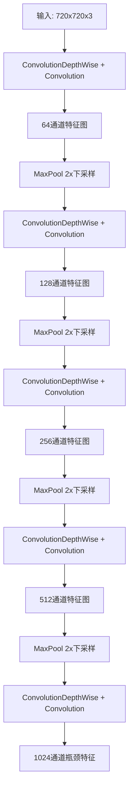
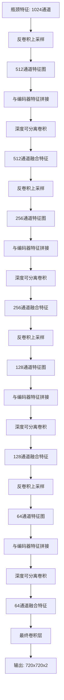
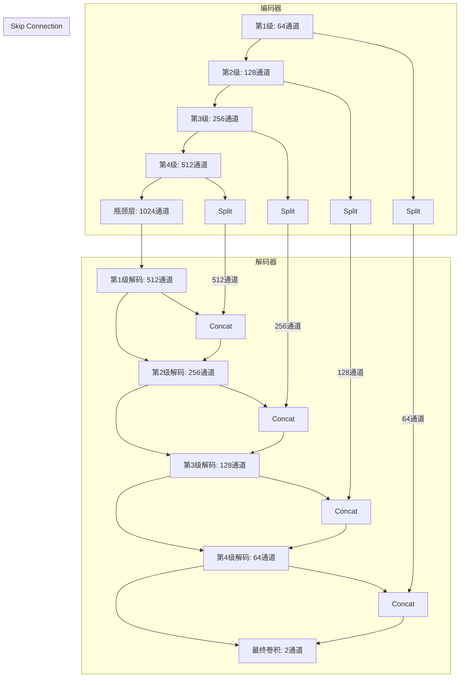

# Unet 编码器-解码器架构与 skip connection

<!-- WIKI_NAV_START -->
> [!info] 视觉感知 Wiki 导航
> [[projects/linux视觉感知项目/index|项目首页]] · [[projects/Linux视觉感知项目/5 车道线检测模型部署/5.1 LSTR 参数化车道线检测（ONNX Runtime）/5.1.3 双输入机制与 log_space.bin 预计算数据|← 上一篇：5.1.3 双输入机制与 log_space.bin 预计算数据]] · [[projects/Linux视觉感知项目/5 车道线检测模型部署/5.2 Unet 语义分割（NCNN）/5.2.2 NCNN 模型部署：HWC 到 CHW 数据布局转换与 argmax 后处理|下一篇：5.2.2 NCNN 模型部署：HWC 到 CHW 数据布局转换与 argmax 后处理 →]]
<!-- WIKI_NAV_END -->

本文档详细分析 Linux 视觉感知处理系统中 Unet 语义分割模型的编码器-解码器架构与 skip connection（跳跃连接）机制。Unet 是经典的语义分割网络，其核心设计思想是通过编码器逐步提取高层语义特征，再通过解码器恢复空间细节，而 skip connection 则是连接高低层特征的关键桥梁。

## Unet 架构设计原理

Unet 架构的核心思想源于解决语义分割中的两个关键矛盾：**语义信息**与**空间细节**的平衡。编码器通过连续的下采样操作扩大感受野，提取高级语义特征，但同时丢失了精确的空间位置信息；解码器通过上采样恢复空间分辨率，但缺乏低级细节特征。skip connection 的设计正是为了解决这一矛盾，将编码器中不同层级的特征直接传递给解码器对应层级，实现多尺度特征的融合。

从数学角度看，skip connection 实现了特征图的**恒等映射**，使得梯度能够直接从解码器流向编码器，缓解了深层网络中的梯度消失问题。在 Unet 的具体实现中，这种连接表现为编码器特征图与解码器特征图在通道维度上的拼接（concatenation），而非简单的相加（addition），这保留了原始特征的完整性，为后续卷积层提供了更丰富的特征信息。

Sources: `卷积神经网络/卷积神经网络/Unet_NCNN/models/model.ncnn.param#L1-L57`

## 编码器结构分析

编码器（下采样路径）负责逐步提取图像的高层语义特征。从 `model.ncnn.param` 文件中可以清晰看到编码器的层次结构：



编码器的具体层级结构如下表所示：

| 层级 | 层类型 | 输出通道 | 功能描述 |
|------|--------|----------|----------|
| 第1级 | ConvolutionDepthWise + Convolution | 64 | 初始特征提取，提取边缘、纹理等低级特征 |
| 第1级下采样 | MaxPool | 64 | 2x下采样，扩大感受野 |
| 第2级 | ConvolutionDepthWise + Convolution | 128 | 提取中级特征，如角点、简单形状 |
| 第2级下采样 | MaxPool | 128 | 2x下采样 |
| 第3级 | ConvolutionDepthWise + Convolution | 256 | 提取高级特征，如物体部件 |
| 第3级下采样 | MaxPool | 256 | 2x下采样 |
| 第4级 | ConvolutionDepthWise + Convolution | 512 | 提取更高级语义特征 |
| 第4级下采样 | MaxPool | 512 | 2x下采样 |
| 瓶颈层 | ConvolutionDepthWise + Convolution | 1024 | 提取全局语义信息，感受野最大 |

每个编码器层级都采用了**深度可分离卷积**（ConvolutionDepthWise）+ **逐点卷积**（Convolution）的组合，这种设计在保持特征提取能力的同时，显著减少了参数量和计算量，特别适合在嵌入式设备上部署。

Sources: `卷积神经网络/卷积神经网络/Unet_NCNN/models/model.ncnn.param#L3-L31`

## 解码器结构分析

解码器（上采样路径）负责逐步恢复空间分辨率，将编码器提取的高级语义特征映射回像素级的分类结果。解码器的核心操作包括**反卷积上采样**和**特征融合**：



解码器的具体层级结构如下表所示：

| 层级 | 层类型 | 输出通道 | 功能描述 |
|------|--------|----------|----------|
| 第1级解码 | Deconvolution | 512 | 2x上采样，恢复空间分辨率 |
| 第1级融合 | Concat + Conv | 512 | 与编码器特征拼接后融合 |
| 第2级解码 | Deconvolution | 256 | 2x上采样 |
| 第2级融合 | Concat + Conv | 256 | 与编码器特征拼接后融合 |
| 第3级解码 | Deconvolution | 128 | 2x上采样 |
| 第3级融合 | Concat + Conv | 128 | 与编码器特征拼接后融合 |
| 第4级解码 | Deconvolution | 64 | 2x上采样 |
| 第4级融合 | Concat + Conv | 64 | 与编码器特征拼接后融合 |
| 最终层 | Convolution | 2 | 像素级分类（2类：背景+车道线） |

解码器中的反卷积层（Deconvolution）采用 2x2 的卷积核，步长为 2，实现特征图的 2 倍上采样。每个解码器层级后都紧跟一个深度可分离卷积块，用于融合来自编码器的特征信息。

Sources: `卷积神经网络/卷积神经网络/Unet_NCNN/models/model.ncnn.param#L32-L56`

## Skip Connection 实现机制

Skip connection 是 Unet 架构的核心创新，它在编码器和解码器之间建立了直接的特征传递通道。从 `model.ncnn.param` 文件中可以看到，skip connection 通过 **Split** 和 **Concat** 操作实现：

1. **Split 操作**：在编码器的每个层级，特征图被分割为两份，一份继续向下传递进行下采样，另一份保留用于后续的 skip connection
2. **Concat 操作**：在解码器的对应层级，来自编码器的特征图与解码器的特征图在通道维度上拼接

具体的 skip connection 连接关系如下表所示：

| 编码器层级 | Split 层 | 特征通道数 | 解码器层级 | Concat 层 | 连接说明 |
|------------|----------|------------|------------|------------|----------|
| 第1级 | splitncnn_0 | 64 | 第4级解码 | cat_3 | 编码器第1级特征 → 解码器第4级 |
| 第2级 | splitncnn_1 | 128 | 第3级解码 | cat_2 | 编码器第2级特征 → 解码器第3级 |
| 第3级 | splitncnn_2 | 256 | 第2级解码 | cat_1 | 编码器第3级特征 → 解码器第2级 |
| 第4级 | splitncnn_3 | 512 | 第1级解码 | cat_0 | 编码器第4级特征 → 解码器第1级 |

从 `model.ncnn.param` 文件的具体层定义中可以验证这种连接关系：

```
Split splitncnn_0              1 2 4 5 6          // 第1级编码器输出，分割为两份
...
Concat cat_3                    2 1 5 51 52 0=0    // 第4级解码器融合
```

这种连接设计体现了**对称性原则**：编码器的第1级（最浅层，包含最丰富的空间细节）连接到解码器的第4级（最深层，需要恢复最多空间信息），而编码器的第4级（最深层，包含最抽象的语义信息）连接到解码器的第1级（最浅层，需要补充语义信息）。

Sources: `卷积神经网络/卷积神经网络/Unet_NCNN/models/model.ncnn.param#L8-L9#L33-L51`

## 特征融合与信息流动

Skip connection 实现了编码器和解码器之间的**多尺度特征融合**，其信息流动可以用以下流程图表示：



这种设计带来了以下关键优势：

1. **梯度传播优化**：梯度可以通过 skip connection 直接从解码器流向编码器，缓解了深层网络的梯度消失问题
2. **多尺度特征融合**：编码器不同层级的特征（从低级纹理到高级语义）都能传递到解码器，实现了真正的多尺度特征融合
3. **空间信息保留**：编码器早期的空间细节信息能够直接传递到解码器后期，避免了信息在下采样过程中的丢失
4. **训练稳定性**：skip connection 提供了恒等映射，使得网络更容易训练，收敛速度更快

在代码实现中，skip connection 的实际执行过程体现在 NCNN 推理引擎的层执行顺序中。`model.ncnn.param` 文件中的层顺序已经包含了完整的连接关系，NCNN 会按照拓扑排序自动执行这些操作。

Sources: `卷积神经网络/卷积神经网络/Unet_NCNN/src/unet.cpp#L80-L88`

## 输入预处理与输出后处理

Unet 模型的输入预处理和输出后处理是确保分割质量的重要环节：

**输入预处理**：
1. **保持宽高比的填充**：通过 `copyMakeBorder` 将图像填充为正方形，避免直接 resize 导致的形变
2. **尺寸调整**：resize 到 720x720 的模型输入尺寸
3. **数据格式转换**：从 HWC（高度-宽度-通道）转换为 CHW（通道-高度-宽度）格式
4. **归一化**：将像素值从 [0,255] 归一化到 [0,1] 范围

**输出后处理**：
1. **Argmax 分类**：对每个像素，遍历所有通道找到最大值对应的类别索引
2. **边界裁剪**：去除填充边界，只保留原始图像区域的分割结果
3. **可视化**：将类别索引乘以 255 转为灰度图，用绿色标记非零区域

```
// 输入预处理关键代码 (unet.cpp 第31-77行)
cv::copyMakeBorder(src, tmp, top, bottom, left, right, BORDER_CONSTANT, value);
cv::resize(tmp, tmp1, cv::Size(INPUT_WIDTH, INPUT_HEIGHT), INTER_CUBIC);
tmp1.convertTo(image, CV_32FC3, 1/255.0);
// 手动 HWC -> CHW 转换
for (int i = 0; i < INPUT_HEIGHT; i++)
   for (int j = 0; j < INPUT_WIDTH; j++)
       for (int k = 0; k < 3; k++) {
          data[k*INPUT_HEIGHT*INPUT_WIDTH + i*INPUT_WIDTH + j] = srcdata[i*INPUT_WIDTH*3 + j*3 + k];
       }

// 输出后处理关键代码 (unet.cpp 第91-138行)
for (int i = 0; i < mask.h; i++)
   for (int j = 0; j < mask.w; j++) {
     float tmp = srcdata[0*mask.w*mask.h+i*mask.w+j];
     int maxk = 0;
     for (int k = 0; k < mask.c; k++) {
       if (tmp < srcdata[k*mask.w*mask.h+i*mask.w+j]) {
         tmp = srcdata[k*mask.w*mask.h+i*mask.w+j];
         maxk = k;
       }
     }
     data[i*INPUT_WIDTH + j] = maxk;
   }
```

Sources: `卷积神经网络/卷积神经网络/Unet_NCNN/src/unet.cpp#L31-L77#L91-L138`

## 模型架构优化策略

本项目中 Unet 模型采用了多项优化策略，以适应嵌入式平台的部署需求：

1. **深度可分离卷积**：将标准卷积分解为深度卷积和逐点卷积，大幅减少参数量和计算量
2. **静态量化**：使用 NCNN 的静态量化技术，进一步压缩模型体积
3. **内存优化**：NCNN 的内存管理机制避免了不必要的内存拷贝
4. **多线程推理**：设置 `ex.set_num_threads(4)` 利用多核 CPU 并行计算

从 `unet.cpp` 代码中可以看到这些优化的具体应用：

```
// 设置轻量模式和多线程
ex.set_light_mode(true);
ex.set_num_threads(4);
```

与传统的标准卷积 Unet 相比，这种优化后的架构在保持分割精度的同时，显著提升了推理速度，更适合在 ARM FT2000/4 等无 GPU 嵌入式平台上运行。

Sources: `卷积神经网络/卷积神经网络/Unet_NCNN/src/unet.cpp#L80-L83`

## 与 LSTR 模型的对比分析

Unet 和 LSTR 代表了两种不同的视觉任务解决方案，它们在架构设计上有显著差异：

| 对比维度 | Unet (语义分割) | LSTR (车道线检测) |
|----------|----------------|-------------------|
| **任务类型** | 像素级分类 | 参数化曲线回归 |
| **输出格式** | 720×720×2 的掩码张量 | N×2 的分类置信度 + N×8 的曲线参数 |
| **架构特点** | 编码器-解码器 + skip connection | Transformer 编码器 + 参数化解码器 |
| **后处理复杂度** | 简单的 argmax | 复杂的曲线参数解码和匹配 |
| **空间信息保留** | 通过 skip connection 保留 | 通过参数化曲线隐式保留 |
| **适用场景** | 精确的像素级分割 | 实时的车道线检测 |

这种架构差异反映了不同视觉任务的本质需求：语义分割需要精确的空间位置信息，因此采用 skip connection 保留多尺度特征；而车道线检测更关注全局结构和参数化表示，因此采用 Transformer 架构和参数化解码。

Sources: `卷积神经网络/卷积神经网络/Unet_NCNN/models/model.ncnn.param#L1-L57` `Linux视觉感知处理系统-dr-卷积神经网络/SKILL.md#L80-L98`

## 部署与性能考量

在 Linux 视觉感知处理系统中，Unet 模型的部署需要考虑以下关键因素：

1. **内存占用**：720×720×2 的输出张量需要约 4MB 内存（float32），加上中间特征图，总内存占用可达数十 MB
2. **计算复杂度**：58 层网络结构，包含大量卷积运算，在 ARM 平台上推理时间约 100-200ms
3. **精度-速度权衡**：通过调整输入分辨率（如 360×360）可以在精度和速度之间取得平衡
4. **模型文件大小**：NCNN 的 .param + .bin 文件通常只有几 MB，适合嵌入式部署

从系统架构角度看，Unet 模块通过文件系统与其他模块进行数据交换，这种设计虽然简单可靠，但也存在一定的 I/O 瓶颈。在实际部署中，可以通过共享内存或进程间通信机制进一步优化数据传输效率。

Sources: `卷积神经网络/卷积神经网络/Unet_NCNN/src/unet.cpp#L13-L14` `Linux视觉感知处理系统-dr-卷积神经网络/SKILL.md#L48-L52`

## 总结

Unet 的编码器-解码器架构与 skip connection 机制是语义分割领域的经典设计。通过编码器逐步提取高级语义特征，解码器恢复空间细节，skip connection 在两者之间建立直接连接，实现了多尺度特征的有效融合。本项目中采用的深度可分离卷积优化和 NCNN 部署方案，使得这种经典架构能够在嵌入式平台上高效运行，为车道线检测等视觉任务提供了可靠的像素级分割能力。

这种架构设计思想不仅适用于 Unet，也为后续的模型优化和架构改进提供了重要参考。通过理解 skip connection 的本质——即多尺度特征的恒等映射和梯度传播优化——可以更好地设计适应不同场景的神经网络架构。

<!-- WIKI_FOOTER_START -->
---
> [!tip] 继续阅读
> [[projects/linux视觉感知项目/index|项目首页]] · [[projects/Linux视觉感知项目/5 车道线检测模型部署/5.1 LSTR 参数化车道线检测（ONNX Runtime）/5.1.3 双输入机制与 log_space.bin 预计算数据|← 上一篇：5.1.3 双输入机制与 log_space.bin 预计算数据]] · [[projects/Linux视觉感知项目/5 车道线检测模型部署/5.2 Unet 语义分割（NCNN）/5.2.2 NCNN 模型部署：HWC 到 CHW 数据布局转换与 argmax 后处理|下一篇：5.2.2 NCNN 模型部署：HWC 到 CHW 数据布局转换与 argmax 后处理 →]]
<!-- WIKI_FOOTER_END -->
