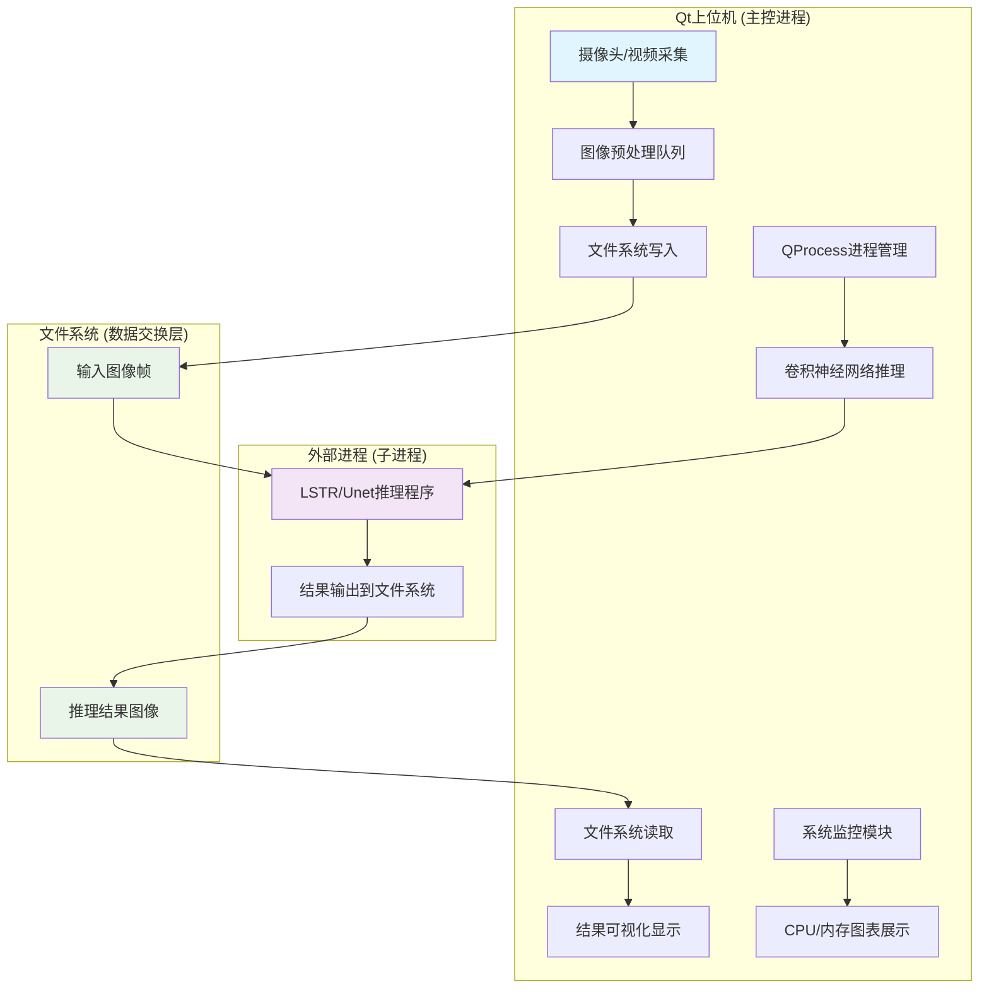

# 文件系统作为模块间数据交换媒介的设计权衡

<!-- WIKI_NAV_START -->
> [!info] 视觉感知 Wiki 导航
> [[projects/linux视觉感知项目/index|项目首页]] · [[projects/Linux视觉感知项目/04 系统集成与性能/5.2 模型轻量化与参数压缩|← 上一篇：7.2 模型轻量化部署：深度可分离卷积与参数量压缩]] · [[projects/Linux视觉感知项目/05 面试与复习/6.1 学习计划与时间分配|下一篇：8.1 分步学习计划与时间分配建议 →]]
<!-- WIKI_NAV_END -->

在Linux视觉感知处理系统中，文件系统被选作模块间数据交换的主要媒介，而非共享内存、消息队列等传统IPC机制。这一设计决策源于项目特定约束条件：ARM FT2000/4无GPU平台、跨模块协作需求以及开发调试便利性的综合考量。本文将深入分析这一架构选择的背景、实现细节、权衡考量以及优化策略。

## 系统架构与文件系统交互模式

系统采用分层解耦架构，Qt上位机作为主控进程，通过QProcess管理LIME图像预处理和卷积神经网络推理等外部进程。模块间数据流通过文件系统实现：Qt程序将采集的图像帧写入指定目录，推理程序从该目录读取处理后再将结果写入另一目录，Qt程序最终读取结果进行显示。



Sources: `上位机程序/Lane_Detection/mainwindow.cpp#L27-L53`

## 文件系统数据流实现细节

### 图像帧存储路径规划

系统定义了清晰的路径结构来组织不同类型的文件数据：

| 数据类型 | 存储路径 | 用途 |
|---------|----------|------|
| 摄像头采集帧 | `/home/kylin/桌面/project_v1.0/frames/` | 实时摄像头图像存储 |
| 视频提取帧 | `/home/kylin/桌面/project_v1.0/LSTR/videos/frames/` | 本地视频文件提取的帧 |
| 推理结果 | `/home/kylin/桌面/project_v1.0/LSTR/result/` | 车道线识别后的结果图像 |
| 背景资源 | `上位机软件根目录/resources` | 界面背景图片等资源文件 |

这种路径规划确保了不同模块能够通过约定的路径访问数据，避免了硬编码路径带来的维护问题。

### 数据写入与读取流程

Qt上位机通过OpenCV的`imwrite()`函数将摄像头采集的图像帧写入文件系统：

```cpp
// 摄像头采集
void MainWindow::readFrame()
{
    cap.read(src_image);
    if(!src_image.empty())
    {
        QImage qsrc = MatImageToQt(src_image);
        ui->cameraView->setPixmap(QPixmap::fromImage(qsrc));
        Mat re;
        cv::resize(src_image, re, cv::Size(320,240), cv::INTER_AREA);
        imwrite("/home/kylin/桌面/project_v1.0/frames/"+ to_string(count) + ".jpg", re);
        // 统计图片数量
        count ++;
    }
}
```

推理结果读取采用轮询方式，通过循环检查新生成的结果文件：

```cpp
// 启动神经网络车道线识别功能后的结果读取
for(int i = 1; i < INT_MAX; i++)
{
    // 读取识别的图片并显示在上位机
    Mat r = imread("/home/kylin/桌面/project_v1.0/LSTR/result/" + to_string(i) + ".jpg");
    if(r.empty()) break;
    QImage rq = MatImageToQt(r);
    ui->resultView->setPixmap(QPixmap::fromImage(rq));
    waitKey(100);
}
```

Sources: `上位机程序/Lane_Detection/mainwindow.cpp#L151-L166` `上位机程序/Lane_Detection/mainwindow.cpp#L131-L139`

### 文件系统监控机制

Qt上位机使用`QFileSystemModel`监控推理结果目录，实现新生成结果的自动发现：

```cpp
// 识别图片所在文件夹目录显示
m_model = new QFileSystemModel;
QString path = "/home/kylin/桌面/project_v1.0/LSTR/result/";
m_model->setRootPath(path);
ui->treeView->setModel(m_model);
ui->treeView->setRootIndex(m_model->index(path));
```

这种监控机制使得界面能够实时反映推理程序的处理进度，提升了用户体验。

Sources: `上位机程序/Lane_Detection/mainwindow.cpp#L15-L20`

## 设计权衡分析

### 选择文件系统作为通信媒介的优势

**解耦性与独立性**：文件系统作为中间层，使得各模块可以独立开发、编译和调试。Qt上位机、LIME预处理和神经网络推理模块之间没有直接的代码依赖，降低了系统复杂性。

**跨平台兼容性**：文件系统操作在Linux、Windows、macOS等操作系统上具有高度一致性，便于系统在不同平台上移植。这对于项目后期可能的平台迁移提供了便利。

**持久化与可调试性**：所有中间结果都保存在文件系统中，便于问题排查和结果验证。开发者可以直接查看文件系统中的图像文件，无需额外的调试工具。

**工具集成便利性**：文件系统接口使得集成FFmpeg、ImageMagick等外部工具变得简单。系统通过QProcess调用FFmpeg进行视频帧提取，展现了良好的工具集成能力。

Sources: `上位机程序/Lane_Detection/mainwindow.cpp#L87-L121`

### 文件系统交换的性能劣势

**I/O延迟与吞吐量限制**：每次文件读写都涉及系统调用和磁盘I/O，相比内存操作有显著延迟。对于高分辨率图像，单次读写可能耗时数十毫秒，影响系统整体实时性。

**资源占用与竞争**：频繁的文件操作会消耗CPU和I/O带宽，在多模块并发访问时可能产生资源竞争。特别是在ARM FT2000/4这类资源受限平台上，这种开销更为明显。

**实时性约束**：文件系统交换不适合毫秒级实时性要求的应用。系统采用10ms的`waitKey(100)`延迟进行结果轮询，反映了这一限制。

**存储空间管理**：大量图像帧的积累会快速消耗存储空间，需要定期清理或采用循环覆盖策略。系统缺乏自动的存储管理机制。

### 与其他IPC机制的比较

| IPC机制 | 性能 | 复杂度 | 适用场景 | 本项目适用性 |
|---------|------|--------|----------|--------------|
| 文件系统 | 低 | 低 | 跨进程、跨语言、调试 | ✓ 主要选择 |
| 共享内存 | 高 | 高 | 高性能、低延迟 | ✗ 实现复杂 |
| 管道/FIFO | 中 | 中 | 流式数据、父子进程 | ✗ 不适合大文件 |
| 消息队列 | 中 | 中 | 小数据量、异步 | ✗ 尺寸限制 |
| 套接字 | 中 | 中 | 网络通信 | ✗ 本地效率低 |

**共享内存方案分析**：虽然共享内存提供零拷贝的高性能数据交换，但在本项目中面临几个挑战：首先，需要处理复杂的同步和互斥问题；其次，跨进程的内存管理增加了编程复杂度；最后，在无GPU的ARM平台上，共享内存的实现和调试相对困难。

**管道与消息队列局限**：管道和消息队列适合小数据量的流式传输，但对于图像这种大尺寸数据，需要分块传输和重组，增加了实现复杂度。此外，这些机制通常有大小限制，不适合传输高分辨率图像。

## 嵌入式平台优化策略

### 性能优化措施

**内存文件系统（tmpfs）**：对于频繁读写的临时文件，可以考虑使用内存文件系统。将frames和result目录挂载到tmpfs上，可以将磁盘I/O转换为内存操作，显著提升性能。

```bash
# 挂载tmpfs文件系统
mount -t tmpfs -o size=100M tmpfs /tmp/frames
mount -t tmpfs -o size=100M tmpfs /tmp/result
```

**批量文件操作**：减少系统调用次数，采用批量读写策略。例如，一次性读取多个结果文件，或使用缓冲写入减少磁盘同步次数。

**异步I/O操作**：使用异步文件操作避免阻塞主线程。Qt提供了`QFile`和`QTextStream`的异步操作模式，可以改善界面响应性。

**文件锁与并发控制**：当多个进程同时访问文件系统时，需要使用文件锁保护共享资源。系统可以采用简单的锁文件机制或更复杂的分布式锁。

### 资源管理策略

**存储空间监控**：添加存储空间监控机制，当剩余空间低于阈值时自动清理旧文件或发出警告。

**文件命名与索引**：采用时间戳或序列号命名文件，便于管理和检索。可以建立索引文件记录当前处理的进度，避免重复处理。

**压缩与格式优化**：对于存储的图像文件，可以考虑使用更高效的压缩格式（如WebP）或降低质量参数，在可接受的质量损失下减少存储占用。

## 故障处理与容错机制

### 文件系统错误处理

**文件读写验证**：每次文件操作后检查返回值，处理文件不存在、权限不足、磁盘空间满等错误情况。

```cpp
// 文件写入错误处理示例
bool success = imwrite(filepath, image);
if (!success) {
    // 处理写入失败：重试、使用备用路径、通知用户等
    QMessageBox::warning(this, "Error", "图像保存失败");
}
```

**路径配置验证**：在系统启动时验证所有必需目录是否存在，自动创建缺失目录，检查目录权限。

**备份与恢复机制**：对于关键数据，建立备份机制。当检测到文件损坏时，可以从备份恢复或重新生成。

### 进程间同步与协调

**处理进度同步**：使用状态文件或共享变量记录各模块的处理进度，避免数据不一致。例如，LSTR程序完成处理后更新状态文件，Qt程序根据状态决定何时读取结果。

**超时与重试机制**：为文件操作设置超时时间，当操作超时时进行重试。对于推理过程，设置合理的超时阈值，避免无限等待。

**错误传播与通知**：当推理程序出现错误时，通过错误日志文件或特定状态文件通知Qt程序，提供友好的错误提示。

## 扩展性与可维护性设计

### 模块接口标准化

**统一数据格式**：定义标准的图像文件格式（如JPEG、PNG）和命名规则，确保模块间数据兼容性。

**配置文件管理**：使用JSON或XML配置文件管理路径、参数和配置，避免硬编码。配置文件应支持热重载，便于运行时调整。

```json
{
  "input_frames_dir": "/home/kylin/frames/",
  "output_result_dir": "/home/kylin/result/",
  "model_path": "/home/kylin/models/",
  "ffmpeg_path": "/usr/bin/ffmpeg",
  "storage_limit_mb": 1024
}
```

### 插件化架构支持

**算法模块可替换性**：通过文件系统接口，可以轻松替换不同的图像预处理算法或神经网络模型，只需确保输入输出文件格式一致。

**平台适配层**：为不同的硬件平台提供适配层，处理文件路径、权限和存储特性差异。

### 日志与调试支持

**分级日志系统**：实现DEBUG、INFO、WARNING、ERROR级别的日志记录，便于问题定位和性能分析。

**中间结果保存**：可配置地保存中间处理结果，支持调试模式下的单步处理和结果验证。

## 未来优化方向

### 性能提升路径

**混合通信策略**：对于实时性要求高的数据，采用共享内存或管道；对于大文件或持久化数据，保留文件系统。这种混合策略可以平衡性能和复杂性。

**零拷贝技术**：研究内存映射文件（mmap）技术，减少数据复制次数，提升大文件处理效率。

**异步流水线处理**：实现生产者-消费者模式，各模块通过队列异步通信，提高整体吞吐量。

### 可靠性增强

**事务性文件操作**：实现类似数据库事务的文件操作，确保数据一致性。例如，采用"写入临时文件-重命名"的原子操作。

**健康检查与自愈**：添加模块健康检查机制，当检测到异常时自动重启或切换备用方案。

**分布式文件系统支持**：对于多机部署场景，考虑支持NFS、GlusterFS等分布式文件系统，实现跨节点数据共享。

## 总结

文件系统作为Linux视觉感知处理系统的模块间数据交换媒介，是在ARM FT2000/4无GPU平台特定约束下的合理选择。这一设计在开发效率、系统解耦和调试便利性方面具有明显优势，但在性能、实时性和资源管理方面存在固有限制。

通过合理的优化策略，如使用内存文件系统、批量操作、异步I/O等，可以在一定程度上弥补性能劣势。同时，完善的错误处理、资源管理和扩展性设计，确保了系统在嵌入式环境下的稳定性和可维护性。

这一架构选择体现了嵌入式视觉处理系统的典型设计模式：在性能、复杂性和开发成本之间寻找平衡点。对于类似项目，开发者应根据具体约束条件，权衡文件系统与其他IPC机制的优劣，选择最适合的通信方案。

<!-- WIKI_FOOTER_START -->
---
> [!tip] 继续阅读
> [[projects/linux视觉感知项目/index|项目首页]] · [[projects/Linux视觉感知项目/04 系统集成与性能/5.2 模型轻量化与参数压缩|← 上一篇：7.2 模型轻量化部署：深度可分离卷积与参数量压缩]] · [[projects/Linux视觉感知项目/05 面试与复习/6.1 学习计划与时间分配|下一篇：8.1 分步学习计划与时间分配建议 →]]
<!-- WIKI_FOOTER_END -->
