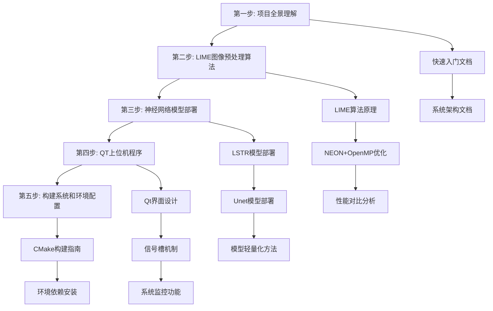
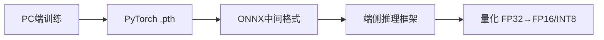

# 分步学习计划与时间分配建议

<!-- WIKI_NAV_START -->
> [!info] 视觉感知 Wiki 导航
> [[projects/linux视觉感知项目/index|项目首页]] · [[projects/Linux视觉感知项目/04 系统集成与性能/5.3 文件系统数据交换设计|← 上一篇：7.3 文件系统作为模块间数据交换媒介的设计权衡]] · [[projects/Linux视觉感知项目/05 面试与复习/6.2 项目全局面试问答|下一篇：8.2.1 项目全局高频面试问答 →]]
<!-- WIKI_NAV_END -->

本文档为Linux视觉感知处理系统的学习提供系统性的分步学习计划，帮助初学者在5-7小时内掌握项目的核心架构、关键算法和面试要点。学习计划遵循"由粗到细、重点突出"的原则，确保在有限时间内获得最大的学习收益。

## 项目概述与学习目标

Linux视觉感知处理系统是一个基于飞腾FT2000/4嵌入式开发板的完整视觉感知流水线，核心亮点是**无GPU场景下的CPU极致优化**。系统实现了从摄像头采集→LIME低照度增强→Unet/LSTR车道线识别→QT上位机显示的完整流程。

**核心学习目标：**
1. 理解系统整体架构和数据流向
2. 掌握LIME低照度增强算法及NEON/OpenMP优化技术
3. 了解两种神经网络模型部署方案（Unet/NCNN和LSTR/ONNX Runtime）
4. 熟悉QT上位机程序的界面控制和系统监控功能
5. 能够清晰回答项目相关的面试问题

Sources: `学习计划.md#L1-L20`

## 学习路线总览

基于项目文档结构，建议按照以下顺序进行学习：



Sources: `学习计划.md#L22-L28`

## 项目全景理解（30分钟）

### 学习内容

| 学习材料 | 内容重点 | 时间分配 |
|----------|----------|----------|
| [[projects/Linux视觉感知项目/00 项目总览/1.1 项目概述|项目概述]] | 项目背景、技术栈、硬件平台 | 10分钟 |
| [[projects/Linux视觉感知项目/00 项目总览/1.5 系统全景与数据流|系统全景与数据流总览]] | 四个模块的关系、数据流向 | 15分钟 |
| 面试介绍模板 | 简历描述、口述话术 | 5分钟 |

### 学习目标

完成此步骤后，你应该能够回答：
1. 这个项目做了什么？解决了什么实际问题？
2. 为什么选择在嵌入式端做？为什么不用GPU加速？
3. 整体技术栈是什么？各模块之间如何协作？

### 关键知识点

**硬件平台特点：**
- 飞腾FT2000/4：4核ARM v8架构，主频2.6GHz
- GPU限制：AMD R5-230仅用于显示，不支持CUDA通用计算
- 内存限制：需要优化内存访问模式提高缓存命中率

**系统架构核心：**


Sources: `学习计划.md#L30-L55`

## LIME图像预处理算法（2-3小时）

> **这是面试的重点，100%会问到性能优化部分。**

### LIME算法原理（30分钟）

**学习材料：** [[projects/Linux视觉感知项目/02 LIME 低照度增强/3.1 算法原理：Retinex与光照图|LIME 算法原理：Retinex 理论与光照图估计]]1]
- 求RGB三通道最大值 → 构建初始光照图 `T`
- 使用ALM（增广拉格朗日乘子法）迭代优化光照图
- 用优化后的光照图对原图做增强：`output = input / T`
- 阈值截断防止过曝

**关键公式：**
```
增强公式：R = I / T    （I是原图，T是光照图）
收敛判断：||T_new - T_old||_F / ||T_old||_F < epsilon
```

### LIME未优化代码阅读（30分钟）

**文件：** `图像预处理（加速前+加速后）/Lime/lime.cpp`

| 函数名 | 功能说明 | 重要程度 |
|--------|----------|----------|
| `__initIllumMap()` | 归一化图像，构建初始光照图 | 基础 |
| `getMax()` | 求RGB三通道最大值 | **优化重点** |
| `Frobenius()` | 求矩阵F范数 | **优化重点** |
| `optimizeIllumMap()` | ALM迭代优化光照图 | 核心逻辑 |
| `enhance()` | 图像增强主函数 | **优化重点** |
| `Mat2Vec()` | 矩阵压缩成一维向量 | **优化重点** |

### LIME优化代码阅读（1-1.5小时）

**文件：** `图像预处理（加速前+加速后）/Lime_NEON+OpenMP/lime_opt.cpp`

**四个核心优化点：**

#### 优化点1：循环重排（Loop Reordering）
```cpp
// 优化前：列优先遍历 → 缓存行频繁失效
for (int j = 0; j < cols; j++)
    for (int i = 0; i < rows; i++) sum += A[i][j];

// 优化后：行优先遍历 → 匹配内存布局
for (int i = 0; i < rows; i++)
    for (int j = 0; j < cols; j++) sum += A[i][j];
```

#### 优化点2：NEON指令集优化
| 指令 | 功能 | 使用场景 |
|------|------|----------|
| `vld1q_f32` | 加载4个float到128位寄存器 | 数据加载 |
| `vmaxq_f32` | 4个float并行求最大值 | `getMax()`函数 |
| `vmulq_f32` | 4个float并行乘法 | `Frobenius()`函数 |

#### 优化点3：OpenMP多线程并行
**策略A - 色彩通道分离：**
```cpp
#pragma omp parallel sections
{
    #pragma omp section  // 绿色通道
    { auto g = img_norm_g / T; }
    #pragma omp section  // 蓝色通道
    { auto b = img_norm_b / T; }
    #pragma omp section  // 红色通道
    { auto r = img_norm_r / T; }
}
```

**策略B - 图像分块处理：**
将图像分为4块，每块用一个线程处理，充分利用4核CPU。

#### 优化点4：循环展开（Loop Unrolling）
```cpp
// 每次 j += 4，配合NEON一次处理4个float
for (int j = 0; j < col; j += 4) { ... }
```

### 优化效果对比

| 版本 | 256×256图像傅里叶函数耗时 | 加速比 |
|------|---------------------------|--------|
| 未优化 | 1.6305s | 1× |
| 傅里叶函数重构 | 1.031s | 1.58× |
| NEON + OpenMP | 0.314s | **5.19×** |

Sources: `学习计划.md#L56-L120`

## 神经网络模型部署（1-2小时）

### 模型部署全流程（20分钟）

**部署流程：**


**两种模型对比：**

| 对比项 | Unet | LSTR |
|--------|------|------|
| 方法类型 | 语义分割（像素级） | 端到端检测（多项式拟合） |
| 部署框架 | NCNN | ONNX Runtime |
| 轻量化手段 | 深度可分离卷积 + FP16量化 | ONNX导出 + FP16量化 |
| 优化前推理时间 | 17.386s | 1.953s |
| 优化后推理时间 | 4.676s | **0.182s** |
| 权重大小 | 124MB → 24MB | 124.7MB → **12MB** |

### Unet + NCNN代码阅读（30分钟）

**文件：** `卷积神经网络/卷积神经网络/Unet_NCNN/src/unet.cpp`

**阅读顺序：**
1. 模型加载：`load_param()` + `load_model()`
2. 图像预处理：resize + 归一化 + HWC→CHW转换
3. 推理：`create_extractor()` → `set_num_threads(4)` → `input()` → `extract()`
4. 后处理：argmax分类 → 绘制结果

### LSTR + ONNX代码阅读（30分钟）

**文件：** `卷积神经网络/卷积神经网络/LSTR_ONNX/main.cpp`

**重点理解：**
- `pred_logits` — 车道线置信度（判断哪些query是有效车道）
- `pred_curves` — 车道线曲线参数（多项式系数）
- 车道线绘制公式：`x = p[2]/(y-p[3])^2 + p[4]/(y-p[3]) + p[5] + p[6]*y - p[7]`

### 模型轻量化方法（20分钟）

**深度可分离卷积原理：**
```
标准卷积：Cin × Cout × K × K 参数量
深度可分离卷积：Cin × K × K + Cin × Cout × 1 × 1 参数量
参数量减少比例 ≈ 1/K²（K=3时约减少到1/9）
```

**量化原理：**
```
FP32（32位浮点）→ FP16（16位浮点）→ INT8（8位整数）
精度逐步降低，速度逐步提升，存储逐步缩小
```

Sources: `学习计划.md#L121-L165`

## QT上位机程序（30-45分钟）

> 面试问得较少，但要能说清楚做了什么。

### 主窗口逻辑（30分钟）

**文件：** `上位机程序/Lane_Detection/mainwindow.cpp`

**重点理解：**
- `QProcess` 调用外部可执行程序（避免主线程阻塞）
- 摄像头采集 → 保存帧图片 → 调用神经网络推理 → 显示结果
- `QChart` 实时刷新CPU/内存曲线

### CPU监控实现（15分钟）

**文件：** `上位机程序/Lane_Detection/sysinfolinuximpl.cpp`

**核心公式：**
```
CPU占用率 = (use_new - use_old) / (total_new - total_old) × 100%

其中：
- use = user + nice + system（从/proc/stat读取）
- total = 所有时间之和
- 采样间隔 = 1秒
```

Sources: `学习计划.md#L166-L185`

## 构建系统和环境配置（15分钟）

### 构建文件清单

| 文件路径 | 内容说明 |
|----------|----------|
| `图像预处理（加速前+加速后）/Lime/CMakeLists.txt` | LIME基础版，链接OpenCV |
| `图像预处理（加速前+加速后）/Lime_NEON+OpenMP/CMakeLists.txt` | LIME优化版，加OpenMP |
| `卷积神经网络/卷积神经网络/LSTR_ONNX/CMakeLists.txt` | LSTR部署，链接ONNX Runtime |
| `卷积神经网络/卷积神经网络/Unet_NCNN/CMakeLists.txt` | Unet部署，链接NCNN |
| `上位机程序/Lane_Detection/1102demo3.pro` | QT工程文件 |

### 编译方式速查

```bash
# LIME算法
cd 图像预处理/Lime && mkdir build && cd build && cmake .. && make && ./lime

# Unet NCNN
cd 卷积神经网络/Unet_NCNN && mkdir build && cd build && cmake .. && make && ./unet_ncnn ../images/0.jpg

# LSTR ONNX
cd 卷积神经网络/LSTR_ONNX && mkdir build && cd build && cmake .. && make && ./LSTR
```

Sources: `学习计划.md#L186-L200`

## 学习方法建议

### 高效学习策略

1. **由粗到细原则**：先理解整体架构，再深入细节
2. **代码导向学习**：每一步都有具体文件和行数，不是空谈理论
3. **对比学习法**：优化前后代码放在一起看，理解更深刻
4. **手写练习**：对于NEON优化等关键代码，建议手写一遍加深记忆

### 学习时间分配建议

| 学习阶段 | 建议时间 | 主要内容 |
|----------|----------|----------|
| 第一天 | 2-3小时 | 项目全景理解 + LIME算法原理 |
| 第二天 | 2-3小时 | LIME优化代码 + 模型部署 |
| 第三天 | 1-2小时 | QT上位机 + 构建系统 + 面试准备 |

### 学习检查点

每个步骤完成后，检查自己是否能回答以下问题：
- **第一步**：能用一句话描述项目的核心价值
- **第二步**：能解释NEON和OpenMP如何协同优化LIME算法
- **第三步**：能区分Unet和LSTR的部署差异
- **第四步**：能说明QT上位机如何避免UI卡顿
- **第五步**：能独立完成项目的编译和运行

Sources: `学习计划.md#L201-L220`

## 面试准备重点

### 必问问题（100%会出现）

1. **NEON指令集是什么？在项目中怎么用的？**
   - SIMD架构，128位寄存器一次处理4个float32
   - 具体指令：`vld1q_f32/vst1q_f32/vmaxq_f32/vmulq_f32`
   - 用于`getMax()`和`Frobenius()`函数加速

2. **OpenMP怎么用的？和pthread比有什么优势？**
   - `#pragma omp parallel sections` 色彩通道分离
   - 图像分块4等分，4线程并行
   - 优势：编译指令声明，无需手动管理线程，自动负载均衡

3. **循环重排/循环展开的原理？**
   - 循环重排：匹配行优先存储，提高缓存命中率
   - 循环展开：减少循环控制开销，适配NEON并行宽度

4. **为什么不用GPU加速？**
   - 开发板GPU是AMD老款，不支持CUDA，仅用于显示
   - CPU是4核ARM v8，主频2.6GHz，只能用CPU优化

### 高频问题

5. **模型部署流程？**
   - PyTorch → pth → pt(jit) → pnnx → ncnn(.param+.bin)
   - PyTorch → onnx → ONNX Runtime

6. **深度可分离卷积原理？**
   - DW（逐通道卷积）+ PW（逐点1×1卷积）
   - 参数量减少到约1/K²

7. **Unet和LSTR的区别？**
   - Unet：编码-解码+跳跃连接，像素级分割
   - LSTR：Transformer端到端，多项式拟合车道线

Sources: `学习计划.md#L221-L260`

## 学习进度跟踪表

| 步骤 | 学习内容 | 完成状态 | 完成日期 | 掌握程度 |
|------|----------|----------|----------|----------|
| 1 | 项目全景理解 | ⬜ | | 1-5分 |
| 2.1 | LIME算法原理 | ⬜ | | 1-5分 |
| 2.2 | LIME未优化代码 | ⬜ | | 1-5分 |
| 2.3 | LIME优化代码（NEON/OpenMP） | ⬜ | | 1-5分 |
| 3.1 | 模型部署流程 | ⬜ | | 1-5分 |
| 3.2 | Unet + NCNN代码 | ⬜ | | 1-5分 |
| 3.3 | LSTR + ONNX代码 | ⬜ | | 1-5分 |
| 4 | QT上位机 | ⬜ | | 1-5分 |
| 5 | 构建系统 | ⬜ | | 1-5分 |

**掌握程度评分标准：**
- 1分：完全不会，需要重新学习
- 2分：知道概念，但讲不清楚
- 3分：能基本理解，但需要参考材料
- 4分：能独立讲解，回答大部分问题
- 5分：完全掌握，能应对面试追问

Sources: `学习计划.md#L261-L280`

## 参考资源与下一步学习

完成本学习计划后，建议继续学习以下相关文档：

- [[projects/Linux视觉感知项目/05 面试与复习/6.2 项目全局面试问答|项目全局高频面试问答]]：深入面试问题解答
- [[projects/Linux视觉感知项目/05 面试与复习/6.3 LIME与优化面试要点|LIME 算法与 NEON / OpenMP 优化面试要点]]：优化技术细节
- [[projects/Linux视觉感知项目/05 面试与复习/6.4 LSTR与Unet部署面试要点|LSTR 与 Unet 模型部署面试要点]]：模型部署细节
- [[projects/Linux视觉感知项目/05 面试与复习/6.5 系统设计决策与追问应对|系统设计决策与常见追问应对]]：系统设计思路

**学习建议：**
1. 如果时间充裕，可以手写一遍`getMax()`的NEON优化版本
2. 模型部署部分，建议了解ONNX和NCNN的区别（ONNX更通用，NCNN更轻量针对ARM）
3. 面试前重点背诵"为什么不用GPU"和"各优化点的定义"这两段话术

Sources: `学习计划.md#L281-L300`

## 学习计划总结

本学习计划提供了一个系统性的学习路径，帮助初学者在5-7小时内掌握Linux视觉感知处理系统的核心内容。通过分步学习、重点突出、代码导向的方法，可以高效地准备项目相关的技术面试。

**关键成功因素：**
1. 坚持由粗到细的学习原则
2. 重点掌握LIME算法的优化技术
3. 理解两种模型部署方案的差异
4. 通过手写练习加深对关键代码的理解
5. 定期复习并完成学习进度跟踪

记住，学习不是为了"看过"，而是为了"能讲清楚"。每个步骤完成后，尝试用费曼技巧向他人解释所学内容，这是检验学习效果的最佳方法。

## 新版与旧版 Wiki 对比总结

| 对比项 | 旧版 `2026-07-10-142635` | 新版 `2026-07-10-222935`（当前） |
| --- | --- | --- |
| 保存状态 | 目录完整保留，未覆盖、未删除 | `current` 指向此独立版本 |
| 页面规模 | 35 页 | 36 页，页面文件完整 |
| 主要定位 | 第一次建立项目全貌：环境、模块、通用原理 | 第二次针对性复习：LIME 实现、模型部署、面试追问 |
| LIME / `solveT()` | 有 LIME 原理、原始/优化代码与通用优化专题 | 独立拆解 ADMM 的 `T/G/Z/u`、FFT 求解、更新顺序和收敛参数 |
| 性能优化 | NEON、OpenMP、循环优化和性能提升 | 对应 `getMax`、`Frobenius`、FFT、`Mat2Vec`、`optIllumMap`、`enhance`，同时提示尾循环、归约和竞争风险 |
| Unet / NCNN | 有模型与框架部署专题 | 串成 `padding → resize → HWC/CHW → 推理 → argmax → 去 padding` 的可口述闭环 |
| LSTR / ONNX | 有 LSTR 与 ONNX Runtime 推理实现 | 明确双输入、`Run()`、`pred_logits`、`pred_curves`、`log_space.bin` 与绘制后处理的边界 |
| 概念区分 | 有轻量化与量化专题 | 进一步区分结构轻量化、格式转换、推理框架、量化和后处理，并标注哪些结论已由代码验证 |
| 面试准备 | 1 个综合高频面试页 | 项目全局、LIME 优化、模型部署 3 个专题页，加 1 个系统设计追问页 |
| 图示和学习路径 | 常规 Wiki 导航与项目学习路线 | 强化系统流、ADMM 依赖、部署链和优化层次图，配合每天约 60 分钟的复习单元 |

**结论：**旧版适合“先知道项目有什么”；新版适合“把 `solveT()` 和 Unet/LSTR 部署真正串到代码，并能经得住面试追问”。

<!-- WIKI_FOOTER_START -->
---
> [!tip] 继续阅读
> [[projects/linux视觉感知项目/index|项目首页]] · [[projects/Linux视觉感知项目/04 系统集成与性能/5.3 文件系统数据交换设计|← 上一篇：7.3 文件系统作为模块间数据交换媒介的设计权衡]] · [[projects/Linux视觉感知项目/05 面试与复习/6.2 项目全局面试问答|下一篇：8.2.1 项目全局高频面试问答 →]]
<!-- WIKI_FOOTER_END -->
