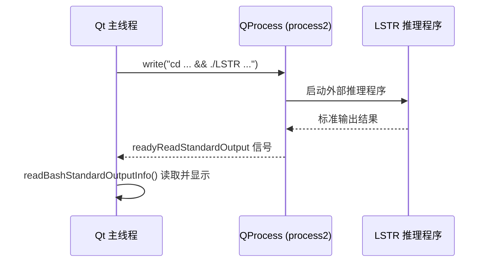
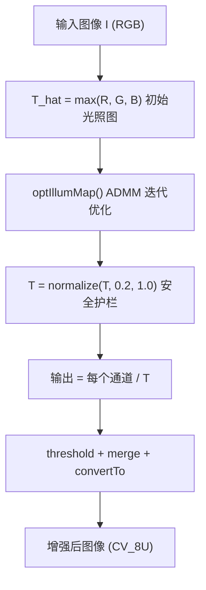
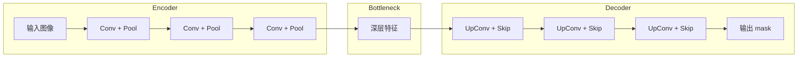
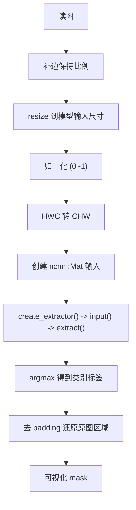

# 项目全局高频面试问答

<!-- WIKI_NAV_START -->
> [!info] 视觉感知 Wiki 导航
> [[projects/linux视觉感知项目/index|项目首页]] · [[projects/Linux视觉感知项目/05 面试与复习/6.1 学习计划与时间分配|← 上一篇：8.1 分步学习计划与时间分配建议]] · [[projects/Linux视觉感知项目/05 面试与复习/6.3 LIME与优化面试要点|下一篇：8.2.2 LIME 算法与 NEON / OpenMP 优化面试要点 →]]
<!-- WIKI_NAV_END -->

本文档是 **Linux 视觉感知处理系统** 的面试准备核心资料。内容覆盖项目全局认知、各模块深度追问、以及不同时间长度的项目讲解模板，帮助你在面试中精准表达技术方案，避免常见表述错误。

---

## 一、项目全局认知：6 个必答基础题

### 1. 项目解决了什么问题？

**面试官问**：你这个 Linux 视觉感知处理系统主要解决什么实际问题？

**建议回答**：这个项目面向校园无人配送车的车道线识别场景，运行在飞腾 FT2000/4 四核 ARM 开发板和银河麒麟 V10 系统上。它主要解决两个问题：一是夜晚或弱光环境下道路图像偏暗，车道线和背景对比度低，模型直接识别容易漏检或误检；二是 ARM 平台算力有限、没有合适 GPU 通用计算路径，需要在纯 CPU 环境下实现实时处理。

**追问要点**：必须说清平台（飞腾 FT2000/4）、场景（校园无人配送车）、痛点（弱光+算力受限）。

**常见错误**：只说"做低光照增强"，忘记最终目标是提升车道线识别质量。

### 2. 完整数据流是什么？


**建议回答**：用户先在 Qt 上位机点击按钮，系统读取摄像头或本地视频帧；针对弱光场景，图像先经过 LIME 做低照度增强，提高车道线可见性；增强后的图像再送入 Unet 或 LSTR 做车道线识别；模型生成识别结果后，Qt 负责显示原图、结果图，并实时刷新 CPU/内存占用曲线。

**关键区分**：LIME 是增强，不是检测；Unet/LSTR 才是识别。详见 [[projects/Linux视觉感知项目/03 模型推理部署/4.6 两种方案对比：分割vs曲线|两种检测方案对比]]。

### 3. 为什么分 Qt、LIME、模型推理三个模块？

| 模块 | 职责 | 为什么独立 |
|---|---|---|
| **Qt 上位机** | 按钮控制、图像显示、CPU/内存监控 | 是控制和展示层，不是算法核心 |
| **LIME** | 低照度图像增强 | 只负责提升图像质量，不负责检测 |
| **Unet/LSTR** | 车道线识别 | 模型推理耗时，不能阻塞 UI 线程 |

**建议回答**：分模块是为了让系统边界清晰。重推理如果直接写在 Qt UI 主线程里，会阻塞界面刷新。分模块后，图像质量差就看 LIME，识别效果差就看模型，界面卡顿就看 Qt，方便定位问题，也方便后续替换模型。

### 4. 为什么需要 LIME？

**建议回答**：夜晚或弱光环境下，车道线和道路背景的对比度会下降，车道线边缘和纹理特征不明显，直接送入模型容易出现漏检或误检。LIME 的作用是在模型推理前提高低照度图像质量，让车道线更清楚，从而提升后续 Unet 或 LSTR 的输入质量。

**LIME 最小原理**：

```text
T_hat = max(R, G, B)        // 初始光照图
T = optimize(T_hat)          // 优化后的光照图（ADMM 迭代）
T = normalize(T, 0.2, 1.0)  // 安全护栏，防止除以接近0
输出 = 每个通道 / T           // 暗处 T 小，增强更明显
```

详见 [[projects/Linux视觉感知项目/02 LIME 低照度增强/3.1 算法原理：Retinex与光照图|LIME 算法核心思想]] 和 [[projects/Linux视觉感知项目/02 LIME 低照度增强/3.7 优化前后性能对比|优化前后性能对比]]。

### 5. Unet 和 LSTR 的区别是什么？

| 维度 | Unet | LSTR |
|---|---|---|
| **检测方式** | 像素级语义分割 | 参数化曲线检测 |
| **输出** | 逐像素的类别标签 mask | 车道线存在性 logits + 曲线参数 |
| **核心网络** | Encoder-Decoder + Skip Connection | Transformer-based |
| **部署框架** | NCNN（`.param` + `.bin`） | ONNX Runtime |
| **后处理** | argmax -> 去 padding -> 可视化 | logits 筛选 -> curves 还原点 -> 构造绿色区域 |

**建议回答**：Unet 更像"逐像素画线"，给出图像中每个像素是不是车道线的结果；LSTR 更像"直接给出曲线方程"，预测车道线的存在性和曲线参数，再通过后处理还原成车道线。

**关键易错**：图上的绿色车道区域是后处理构造的，不是 LSTR 模型直接输出的。

详见 [[projects/Linux视觉感知项目/03 模型推理部署/4.6 两种方案对比：分割vs曲线|两种检测方案对比]]。

### 6. 为什么需要 NEON 和 OpenMP？

| 技术 | 类型 | 作用层次 | 一句话描述 |
|---|---|---|---|
| **NEON** | SIMD 向量化 | 单核 | 一条指令处理 4 个 float |
| **OpenMP** | 多线程并行 | 多核 | 把任务分给多个 CPU 核心 |

**建议回答**：飞腾 FT2000/4 是四核 ARM 开发板，算力有限，而且没有合适的 GPU 通用计算路径。NEON 是 ARM 上的 SIMD 指令集，可以让单条指令一次处理多个数据；OpenMP 是多核并行方案，把独立任务分配给多个 CPU 核心。两者结合，从单核向量化和多核并行两个维度提升速度。

**常见错误**：把 NEON 和 OpenMP 混为一谈。NEON 是单核向量化，OpenMP 是多核并行。

详见 [[projects/Linux视觉感知项目/02 LIME 低照度增强/3.5 NEON SIMD向量化加速|NEON SIMD 加速原理]] 和 [[projects/Linux视觉感知项目/02 LIME 低照度增强/3.6 OpenMP多线程并行|OpenMP 多线程策略]]。

---

## 二、Qt 上位机模块：深度追问

### 2.1 Qt 在项目里负责什么？

**建议回答**：Qt 是上位机控制和展示层，负责三个职责：**控制**（按钮触发摄像头/视频采集和模型推理）、**显示**（原图和识别结果可视化）、**监控**（CPU/内存状态实时曲线）。它不是算法核心，因为算法核心是 LIME 图像增强和 Unet/LSTR 模型推理。

**Qt 程序入口骨架**：

```cpp
int main(int argc, char *argv[])
{
    QApplication a(argc, argv);  // 创建 Qt 运行环境
    MainWindow w;                // 创建主窗口
    w.show();                    // 显示窗口
    return a.exec();             // 进入事件循环
}
```

`a.exec()` 是 Qt 程序的核心——进入事件循环。删除后窗口一闪而过，按钮、定时器、进程输出回调全部失效。

### 2.2 信号槽机制详解

项目中所有用户交互都通过 `connect()` 建立信号-槽连接：

| 信号源 | 信号 | 槽函数 | 功能 |
|---|---|---|---|
| `ui->Open` 按钮 | `clicked()` | `on_Open_triggered()` | 开启摄像头 |
| `ui->Stop` 按钮 | `clicked()` | `on_Stop_triggered()` | 关闭摄像头 |
| `ui->result` 按钮 | `clicked()` | `on_Select_triggered()` | 选择本地视频 |
| `ui->yolop_process` 按钮 | `clicked()` | `yolop_process()` | 启动车道线识别 |
| `timer` 定时器 | `timeout()` | `readFrame()` | 定时读取摄像头帧 |
| `timer2` 定时器 | `timeout()` | `timerTimeOut()` | 定时刷新 CPU/内存 |
| `process2` 进程 | `readyReadStandardOutput()` | `readBashStandardOutputInfo()` | 读取外部程序输出 |

**面试翻译法**：任何 `connect` 都按四步翻译——谁发出事件？什么事件？谁来处理？调哪个函数？

### 2.3 为什么用 QProcess 调外部程序？

**建议回答**：预处理和卷积神经网络识别都比较耗时，如果直接放到上位机主程序里，会导致界面堵塞。所以项目采用 `QProcess` 调外部可执行程序，让 Qt 主程序只做启动、输入命令、读取输出。



### 2.4 CPU/内存监控原理

| 指标 | 数据来源 | 计算方式 | 刷新机制 |
|---|---|---|---|
| **CPU 占用率** | `/proc/stat` | 前后两次采样做差值 | `timer2` 每秒触发 |
| **内存使用率** | `free -m` | `(total - free) / total x 100` | `timer2` 每秒触发 |

**关键区别**：CPU 是累计时间，必须做前后差值才能算出瞬时使用率；内存是当前状态量，直接按比例计算。

**动态曲线原理**：不是线自己在动，而是每秒整条重绘——新值加入历史列表，旧曲线清空，所有点重新 append 到 `QSplineSeries`。

---

## 三、LIME 低照度增强：算法原理追问

### 3.1 LIME 核心数学模型



**关键变量速查表**：

| 变量 | 含义 | 谁产生的 |
|---|---|---|
| `T_hat` | 初始光照图（RGB 最大值） | `_init_IllumMap()` -> `getMax()` |
| `T` | 优化后的光照图 | `optIllumMap()` 返回 |
| `G` | ADMM 辅助变量 | 迭代更新 |
| `Z` | ADMM 对偶变量 | 迭代更新 |
| `u` | 惩罚参数 | 每次迭代增大 |
| `W` | 权重矩阵 | `weightStrategy()` |
| `epsilon` | 收敛阈值 | `Frobenius(T_hat) x 0.001` |

### 3.2 LIME 高频追问

**Q：为什么不能直接把每个像素乘一个固定系数提亮？**

A：固定系数不区分亮暗区域，亮处会过曝，暗处提升不足。LIME 通过估计每个像素的光照强度 T，实现"暗处多提、亮处少提"的自适应增强。

**Q：`T_hat` 和 `T` 有什么区别？**

A：`T_hat` 是根据 RGB 三通道最大值得到的初始估计，比较粗糙；`T` 是经过 ADMM 迭代优化后的光照图，在保持与 `T_hat` 一致的同时，让空间上更平滑。

**Q：`optIllumMap()` 里为什么用傅里叶变换？**

A：频域操作是为了高效求解 ADMM 子问题中的线性系统，不要把它讲成"做了一个滤波器"，而是求解工具。

**Q：如果去掉 `normalize(T, 0.2, 1)` 会怎样？**

A：T 可能接近 0，`channel / T` 会导致像素值爆炸，输出图像完全不可用。

详见 [[projects/Linux视觉感知项目/02 LIME 低照度增强/3.1 算法原理：Retinex与光照图|LIME 算法核心思想]]。

---

## 四、性能优化：NEON + OpenMP 追问

### 4.1 四层优化链


| 优化层 | 解决什么问题 | 具体做法 |
|---|---|---|
| **循环重排** | 列优先遍历导致缓存行频繁失效 | 匹配 OpenCV 行优先存储，内层循环遍历列 |
| **循环展开** | 循环控制开销大 | 每次处理 4 个像素，减少分支跳转 |
| **NEON** | 单核处理效率低 | 128 位寄存器一次处理 4 个 float |
| **OpenMP** | 多核利用率低 | RGB 三通道分离到三个线程并行处理 |

**必记性能数据**：

| 阶段 | 耗时 | 加速比 |
|---|---|---|
| LIME 未优化 | 约 1.6305s | 基准 |
| 傅里叶函数重构后 | 约 1.031s | 1.58x |
| NEON + OpenMP 后 | 约 0.314s | **5.19x** |

### 4.2 NEON 核心代码解析

**getMax 函数的 NEON 优化**（求 RGB 三通道最大值）：

```cpp
// 未优化：逐像素比较
for(int i = 0; i < row; i++){
    for(int j = 0; j < col; j++){
        temp_mat.at<float>(i,j) = MAX(MAX(g, b), r);
    }
}

// NEON 优化：每次处理 4 个像素
for (int i = 0; i < row; i++){
    for (int j = 0; j < col; j += 4){
        float32x4_t g = vld1q_f32(g_ptr + j);  // 加载 4 个 float
        float32x4_t b = vld1q_f32(b_ptr + j);
        float32x4_t r = vld1q_f32(r_ptr + j);
        float32x4_t m = vmaxq_f32(g, vmaxq_f32(b, r)); // 并行比较
        vst1q_f32(out_ptr + j, m);  // 批量存储
    }
}
```

**NEON 关键指令速查**：

| 指令 | 功能 | 应用场景 |
|---|---|---|
| `vld1q_f32` | 加载 4 个 32 位浮点数 | 数据加载 |
| `vst1q_f32` | 存储 4 个 32 位浮点数 | 结果写回 |
| `vmaxq_f32` | 并行求最大值 | getMax 函数 |
| `vmulq_f32` | 并行乘法 | Frobenius 范数 |
| `vaddq_f32` | 并行加法 | 累加求和 |

**手算验证**：给定 `g=[0.1, 0.7, 0.3, 0.9]`, `b=[0.5, 0.2, 0.8, 0.1]`, `r=[0.4, 0.6, 0.2, 0.3]`，`vmaxq_f32(g, vmaxq_f32(b, r))` 输出为 `[0.5, 0.7, 0.8, 0.9]`。

### 4.3 OpenMP 色彩通道分离

**核心思路**：RGB 三通道互相独立，没有数据耦合关系，可以用 `#pragma omp parallel sections` 分配到三个线程并行处理。

**为什么 OpenMP 不能随便加？**

必须先判断数据依赖。如果多个线程同时写同一个内存地址（如 `Mat2Vec` 函数的逐元素写入），会产生竞争条件，导致结果错误。只有确认无数据耦合的代码段（如 RGB 三通道独立处理）才能安全并行。

详见 [[projects/Linux视觉感知项目/02 LIME 低照度增强/3.6 OpenMP多线程并行|OpenMP 多线程策略]]。

### 4.4 NEON vs OpenMP 高频对比题

| 对比维度 | NEON | OpenMP |
|---|---|---|
| **本质** | SIMD 单指令多数据 | 多线程并行 |
| **作用范围** | 单核内 | 多核间 |
| **并行粒度** | 4 个 float / 指令 | N 个线程 / 核心 |
| **适用场景** | 密集数值计算（像素遍历） | 独立任务并行（通道分离） |
| **硬件依赖** | ARM NEON 寄存器 | CPU 核心数 |
| **编程方式** | 内联函数 `vld1q_f32` 等 | 编译制导 `#pragma omp` |

---

## 五、Unet + NCNN 部署追问

### 5.1 Unet 网络结构要点



**核心概念**：
- **Encoder**：逐步提取语义特征，分辨率降低，语义增强
- **Decoder**：恢复空间分辨率，把低分辨率特征映射回图像大小
- **Skip Connection**：把浅层细节传给解码器，避免车道线边缘粗糙
- **深度可分离卷积**：DW（逐通道卷积）+ PW（1x1 通道融合），减少计算量

详见 [[projects/Linux视觉感知项目/03 模型推理部署/4.4 Unet编码器-解码器架构|Unet 编码器-解码器架构与 skip connection]]。

### 5.2 NCNN 部署代码主流程



**高频部署错误**：

| 错误 | 现象 | 原因 |
|---|---|---|
| 不补边直接 resize | 车道线比例变形 | 未保持原图宽高比 |
| 忘记 HWC 转 CHW | 输出完全不可信 | OpenCV 和模型布局不同 |
| 不做 argmax | 得不到类别标签 | 模型输出是分数，不是类别 |
| 不去 padding | 补边区域污染结果 | 后处理要恢复原图区域 |

**模型转换链路**：`.pth -> .pt -> .param + .bin`（通过 pnnx 工具）

详见 [[projects/Linux视觉感知项目/03 模型推理部署/4.5 NCNN部署与HWC-CHW转换|NCNN 模型部署详解]]。

---

## 六、LSTR + ONNX Runtime 追问

### 6.1 LSTR 核心输出

| 输出 tensor | 含义 | 用途 |
|---|---|---|
| `pred_logits` | 每条候选车道线的置信度分数 | 阈值筛选：高于阈值 -> 有效车道线 |
| `pred_curves` | 车道线的曲线参数 | 配合 `log_space.bin` 还原成采样点 |

**LSTR 代码主流程**：

```text
初始化 ONNX Runtime session
-> 获取输入输出节点名
-> 构造 image tensor + mask_tensor（全零）
-> Run()
-> 用 pred_logits 筛选有效车道
-> 用 pred_curves + log_space.bin 生成曲线点
-> 选左右车道线
-> 构造绿色车道区域（后处理！）
-> 叠加到原图显示
```

### 6.2 LSTR 高频追问

**Q：`mask_tensor` 为什么即使全零也要传？**

A：模型训练时有双输入接口，部署时必须保持接口一致，否则 `Run()` 会报 shape 不匹配错误。

**Q：`log_space.bin` 是什么？**

A：它提供采样位置基准，把模型输出的曲线参数恢复成离散的像素坐标点。预计算后直接加载，体现了"用空间换时间"的优化思想。

**Q：为什么说绿色区域是后处理？**

A：`pred_logits` 只告诉"有没有车道线"，`pred_curves` 只给出曲线参数，绿色区域是程序根据左右车道线点集填充构造出来的，不是模型直接吐出来的。

**Q：`pred_logits` 阈值怎么影响结果？**

A：阈值太高 -> 车道线漏检（召回率下降）；阈值太低 -> 错误车道增多（精确率下降）。

详见 [[projects/Linux视觉感知项目/03 模型推理部署/4.1 LSTR模型架构与曲线解码|LSTR 模型架构与参数化曲线输出解码]]。

---

## 七、系统综合面试题

### 7.1 为什么不用 GPU？

**建议回答**：项目部署在飞腾 FT2000/4 ARM 开发板上，板载显卡是 AMD R5-230，不适合做通用 GPU 计算（CUDA 不支持，OpenCL 性能有限）。所以整个系统只能在 CPU 侧做优化，这也是项目需要 NEON 和 OpenMP 的根本原因。

### 7.2 如何证明优化有效？

**建议回答**：验证优化有效性需要科学的实验设计：
1. **正确性验证**：优化前后的图像差异在可接受范围内
2. **性能测量**：固定条件下的多次测量，计算平均值和标准差
3. **瓶颈分析**：使用性能分析工具识别热点函数
4. **资源监控**：观察 CPU、内存、缓存使用情况

不能只报一个时间数字，要说明测试环境和统计方法。

### 7.3 系统端到端性能数据

| 处理阶段 | 耗时 | 占比 |
|---------|------|------|
| 摄像头采集 + JPEG 编码 | ~40ms | ~17% |
| LIME 低照度增强（NEON+OpenMP） | ~314ms | ~53% |
| LSTR ONNX 推理 | ~182ms | ~31% |
| **合计** | **~536ms** | 100% |

系统端到端约 **1.87 FPS**。LIME 占据超过一半时间，是主要瓶颈。如果光照条件较好可跳过 LIME，帧率可提升至约 5 FPS。

### 7.4 MatImageToQt 做了什么？

| 输入类型 | 处理方式 |
|---|---|
| `CV_8UC1`（灰度图） | 构造 `Format_Indexed8`，设置 256 级灰度颜色表 |
| `CV_8UC3`（彩色图） | 构造 `Format_RGB888`，调用 `rgbSwapped()` 交换 R/B 通道 |
| `CV_8UC4`（带透明通道） | 构造 `Format_ARGB32`，调用 `copy()` |

**关键点**：OpenCV 默认 BGR 顺序，Qt 默认 RGB 顺序，所以彩色图需要 `rgbSwapped()`。

### 7.5 常见错误速查表

| 错误说法 | 正确说法 |
|---|---|
| FT2000F2000T 开发板 | 飞腾 FT2000/4 四核 ARM 开发板 |
| Qt 是算法核心 | Qt 是控制、显示、监控层 |
| LIME 检测车道线 | LIME 做低照度增强，Unet/LSTR 做识别 |
| CPU/内存监控用来判断模型效果 | 监控用于观察负载和部署稳定性 |
| 绿色区域是 LSTR 模型直接输出 | 绿色区域是后处理构造的 |
| NEON 和 OpenMP 是一回事 | NEON 是单核 SIMD，OpenMP 是多核并行 |
| 只回答"分模块为了不卡顿" | 还要答耦合低、调试容易、模型可替换 |

---

## 八、项目讲解模板

### 8.1 一分钟版本

> 这个项目是一个运行在飞腾 FT2000/4 四核 ARM 开发板和银河麒麟 V10 系统上的嵌入式视觉感知系统，主要面向校园无人配送车的车道线识别场景。系统输入来自摄像头或本地视频帧。由于夜晚或弱光环境下车道线对比度低，模型直接识别容易漏检，所以系统先用 LIME 算法做低照度增强。增强后的图像再送入 Unet 或 LSTR 进行车道线识别。最后 Qt 上位机负责按钮控制、图像和识别结果显示，并实时监控 CPU 和内存状态。因为开发板没有 GPU，整个优化都在 CPU 侧做，包括 NEON 向量化和 OpenMP 多线程。

### 8.2 两分钟版本

> 我这个项目是一个基于飞腾 FT2000/4 ARM 开发板的 Linux 嵌入式视觉感知系统，主要面向校园无人配送车的车道线识别场景。
>
> 系统整体流程是：先由 Qt 上位机负责控制、显示和监控，通过摄像头或视频获取道路图像；然后用 LIME 做低照度增强，提高夜间或弱光环境下车道线的可见性；增强后的图像再送入车道线识别模型，项目里涉及 Unet/NCNN 的像素级语义分割和 LSTR/ONNX Runtime 的参数化车道线检测两种方案。
>
> 因为开发板算力有限，而且没有合适的 GPU 通用计算路径，所以项目对图像预处理做了循环重排、循环展开、NEON 向量化和 OpenMP 多线程优化。比如 LIME 从约 1.63s 优化到约 0.314s，总加速约 5.19 倍。
>
> 整体上，这个项目的重点是把视觉感知算法在 ARM 嵌入式平台上跑通，并通过 CPU 侧多维度优化达到可用的实时性。

### 8.3 简历技术要点模板

> **基于 FT2000/4 处理器的嵌入式视觉感知系统** `C++ / ARM Linux / NEON / OpenMP`
>
> **项目描述**：基于飞腾 FT2000/4 处理器与国产麒麟操作系统，实现从摄像头输入、图像预处理、模型推理再到可视化监测的全流程落地，完成面向校园无人配送车的实时车道线识别系统。
>
> **技术要点**：
> 1. **预处理实现**：复现论文《LIME》中的低照度增强算法，解决夜晚场景下车道线辨识度低的问题
> 2. **预处理优化**：通过循环重排、循环展开、ARM NEON 指令集优化及 OpenMP 多线程并行加速，LIME 处理速度提升约 5.19 倍
> 3. **模型轻量化**：对比 Unet 与 Transformer-based LSTR 两种车道线识别网络，采用深度可分离卷积 + 量化实现轻量化，基于 NCNN/ONNX Runtime 完成端侧部署
> 4. **性能监控**：使用 Qt 开发上位机，实时监测 CPU 占用率、内存使用率等关键指标并可视化

---

## 九、面试应答策略

### 9.1 追问应答层次法

每个技术点都准备四层回答：

| 层次 | 内容 | 示例（以 LIME 为例） |
|---|---|---|
| **第 1 层：为什么需要** | 痛点和动机 | 弱光下车道线对比度低，直接识别漏检 |
| **第 2 层：最小原理** | 核心公式/流程 | `输出 = 通道 / T`，暗处 T 小增强更明显 |
| **第 3 层：代码实现** | 关键函数和变量 | `optIllumMap()` 做 ADMM 迭代优化 T |
| **第 4 层：工程取舍** | 性能数据和优化 | NEON+OpenMP 从 1.63s 优化到 0.314s |

### 9.2 面试时间分配建议

| 时间 | 内容 | 重点 |
|---|---|---|
| 前 30 秒 | 项目背景 + 平台 + 场景 | 飞腾 FT2000/4、校园无人配送车 |
| 30-60 秒 | 完整数据流 | Qt -> LIME -> Unet/LSTR -> Qt |
| 60-90 秒 | 一个技术亮点深入 | LIME 原理 + NEON/OpenMP 优化 |
| 90-120 秒 | 性能数据 + 工程总结 | 5.19x 加速、模型对比 |

### 9.3 模块难度与复习优先级

| 模块 | 面试难度 | 原因 | 复习策略 |
|---|---|---|---|
| 项目总流程 | 中等 | 模块多但逻辑直观 | 先画流程图，再背面试主线 |
| Qt 上位机 | 中等 | API 多但原理清晰 | 跟信号槽和事件流走 |
| LIME 基础 | 较高 | 变量多，数学迭代抽象 | 先只懂 `channel / T`，再看 ADMM |
| LIME 优化 | 最高 | 同时涉及缓存、SIMD、多线程 | 先单独学 NEON，再单独学 OpenMP |
| Unet | 较高 | 网络结构和部署流程混在一起 | 先学结构，再学 NCNN 代码 |
| LSTR | 最高 | 参数化输出和后处理不直观 | 先对比 Unet，再手算曲线点 |

---

## 下一步

面试准备完成后，可按需深入阅读以下文档：

- **Qt 上位机**：[[projects/Linux视觉感知项目/01 Qt 上位机/2.1 界面布局与UI控件|Qt 界面布局与 UI 控件映射]]
- **LIME 算法**：[[projects/Linux视觉感知项目/02 LIME 低照度增强/3.1 算法原理：Retinex与光照图|LIME 算法核心思想]]
- **NEON 和 OpenMP**：[[projects/Linux视觉感知项目/02 LIME 低照度增强/3.5 NEON SIMD向量化加速|NEON SIMD 加速]] 和 [[projects/Linux视觉感知项目/02 LIME 低照度增强/3.6 OpenMP多线程并行|OpenMP 多线程]]
- **Unet 和 LSTR 对比**：[[projects/Linux视觉感知项目/03 模型推理部署/4.6 两种方案对比：分割vs曲线|两种检测方案对比]]
- **性能数据和技术选型**：[[projects/Linux视觉感知项目/02 LIME 低照度增强/3.7 优化前后性能对比|优化前后性能对比]]
- **系统设计决策**：[[projects/Linux视觉感知项目/05 面试与复习/6.5 系统设计决策与追问应对|系统设计决策与常见追问应对]]

<!-- WIKI_FOOTER_START -->
---
> [!tip] 继续阅读
> [[projects/linux视觉感知项目/index|项目首页]] · [[projects/Linux视觉感知项目/05 面试与复习/6.1 学习计划与时间分配|← 上一篇：8.1 分步学习计划与时间分配建议]] · [[projects/Linux视觉感知项目/05 面试与复习/6.3 LIME与优化面试要点|下一篇：8.2.2 LIME 算法与 NEON / OpenMP 优化面试要点 →]]
<!-- WIKI_FOOTER_END -->
