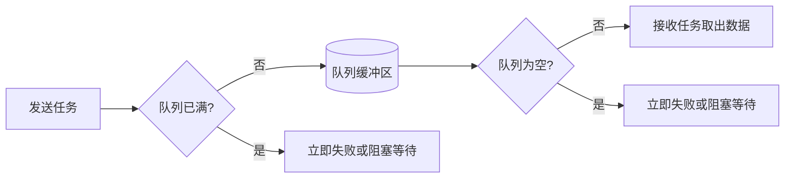

	
# RTOS高频面试题

> 本文对应原复习文档第 8.1～8.30 题，编号统一为 A1～A30。答案以原标准答案为基础，并结合本项目真实代码整理。

## 使用方法

1. 先遮住答案，只看题目并口述。
2. 再对照答案，重点检查是否说出“核心原理”和“项目实例”。
3. 不必逐字背诵，但技术关键词和因果关系不能说错。
4. 每次练习只回答一题，答完后再看下一题。
5. **A0 是面试开场的项目自我介绍稿，务必先练熟再进入 A1～A30 的技术点。**

---

## A0. 请介绍一下你的项目。（面试开场稿）

> ⭐ 面试几乎必问的第一题，也是唯一由你主动控场的部分。建议背熟“电梯稿”，讲顺“详细版”，并准备好 3 个 STAR 亮点应对追问。

### 一、项目基本信息速查表（硬信息，随时可能被问）

| 项目 | 内容 |
| --- | --- |
| 项目名称 | 基于 STM32 + FreeRTOS 的智能油烟机控制系统 |
| 主控芯片 | STM32F103C8T6（Cortex-M3，72 MHz，64 KB Flash / 20 KB RAM） |
| 操作系统 | FreeRTOS V9.0.0，heap_4，tick 1000 Hz |
| 系统架构 | 三层：BSP 驱动层 / FreeRTOS 中间层 / APP 应用层 |
| 任务数量 | 7 个常驻业务任务 + 启动任务（IAP 任务为条件编译，默认关闭） |
| 核心算法 | 多传感器融合风速决策 + 位置式 PID 闭环调速 |
| 关键外设 | TIM1 互补 PWM、TIM2 编码器、DHT11、MQ2、SPI LCD、USART+DMA |
| 工作模式 | 待机、手动、自动、防回流 四种 |
| 开发形式 | 〔待填：个人项目 / 团队，你负责的部分〕 |
| 开发周期 | 〔待填：约 X 周/月〕 |

> 📌 表中“待填”项请按你的真实情况补上，面试官很爱问“这是你一个人做的吗、做了多久”。

### 二、30 秒电梯稿（先背这个）

我做的是一个基于 STM32F103 和 FreeRTOS 的智能油烟机控制系统。它通过 DHT11 和 MQ2 采集温湿度与油烟浓度，用多传感器融合算法决策目标转速，再通过编码器反馈和 PID 闭环精确控制直流电机的转速。整个系统用 FreeRTOS 把按键、采集、控制、显示等不同周期的业务拆成多个任务，采用三层架构，支持待机、手动、自动和防回流四种工作模式。我在这个项目里主要负责〔待填〕，重点解决了多任务并发下的状态共享和电机闭环调速两个问题。

### 三、2～3 分钟详细版（按 背景→架构→功能→难点→成果 展开）

**背景与目标：**传统油烟机大多是几档定速、手动调节，不能根据油烟大小自动调速。我想做一个能自动感知、自动调速的控制系统，用它来练习 RTOS 多任务开发和闭环控制。

**整体架构：**系统采用三层架构。最底层是 BSP 驱动层，封装按键、DHT11、MQ2、PWM、编码器、LCD 等硬件时序；中间是 FreeRTOS，提供任务调度、互斥量、信号量和软件定时器；最上层是应用层，负责模式状态机和业务逻辑。这样分层的好处是高内聚低耦合，每一层可以独立开发和测试。

**核心功能：**一共 7 个常驻任务，按响应实时性分配优先级——速度计算任务最高（响应 TIM4 的 1 ms 节拍，防止编码器丢脉冲），电机控制次之，然后是按键、传感器采集、风速计算、防回流，UI 显示最低。任务之间用一个全局状态结构体 `g_systemState` 加互斥量 `g_dataMutex` 共享最新状态，用二值信号量做中断到任务的事件通知。控制上，编码器把实际转速反馈给位置式 PID（Kp=14、Ki=1.65、Kd=0，实际是 PI 控制），算出 PWM 占空比驱动 H 桥电机。

**难点与解法：**我遇到的主要难点有三个——一是多任务同时读写共享状态导致数据不一致，用互斥量保护关键读写解决；二是电机调速的超调和稳态误差，通过 PID 调参和积分、输出限幅解决；三是〔待填：你印象最深的一个 bug 或优化，例如优先级设计、栈大小调优〕。

**成果与反思：**目前系统能稳定运行四种模式，实现了油烟浓度驱动的自动调速闭环。我也清楚它还有不足，比如动态内存用的是通用 heap_4 而没有做固定块内存池，IAP 在线升级还是实验性链路、默认关闭且没有 A/B 双分区回滚，这些是我后续想继续完善的方向。

> ⚠️ **诚实红线**：不要宣称“转速精度 ±5%”“有看门狗保护”“通过工业认证”——源码里没有这些证据，说了经不起追问。IAP 也要如实说明是“默认关闭的实验功能”，不要说成产品级已完成。

### 四、3 个 STAR 亮点故事（应对“讲一个你解决的难点”）

**亮点 1 · 多任务状态共享（对应 A1、A2）**
- S/T：多个任务都要读写当前模式、温湿度、转速等状态，抢占式调度下同时读写会读到“半新半旧”的脏数据。
- A：把状态集中到全局结构体 `g_systemState`，用互斥量 `g_dataMutex` 保护关键读写，锁内只做必要的复制/更新，把 LCD 刷新、串口打印等耗时操作放到锁外。
- R：状态一致性问题消失，也没有因为长临界区拖慢高优先级任务。

**亮点 2 · PID 闭环调速调参（对应 A9、A10）**
- S/T：电机开环调速转速不稳、负载变化时掉速，需要闭环。
- A：用 TIM2 编码器测速做反馈，位置式 PID 计算 PWM；先整定 Kp 提高响应，再加小 Ki 消除稳态误差，Kd 置 0 避免放大噪声，最终 Kp=14、Ki=1.65；对积分项和输出（0～1000）做限幅防积分饱和。
- R：转速能快速跟随目标并稳定，超调可控。

**亮点 3 · 任务优先级与实时性设计（对应 A29）**
- S/T：任务多，若优先级乱设会出现测速丢脉冲或低优先级饿死。
- A：按“响应期限+执行时间”而非“功能重要性”分配优先级，测速任务最高、UI 最低，并保证每个任务都有延时或信号量等待这样的阻塞点。
- R：编码器脉冲不丢、控制环及时、UI 也不卡，系统整体实时性稳定。

### 五、常见追问预案

| 追问 | 回答要点 |
| --- | --- |
| 这个项目为什么用 RTOS 而不是裸机？ | 多个不同周期的业务（1 ms 测速～500 ms 采集）并发，裸机大循环难保证实时性；RTOS 抢占式调度能让高优先级任务及时响应，任务间用信号量/互斥量解耦。（详见 A24） |
| 为什么选 STM32F103？ | Cortex-M3、资源够用、生态成熟、FreeRTOS 移植方便，适合这类中等复杂度控制项目。 |
| 这个项目最难的地方？ | 见上面 3 个 STAR 亮点，任选最熟的一个深入讲。 |
| 项目有什么不足 / 下一步怎么优化？ | ①用固定块内存池替代通用 heap_4 提升确定性（A27）；②IAP 补齐 A/B 双分区回滚与断点续传，并删除 CRC 失败仍擦除的风险代码（A30）；③开启栈溢出检测和看门狗（A4）。 |

---

## A1. 为什么在 RTOS 的多任务间通信中，使用互斥量加全局变量的形式？

**答案：**本项目中的多个任务都需要读取或更新当前模式、温湿度、气体浓度、目标转速和实际转速等最新状态，所以把这些数据集中放在全局结构体 `g_systemState` 中，相当于系统的公共状态面板。FreeRTOS 是抢占式调度，如果一个任务正在更新结构体，另一个任务同时读取，就可能读到一半新、一半旧的数据，造成状态不一致。因此项目使用 `g_dataMutex` 保护关键读写，保证共享状态不会被多个任务同时修改或在更新过程中被读取。使用时只在锁内复制或更新必要字段，完成后立即释放，不能把 LCD 刷新、串口打印等耗时操作放在互斥区内。

![[projects/RTOS项目/assets/state-sharing_animated.svg]]

## A2. 为什么本项目不主要采用队列进行任务间通信？

**答案：**队列是先进先出的，适合传递必须按顺序处理的命令、事件或数据流，例如连续收到的多条控制命令，每一条都不能漏掉。但本项目大部分任务只关心当前最新状态，例如 LCD 只需要当前模式和转速，电机控制只需要当前目标转速和实际转速，并不需要依次处理过去每一次传感器数据。如果每个状态都建立队列，会增加队列缓存、内存占用和同步逻辑。因此项目使用 `g_systemState` 保存一份最新状态，再用 `g_dataMutex` 保护关键读写，更简单，也更符合本项目需求。队列并不是不好，只是更适合“每条消息都要处理”的场景。

| 需求 | 更合适的方式 |
| --- | --- |
| 多个任务读取同一份最新状态 | 全局状态结构体 + 互斥量 |
| 命令、事件必须逐条处理 | 队列 |
| 中断只通知任务发生了一次事件 | 二值信号量或任务通知 |

## A3. 请说一下堆和栈的区别。
> 📎 同类八股：[[#同类八股-第8题：堆和栈有什么区别？|嵌入式八股150题#第8题：堆和栈有什么区别？]]

## A4. FreeRTOS 任务栈大小的单位是字还是字节？栈溢出会造成什么风险？
> 📎 同类八股：[[#同类八股-第13题：栈溢出是什么？如何避免？|嵌入式八股150题#第13题：栈溢出是什么？如何避免？]] | [[#同类八股-第104题：如何判断 FreeRTOS 任务栈是否够用？|嵌入式八股150题#第104题：如何判断 FreeRTOS 任务栈是否够用？]]


**答案：**`xTaskCreate()` 的栈深度参数单位不是固定的“字节”，而是 `StackType_t` 元素个数。在本项目的 Cortex-M3 移植中，`StackType_t` 是 32 位，因此一个单位是 4 字节。例如 `TASK_START_STK_SIZE` 为 64，实际任务栈空间就是 64×4，也就是 256 字节。栈溢出后会覆盖相邻内存，可能破坏局部变量、返回地址、TCB 或其他任务数据，表现为数据异常、程序跑飞或 HardFault，不一定立刻报错。本项目当前 `configCHECK_FOR_STACK_OVERFLOW` 为 0，正式工程建议开启栈溢出检测，并用 `uxTaskGetStackHighWaterMark()` 检查剩余栈空间。

## A5. 请说一下 FreeRTOS 的启动流程。
> 📎 同类八股：[[#同类八股-第51题：STM32 启动流程大致是什么？|嵌入式八股150题#第51题：STM32 启动流程大致是什么？]] | [[#同类八股-第56题：SysTick 在嵌入式系统中有什么作用？|嵌入式八股150题#第56题：SysTick 在嵌入式系统中有什么作用？]]


**答案：**STM32 上电复位后，Cortex-M3 先从向量表取出初始 MSP，再取出 `Reset_Handler` 地址开始执行。启动代码完成系统时钟和 C 运行环境初始化，把 `.data` 从 Flash 复制到 RAM、清零 `.bss`，然后进入 `main()`。本项目在 `main()` 中先执行 `Hardware_Init()` 初始化 TIM1 PWM、TIM2 编码器、传感器、PID、LCD、串口和 DMA，再执行 `System_Init()` 初始化 `g_systemState` 并创建互斥量、二值信号量，然后通过 `StartTask_Create()` 创建启动任务，最后调用 `vTaskStartScheduler()`。调度器会创建空闲任务，启用软件定时器时还会创建定时器服务任务，并由移植层配置 SysTick 和 PendSV，最后通过 SVC 恢复第一个任务的上下文。`StartTask` 运行后创建各业务任务，最后启动 TIM4 并删除自己。之后 SysTick 提供系统节拍，PendSV 负责后续任务切换，正常情况下 `vTaskStartScheduler()` 不会返回。

![[projects/RTOS项目/assets/freertos-startup_animated.svg]]

## A6. 什么是 Bootloader？STM32 的上电启动流程是怎样的？
> 📎 同类八股：[[#同类八股-第52题：Bootloader 有什么作用？|嵌入式八股150题#第52题：Bootloader 有什么作用？]]


**答案：**Bootloader 是上电后优先运行的一段引导程序，负责判断启动条件、完成必要初始化、校验应用程序，并选择进入升级流程还是跳转到 APP。STM32 复位后，会根据 BOOT 引脚把启动存储区映射到 `0x00000000`，内核从向量表第一个字读取初始 MSP，从第二个字读取复位入口地址，然后执行 `Reset_Handler`，完成时钟、`.data` 和 `.bss` 初始化后进入 C 程序。结合本项目，升级数据由 USART1 接收，DMA1_Channel5 搬运到 RAM，DMA 完成中断释放 `g_iapSemaphore`，`iap_task` 做 CRC32 校验；校验通过后才把固件正文写入 `FLASH_APP1_ADDR`。跳转前还要检查 APP 的初始栈地址是否合法，关闭相关中断和外设，设置 APP 的 MSP，再跳到 APP 的复位入口。Bootloader 的核心作用就是确保“能升级、能校验、能正确启动 APP”。

![[projects/RTOS项目/assets/boot-vs-freertos-startup.svg]]

## A7. 移植 FreeRTOS 时需要配置或修改哪些文件？

**答案：**移植 FreeRTOS 一般不是修改内核算法，而是完成”加入内核源码、选择处理器移植层、配置工程参数、接管三个异常”这几件事。

![[projects/RTOS项目/assets/freertos-porting-steps.svg]]

## A8. 请说一下直流有刷电机的驱动原理。

**答案：**直流有刷电机的方向由电机两端电压方向决定，通常用 H 桥控制：导通一组对角 MOS 管时正转，导通另一组对角 MOS 管时反转。速度则通过 PWM 调节，改变占空比就改变电机两端的平均电压，从而改变转速。H 桥同一桥臂的上下管绝对不能同时导通，否则会造成电源直通，所以切换方向时要先关闭原通道，并通过互锁和死区时间留出 MOS 管关断时间。本项目使用 TIM1 的 CH1 和 CH1N 输出互补 PWM，频率为 1 kHz，PA2 控制 H 桥使能；`motor_dir()` 会先关闭 CH1/CH1N，再使能目标通道，`motor_stop()` 同时关闭两个通道并拉低 PA2。实际转速再由编码器反馈给 PID，形成闭环调速。

| 控制目标 | 本项目实现 |
| --- | --- |
| 正反转 | 在 CH1 与 CH1N 之间切换，改变 H 桥电流方向 |
| 调速 | 修改 TIM1 的 CCR1，改变 PWM 占空比 |
| 防直通 | 互补输出、死区时间、切换前先关闭通道 |
| 总使能 | PA2 控制 H 桥驱动使能 |


## A9. 请说一下编码器测速的原理。

**答案：**编码器把电机旋转转换成 A、B 两路相差 90° 的正交脉冲。定时器根据两路信号的相位先后判断方向，再统计脉冲数。本项目把 A、B 相接到 PA0/TIM2_CH1 和 PA1/TIM2_CH2，并把 TIM2 配置为 TI12 编码器模式进行计数，同时用溢出变量扩展 16 位计数范围。测速采用固定时间窗计数法：在确定的采样时间内读取计数变化量，再结合每圈计数数和采样周期换算 RPM。TIM4 只负责按固定节拍进入中断并通过 `xSemaphoreGiveFromISR()` 唤醒 `SpeedCalcTask`，真正的计数读取、速度换算和滤波放在任务中完成，最后把结果写入 `actualRPM`，供 PID 作为反馈。测速是否准确主要取决于编码器每圈脉冲数、倍频方式和实际采样周期是否一致。

![[projects/RTOS项目/assets/encoder-pid-loop_animated.svg]]

## A10. 什么是 PID 算法？P、I、D 分别解决什么问题？

**答案：**PID 是一种反馈闭环控制算法，先计算误差 `e=目标值-实际值`，再根据比例、积分和微分三部分得到控制输出。P 看当前误差，误差越大调节越强，负责快速靠近目标，但单独使用可能留下稳态误差；I 累加过去误差，只要误差长期存在就持续补偿，负责消除稳态误差，但过大会产生积分饱和、超调和振荡；D 看误差变化趋势，能够提前抑制变化，减少超调，但对测量噪声比较敏感。本项目通过编码器得到 `actualRPM`，与 `targetRPM` 做差后，用位置式 PID 计算 TIM1 PWM，参数为 `Kp=14.0`、`Ki=1.65`、`Kd=0`，因此当前实际是 PI 控制。代码还对积分和最终输出做限幅，PID 输出范围为 0～1000，对应 PWM 比较值范围。

| 参数 | 关注什么 | 主要作用 | 过大风险 |
| --- | --- | --- | --- |
| P | 当前误差 | 提高响应速度 | 超调、振荡 |
| I | 历史累计误差 | 消除稳态误差 | 积分饱和、响应拖尾 |
| D | 误差变化速度 | 提前制动、减小超调 | 放大噪声 |

## A11. 如何用 C 语言实现面向对象思想？

**答：**在C语言中实现面向对象编程，主要利用结构体和函数指针来模拟类的三大特性：封装、继承和多态。​

封装通过将数据成员和函数指针组合在一个结构体中实现。例如，定义一个“类”时，结构体包含状态变量，并包含指向相关操作的函数指针，使用者通过该结构体实例调用方法，隐藏内部实现细节。​
继承可以通过结构体嵌套来实现。将基类结构体作为子类结构体的第一个成员，这样在内存布局上，子类对象首地址与基类部分对齐，可以安全地将子类指针强制转换为基类指针，实现基类方法对派生部分的操作。​
多态则依赖于虚函数表（vtable）。在基类中定义一个包含函数指针的结构体作为虚表，基类实例中保存虚表指针。子类可以修改虚表中的函数指针指向自己的实现，从而实现运行时动态绑定，也就是多态。​
注：在本项目中，笔者使用的是封装思想。

## A12. 请说一下 DHT11 单总线协议。

**答案：**DHT11 使用一根数据线通信，空闲时由上拉保持高电平，通信由 MCU 主动发起。主机先把总线拉低至少 18 ms，再释放并等待 20～40 μs；DHT11 收到起始信号后，先拉低约 80 μs、再拉高约 80 μs作为响应。随后发送 40 位数据，每一位都先保持约 50 μs 低电平，再通过高电平时间区分 0 和 1：约 26～28 μs 表示 0，约 70 μs 表示 1。40 位依次是湿度整数、湿度小数、温度整数、温度小数和校验和，最后一个字节应等于前四个字节之和的低 8 位。本项目驱动用 30 μs 采样点判断位值，并设置超时避免一直卡在等待电平的循环中；`SensorTask` 每 500 ms 读取一次，校验通过后才更新系统状态。
![[projects/RTOS项目/assets/dht11-timing.svg]]

| 阶段   | 总线时序                         |
| ---- | ---------------------------- |
| 主机起始 | 拉低至少 18 ms，再拉高 20～40 μs      |
| 从机响应 | 约 80 μs 低电平 + 约 80 μs 高电平    |
| 数据 0 | 约 50 μs 低电平 + 约 26～28 μs 高电平 |
| 数据 1 | 约 50 μs 低电平 + 约 70 μs 高电平    |

## A13. 请说一下 SPI 的通信原理以及四种工作模式。
> 📎 同类八股：[[#同类八股-第81题：SPI 的基本通信原理是什么？|嵌入式八股150题#第81题：SPI 的基本通信原理是什么？]] | [[#同类八股-第82题：SPI 的 CPOL 和 CPHA 是什么？|嵌入式八股150题#第82题：SPI 的 CPOL 和 CPHA 是什么？]]
## A14. 请说一下编写 PWM 驱动的步骤。

**答案：**编写 PWM 驱动时，先根据芯片手册确定定时器、输出通道和对应 GPIO，然后打开 GPIO 与定时器时钟，把引脚配置成复用推挽输出。接着配置预分频器 PSC、自动重装值 ARR 和计数模式，PWM 频率通常按 `定时器时钟÷(PSC+1)÷(ARR+1)` 计算；再配置输出比较模式、极性、通道使能和 CCR，CCR 与 ARR 的比例决定占空比。为了让更新更平稳，通常还要打开 CCR 和 ARR 预装载。若使用 TIM1 这类高级定时器，还需要配置 CH1N 互补输出、BDTR 死区和主输出使能 MOE，最后使能定时器。本项目调用 `TIM1_dead_pwm_init(999,71,0,100)` 得到 1 kHz PWM，初始 CCR 为 0，并通过 `TIM_CtrlPWMOutputs()` 打开 MOE；运行时由 `motor_speed()` 修改 CCR1 调速。

> **📝 详细理解：**

**第一步：确定硬件连接**
```
1. 查芯片手册 → 选择定时器（如 TIM1）
2. 选择输出通道 → CH1 对应 PA8
3. 确认 GPIO → PA8 需要配置为复用推挽输出
```

**第二步：开启时钟**
```c
RCC_APB2PeriphClockCmd(RCC_APB2Periph_TIM1, ENABLE);  // 定时器时钟
RCC_APB2PeriphClockCmd(RCC_APB2Periph_GPIOA, ENABLE); // GPIO 时钟
```

**第三步：配置 GPIO**
```c
GPIO_InitStructure.GPIO_Mode = GPIO_Mode_AF_PP;  // 复用推挽输出
GPIO_InitStructure.GPIO_Pin = GPIO_Pin_8;        // PA8
GPIO_InitStructure.GPIO_Speed = GPIO_Speed_50MHz;
GPIO_Init(GPIOA, &GPIO_InitStructure);
```

**第四步：配置定时器基础参数（关键！）**
```
PWM 频率 = 定时器时钟 ÷ (PSC+1) ÷ (ARR+1)

本项目示例（72 MHz 系统时钟）：
  - TIM1 时钟 = 72 MHz
  - PSC = 71  → 分频后 = 72MHz ÷ (71+1) = 1 MHz
  - ARR = 999 → 周期 = 1MHz ÷ (999+1) = 1000 Hz = 1 kHz

计数模式：向上计数（TIM_CounterMode_Up）
```

**第五步：配置输出比较（PWM 模式）**
```
- 输出比较模式：PWM 模式 1（TIM_OCMode_PWM1）
  → 计数器 < CCR 时输出有效电平，≥ CCR 时输出无效电平
  
- 输出极性：高电平有效（TIM_OCPolarity_High）
  
- 通道使能：TIM_OutputState_Enable

- CCR 值：决定占空比
  → 占空比 = CCR / (ARR + 1) × 100%
  → 本项目：CCR = 0 时占空比 0%，CCR = 500 时占空比 50%
```

**第六步：预装载使能（平滑更新）**
```
CCR 预装载：更新 CCR 值时不立即生效，等下一个更新事件
ARR 预装载：更新 ARR 值时不立即生效，等溢出时更新
→ 防止在 PWM 周期中间改变参数导致毛刺
```

**第七步：高级定时器特殊配置（TIM1/TIM8）**
```
1. CH1N 互补输出：H 桥需要互补 PWM（如 PA7 输出反向 PWM）
2. 死区时间：防止 H 桥上下管直通短路
3. MOE（主输出使能）：TIM_CtrlPWMOutputs(TIM1, ENABLE)
   → 不开启 MOE，PWM 无输出！
```

**第八步：使能定时器**
```c
TIM_Cmd(TIM1, ENABLE);  // 开始产生 PWM
```

---

**本项目参数分析**

```c
TIM1_dead_pwm_init(999, 71, 0, 100);
```

| 参数 | 含义 | 计算 |
|------|------|------|
| 999 | ARR（自动重装值） | 周期 = (999+1) × 分频后时间 |
| 71 | PSC（预分频器） | 分频后频率 = 72MHz ÷ (71+1) = 1 MHz |
| 0 | CCR（初始占空比） | 初始占空比 = 0/(999+1) = 0% |
| 100 | 死区时间 | 防止 H 桥直通 |

**最终 PWM 参数：**
- 频率 = 72MHz ÷ 72 ÷ 1000 = **1 kHz**
- 占空比 = CCR / 1000 × 100%（运行时由 `motor_speed()` 修改 CCR1）

**运行时调速**
```c
void motor_speed(uint16_t duty) {
    TIM_SetCompare1(TIM1, duty);  // 修改 CCR1，改变占空比
}
```

---

**PWM 波形示意**
```
ARR = 999, CCR = 500 时：

计数器: 0 → 500 → 999 → 溢出重置
         ↘      ↗
          \    /
           \  /
            \/
PWM 输出:  ┌─────────┐
           │ 高电平   │ 低电平 │
           └─────────┘
           |← 50% →|
```

**记忆口诀：**
> **"定通时引"** → 定定时器、通时钟、引脚复用
> **"分频周期"** → PSC 分频、ARR 定周期
> **"比较占空"** → 比较模式、CCR 定占空比
> **"死区互补"** → 高级定时器要配死区和互补输出

## A15. 请说一下 FreeRTOS 的任务切换原理。
> 📎 同类八股：[[#同类八股-第93题：FreeRTOS 的任务调度机制是什么？|嵌入式八股150题#第93题：FreeRTOS 的任务调度机制是什么？]]


**答案：**任务切换的本质不是只换一个函数，而是保存当前任务的完整上下文，再恢复另一个任务的上下文。切换可能由系统节拍、任务阻塞、主动让出 CPU，或者高优先级任务被事件唤醒触发。Cortex-M3 进入异常时，硬件会自动把 R0～R3、R12、LR、PC 和 xPSR 压入当前任务栈；PendSV 再由软件保存 R4～R11，并把当前 PSP 保存到当前任务的 TCB 中。调度器选择最高优先级的就绪任务后，从它的 TCB 取出栈指针，恢复 R4～R11，再通过异常返回由硬件恢复剩余寄存器，CPU 就从新任务上次停止的位置继续执行。本项目把 PendSV 设置为最低优先级，使任务切换不会抢占更紧急的外设中断；SVC 用于启动第一个任务，之后主要由 PendSV 完成切换。

![[projects/RTOS项目/assets/context-switch_animated.svg]]

## A16. 什么是优先级反转？如何解决？
> 📎 同类八股：[[#同类八股-第95题：什么是优先级反转？如何解决？|嵌入式八股150题#第95题：什么是优先级反转？如何解决？]]

## A17. RTOS 中的延时函数如何实现调度？

**答案：**RTOS 延时不是让 CPU 原地空转，而是把延时时间换算成系统 tick，记录任务的唤醒时刻，再把当前任务从就绪表移到延时列表，使它进入阻塞态并触发调度，CPU 就可以去运行其他就绪任务。每次 SysTick 到来时，内核增加 tick 计数，并检查是否有任务到达唤醒时间；到期任务会重新进入就绪态，如果它的优先级高于当前任务，就通过 PendSV 完成切换。本项目的 tick 频率是 1000 Hz，也就是 1 ms 一个 tick，`delay_ms()` 在调度器启动后会调用 `vTaskDelay()`。按键、传感器、电机和 UI 任务分别延时 10、500、50 和 200 ms，因此不会一直占用 CPU。只有 DHT11 这类微秒级严格时序才使用忙等待的 `delay_us()`。

## A18. RTOS 中二值信号量与计数信号量有什么区别？
> 📎 同类八股：[[#同类八股-第98题：二值信号量和计数信号量有什么区别？|嵌入式八股150题#第98题：二值信号量和计数信号量有什么区别？]]


## A19. 请说一下 FreeRTOS 的动态内存管理方式。
> 📎 同类八股：[[#同类八股-第103题：FreeRTOS 的 heap_1 到 heap_5 有什么区别？|嵌入式八股150题#第103题：FreeRTOS 的 heap_1 到 heap_5 有什么区别？]]


**答案：**FreeRTOS 对外统一提供 `pvPortMalloc()` 和 `vPortFree()`，内部可以选择五种堆实现。`heap_1` 只分配不释放，最简单、确定性好；`heap_2` 支持释放，但不会合并相邻空闲块，容易产生外部碎片；`heap_3` 直接封装 C 库的 `malloc/free`；`heap_4` 支持分配和释放，还能合并相邻空闲块，是多数单 RAM 区域项目的常用方案；`heap_5` 在 `heap_4` 基础上支持多个不连续内存区域。本项目在 Keil 工程中加入的是 `heap_4.c`，`configTOTAL_HEAP_SIZE` 配置为 10 KB，动态创建任务、队列、互斥量和信号量时会从这块 RTOS 堆中申请内存。选型时不只是看能否释放，还要考虑碎片、确定性以及是否存在多个内存区域。

| 实现 | 能否释放 | 是否合并相邻空闲块 | 典型场景 |
| --- | --- | --- | --- |
| heap_1 | 否 | 不需要 | 只在启动阶段创建、永不删除 |
| heap_2 | 是 | 否 | 兼容旧方案，易碎片化 |
| heap_3 | 是 | 取决于 C 库 | 直接使用标准库分配器 |
| heap_4 | 是 | 是 | 单个连续 RAM 区，本项目使用 |
| heap_5 | 是 | 是 | 多个不连续 RAM 区域 |

## A20. 什么是内存碎片？
> 📎 同类八股：[[#同类八股-第20题：为什么嵌入式系统中通常不建议频繁使用动态内存？|嵌入式八股150题#第20题：为什么嵌入式系统中通常不建议频繁使用动态内存？]]

## A21. 全局变量、静态全局变量和局部变量的存储区域及生命周期有什么区别？
> 📎 同类八股：[[#同类八股-第9题：全局变量、局部变量和静态变量分别存放在哪里？|嵌入式八股150题#第9题：全局变量、局部变量和静态变量分别存放在哪里？]]


## A22. 请说一下内存泄漏的原因。
> 📎 同类八股：[[#同类八股-第12题：什么是内存泄漏？如何避免？|嵌入式八股150题#第12题：什么是内存泄漏？如何避免？]]


## A23. GPIO 配置为输入模式时，上拉和下拉电阻有什么作用？

**答案：**GPIO 输入阻抗很高，如果外部设备没有主动输出，引脚就会悬空，容易受到电磁干扰而随机跳变。上拉电阻把空闲电平稳定在高电平，下拉电阻把空闲电平稳定在低电平，从而给输入一个确定的默认状态。选择哪一种取决于外部电路和有效电平，例如按键一端接地时通常用上拉，松开读到 1、按下读到 0。本项目按键采用上拉输入，就是为了避免松开时电平漂浮。内部上拉、下拉电阻阻值通常较大，适合普通输入；像 I²C 开漏总线或干扰较强的场景，往往还需要根据速度和负载选择合适的外部上拉电阻。

## A24. 裸机系统与 RTOS 系统的核心差异是什么？
> 📎 同类八股：[[#同类八股-第91题：裸机和 RTOS 有什么区别？|嵌入式八股150题#第91题：裸机和 RTOS 有什么区别？]]


## A25. RTOS 中消息队列的发送与接收过程是什么？队列满或空时如何处理？
> 📎 同类八股：[[#同类八股-第96题：FreeRTOS 队列有什么作用？|嵌入式八股150题#第96题：FreeRTOS 队列有什么作用？]]


**答案：**FreeRTOS 队列通常按固定长度和固定元素大小创建，发送时会把一份数据复制进队列，接收时再复制到接收变量中，因此发送方和接收方不需要共享同一块原始数据。发送时如果队列未满，数据入队，并唤醒等待接收的最高优先级任务；如果队列已满，等待时间为 0 就立即返回失败，等待时间大于 0 就把发送任务放入等待列表，直到有空位或超时。接收过程正好相反：队列非空就取出数据并可能唤醒等待发送的任务；队列为空时可以立即失败、限时阻塞或使用 `portMAX_DELAY` 一直等待。调用者必须检查返回值，决定重试、丢弃、覆盖还是报警。在 ISR 中不能使用普通队列 API，而要使用 `xQueueSendFromISR()` 等 `FromISR` 版本。



## A26. 请说一下 STM32 的中断响应过程。

**答案：**外设事件发生后先置位中断标志，并向 NVIC 发出请求。NVIC 检查中断是否使能、优先级是否允许抢占以及当前屏蔽状态；条件满足时，Cortex-M3 在完成当前指令后进入异常。硬件自动把 R0～R3、R12、LR、PC 和 xPSR 压入当前栈，再从中断向量表取出 ISR 地址并跳转执行。ISR 中通常先确认中断源、清除标志，再完成最必要的处理；执行异常返回指令后，硬件自动恢复之前压栈的寄存器，程序回到被打断的位置继续运行。若有更高优先级中断到来，可以发生中断嵌套。结合本项目，TIM4 中断清除更新标志后只释放速度计算信号量，DMA 中断清除传输完成标志后只释放 IAP 信号量，把耗时工作留给任务处理。

## A27. RTOS 的内存池机制如何优化内存分配？

**答案：**内存池是在系统初始化时预先申请一大块连续内存，再按固定大小切成多个内存块，并用空闲链表或位图管理。任务申请时直接取出一个空闲块，释放时再放回池中，不需要每次搜索和切割不同大小的区域，因此分配和释放速度快、执行时间更确定，也不会产生外部碎片，适合实时性要求高和对象大小固定的场景，例如消息节点、网络包或固定尺寸缓冲区。缺点是可能产生内部碎片：对象比块小时，剩余空间会浪费；对象比块大时又无法直接分配。因此工程上常建立多个不同块大小的内存池。本项目使用的是 `heap_4` 通用动态分配器，并没有专门实现固定块内存池；如果以后频繁创建固定大小的数据包，可以增加内存池来提高确定性。

## A28. FreeRTOS 中 ISR 与任务如何安全通信？为什么不建议在 ISR 中直接调用复杂函数？
> 📎 同类八股：[[#同类八股-第102题：中断和任务之间如何同步？|嵌入式八股150题#第102题：中断和任务之间如何同步？]]


**答案：**ISR 中应使用专门的 `FromISR` API，例如 `xSemaphoreGiveFromISR()`、`xQueueSendFromISR()`，因为这些接口不会让中断阻塞，并能通过 `xHigherPriorityTaskWoken` 告诉内核是否有更高优先级任务被唤醒；如果为真，就在退出中断前调用 `portYIELD_FROM_ISR()`，让高优先级任务尽快运行。ISR 必须尽量短，因为中断执行时间过长会增加其他中断的响应延迟；复杂函数还可能包含阻塞、动态内存、不可重入代码或长临界区，在中断上下文中调用可能破坏实时性甚至导致死锁。本项目的 TIM4 ISR 只清标志并通知 `SpeedCalcTask`，DMA ISR 只通知 `iap_task`；RPM 计算、滤波、CRC32、Flash 擦写和 APP 跳转全部放在任务上下文完成。

![[projects/RTOS项目/assets/isr-task-handoff_animated.svg]]

## A29. RTOS 任务优先级应如何分配？高优先级任务长期占用 CPU 会有什么问题？
> 📎 同类八股：[[#同类八股-第94题：FreeRTOS 任务优先级如何设计？|嵌入式八股150题#第94题：FreeRTOS 任务优先级如何设计？]]


**答案：**任务优先级应根据响应期限、执行周期和阻塞关系分配，而不是简单按照“功能重要程度”分配。实时性高、必须快速响应且执行时间短的任务优先级应较高；允许延迟、执行时间长的显示和日志任务优先级应较低。任务优先级设置后还必须保证每个任务有延时、信号量等待或其他阻塞点。如果高优先级任务在死循环中一直处于就绪态，它会持续抢占 CPU，使低优先级任务虽然已经就绪却永远得不到运行机会，这叫任务饥饿。本项目中 IAP、测速和电机控制优先级较高，UI 显示优先级最低；`SpeedCalcTask` 等待 TIM4 信号量，其他周期任务会主动延时。如果高优先级任务长期关闭中断或停留在临界区，还会进一步影响 SysTick 和外设中断，造成系统时间和实时性异常。

| 本项目任务 | 优先级 | 设计原因 |
| --- | ---: | --- |
| `iap_task` | 7 | 升级使能时及时处理完整固件 |
| `SpeedCalcTask` | 6 | 保证测速反馈及时 |
| `MotorControlTask` | 5 | 保证控制环响应 |
| `KeyScanTask` | 4 | 保证人机操作响应 |
| `SensorTask` / `WindSpeedTask` | 3 | 周期采集与计算 |
| `AntiBackflowTask` | 2 | 100 ms 周期保护判断 |
| `UIDisplayTask` | 1 | 显示延迟通常不影响控制安全 |

## A30. 固件升级时突然断电，再次上电如何保证系统恢复并重新升级？
> 📎 同类八股：[[#同类八股-第63题：Flash 写入和掉电保护要注意什么？|嵌入式八股150题#第63题：Flash 写入和掉电保护要注意什么？]]


**答案：**先要如实区分设计目标、当前代码和完整的抗断电方案。本项目采用 Bootloader 区与单 APP 区分离，固件通过 USART + DMA 接收，设计上应先做 CRC32 校验，只有通过后才能擦除并写入 `0x0800F000`，跳转前还要检查初始 MSP 和复位向量是否合法。需要注意，当前 `iap_task` 的 CRC 失败分支仍然调用了 `FLASH_ErasePage(FLASH_APP1_ADDR)`，这与“校验失败不擦除”的目标矛盾，是必须删除的风险代码，不能在面试中说成已经完全保护。即使修正这一点，写 APP 过程中突然断电仍可能留下不完整固件；再次上电时 Bootloader 应校验 APP，无效就留在升级模式等待重传。更可靠的量产方案是 A/B 双 APP 分区：新固件先写入非活动分区，完整校验通过后再原子切换启动标志；新版本启动成功后写确认标志，若启动失败或看门狗复位则自动回滚旧分区。因此，本项目已有 CRC、入口检查和非法 APP 不跳转的基础，但尚未完整实现 A/B 回滚与断点续传。

![[projects/RTOS项目/assets/iap-power-recovery_animated.svg]]


---

# 同类八股完整内容（悬停预览用）

> 说明：本区内容摘自 [[projects/嵌入式八股/嵌入式八股150题|嵌入式八股150题]]，用于让上方“同类八股”链接像原文件速查表一样，在当前文档内悬停预览。

## 同类八股-第8题：堆和栈有什么区别？

> 来源：[[projects/嵌入式八股/嵌入式八股150题#第8题：堆和栈有什么区别？|嵌入式八股150题#第8题：堆和栈有什么区别？]]

> **栈由编译器自动管理（函数进出），速度快但空间小；堆由程序员手动管理（malloc/free），灵活但风险大。**

**① 核心区别对比**

| **对比项** | 栈（Stack） | 堆（Heap） |
|--------|------------|-----------|
| **管理方式** | 编译器自动分配释放 | 程序员手动 malloc/free |
| **速度** | 快（直接移动栈指针） | 慢（需要查找空闲块） |
| **空间大小** | 较小（通常几KB~几MB） | 较大（取决于系统可用内存） |
| **生存期** | 函数结束自动释放 | 由程序员控制 |
| **碎片问题** | 无（后进先出） | 有（频繁分配释放产生碎片） |
| **生长方向** | 向低地址增长（多数平台） | 向高地址增长（多数平台） |

**② 内存布局图**

```
┌───────────────┐ 高地址
│   栈 Stack     │ ← 局部变量、函数参数、返回地址（向下增长 ↓）
├───────────────┤
│       ↓       │
│   空闲区域     │
│       ↑       │
├───────────────┤
│   堆 Heap      │ ← malloc/new 分配（向上增长 ↑）
├───────────────┤
│ .bss / .data   │ ← 全局变量、静态变量
├───────────────┤
│ .text（代码段） │ ← 程序指令
└───────────────┘ 低地址
```

**③ 嵌入式中的注意事项**

| **问题** | 后果 | 建议 |
|------|------|------|
| **栈上放大型数组** | 栈溢出 → 系统崩溃 | 大数组放全局/静态区 |
| **深递归** | 栈溢出 | 改用循环或限制递归深度 |
| **频繁 malloc/free** | 内存碎片 → 运行久了分配失败 | 用静态分配或内存池 |
| **忘记 free** | 内存泄漏 | RAII 或成对管理 |

**面试常问追问**

| 追问 | 回答 |
|-------------|-----------|
| **栈溢出会怎样？** | 覆盖相邻内存，导致数据破坏或 HardFault（MCU）/段错误（Linux） |
| **栈的默认大小是多少？** | MCU 由链接脚本/RTOS配置，Linux 线程默认 8MB |
| **堆内存是物理地址吗？** | malloc 返回的是虚拟地址，需要页表映射到物理地址 |
| **为什么嵌入式慎用堆？** | RAM 有限、碎片不可控、分配时间不确定、长期运行稳定性差 |

---

## 同类八股-第13题：栈溢出是什么？如何避免？

> 来源：[[projects/嵌入式八股/嵌入式八股150题#第13题：栈溢出是什么？如何避免？|嵌入式八股150题#第13题：栈溢出是什么？如何避免？]]

> **栈空间用超了就是栈溢出——深递归、大局部数组、调用链太深都是元凶。**

**① 栈溢出原理**

```
栈空间（有限大小）
┌─────────────────┐ 高地址
│   main() 栈帧    │
│   funcA() 栈帧   │
│   funcB() 栈帧   │  ← 每调一层函数就压一帧
│   funcC() 栈帧   │
│   ...不断深入... │
│   💥 栈溢出！    │  ← 超出栈边界，覆盖其他内存
└─────────────────┘ 低地址
```

**② 常见原因**

| **原因**             | 说明                            |
| ------------------ | ----------------------------- |
| **递归没有终止条件**       | 无限递归，栈帧不断压入                   |
| **局部数组过大**         | 函数内定义 char buf[65536] 直接吃掉栈空间 |
| **调用链太深**          | 中间件/回调层层嵌套                    |
| **FreeRTOS 任务栈太小** | 任务栈分配不足，运行时溢出                 |

**③ 如何避免**

| **方法** | 说明 |
|------|------|
| **大数组放静态区/堆上** | static char buf[N] 或 malloc |
| **限制递归深度** | 加深度计数器或改用迭代 |
| **合理设置任务栈** | FreeRTOS 用 uxTaskGetStackHighWaterMark 监控 |
| **开启栈溢出检测** | configCHECK_FOR_STACK_OVERFLOW |

```cpp
// 错误：大数组放栈上
void bad() { char buf[4096]; }  // 💥 栈上吃掉 4KB

// 正确：大数组放静态区
void good() { static char buf[4096]; }  // ✅ 放在 BSS 段
```

**④ 记住什么**

- 栈溢出 ≠ 段错误，但栈溢出**常常导致**段错误或数据破坏
- 嵌入式 MCU 栈通常只有几 KB，比 Linux 小得多，更要注意
- FreeRTOS 每个任务独立栈，任务多时总栈空间可能超过 RAM

**面试常问追问**

| 追问 | 回答 |
|------|-------------|
| **栈溢出会怎样？** | 数据被覆盖、HardFault、程序跑飞、偶发崩溃 |
| **FreeRTOS 怎么检测栈溢出？** | 水位线 uxTaskGetStackHighWaterMark + 溢出钩子 |
| **栈和堆哪个在高地址？** | 取决于平台，ARM Cortex-M 通常栈在高地址向下增长 |
| **printf 会吃栈吗？** | 会，printf 内部缓冲区可能占数百字节到 1KB+ |

---

## 同类八股-第104题：如何判断 FreeRTOS 任务栈是否够用？

> 来源：[[projects/嵌入式八股/嵌入式八股150题#第104题：如何判断 FreeRTOS 任务栈是否够用？|嵌入式八股150题#第104题：如何判断 FreeRTOS 任务栈是否够用？]]

> **用 uxTaskGetStackHighWaterMark 查历史最小剩余，打开栈溢出检测钩子，高负载长时间测试后保留安全余量。**

**① 三种检测方法**

| 方法 | 说明 | 精度 |
|------|------|------|
| uxTaskGetStackHighWaterMark | 返回任务运行以来的最小剩余栈空间（单位：字） | 高 |
| configCHECK_FOR_STACK_OVERFLOW | FreeRTOS 内置钩子函数，溢出时自动调用 | 中 |
| 栈填充魔术值 | 未用栈区域填 0xA5，调试时查看被覆盖情况 | 低 |

**② 高水位线用法**

```c
void vTask(void *p) {
    for(;;) {
        // 定期检查栈高水位
        UBaseType_t watermark = uxTaskGetStackHighWaterMark(NULL);
        if (watermark < 50) {  // 剩余不到 50 字
            printf("Warning: task stack low! %d words left\n", watermark);
        }
        vTaskDelay(pdMS_TO_TICKS(1000));
    }
}
```

| 返回值 | 含义 |
|--------|------|
| 大（如 200） | 栈空间充裕，从未接近溢出 |
| 小（如 20） | 栈空间紧张，需要增大或优化 |
| 0 | 曾经恰好用完，极度危险 |

**③ 栈消耗大户**

| 来源 | 说明 |
|------|------|
| 局部变量大数组 | char buf[512] 直接吃掉 512 字节 |
| printf / sprintf | 格式化缓冲区，消耗几百字节 |
| 函数调用嵌套 | 每层调用保存 LR、寄存器 |
| 递归 | 调用深度不可控，嵌入式尽量避免 |
| 中断嵌套 | ISR 也用任务栈（MSP 或 PSP） |

**④ 工程实践**

| 步骤 | 操作 |
|------|------|
| 1 | 按经验设置初始栈大小（如 256/512/1024 字） |
| 2 | 高负载、长时间运行测试 |
| 3 | 读取每个任务的高水位线 |
| 4 | 高水位 < 总栈 20% 的任务，增大栈或优化代码 |
| 5 | 保留 20%~30% 安全余量 |

**面试常问追问**

| 追问 | 回答 |
|------|------|
| **栈溢出会导致什么？** | 破坏相邻内存（其他任务栈、内核对象、全局变量），导致 HardFault 或莫名数据错误 |
| **configCHECK_FOR_STACK_OVERFLOW 设 1 还是 2？** | 2 更严格（额外检查栈底标记），调试阶段建议设 2 |
| **栈设太大有什么问题？** | 浪费 RAM，嵌入式 RAM 有限，需要平衡 |

---

## 同类八股-第51题：STM32 启动流程大致是什么？

> 来源：[[projects/嵌入式八股/嵌入式八股150题#第51题：STM32 启动流程大致是什么？|嵌入式八股150题#第51题：STM32 启动流程大致是什么？]]

> **上电 → 读向量表取栈顶&复位入口 → 执行 Reset_Handler 做底层初始化 → 跳进 main()**

**① 上电/复位后，CPU 先读「中断向量表」**

向量表在 Flash 的最开头（通常是 0x08000000）：

| 位置        | 内容                     | 作用             |
| --------- | ---------------------- | -------------- |
| 第1个字（4字节） | **初始栈顶地址**             | 加载到 MSP（主堆栈指针） |
| 第2个字（4字节） | **Reset_Handler 入口地址** | CPU 跳过去执行      |

**② Reset_Handler 做底层初始化**

```text
1. 设置运行环境
2. .data 段：从 Flash 拷贝到 RAM（全局变量有初值的原因）
3. .bss 段：清零（未初始化全局变量默认为 0 的原因）
4. 调用 SystemInit() 配系统时钟
5. 进入 C 运行环境，调用 main()
```

**③ 关键文件关系**

| 文件 | 作用 |
|------|------|
| 启动文件 startup_xxx.s | 汇编，定义向量表和 Reset_Handler |
| 链接脚本 .ld/.sct | 决定 .data/.bss/堆/栈放在哪 |
| SystemInit() | 配 HSE/PLL/SYSCLK 等时钟 |

**面试常问追问**

| 追问 | 回答 |
|------|------|
| **全局变量为什么有初值？** | .data 段在 Flash 存了初始值，启动时由 Reset_Handler 拷贝到 RAM |
| **未初始化全局变量为什么默认是 0？** | 启动文件把 .bss 段清零了 |
| **栈空间哪来的？** | 向量表第一个字就是初始栈顶地址，启动时加载到 MSP |

---

## 同类八股-第56题：SysTick 在嵌入式系统中有什么作用？

> 来源：[[projects/嵌入式八股/嵌入式八股150题#第56题：SysTick 在嵌入式系统中有什么作用？|嵌入式八股150题#第56题：SysTick 在嵌入式系统中有什么作用？]]

> **SysTick 是 Cortex-M 内核自带的 24 位倒计数定时器，产生固定周期节拍中断——裸机中用于计时和延时，RTOS 中作为调度心跳。**

**① SysTick 基本参数**

| 参数 | 说明 |
|------|------|
| 位宽 | 24 位倒计数 |
| 时钟源 | AHB/8 或 AHB（系统时钟） |
| 最大计数 | 2^24 = 16,777,215 |
| 自动重载 | 到 0 时自动加载重载值并触发中断 |

**② 两种用途**

| 场景 | 作用 |
|------|------|
| 裸机 | 提供 ms/us 级延时和计时基准（HAL_Delay 就是用它） |
| RTOS | 提供系统 tick，驱动任务调度、延时、超时检测 |

**③ FreeRTOS 中的角色**

```text
SysTick 中断
    |
    v
xTaskIncrementTick()
    |
    +-- 更新系统 tick 计数
    +-- 检查延时任务是否到期
    +-- 必要时触发 PendSV 进行任务切换
```

**面试常问追问**

| 追问 | 回答 |
|------|------|
| **SysTick 是外设吗？** | 不是，它是 Cortex-M 内核的一部分，所有 Cortex-M 芯片都有 |
| **HAL_Delay 为什么不准？** | 它基于 SysTick 中断计数，中断延迟和优先级会影响精度 |
| **FreeRTOS 的 configTICK_RATE_HZ 是什么？** | SysTick 中断频率，设为 1000 则 1ms 一个 tick |

---

## 同类八股-第52题：Bootloader 有什么作用？

> 来源：[[projects/嵌入式八股/嵌入式八股150题#第52题：Bootloader 有什么作用？|嵌入式八股150题#第52题：Bootloader 有什么作用？]]

> **Bootloader 是上电后最先跑的小程序，决定是升级固件还是跳进应用程序。**

**① Bootloader 工作流程**

```text
上电
  |
  v
Bootloader 启动
  |
  +-- 检查升级标志/通信命令
  |     |
  |     +-- 需要升级 --> 通过串口/CAN/USB接收新固件 --> 写入Flash --> 重启
  |     |
  |     +-- 不需要升级 --> 校验应用程序合法性
  |                          |
  |                          +-- 合法 --> 设置MSP、VTOR --> 跳转APP
  |                          |
  |                          +-- 非法 --> 等待升级或报错
```

**② 跳转应用前的关键操作**

| 操作 | 说明 |
|------|------|
| 设置 MSP | 把 APP 的栈顶地址加载到主栈指针 |
| 设置 VTOR | 向量表偏移寄存器，指向 APP 的向量表 |
| 关/重配中断 | 避免跳转后中断还在 Bootloader 的处理函数 |
| 校验固件 | 检查 CRC/MD5 或特定标志位 |

**面试常问追问**

| 追问 | 回答 |
|------|------|
| **为什么跳转前要设 VTOR？** | 不设的话中断向量表还指向 Bootloader 区域，APP 的中断无法正确响应 |
| **Bootloader 和 APP 怎么通信？** | 共享 Flash 中的标志位、备份寄存器、或 RAM 中的通信区 |
| **IAP 是什么？** | In-Application Programming，应用内编程，本质就是 Bootloader 在线升级 |

---

## 同类八股-第81题：SPI 的基本通信原理是什么？

> 来源：[[projects/嵌入式八股/嵌入式八股150题#第81题：SPI 的基本通信原理是什么？|嵌入式八股150题#第81题：SPI 的基本通信原理是什么？]]

> **SPI 是四线制同步全双工总线，靠 CS 片选选设备、SCLK 驱动时序、MOSI/MISO 双向传数据，速度快协议简单。**

**① SPI 物理层**

| 信号线   | 全称                  | 作用              |
| ----- | ------------------- | --------------- |
| SCLK  | Serial Clock        | 主机产生的时钟信号       |
| MOSI  | Master Out Slave In | 主机发、从机收         |
| MISO  | Master In Slave Out | 从机发、主机收         |
| CS/SS | Chip Select         | 片选，低电平有效，每个从机一根 |

**② 通信过程**

```text
主机                    从机
  |--- CS 拉低（选中从机）--->|
  |--- SCLK 时钟启动 ------->|
  |--- MOSI 发送数据 ------->|
  |<-- MISO 同时返回数据 -----|
  |--- CS 拉高（释放从机）--->|
```

- **全双工**：发送和接收同时进行，主机发 8bit 的同时从机也在移出 8bit
- **只读不发也要产生时钟**：主机想读从机数据，必须发 dummy 字节（如 0xFF）驱动时钟

**③ SPI vs I2C vs UART 速查**

| 对比项 | SPI | I2C | UART |
|--------|-----|-----|------|
| 线数 | 4 | 2 | 2 |
| 通信方式 | 全双工、同步 | 半双工、同步 | 全双工、异步 |
| 速率 | 可达几十 MHz | 100k~3.4MHz | 通常 ≤1Mbps |
| 多从机 | 每个需独立 CS | 地址寻址 | 点对点 |
| 典型场景 | Flash、LCD、高速 ADC | EEPROM、传感器 | 调试口、蓝牙 |

**面试常问追问**

| 追问 | 回答 |
|------|------|
| **SPI 没有 ACK 怎么保证可靠？** | 靠应用层校验（CRC/状态寄存器）或重发 |
| **CS 片选时序要注意什么？** | 传输前拉低、传输后拉高；有些设备要求 CS 拉高才触发命令 |
| **SPI 为什么比 I2C 快？** | 全双工无地址/ACK 开销，推挽输出驱动强，时钟可达几十 MHz |

---

## 同类八股-第82题：SPI 的 CPOL 和 CPHA 是什么？

> 来源：[[projects/嵌入式八股/嵌入式八股150题#第82题：SPI 的 CPOL 和 CPHA 是什么？|嵌入式八股150题#第82题：SPI 的 CPOL 和 CPHA 是什么？]]

> **CPOL 决定时钟空闲电平，CPHA 决定数据在哪边沿采样，两者组合成 4 种 SPI 模式，主从必须一致。**

**① CPOL 和 CPHA 定义**

| 参数 | 值 | 含义 |
|------|------|------|
| CPOL | 0 | SCLK 空闲时为**低电平** |
| CPOL | 1 | SCLK 空闲时为**高电平** |
| CPHA | 0 | 在**第一个**边沿采样数据 |
| CPHA | 1 | 在**第二个**边沿采样数据 |

**② 四种 SPI 模式**

| 模式 | CPOL | CPHA | 空闲电平 | 采样边沿 | 常见设备 |
|------|------|------|----------|----------|----------|
| Mode 0 | 0 | 0 | 低 | 上升沿 | 大多数 SPI Flash、传感器 |
| Mode 1 | 0 | 1 | 低 | 下降沿 | 部分 ADC |
| Mode 2 | 1 | 0 | 高 | 下降沿 | 较少使用 |
| Mode 3 | 1 | 1 | 高 | 上升沿 | 部分传感器、LCD |

**③ 时序图示例**

```text
Mode 0 (CPOL=0, CPHA=0):
SCLK: ____┌──┐  ┌──┐  ┌──┐  ┌──┐____
           采样  采样  采样  采样
MOSI: ----< D7 >< D6 >< D5 >< D4 >----

Mode 3 (CPOL=1, CPHA=1):
SCLK: ────┐  ┌──┐  ┌──┐  ┌──┐  ┌────
             采样  采样  采样  采样
MOSI: ----< D7 >< D6 >< D5 >< D4 >----
```

**面试常问追问**

| 追问 | 回答 |
|------|------|
| **主从 CPOL/CPHA 不一致会怎样？** | 数据错位或完全读错 |
| **怎么确定设备用哪种模式？** | 查芯片手册的 SPI 时序图 |
| **调试 SPI 数据异常先查什么？** | 先查 CPOL/CPHA 是否匹配，再查时钟频率和位序 |

---

## 同类八股-第93题：FreeRTOS 的任务调度机制是什么？

> 来源：[[projects/嵌入式八股/嵌入式八股150题#第93题：FreeRTOS 的任务调度机制是什么？|嵌入式八股150题#第93题：FreeRTOS 的任务调度机制是什么？]]

> **FreeRTOS 默认基于优先级抢占式调度，高优先级就绪就抢占低优先级；同优先级按时间片轮转。**

**① 调度策略**

| 策略 | 说明 | 配置 |
|------|------|------|
| 抢占式调度 | 高优先级任务就绪立即抢占 | configUSE_PREEMPTION = 1 |
| 时间片轮转 | 同优先级任务按 tick 轮转 | configUSE_TIME_SLICING = 1 |
| 协作式调度 | 任务主动让出 CPU 才切换 | configUSE_PREEMPTION = 0（少用） |

**② 调度触发点**

| 触发时机 | 说明 |
|----------|------|
| SysTick 中断 | 每个 tick 检查是否需要切换 |
| 任务阻塞 | 主动调用 vTaskDelay / 等待队列等 |
| 任务唤醒 | 队列/信号量使高优先级任务就绪 |
| 中断退出 | ISR 中唤醒高优先级任务 |
| taskYIELD() | 主动让出 CPU 给同优先级任务 |

**③ Cortex-M 上的调度实现**

```text
SysTick 中断（每 1ms）
    │
    v
xTaskIncrementTick()
    │
    +-- 更新 tick 计数
    +-- 检查延时任务是否到期
    +-- 如果需要切换 → 触发 PendSV
                             │
                             v
                        PendSV_Handler（最低优先级异常）
                             │
                             v
                        保存当前任务上下文
                        恢复下一个任务上下文
                        切换 PSP 指针
```

**面试常问追问**

| 追问 | 回答 |
|------|------|
| **为什么任务切换放在 PendSV 里？** | PendSV 优先级最低，等其他 ISR 都执行完再切换，避免在中断中做复杂上下文切换 |
| **抢占式和协作式怎么选？** | 嵌入式几乎都用抢占式，保证高优先级实时响应 |
| **调度器关闭会怎样？** | vTaskSuspendAll() 后不发生任务切换，但中断仍在响应 |

---

## 同类八股-第95题：什么是优先级反转？如何解决？

> 来源：[[projects/嵌入式八股/嵌入式八股150题#第95题：什么是优先级反转？如何解决？|嵌入式八股150题#第95题：什么是优先级反转？如何解决？]]

> **高优先级等低优先级持有的资源，低优先级又被中优先级抢占，导致高优先级间接被中优先级阻塞。解决靠互斥量的优先级继承。**

**① 优先级反转场景**

```text
优先级：高 > 中 > 低

时间线：
  低优先级任务 获取 mutex ──→ 执行临界区
  高优先级任务 就绪，抢占低优先级 ──→ 等 mutex（阻塞）
  中优先级任务 就绪，抢占低优先级 ──→ 执行
  此时：高优先级等低优先级释放 mutex
        低优先级被中优先级抢占，无法执行
        高优先级间接被中优先级阻塞！
```

| 时间 | 低优先级 L | 中优先级 M | 高优先级 H |
|------|-----------|-----------|-----------|
| T1 | 获取 mutex，执行 | - | - |
| T2 | 被 H 抢占 | - | 等 mutex，阻塞 |
| T3 | 被 M 抢占 | 执行中 | 等 mutex |
| T4 | 还没执行完 | 还在执行 | **一直等！** |

**② 解决方案**

| 方案 | 原理 | FreeRTOS 支持 |
|------|------|---------------|
| 优先级继承 | 高优先级等 mutex 时，临时提升持有者优先级 | ✅ mutex 默认支持 |
| 优先级天花板 | 持有者优先级直接提升到可能等待者的最高优先级 | ❌ 不支持 |
| 缩短临界区 | 减少持锁时间，降低反转概率 | ✅ 工程最佳实践 |

**③ 优先级继承过程**

```text
低优先级 L 获取 mutex
    ↓
高优先级 H 等 mutex → L 的优先级临时提升到 H 的级别
    ↓
中优先级 M 就绪 → 不能抢占 L（因为 L 已被提升）
    ↓
L 执行完临界区，释放 mutex → 优先级恢复
    ↓
H 获取 mutex，执行
```

**④ mutex vs 二值信号量**

| 对比项 | mutex | 二值信号量 |
|--------|-------|-----------|
| 优先级继承 | ✅ 支持 | ❌ 不支持 |
| 用途 | 保护共享资源 | 任务同步/中断通知 |
| 递归锁 | 支持（xSemaphoreCreateRecursiveMutex） | 不支持 |
| 适用场景 | 互斥访问共享资源 | ISR 通知任务 |

**面试常问追问**

| 追问 | 回答 |
|------|------|
| **经典优先级反转案例？** | NASA 火星探路者号，高优先级任务被低优先级持锁阻塞，导致系统复位 |
| **二值信号量能代替 mutex 吗？** | 不能，二值信号量没有优先级继承，用于同步而非互斥 |
| **FreeRTOS mutex 怎么实现优先级继承的？** | 检测到高优先级等待时，把持有者优先级临时提升，释放后恢复原优先级 |

---

## 同类八股-第98题：二值信号量和计数信号量有什么区别？

> 来源：[[projects/嵌入式八股/嵌入式八股150题#第98题：二值信号量和计数信号量有什么区别？|嵌入式八股150题#第98题：二值信号量和计数信号量有什么区别？]]

> **二值信号量只有 0/1，用于"事件发生了吗"；计数信号量可以累加，用于"有 N 个资源可用"或"事件发生了几次"。**

**① 核心对比**

| 对比项 | 二值信号量 | 计数信号量 |
|--------|-----------|-----------|
| 取值范围 | 0 或 1 | 0 ~ 最大计数值 |
| 创建 | xSemaphoreCreateBinary() | xSemaphoreCreateCounting(max, init) |
| 用途 | 事件通知（发生/未发生） | 资源计数 / 事件计数 |
| 多次 give | 保持为 1，不累加 | 计数递增 |
| 典型场景 | ISR 通知任务 | 多缓冲块管理 |

**② 行为差异**

```text
二值信号量：
  give → give → give → take
  值:   0→1    1→1    1→1    1→0
  只记住"有没有发生"，多次 give 只算一次

计数信号量：
  give → give → give → take
  值:   0→1    1→2    2→3    3→2
  每次 give 计数+1，take 计数-1
```

**③ 选型建议**

| 场景 | 推荐 | 原因 |
|------|------|------|
| DMA 完成通知 | 二值信号量 | 只关心"是否完成" |
| 多块缓冲区分配 | 计数信号量 | 需要知道"还剩几块" |
| 中断发生频率统计 | 计数信号量 | 需要记录次数 |
| 任务间简单同步 | 二值信号量 | 轻量，逻辑简单 |

**面试常问追问**

| 追问                         | 回答                               |
| -------------------------- | -------------------------------- |
| **二值信号量多次 give 会丢事件吗？**    | 会，多次 give 只保持为 1，take 一次就清零了     |
| **需要不丢事件用什么？**             | 用计数信号量（记录次数）或队列（记录每次数据）          |
| **二值信号量和 mutex 外观像，本质区别？** | mutex 有所有权+优先级继承；二值信号量没有所有权，用于同步 |

---

## 同类八股-第103题：FreeRTOS 的 heap_1 到 heap_5 有什么区别？

> 来源：[[projects/嵌入式八股/嵌入式八股150题#第103题：FreeRTOS 的 heap_1 到 heap_5 有什么区别？|嵌入式八股150题#第103题：FreeRTOS 的 heap_1 到 heap_5 有什么区别？]]

> **heap_1 只分配不释放，heap_2 可释放但有碎片，heap_3 包装标准库，heap_4 合并空闲块最常用，heap_5 支持多段不连续 RAM。**

**① 五种堆实现对比**

| 实现 | 分配 | 释放 | 碎片处理 | 多段 RAM | 适用场景 |
|------|------|------|----------|----------|----------|
| heap_1 | ✅ | ❌ | 无碎片 | ❌ | 启动时创建对象，运行期不删除 |
| heap_2 | ✅ | ✅ | 不合并 | ❌ | 对象生命周期简单，释放顺序和分配顺序一致 |
| heap_3 | ✅ | ✅ | 依赖 C 库 | ❌ | 想用标准库 malloc/free |
| heap_4 | ✅ | ✅ | **合并空闲块** | ❌ | **最常用**，适合大多数嵌入式项目 |
| heap_5 | ✅ | ✅ | **合并空闲块** | **✅ 支持** | RAM 不连续的芯片（如 STM32 多段 RAM） |

**② heap_4 合并原理**

```text
释放前:
  [已用 100B] [空闲 50B] [已用 200B] [空闲 80B]

释放中间 200B 后（heap_4 自动合并）:
  [已用 100B] [空闲 330B（50+200+80合并）]

heap_2 不会合并:
  [已用 100B] [空闲 50B] [空闲 200B] [空闲 80B] ← 三块碎片
```

**③ heap_5 多段 RAM 示例**

```c
// STM32H7：DTCM 128KB + AXI_SRAM 512KB + SRAM1 128KB
HeapRegion_t xHeapRegions[] = {
    { (uint8_t *)0x20000000, 128*1024 },  // DTCM
    { (uint8_t *)0x24000000, 512*1024 },  // AXI_SRAM
    { (uint8_t *)0x30000000, 128*1024 },  // SRAM1
    { NULL, 0 }                            // 结束标记
};
vPortDefineHeapRegions(xHeapRegions);
```

**④ 工程选择建议**

| 场景 | 推荐 |
|------|------|
| 只在启动时创建任务/队列 | heap_1 |
| 需要运行期动态创建删除 | heap_4 |
| 多段不连续 RAM | heap_5 |
| 想用标准库 | heap_3（但不推荐，碎片不可控） |

**面试常问追问**

| 追问 | 回答 |
|------|------|
| **pvPortMalloc 失败怎么处理？** | 检查剩余堆空间（xPortGetFreeHeapSize），增大 configTOTAL_HEAP_SIZE 或减少内存使用 |
| **heap_4 会碎片化吗？** | 比 heap_2 好很多（合并空闲块），但频繁分配释放不同大小仍可能碎片化 |
| **怎么选堆实现？** | 大多数项目用 heap_4；多段 RAM 用 heap_5；对象只创建不删除用 heap_1 |

---

## 同类八股-第20题：为什么嵌入式系统中通常不建议频繁使用动态内存？

> 来源：[[projects/嵌入式八股/嵌入式八股150题#第20题：为什么嵌入式系统中通常不建议频繁使用动态内存？|嵌入式八股150题#第20题：为什么嵌入式系统中通常不建议频繁使用动态内存？]]

> **RAM 有限 + 内存碎片 + 实时性要求 + 可靠性要求 → 嵌入式更偏向静态分配。**

**① 动态内存在嵌入式中的问题**

| **问题** | 说明 |
|------|------|
| **内存碎片** | 反复 malloc/free 产生碎片，总内存够但找不到连续块 |
| **分配时间不确定** | malloc 可能触发内存整理，执行时间不可预测 |
| **泄漏风险** | 遗忘释放/异常路径遗漏，长时间运行逐渐 OOM |
| **重复释放/悬空指针** | 释放后继续访问，破坏数据甚至外设寄存器 |
| **RAM 资源有限** | MCU 可能只有几 KB 到几百 KB RAM |

**② 内存碎片示意**

```
初始状态：[     可用 256 字节     ]

分配释放多次后：
[已用][空40B][已用][空80B][已用][空60B][已用]
         ↑ 总空闲 180B，但无法分配 100B 的连续块！
```

**③ 嵌入式推荐的替代方案**

| **方案** | 说明 | 适用场景 |
|------|------|----------|
| **静态分配** | 编译时确定大小 | 绝大多数场景优先考虑 |
| **固定大小内存池** | 预分配 N 个固定大小块 | 需要动态但大小固定 |
| **对象池** | 预创建 N 个对象实例 | 任务/连接/消息对象 |
| **启动时一次分配** | 运行时不 malloc/free | 配置缓冲区等 |

```cpp
// 内存池示例：固定块大小，无碎片
static uint8_t pool[16][64];  // 16 个 64 字节块
static uint8_t used[16] = {0}; // 使用标记
```

**④ 如果必须用动态内存**

| **建议** | 说明 |
|------|------|
| **启动阶段分配** | 初始化时一次性 malloc，运行阶段不再分配 |
| **限制使用范围** | 仅在非实时、可重试的路径中使用 |
| **检查返回值** | malloc 返回 NULL 时必须处理 |
| **监控堆状态** | 定时检查剩余堆空间 |
| **使用安全分配器** | FreeRTOS 的 pvPortMalloc/PortFree 可追踪 |

**⑤ 记住什么**

- 核心原则：**不是绝对不能用，而是要可控**
- 可控 = 生命周期清晰 + 最大占用可预期 + 失败可处理
- 嵌入式面试的黄金回答：静态分配为主，内存池为辅，动态分配尽量避免

**面试常问追问**

| 追问 | 回答 |
|------|-------------|
| **malloc(0) 返回什么？** | 实现定义，可能返回 NULL 或有效指针（不能解引用） |
| **FreeRTOS 有几种堆实现？** | heap_1 到 heap_5，heap_1 只分配不释放，heap_4 有合并 |
| **内存碎片怎么解决？** | 定期整理（如果支持）或使用固定大小内存池 |
| **嵌入式 Linux 也要避免动态内存吗？** | 用户态程序可以用，内核驱动要谨慎（GFP 标志、内存池） |

---

## 同类八股-第9题：全局变量、局部变量和静态变量分别存放在哪里？

> 来源：[[projects/嵌入式八股/嵌入式八股150题#第9题：全局变量、局部变量和静态变量分别存放在哪里？|嵌入式八股150题#第9题：全局变量、局部变量和静态变量分别存放在哪里？]]

> **局部变量在栈上，全局变量和静态变量在静态存储区（.data/.bss），static 局部变量虽然写在函数里但不在栈上。**

**① 存储位置总结**

| **变量类型** | 存储区域 | 生命周期 | 初始化值 |
|---------|---------|---------|---------|
| **普通局部变量** | 栈区 | 函数调用期间 | 随机值（未初始化） |
| **static 局部变量** | 静态存储区 | 整个程序运行期 | 0（默认） |
| **全局变量（已初始化）** | .data 段 | 整个程序运行期 | 指定初值 |
| **全局变量（未初始化）** | .bss 段 | 整个程序运行期 | 0 |
| **static 全局变量** | .data / .bss 段 | 整个程序运行期 | 同全局变量 |

**② 程序段分布图**

```
Flash 中存储：
┌─────────────────┐
│  .text（代码段）  │  ← 程序指令
│  .rodata        │  ← const 常量、字符串字面量
│  .data 初值      │  ← 已初始化全局/静态变量的"模板"
└─────────────────┘

RAM 中运行：
┌─────────────────┐
│  栈 Stack        │  ← 局部变量
├─────────────────┤
│  堆 Heap         │  ← malloc
├─────────────────┤
│  .bss 段         │  ← 未初始化全局/静态变量（启动时清零）
│  .data 段        │  ← 已初始化全局/静态变量（启动时从Flash拷贝）
└─────────────────┘
```

**③ 启动流程中的初始化**

| **步骤** | 操作 | 原因 |
|------|------|------|
| **1** | .bss 段清零 | 未初始化全局变量默认为 0 |
| **2** | .data 段从 Flash 拷贝到 RAM | 已初始化全局变量需要有初值 |
| **3** | 跳转到 main | 初始化完成，开始执行用户代码 |

**面试常问追问**

| 追问                      | 回答                                                           |
| ----------------------- | ------------------------------------------------------------ |
| **未初始化的全局变量为什么是 0？**    | 启动代码在 main 之前将 .bss 段清零                                      |
| **static 局部变量为什么不在栈上？** | 编译器把它放在静态存储区，函数返回后值仍保留                                       |
| **.data 和 .bss 有什么区别？** | .data 存已初始化变量（占 Flash + RAM），.bss 存未初始化变量（只占 RAM，Flash 不存内容） |
| **局部变量不初始化的值是什么？**      | 栈上的残留数据，是不确定的随机值                                             |

---

## 同类八股-第12题：什么是内存泄漏？如何避免？

> 来源：[[projects/嵌入式八股/嵌入式八股150题#第12题：什么是内存泄漏？如何避免？|嵌入式八股150题#第12题：什么是内存泄漏？如何避免？]]

> **申请了内存没释放，就叫内存泄漏——长时间运行的嵌入式设备会逐渐死机。**

**① 什么是内存泄漏**

```
程序 malloc/new → 获得内存块 → 忘记 free/delete → 内存永远回不来
                                              ↓
                               系统可用内存越来越少 → 最终 OOM/死机
```

**② 常见泄漏场景**

| **场景** | 说明 |
|------|------|
| 提前 
eturn 跳过释放 | 函数中间 
eturn，后面的 ree 被跳过 |
| **异常/错误分支遗漏** | if (err) return; 但没释放已分配的内存 |
| **容器只增不删** | 链表/数组不断 push 但不 pop |
| **循环引用** | shared_ptr 互相引用导致引用计数永远不归零 |

**③ 如何避免**

```cpp
// 方法1：RAII——用智能指针自动管理
std::unique_ptr<int> p(new int(42)); // 离开作用域自动释放

// 方法2：成对出现，所有分支都释放
int *buf = malloc(256);
if (!buf) return -1;
if (err) { free(buf); return -1; }  // 异常分支也要释放
free(buf);                            // 正常分支释放
```

**④ 排查工具**

| **平台** | 工具 |
|------|------|
| **Linux** | algrind、AddressSanitizer（ASan）、mtrace |
| **FreeRTOS** | xPortGetFreeHeapSize() 监控堆变化 |
| **通用** | 代码审查、堆剩余空间日志监控 |

**⑤ 记住什么**

- 核心原则：**谁申请谁释放，每条路径都要释放**
- C++ 优先用 RAII（unique_ptr/shared_ptr）
- 嵌入式中更推荐**静态分配**，从根源上杜绝泄漏

**面试常问追问**

| 追问 | 回答 |
|------|-------------|
| **shared_ptr 循环引用怎么办？** | 用 weak_ptr 打破循环 |
| **valgrind 怎么用？** | algrind --leak-check=full ./program |
| **FreeRTOS 怎么监控堆？** | 定时调用 xPortGetFreeHeapSize 记录日志 |
| **嵌入式为什么更怕内存泄漏？** | 设备长期运行，泄漏累积导致系统不可用 |

---

## 同类八股-第91题：裸机和 RTOS 有什么区别？

> 来源：[[projects/嵌入式八股/嵌入式八股150题#第91题：裸机和 RTOS 有什么区别？|嵌入式八股150题#第91题：裸机和 RTOS 有什么区别？]]

> **裸机是主循环+中断的前后台结构，简单可控；RTOS 提供任务调度和同步机制，更适合复杂多任务系统。**

**① 裸机 vs RTOS 对比**

| 对比项 | 裸机 | RTOS |
|--------|------|------|
| 程序结构 | 主循环 while(1) + 中断 | 多个独立任务并发运行 |
| 调度方式 | 顺序执行，中断打断 | 按优先级抢占/时间片轮转 |
| 实时性 | 依赖中断，主循环延迟不确定 | 高优先级任务可抢占，响应确定 |
| 资源开销 | 极小 | 需要任务栈、TCB、调度器开销 |
| 模块耦合 | 主循环中各模块互相影响 | 任务间通过队列/信号量解耦 |
| 开发难度 | 简单 | 需要理解调度、同步、临界区 |
| 调试难度 | 简单 | 需要任务状态监控、栈水位检查 |

**② 选型建议**

| 场景 | 推荐 | 原因 |
|------|------|------|
| 简单采集+显示+按键 | 裸机 | 功能少，逻辑简单 |
| 多路通信+控制+日志 | RTOS | 多模块需要并发和优先级管理 |
| RAM < 10KB | 裸机 | RTOS 任务栈开销可能不够 |
| 需要严格实时响应 | RTOS | 抢占式调度保证响应时间 |
| 低功耗+简单唤醒 | 裸机 | RTOS 调度器本身有功耗开销 |

**③ 裸机典型结构**

```c
int main(void) {
    硬件初始化();
    while(1) {
        任务A();   // 采集
        任务B();   // 显示
        任务C();   // 通信
    }
}
// 中断处理实时事件（串口收数据、定时器）
```

**面试常问追问**

| 追问 | 回答 |
|------|------|
| **裸机能做多任务吗？** | 能，用状态机+定时器轮询模拟，但没有优先级抢占 |
| **RTOS 一定比裸机好吗？** | 不一定，RTOS 带来调度开销和并发复杂度，简单系统用裸机更可靠 |
| **前后台系统是什么？** | 前台=中断，后台=主循环 while(1)，是裸机最常见的架构 |

---

## 同类八股-第96题：FreeRTOS 队列有什么作用？

> 来源：[[projects/嵌入式八股/嵌入式八股150题#第96题：FreeRTOS 队列有什么作用？|嵌入式八股150题#第96题：FreeRTOS 队列有什么作用？]]

> **队列是 FreeRTOS 最常用的任务间通信机制，可以在任务与任务、任务与中断之间传递数据，自带缓冲和阻塞等待。**

**① 队列核心特性**

| 特性 | 说明 |
|------|------|
| 数据拷贝 | 按元素大小拷贝进队列，不是传指针 |
| FIFO 顺序 | 先进先出（也可插队到头部） |
| 满阻塞 | 队列满时发送方可阻塞等待空间 |
| 空阻塞 | 队列空时接收方可阻塞等待数据 |
| 线程安全 | 内部自带临界区保护，多任务安全 |

**② 典型使用流程**

```text
生产者任务/ISR                    消费者任务
    │                                │
    │  xQueueSend(queue, &data, t)   │
    │ ─────────────────────────────→ │
    │         队列缓冲区              │  xQueueReceive(queue, &buf, t)
    │                                │
    如果队列满: 阻塞/返回 err      如果队列空: 阻塞/返回 err
```

**③ 关键 API**

| API | 作用 |
|-----|------|
| xQueueCreate(len, itemSize) | 创建队列 |
| xQueueSend() / xQueueSendToBack() | 发送到队尾 |
| xQueueSendToFront() | 插队到队头 |
| xQueueReceive() | 接收并移除 |
| xQueuePeek() | 查看但不移除 |
| xQueueSendFromISR() | ISR 中发送 |
| xQueueReceiveFromISR() | ISR 中接收 |

**④ 队列 vs 直接传指针**

| 方案 | 优点 | 风险 |
|------|------|------|
| 拷贝进队列 | 安全，生命周期清晰 | 大数据拷贝慢 |
| 队列传指针 | 快，适合大数据 | 要管好内存所有权和生命周期 |

**面试常问追问**

| 追问 | 回答 |
|------|------|
| **队列满怎么办？** | 可阻塞等待（设超时）、覆盖旧数据（xQueueOverwrite）、或丢弃 |
| **ISR 里能用 xQueueSend 吗？** | 不能，要用 xQueueSendFromISR，不带阻塞 |
| **队列和全局变量有什么区别？** | 队列自带同步阻塞机制，全局变量需要手动加锁保护 |

---

## 同类八股-第102题：中断和任务之间如何同步？

> 来源：[[projects/嵌入式八股/嵌入式八股150题#第102题：中断和任务之间如何同步？|嵌入式八股150题#第102题：中断和任务之间如何同步？]]

> **中断只做快速通知，用 FromISR 版 API 唤醒任务，任务完成耗时逻辑。核心是"中断搬数据，任务处理数据"。**

**① 同步方式对比**

| 方式 | ISR 端 API | 任务端 API | 适合场景 |
|------|-----------|-----------|----------|
| 二值信号量 | xSemaphoreGiveFromISR | xSemaphoreTake | 简单事件通知 |
| 任务通知 | vTaskNotifyGiveFromISR | ulTaskNotifyTake | 最快，一对一 |
| 队列 | xQueueSendFromISR | xQueueReceive | 需要传数据 |
| 事件组 | xEventGroupSetBitsFromISR | xEventGroupWaitBits | 多条件组合 |

**② 典型模式：ISR 通知任务处理**

```text
串口 IDLE 中断
    │
    v
USART_IRQHandler:
    ① 清标志
    ② 计算接收长度
    ③ xTaskNotifyFromISR()  ──→  唤醒 vProcessTask
    ④ portYIELD_FROM_ISR()       (如果优先级更高，立即切换)

vProcessTask:
    ① ulTaskNotifyTake()  ──→  阻塞等待通知
    ② 解析协议帧
    ③ 业务处理
```

**③ 代码示例**

```c
// ISR：通知任务
void USART1_IRQHandler(void) {
    if (USART_GetITStatus(USART1, USART_IT_IDLE)) {
        uint16_t len = RX_BUF_SIZE - DMA_GetCurrDataCounter(DMA1_Channel5);
        BaseType_t xHigherPriorityTaskWoken = pdFALSE;
        vTaskNotifyGiveFromISR(xProcessTask, &xHigherPriorityTaskWoken);
        portYIELD_FROM_ISR(xHigherPriorityTaskWoken);  // 请求切换
    }
}

// 任务：等待通知后处理
void vProcessTask(void *p) {
    for(;;) {
        ulTaskNotifyTake(pdTRUE, portMAX_DELAY); // 等通知
        parse_protocol(rx_buf, rx_len);           // 复杂处理
    }
}
```

**④ 关键注意事项**

| 要点 | 说明 |
|------|------|
| ISR 中只用 FromISR API | 普通 API 会阻塞，ISR 中不能阻塞 |
| portYIELD_FROM_ISR | 唤醒了更高优先级任务时，请求立即切换 |
| 中断只做搬运 | 清标志+存数据+发通知，复杂处理交给任务 |

**面试常问追问**

| 追问 | 回答 |
|------|------|
| **ISR 中不调 portYIELD_FROM_ISR 会怎样？** | 被唤醒的任务要等到下一次调度点才运行，延迟增大 |
| **任务通知和信号量选哪个？** | 一对一通知优先用任务通知（更快更省内存）；多任务等同一事件用信号量 |
| **ISR 中能用 mutex 吗？** | 不能，mutex 有阻塞操作，ISR 中不允许阻塞 |

---

## 同类八股-第94题：FreeRTOS 任务优先级如何设计？

> 来源：[[projects/嵌入式八股/嵌入式八股150题#第94题：FreeRTOS 任务优先级如何设计？|嵌入式八股150题#第94题：FreeRTOS 任务优先级如何设计？]]

> **高优先级负责及时响应关键事件，低优先级负责后台处理；关键是避免任务饥饿和响应延迟失控。**

**① 设计原则**

| 原则 | 说明 |
|------|------|
| 实时性优先 | 响应时间要求高的任务给高优先级 |
| 执行时间短 | 高优先级任务要快速完成并阻塞 |
| 非关键任务低优先级 | 日志、状态上报、后台计算放低优先级 |
| 避免饥饿 | 高优先级任务不要长期占 CPU |

**② 典型优先级分配**

| 优先级 | 任务类型 | 示例 |
|--------|----------|------|
| 最高 | 安全相关 | 急停检测、看门狗喂狗 |
| 高 | 实时通信 | CAN/Modbus 协议处理 |
| 中 | 业务逻辑 | 电机控制、传感器融合 |
| 低 | 后台维护 | 日志输出、状态上报、UI 刷新 |
| 最低 | 空闲任务 | 系统默认，低功耗处理 |

**③ 高优先级任务的正确写法**

```c
void vHighPriorityTask(void *pvParameters) {
    for(;;) {
        // 阻塞等待事件（不要忙等！）
        xSemaphoreTake(xSem, portMAX_DELAY);
        // 快速处理关键数据
        process_critical_data();
        // 处理完立刻阻塞，让出 CPU
    }
}
```

**面试常问追问**

| 追问 | 回答 |
|------|------|
| **优先级数值越大优先级越高吗？** | 是的，configMAX_PRIORITIES 定义最大优先级数，数值越大越优先 |
| **任务优先级能动态改吗？** | 能，用 vTaskPrioritySet() 动态调整 |
| **高优先级任务一直不阻塞会怎样？** | 低优先级任务永远得不到执行（饥饿），系统看起来像"卡死" |

---

## 同类八股-第63题：Flash 写入和掉电保护要注意什么？

> 来源：[[projects/嵌入式八股/嵌入式八股150题#第63题：Flash 写入和掉电保护要注意什么？|嵌入式八股150题#第63题：Flash 写入和掉电保护要注意什么？]]

> **Flash 必须先擦后写、按页擦除、有寿命限制；掉电保护核心是防写一半断电导致数据损坏。**

**① Flash 基本特性**

| 特性 | STM32 内部 Flash | EEPROM |
|------|-------------------|--------|
| 擦除单位 | 页（1KB/2KB） | 字节 |
| 写入单位 | 半字/字 | 字节 |
| 擦除值 | 0xFF | 0xFF |
| 寿命 | 1万~10万次 | 100万次+ |
| 速度 | 擦除慢（ms 级） | 快（μs 级） |

**② 掉电保护策略**

```text
方案一：双区备份
  区A 写完 --> 标记区A有效 --> 区B 备份
  掉电恢复时：检查标记，用有效区的数据

方案二：日志追加
  每次写新记录追加到下一位置
  掉电后从最后一条有效记录恢复
```

**③ 工程注意事项**

| 要点 | 说明 |
|------|------|
| 先擦后写 | Flash 只能 1→0 写，必须先擦成 0xFF |
| 写入时不能读 | 写 Flash 期间 CPU 不能从 Flash 取指（需要 RAM 中执行） |
| 对齐要求 | 按字/半字写入，地址要对齐 |
| 寿命管理 | 频繁写入场景用磨损均衡 |

**面试常问追问**

| 追问 | 回答 |
|------|------|
| **为什么写 Flash 时要关中断？** | 写 Flash 期间不能从 Flash 取指，ISR 可能触发取指导致 HardFault |
| **EEPROM 和 Flash 哪个适合存配置？** | EEPROM 更适合（字节擦写、寿命长），Flash 适合存固件 |
| **磨损均衡是什么？** | 分散写入不同位置，避免某一页过早达到擦写寿命 |

---
