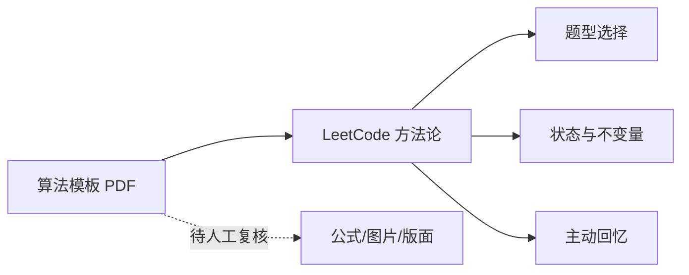

# 算法 PDF 证据索引

## 推荐阅读顺序

1. 先看 [LeetCode 学习体系](tools/distillation/leetcode-algorithm-learning/BOOK_OVERVIEW.md) 和 3 个统一 Skill。
2. 再按本 PDF 的抽取稿查找 C++ 模板。
3. 使用前回到题目约束、不变量和编译测试，不把 PDF 模板当成无条件答案。

## 文件

- [全局理解](tools/distillation/algorithm-pdf/BOOK_OVERVIEW.md)
- [有限文本抽取](算法基础课模板大全-C++版本.pymupdf.md)
- [术语表](tools/distillation/algorithm-pdf/GLOSSARY.md)
- [精华与边界](tools/distillation/algorithm-pdf/DIGEST.md)
- [来源映射](tools/distillation/algorithm-pdf/source-map.md)
- [验证记录](tools/distillation/algorithm-pdf/verified.md)
- [OCR 失败记录](ocr-failure.md)

## 与其他域的关系

PDF 是证据补充层，不作为第四套算法 Skill。
