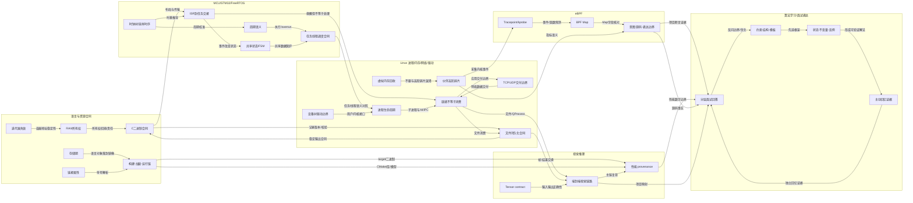

# 全局跨域术语表与关系图候选（Round 2）

> 状态：候选提取，不是最终 Skill。
>
> 范围：C/C++、MCU/STM32、FreeRTOS、Linux 进程/内存/网络/驱动、eBPF、视觉推理、算法学习、面试表达。
>
> 证据规则：`[用户资料事实]` 只表示当前 vault 中由项目源码、配置、项目文档或学习记录直接支持的事实；`[通用外部知识]` 表示资料中的教程、题解、八股或可迁移技术定义，不表示用户亲自实现、测量或验证。`[派生关系]` 仅用于说明 Canvas/HTML/复习结构提供的导航关系，不提高主源证据等级。

## 1. 术语字段和事实边界

每个条目使用以下字段：

- **定义**：可用于后续 Skill 的最小语义；不把项目命名或宣传语当作定义。
- **别名**：资料中实际出现的中文/英文/缩写/接口写法；别名不代表完全同义时会注明边界。
- **相邻概念**：容易一起出现但不能直接替代的节点，用于关系图和反例提示。
- **来源路径**：优先列原始 vault 主源；`distillation/` 仅作导航核对，不替代主源。
- **事实类型**：`用户资料事实`、`通用外部知识` 或 `混合（定义通用，实例为用户资料事实）`。
- **适合链接的 Skill**：只链接当前规范源中已存在的 Skill；若关系值得单独蒸馏，列 `候选 Skill（暂不创建）`。

来源路径中的 `projects/`、`archive/` 均相对于 vault 根目录：
`/Users/zhaowenqiang/Library/Mobile Documents/iCloud~md~obsidian/Documents/qianrushi/`。

## 2. 跨域术语表

### 2.1 C/C++：资源、镜像与二进制合同

#### G01｜存储期（storage duration）

- **定义**：C/C++ 对象从创建/初始化到生命周期结束的语言层属性；自动、静态、线程和动态存储期不能直接等同于某个段名。
- **别名**：静态存储期、自动存储期、动态存储期；资料中也会简称“栈/堆/静态区”，但后者是实现/布局的简化说法。
- **相邻概念**：作用域、链接属性、对象生命周期、`.data`、`.bss`、栈、堆、启动初始化。
- **来源路径**：`projects/嵌入式八股/糯叽叽八股/01 C语言.md`（约 1.3、1.5、1.6 节）；`projects/RTOS项目/源码/CORE/startup_stm32f10x_md.s`；`projects/RTOS项目/源码/OBJ/PWM.sct`；`projects/RTOS项目/源码/USER/PWM.map`。
- **事实类型**：混合（语言定义为通用外部知识；STM32 启动、scatter 和 Map 是用户资料事实）。
- **适合链接的 Skill**：`embedded-c-storage-linkage-audit`、`embedded-memory-lifetime-and-pool-design`、`rtos-freertos-config-and-boot`；候选 Skill（暂不创建）：`cross-domain-lifetime-and-image-contract`。

#### G02｜链接属性（linkage）

- **定义**：符号在不同翻译单元之间的可见性/身份规则；文件作用域 `static` 通常形成内部链接，非 `static` 的全局定义通常可被其他单元以 `extern` 声明引用。
- **别名**：内部链接、外部链接、`extern` 声明、`static` 符号；C++ 资料另涉及名字修饰（name mangling），二者不能混为一谈。
- **相邻概念**：作用域、存储期、翻译单元、符号解析、名字修饰、`extern "C"`、multiple definition/undefined reference。
- **来源路径**：`projects/嵌入式八股/糯叽叽八股/01 C语言.md`；`projects/嵌入式八股/糯叽叽八股/02 C++.md`（约 2.4 节）；`projects/RTOS项目/源码/APP_TASK/app_tasks.c`（全局状态与 `static` 任务句柄）；`projects/RTOS项目/源码/USER/PWM.map`。
- **事实类型**：混合（C/C++ 语义为通用外部知识；项目变量/Map 为用户资料事实）。
- **适合链接的 Skill**：`embedded-c-storage-linkage-audit`、`linux-build-debug-chain`、`embedded-cpp-resource-lifetime`；候选 Skill（暂不创建）：`cross-domain-build-and-linkage-audit`。

#### G03｜RAII / 所有权（resource ownership）

- **定义**：RAII 将资源释放绑定到对象析构；所有权描述谁负责创建、使用、转移和释放资源。二者都是生命周期合同，但 RAII 是 C++ 语言/惯用机制，所有权也适用于 C 的显式清理。
- **别名**：资源生命周期、owner/borrower、析构清理、`unique_ptr`/`shared_ptr`/`weak_ptr`；C 侧常见 `malloc/free` 责任链。
- **相邻概念**：拷贝/移动、moved-from、悬空指针、double free、引用计数、容器生命周期、DMA/异步回调。
- **来源路径**：`projects/嵌入式八股/糯叽叽八股/02 C++.md`（C++ 内存与 RAII）；`projects/嵌入式八股/糯叽叽八股/01 C语言.md`（所有权/手动清理相关段落）；`projects/嵌入式八股/糯叽叽八股/03 STL与容器.md`。
- **事实类型**：通用外部知识（当前 vault 有系统化学习资料，但没有完整 C++ 固件项目源码，不能写成用户项目实现事实）。
- **适合链接的 Skill**：`embedded-cpp-resource-lifetime`、`embedded-memory-lifetime-and-pool-design`、`linux-fd-process-io-debugging`；候选 Skill（暂不创建）：`cross-domain-ownership-and-reclamation`。

#### G04｜迭代器失效（iterator invalidation）

- **定义**：容器插入、删除或扩容后，原迭代器、指针或引用是否仍有效由具体容器的失效规则决定；不能用“地址看起来没变”代替规则核验。
- **别名**：容器失效、悬空迭代器、vector 扩容失效；`const_iterator` 是访问权限变体，不是生命周期保证。
- **相邻概念**：动态数组、重新分配、连续内存、对象生命周期、RAII、线程并发。
- **来源路径**：`projects/嵌入式八股/糯叽叽八股/03 STL与容器.md`（vector、list、迭代器失效章节）。
- **事实类型**：通用外部知识。
- **适合链接的 Skill**：`embedded-cpp-resource-lifetime`；候选 Skill（暂不创建）：`cross-domain-ownership-and-reclamation`。

#### G05｜C 二进制合同（binary contract）

- **定义**：寄存器、DMA 缓冲、CAN/UART/SPI/I²C 帧或 Flash 记录对字段偏移、长度、端序、对齐、版本和校验的联合约束；内存中的 `struct` 只是逻辑模型，不自动等于线上字节流。
- **别名**：结构体布局合同、序列化合同、wire format、协议帧布局、寄存器映射、持久化记录格式。
- **相邻概念**：`sizeof`、`offsetof`、`_Alignof`、padding、packed、位域、union、端序、CRC/DLC、DMA/cache。
- **来源路径**：`projects/嵌入式八股/3. 杂七杂八/10. 嵌入式开发，最值得精通的28个结构体.md`（位域、对齐、协议解析、序列化、Flash 记录）；`projects/嵌入式八股/糯叽叽八股/08 通讯协议.md`；`projects/嵌入式八股/糯叽叽八股/06 STM32.md`；`projects/RTOS项目/源码/BSP/CRC32/crc32.c`。
- **事实类型**：混合（合同原则为通用外部知识；当前 RTOS 的 CRC32 源码和 IAP 数据路径是用户资料事实）。
- **适合链接的 Skill**：`embedded-c-struct-binary-contract-audit`、`embedded-memory-lifetime-and-pool-design`、`rtos-iap-firmware-upgrade`；候选 Skill（暂不创建）：`cross-domain-data-contract-audit`。

#### G06｜构建—加载—运行链（build/load/run chain）

- **定义**：从预处理/编译/汇编/链接到动态加载、进程启动和运行时诊断的分阶段证据链；某一阶段成功不能推出下一阶段成功。
- **别名**：编译链、链接链、加载链、provenance chain、source-to-binary traceability。
- **相邻概念**：目标文件、符号解析、动态库、`ldd`、GDB、CMake target、Map/scatter、模型/数据依赖。
- **来源路径**：`archive/大丙Linux教程/第1章 Linux 基础/07 GCC.md`、`08 静态库和动态库.md`、`09 Makefile.md`、`10 GDB调试.md`；`projects/嵌入式八股/糯叽叽八股/02 C++.md`（编译四阶段）；`projects/linux视觉感知项目/文档/01 项目概述/1.3 CMake 构建指南.md`；`projects/linux视觉感知项目/源码/图像预处理（加速前+加速后）/Lime/CMakeLists.txt`。
- **事实类型**：混合（链条定义为通用外部知识；视觉 CMake target 与工程路径为用户资料事实）。
- **适合链接的 Skill**：`linux-build-debug-chain`、`embedded-c-storage-linkage-audit`、`linux-vision-build-provenance-audit`、`vault-source-boundary-and-derived-artifact-audit`；候选 Skill（暂不创建）：`cross-domain-build-and-linkage-audit`。

### 2.2 MCU/STM32/FreeRTOS：时序、事件和状态

#### G07｜时钟树与采样时序（clock/sampling timing）

- **定义**：从系统主时钟推导总线/定时器/ADC/SysTick/UART 等外设时钟，再将采样时间、周期和波特率与代码配置及测量闭环。
- **别名**：`SYSCLK`、`SystemCoreClock`、APB 定时器倍频、ADC sample time、SysTick time base、时钟链。
- **相邻概念**：PLL、HCLK/PCLK、定时器自动重装、ADC 采样保持、UART baud、周期漂移、目标板实测。
- **来源路径**：`projects/嵌入式八股/3. 杂七杂八/9. 嵌入式 STM32 时钟体系全解：从硬件底层到量产实战.md`；`projects/嵌入式八股/3. 杂七杂八/11. 图解 ADC：工作原理、架构分类与核心性能指标.md`；`projects/RTOS项目/源码/USER/system_stm32f10x.c`；`projects/RTOS项目/源码/BSP/MQ2/mq2.c`；`projects/RTOS项目/源码/SYSTEM/delay/delay.c`。
- **事实类型**：混合（时钟/采样定义为通用外部知识；STM32F1 配置、MQ2 10 次平均和 delay 源码为用户资料事实，不等于硬件精度实测）。
- **适合链接的 Skill**：`stm32-clock-and-sampling-timing`、`rtos-sensor-acquisition-and-fusion`、`rtos-software-timer-periodic-design`；候选 Skill（暂不创建）：`cross-domain-timing-and-event-contract`。

#### G08｜ISR→任务事件交接（FromISR handoff）

- **定义**：ISR 只完成快速、不可阻塞的采集/清标志/投递动作，通过 `FromISR` API、信号量、队列或通知唤醒任务，在任务上下文完成耗时处理；唤醒请求不等于业务数据已处理。
- **别名**：中断到任务通信、ISR-to-task handoff、`xSemaphoreGiveFromISR`、`xQueueSendFromISR`、任务通知、二值信号量。
- **相邻概念**：临界区、BASEPRI、可调用 FreeRTOS API 的中断优先级、事件合并、队列积压、共享状态、阻塞。
- **来源路径**：`projects/RTOS项目/文档/3 FreeRTOS 内核与任务设计/3.3 中断优先级配置与临界区保护.md`；`projects/RTOS项目/文档/3 FreeRTOS 内核与任务设计/3.4 软件定时器与周期任务实现.md`；`projects/RTOS项目/源码/APP_TASK/app_tasks.c`；`projects/RTOS项目/源码/BSP/DMA/dma.c`；`projects/RTOS项目/源码/USER/stm32f10x_it.c`。
- **事实类型**：混合（交接原则为通用外部知识；当前 TIM4/DMA、优先级和任务路径为用户资料事实）。
- **适合链接的 Skill**：`rtos-task-and-isr-design`、`rtos-communication-debugging`、`rtos-runtime-fault-diagnosis`、`rtos-software-timer-periodic-design`；候选 Skill（暂不创建）：`cross-domain-event-delivery-contract`。

#### G09｜周期语义（periodic execution semantics）

- **定义**：周期机制必须说明时基、唤醒方式、执行时间、相对等待/绝对 deadline、overrun 和事件合并；“配置了定时器”不等于实际周期、抖动或处理完成已被验证。
- **别名**：周期任务、软件定时器、硬件定时器、absolute deadline、相对 delay、expiration count、overrun。
- **相邻概念**：SysTick、Timer Service Task、`delay_ms`、`timerfd`、`TIMER_ABSTIME`、信号量、事件丢失/合并、调度延迟。
- **来源路径**：`projects/RTOS项目/文档/3 FreeRTOS 内核与任务设计/3.4 软件定时器与周期任务实现.md`；`projects/RTOS项目/源码/FreeRTOS/include/FreeRTOSConfig.h`；`projects/嵌入式八股/糯叽叽八股/09 嵌入式Linux应用.md`；`archive/大丙Linux教程/第4章 套接字通信/09 IO多路转接（复用）之epoll.md`。
- **事实类型**：混合（周期审计原则为通用外部知识；当前工程启用 Timer Service 但业务使用 `delay_ms`/TIM4 的差异是用户资料事实）。
- **适合链接的 Skill**：`rtos-software-timer-periodic-design`、`linux-userspace-timer-drift-audit`、`stm32-clock-and-sampling-timing`；候选 Skill（暂不创建）：`cross-domain-timing-and-event-contract`。

#### G10｜共享状态与状态机（shared state + FSM）

- **定义**：状态机用显式状态、事件/条件和转换维护行为；并发系统还必须规定状态变量的所有者、读写保护、更新周期和事件消费边界。
- **别名**：FSM、有限状态机、`g_systemState`、`g_autoModeState`、Cooking Event、共享状态结构体。
- **相邻概念**：互斥信号量、二值信号量、事件标志、传感器融合、任务周期、数据竞争、状态转换表。
- **来源路径**：`projects/RTOS项目/文档/2 系统架构与设计/2.4 任务间通信：互斥信号量与全局状态管理.md`；`projects/RTOS项目/文档/5 系统功能实现/5.2 自动模式状态机与Cooking Event检测.md`；`projects/RTOS项目/源码/APP_TASK/app_tasks.c`；`projects/RTOS项目/源码/BSP/WIND/wind_speed.c`。
- **事实类型**：混合（FSM/共享状态原则为通用外部知识；项目三状态、50 ms 控制周期、传感器阈值与锁使用为用户资料事实，文档已标出部分源码边界）。
- **适合链接的 Skill**：`rtos-auto-mode-state-machine`、`rtos-task-and-isr-design`、`rtos-sensor-acquisition-and-fusion`、`rtos-runtime-fault-diagnosis`、`rtos-project-storytelling`；候选 Skill（暂不创建）：`cross-domain-state-and-event-contract`。

#### G11｜任务/线程调度合同（task/thread scheduling contract）

- **定义**：调度合同至少包含执行实体、优先级、阻塞条件、唤醒来源、共享数据和退出/回收责任；FreeRTOS 任务与 Linux pthread/进程不能只按“线程”一词互换。
- **别名**：抢占式调度、时间片、ready list、优先级反转、线程池 worker、joinable/detached。
- **相邻概念**：TCB、任务栈、`xTaskCreate`、pthread、条件变量、`waitpid`、`pthread_join`、饥饿、死锁。
- **来源路径**：`projects/RTOS项目/文档/3 FreeRTOS 内核与任务设计/3.2 任务创建、调度与优先级设计.md`；`projects/RTOS项目/源码/FreeRTOS/tasks.c`；`archive/大丙Linux教程/第3章 进程和线程/07 多线程.md`；`archive/大丙Linux教程/第3章 进程和线程/08 线程同步.md`。
- **事实类型**：混合（调度合同为通用外部知识；当前 RTOS 任务创建/优先级及 Linux 教程实例分别是用户资料中的学习/项目资料事实）。
- **适合链接的 Skill**：`rtos-task-and-isr-design`、`rtos-runtime-fault-diagnosis`、`linux-thread-sync-deadlock-diagnosis`、`linux-process-signal-daemon-lifecycle`；候选 Skill（暂不创建）：`cross-domain-scheduling-and-lifecycle`。

### 2.3 Linux 进程/内存/网络/驱动：边界和交付

#### G12｜进程生命周期（process lifecycle）

- **定义**：`fork` 创建父子执行实体，`exec` 替换当前进程映像，信号通知状态变化，`wait/waitpid` 完成子进程回收；守护化改变会话/终端关系，不自动提供监督或正确退出。
- **别名**：fork/exec/wait、SIGCHLD 回收、僵尸进程、daemonization、子进程监督。
- **相邻概念**：PID/进程组、CLOEXEC、管道、共享内存、fd 继承、退出状态、QProcess 生命周期。
- **来源路径**：`archive/大丙Linux教程/第3章 进程和线程/01 进程控制.md`；`archive/大丙Linux教程/第3章 进程和线程/05 信号.md`；`archive/大丙Linux教程/第3章 进程和线程/06 守护进程.md`；`projects/linux视觉感知项目/文档/02 Qt 上位机/2.3 QProcess 进程管理.md`；`projects/linux视觉感知项目/源码/上位机程序/Lane_Detection/mainwindow.cpp`。
- **事实类型**：混合（Linux 进程语义为通用外部知识；视觉项目 QProcess/子进程路径为用户资料事实）。
- **适合链接的 Skill**：`linux-process-signal-daemon-lifecycle`、`linux-fd-process-io-debugging`、`linux-vision-file-ipc-lifecycle-audit`、`linux-vision-project-storytelling`；候选 Skill（暂不创建）：`cross-domain-process-and-ipc-lifecycle`。

#### G13｜就绪≠消费完成（readiness versus consumption）

- **定义**：I/O 多路复用返回“当前操作不会立即阻塞”的就绪提示，不保证一条完整业务消息、一次完整读取、处理成功、对端健康或结果持久化；应用仍需处理短读、EOF、错误和 `EAGAIN`。
- **别名**：readiness、ready event、短读、半包/粘包、framing、消费边界、backpressure。
- **相邻概念**：fd、Socket、`select/poll/epoll`、非阻塞 I/O、TCP 字节流、文件 IPC、QProcess stdout、ACK 交付边界。
- **来源路径**：`archive/大丙Linux教程/第4章 套接字通信/05 TCP数据粘包的处理.md`；`archive/大丙Linux教程/第4章 套接字通信/07 IO多路转接（复用）之select.md`；`archive/大丙Linux教程/第4章 套接字通信/08 IO多路转接（复用）之poll.md`；`archive/大丙Linux教程/第4章 套接字通信/09 IO多路转接（复用）之epoll.md`；`projects/嵌入式八股/2. 小林图解/图解网络/04｜传输层篇/4.22 用了 TCP 协议，数据一定不会丢吗？.md`；`projects/linux视觉感知项目/文档/01 项目概述/1.6 模块间协作与进程通信.md`。
- **事实类型**：混合（I/O 语义为通用外部知识；视觉文件 IPC 路径/编号不一致是用户资料事实）。
- **适合链接的 Skill**：`linux-socket-multiplexing-design`、`linux-fd-process-io-debugging`、`linux-tcp-loss-path-diagnosis`、`linux-vision-file-ipc-lifecycle-audit`、`linux-file-persistence-crash-consistency`；候选 Skill（暂不创建）：`cross-domain-delivery-boundary-audit`。

#### G14｜虚拟内存回收路径（VM reclaim path）

- **定义**：虚拟地址、VMA、缺页、页缓存/匿名页、watermark、kswapd、direct reclaim、Swap 和 OOM 属于内存压力/回收链；它们不能直接替代伙伴系统高阶连续页碎片诊断。
- **别名**：page fault、page cache、anonymous page、watermark、水位线、后台回收、直接回收、Swap。
- **相邻概念**：`malloc/brk/mmap`、NUMA、zone/node、伙伴系统、order、compaction、OOM、首触缺页。
- **来源路径**：`projects/嵌入式八股/2. 小林图解/图解系统/04｜内存管理篇/4.1 为什么要有虚拟内存？.md`；`projects/嵌入式八股/2. 小林图解/图解系统/04｜内存管理篇/4.2 malloc 是如何分配内存的？.md`；`projects/嵌入式八股/2. 小林图解/图解系统/04｜内存管理篇/4.3 内存满了，会发生什么？.md`；`projects/嵌入式八股/2. 小林图解/图解系统/04｜内存管理篇/4.4 在 4GB 物理内存的机器上，申请 8G 内存会怎么样？.md`；`projects/嵌入式八股/2. 小林图解/图解系统/04｜内存管理篇/4.5 如何避免预读失效和缓存污染的问题？.md`；`projects/嵌入式八股/2. 小林图解/图解系统/04｜内存管理篇/4.6 深入理解 Linux 虚拟内存管理.md`；`projects/嵌入式八股/2. 小林图解/图解系统/04｜内存管理篇/4.7 深入理解 Linux 物理内存管理.md`；`projects/嵌入式八股/3. 杂七杂八/7. 嵌入式系统开发，必知的10个内存管理策略.md`。
- **事实类型**：通用外部知识（资料中的 Linux 教程/八股；不表示用户目标机已测出具体水位、回收计数或 OOM 行为）。
- **适合链接的 Skill**：`linux-virtual-memory-reclaim-path`、`linux-buddy-fragmentation-diagnosis`、`embedded-memory-lifetime-and-pool-design`；候选 Skill（暂不创建）：`cross-domain-memory-pressure-and-fragmentation`。

#### G15｜伙伴系统高阶碎片（buddy high-order fragmentation）

- **定义**：伙伴系统按 `order` 管理连续物理页；总空闲页足够不代表有满足 `2^order` 连续块，高阶分配失败要联合 node/zone/order、可迁移性和碎片指标判断。
- **别名**：外部碎片、high-order allocation、`extfrag_index`、`unusable_free_index`、fallback、compaction。
- **相邻概念**：虚拟内存回收、kswapd/direct reclaim、zone、pageblock、eBPF tracepoint/kprobe、OOM。
- **来源路径**：`projects/Linux物理内存检测项目/文档/3 深入理解/3.2 内存管理核心概念/3.2.1 Linux物理内存与伙伴系统.md`；`projects/Linux物理内存检测项目/文档/3 深入理解/3.2 内存管理核心概念/3.2.2 内存碎片化问题分析.md`；`projects/Linux物理内存检测项目/源码/extfraginfo.c`；`projects/Linux物理内存检测项目/源码/fraginfo.c`。
- **事实类型**：混合（伙伴系统定义为通用外部知识；当前项目挂点、字段和指标代码为用户资料事实，采样节流有效性仍需复核）。
- **适合链接的 Skill**：`linux-buddy-fragmentation-diagnosis`、`linux-memory-ebpf-pipeline`、`linux-memory-source-audit`、`interactive-lab-fact-boundary-audit`；候选 Skill（暂不创建）：`cross-domain-memory-pressure-and-fragmentation`。

#### G16｜TCP/UDP 交付边界（transport delivery boundary）

- **定义**：TCP ACK、SYN/accept 队列、qdisc、网卡 RingBuffer、Socket 缓冲、应用读取和业务持久化是不同层的交付证据；UDP 还必须区分端点四元组、广播权限/地址和组播成员关系。
- **别名**：ACK 交付边界、SYN 队列、accept 队列、TCP framing、UDP 四元组、broadcast/multicast reachability。
- **相邻概念**：`listen/backlog`、`SO_KEEPALIVE`、HTTP Keep-Alive、`bind/recvfrom/sendto`、`SO_BROADCAST`、`IP_ADD_MEMBERSHIP`、防火墙/路由。
- **来源路径**：`projects/嵌入式八股/2. 小林图解/图解网络/04｜传输层篇/4.4 TCP 半连接队列和全连接队列.md`；`projects/嵌入式八股/2. 小林图解/图解网络/04｜传输层篇/4.22 用了 TCP 协议，数据一定不会丢吗？.md`；`archive/大丙Linux教程/第4章 套接字通信/10 基于UDP的套接字通信.md`；`archive/大丙Linux教程/第4章 套接字通信/11 UDP之广播.md`；`archive/大丙Linux教程/第4章 套接字通信/12 UDP之组播（多播）.md`。
- **事实类型**：通用外部知识（当前 vault 是教程/八股来源；没有把这些示例写成用户线上网络实测）。
- **适合链接的 Skill**：`linux-tcp-loss-path-diagnosis`、`linux-socket-multiplexing-design`、`linux-udp-datagram-endpoint-routing`、`linux-udp-broadcast-reachability-contract`、`linux-udp-multicast-interface-membership-contract`；候选 Skill（暂不创建）：`cross-domain-delivery-boundary-audit`。

#### G17｜文件持久化合同（file durability contract）

- **定义**：`write`/`fflush`/`fsync`/`fdatasync`/`rename` 对用户态缓冲、Page Cache、文件数据/元数据和目录项的保证不同；文件写返回成功不自动表示掉电安全或业务记录原子更新。
- **别名**：durability、crash consistency、Page Cache/writeback、原子 rename、落盘、持久化边界。
- **相邻概念**：文件型 IPC、半文件、完成标记、锁、QProcess、Flash 写入、CRC、版本号。
- **来源路径**：`projects/嵌入式八股/2. 小林图解/图解系统/07｜文件系统篇/7.1 文件系统全家桶.md`；`projects/嵌入式八股/2. 小林图解/图解系统/07｜文件系统篇/7.2 进程写文件时，进程发生了崩溃，已写入的数据会丢失吗？.md`；`projects/嵌入式八股/糯叽叽八股/09 嵌入式Linux应用.md`；`projects/linux视觉感知项目/文档/05 系统集成与性能/5.3 文件系统数据交换设计.md`。
- **事实类型**：混合（持久化语义为通用外部知识；视觉文件交换缺少原子 rename/done 标记的源码审计结论为用户资料事实）。
- **适合链接的 Skill**：`linux-file-persistence-crash-consistency`、`linux-vision-file-ipc-lifecycle-audit`、`embedded-c-struct-binary-contract-audit`、`rtos-iap-firmware-upgrade`；候选 Skill（暂不创建）：`cross-domain-data-contract-audit`。

#### G18｜设备树—驱动匹配—用户接口边界（driver boundary）

- **定义**：设备树描述硬件资源和 `compatible`，匹配表决定 platform device/driver 绑定，`probe()` 获取资源并初始化；`file_operations`、IRQ 和用户态接口构成后续交付链，教程示例不能冒充用户完成的 Linux 驱动。
- **别名**：DT/driver matching、`compatible`、`platform_driver`、`probe()`、`devm_*`、`file_operations`、字符设备。
- **相邻概念**：U-Boot/内核启动、模块加载、`request_irq`、用户/内核拷贝、mmap、设备生命周期、资源清理。
- **来源路径**：`projects/嵌入式八股/3. 杂七杂八/5. 嵌入式 ARM Linux 系统架构全解：一文讲透硬件、U-Boot、内核、驱动与应用.md`；`projects/嵌入式八股/糯叽叽八股/10 嵌入式Linux驱动.md`；`projects/嵌入式八股/糯叽叽八股/09 嵌入式Linux应用.md`。
- **事实类型**：通用外部知识（当前仓库有教程和接口示例，但没有对应完整 Linux 驱动项目源码；这一边界本身是用户资料审计事实）。
- **适合链接的 Skill**：`linux-driver-device-tree-boundary`、`embedded-arm-linux-boot-chain`、`linux-fd-process-io-debugging`；候选 Skill（暂不创建）：`cross-domain-driver-and-runtime-boundary`。

### 2.4 eBPF：观测链、事件和设计意图

#### G19｜Tracepoint 与 kprobe（probe selection）

- **定义**：Tracepoint 是内核预定义、命名稳定性相对更好的事件挂点；kprobe 是运行时挂到可探测内核函数的动态插桩，灵活但依赖函数符号、签名和内部结构。
- **别名**：静态跟踪点、动态插桩、`mm_page_alloc_extfrag`、`get_page_from_freelist`、probe attach。
- **相邻概念**：eBPF verifier、BPF helper、内核版本兼容、事件字段、函数参数、tracepoint ABI。
- **来源路径**：`projects/Linux物理内存检测项目/文档/3 深入理解/3.3 eBPF程序深度解析/3.3.1 tracepoint探针机制.md`；`projects/Linux物理内存检测项目/文档/3 深入理解/3.3 eBPF程序深度解析/3.3.2 kprobe动态插桩技术.md`；`projects/Linux物理内存检测项目/源码/extfraginfo.c`；`projects/Linux物理内存检测项目/源码/fraginfo.c`；`projects/嵌入式八股/1. 项目八股/Linux物理内存碎片高频面试题.md`。
- **事实类型**：混合（探针差异为通用外部知识；当前项目挂点是用户资料事实）。
- **适合链接的 Skill**：`linux-memory-ebpf-pipeline`、`linux-memory-source-audit`、`linux-buddy-fragmentation-diagnosis`；候选 Skill（暂不创建）：`cross-domain-observability-probe-selection`。

#### G20｜BPF Map（kernel/userspace state contract）

- **定义**：BPF Map 是 eBPF 程序与用户态之间交换键值状态、计数或事件的内核对象；必须同时核对 key、value、更新/读取路径、聚合粒度和生命周期。
- **别名**：BPF map、`BPF_HASH`、counts map、stats map、用户态轮询读取。
- **相邻概念**：探针、事件上下文、PID/node/zone/order 维度、采样节流、Map key、curses 展示、数据一致性。
- **来源路径**：`projects/Linux物理内存检测项目/文档/3 深入理解/3.3 eBPF程序深度解析/3.3.3 BPF map通信机制.md`；`projects/Linux物理内存检测项目/源码/exfrag.py`；`projects/Linux物理内存检测项目/源码/exfrag_user.py`；`projects/Linux物理内存检测项目/源码/extfraginfo.c`；`projects/Linux物理内存检测项目/源码/fraginfo.c`。
- **事实类型**：混合（Map 机制为通用外部知识；当前 Map 字段与 Python/BCC 读取链为用户资料事实）。
- **适合链接的 Skill**：`linux-memory-ebpf-pipeline`、`linux-memory-source-audit`；候选 Skill（暂不创建）：`cross-domain-observability-probe-selection`。

#### G21｜设计意图—源码行为—表达边界（claim/evidence boundary）

- **定义**：将文档/注释中的设计意图与源码实际执行路径、运行环境和测量结果分开；只有证据链闭合的部分才能作为项目事实或面试断言。
- **别名**：source audit、provenance、claim/evidence、实现状态、事实边界、可复现性。
- **相邻概念**：Map key、节流、模型主链、CMake target、教学数据、Canvas/HTML 派生证据、个人贡献。
- **来源路径**：`projects/Linux物理内存检测项目/文档/4 深度学习/4.1 源码审计与事实边界.md`；`projects/linux视觉感知项目/文档/05 系统集成与性能/5.3 文件系统数据交换设计.md`；`projects/linux视觉感知项目/文档/06 面试与复习/6.5 系统设计决策与追问应对.md`；`distillation/global-source-map.md`（跨域导航，不作为主源）。
- **事实类型**：混合（审计原则可迁移；当前项目源码差异和证据等级是用户资料事实）。
- **适合链接的 Skill**：`linux-memory-source-audit`、`linux-vision-build-provenance-audit`、`vision-model-tensor-contract-audit`、`vault-source-boundary-and-derived-artifact-audit`、`interactive-lab-fact-boundary-audit`、`embedded-interview-layered-answer`；候选 Skill（暂不创建）：`cross-domain-evidence-and-provenance-audit`。

### 2.5 视觉推理：数据、模型与执行链

#### G22｜Tensor contract（张量合同）

- **定义**：模型调用的联合合同，至少包含输入数量/名称、shape/rank、dtype、布局、预处理、辅助输入、输出解码和路径；代码调用成功不自动证明模型元数据与主链一致。
- **别名**：输入输出契约、HWC/CHW、NCHW、归一化、`log_space`、mask tensor、曲线/分割解码。
- **相邻概念**：ONNX Runtime、NCNN、LSTR、Unet、OpenCV Mat、模型文件、后处理、文件 IPC、Qt 摄像头支路。
- **来源路径**：`projects/linux视觉感知项目/文档/04 模型推理部署/4.1 LSTR模型架构与曲线解码.md`；`projects/linux视觉感知项目/文档/04 模型推理部署/4.3 log_space与双输入机制.md`；`projects/linux视觉感知项目/文档/04 模型推理部署/4.5 NCNN部署与HWC-CHW转换.md`；`projects/linux视觉感知项目/源码/卷积神经网络/卷积神经网络/LSTR_ONNX/main.cpp`；`projects/linux视觉感知项目/源码/卷积神经网络/卷积神经网络/Unet_NCNN/src/unet.cpp`。
- **事实类型**：混合（张量合同定义为通用外部知识；当前输入构造、2 输入 `Run`、HWC→CHW 和模型路径是用户资料事实，模型完全匹配仍需元数据核对）。
- **适合链接的 Skill**：`vision-model-tensor-contract-audit`、`linux-vision-pipeline-and-optimization`、`linux-vision-file-ipc-lifecycle-audit`、`linux-vision-project-storytelling`；候选 Skill（暂不创建）：`cross-domain-model-and-data-contract`。

#### G23｜视觉端到端链路（camera/file→enhance→inference→display）

- **定义**：从摄像头或文件输入，经 LIME/预处理、ONNX/LSTR 或 NCNN/Unet 推理、后处理，再通过 Qt/QProcess/显示输出的系统数据流；架构图必须回链到实际 target、路径和进程合同。
- **别名**：pipeline、端到端、主链、摄像头支路、增强—推理—后处理—显示。
- **相邻概念**：文件型 IPC、QProcess、模型分支、Tensor contract、CMake provenance、性能 benchmark、缓存局部性。
- **来源路径**：`projects/linux视觉感知项目/文档/01 项目概述/1.5 系统全景与数据流.md`；`projects/linux视觉感知项目/Linux视觉感知处理系统-完整代码流程详解.md`；`projects/linux视觉感知项目/源码/上位机程序/Lane_Detection/mainwindow.cpp`；`projects/linux视觉感知项目/源码/卷积神经网络/卷积神经网络/LSTR_ONNX/main.cpp`；`projects/linux视觉感知项目/源码/卷积神经网络/卷积神经网络/Unet_NCNN/src/unet.cpp`。
- **事实类型**：混合（端到端流水线概念为通用外部知识；当前项目的支路、路径不一致和分支关系为用户资料事实）。
- **适合链接的 Skill**：`linux-vision-pipeline-and-optimization`、`linux-vision-file-ipc-lifecycle-audit`、`linux-vision-build-provenance-audit`、`vision-model-tensor-contract-audit`、`linux-vision-project-storytelling`；候选 Skill（暂不创建）：`cross-domain-model-and-data-contract`。

#### G24｜性能 provenance（performance reproducibility）

- **定义**：性能结论必须绑定 source→target→编译参数/库→模型/数据→二进制→测量记录；同名 target、历史 build 或文档数字不能独立证明当前结果。
- **别名**：build provenance、benchmark provenance、可复现性能、基线/优化对比、同名 target 风险。
- **相邻概念**：CMake、NEON、OpenMP、NCNN/ONNX Runtime、模型版本、输入数据、缓存、端到端 latency。
- **来源路径**：`projects/linux视觉感知项目/文档/03 LIME 低照度增强/3.7 优化前后性能对比.md`；`projects/linux视觉感知项目/文档/04 模型推理部署/4.6 两种方案对比：分割vs曲线.md`；`projects/linux视觉感知项目/源码/图像预处理（加速前+加速后）/Lime/CMakeLists.txt`；`projects/linux视觉感知项目/源码/图像预处理（加速前+加速后）/Lime_NEON+OpenMP/CMakeLists.txt`；`projects/linux视觉感知项目/源码/图像预处理（加速前+加速后）/Lime_NEON+OpenMP/lime_opt.cpp`。
- **事实类型**：混合（可复现性原则为通用外部知识；当前 target 和性能材料的证据缺口是用户资料事实）。
- **适合链接的 Skill**：`linux-vision-build-provenance-audit`、`linux-vision-pipeline-and-optimization`、`linux-build-debug-chain`、`vault-source-boundary-and-derived-artifact-audit`；候选 Skill（暂不创建）：`cross-domain-evidence-and-provenance-audit`。

### 2.6 算法学习与面试表达：从结构识别到可验证叙述

#### G25｜约束—结构—模板（algorithm framework selection）

- **定义**：先从约束、输入结构、操作和目标函数识别候选算法框架，再编码；题名或熟悉代码不能替代结构证据。
- **别名**：题型识别、框架选择、模板选择、constraint-driven pattern recognition。
- **相邻概念**：滑动窗口、双指针、二分、DP、贪心、回溯、复杂度、反例。
- **来源路径**：`archive/力扣刷题/01-Raw/01-Hot100刷题体系调研报告.md`；`archive/力扣刷题/01-Raw/02-Hot100两周速通刷题计划.md`；`archive/力扣刷题/02-Wiki/专题总结/00-YXC常用模板索引.md`；`archive/力扣刷题/学习中枢.md`。
- **事实类型**：通用外部知识（资料是用户的学习体系/题解来源；不推断用户已掌握任何题型）。
- **适合链接的 Skill**：`algorithm-problem-framework-selection`、`algorithm-state-and-invariant-derivation`、`algorithm-active-recall-loop`；候选 Skill（暂不创建）：`cross-domain-evidence-and-provenance-audit`。

#### G26｜状态—不变量—反例（state/invariant/counterexample）

- **定义**：选定框架后，明确 DP 状态、循环不变量/区间、回溯状态或贪心选择条件，并用边界和反例检验；样例通过不等于证明成立。
- **别名**：DP state、loop invariant、binary-search interval、backtracking state、greedy proof、反例验证。
- **相邻概念**：约束识别、初始化、转移、剪枝、边界、复杂度、独立重写。
- **来源路径**：`archive/力扣刷题/02-Wiki/专题总结/08-回溯算法.md`；`archive/力扣刷题/02-Wiki/专题总结/09-二分查找.md`；`archive/力扣刷题/02-Wiki/专题总结/10-动态规划.md`；`archive/力扣刷题/02-Wiki/专题总结/11-贪心算法.md`；`archive/力扣刷题/03-学习笔记/Day11-二分查找.md`；`archive/力扣刷题/03-学习笔记/Day12-动态规划入门与贪心.md`；`archive/力扣刷题/03-学习笔记/Day13-进阶动态规划.md`。
- **事实类型**：通用外部知识。
- **适合链接的 Skill**：`algorithm-state-and-invariant-derivation`、`algorithm-problem-framework-selection`、`algorithm-active-recall-loop`；候选 Skill（暂不创建）：`cross-domain-state-and-invariant-audit`。

#### G27｜主动回忆与掌握证据（active recall evidence）

- **定义**：以独立尝试、最小提示、复盘、间隔复习和无提示重写产生行为证据；“看懂/看过”不等于可迁移掌握。
- **别名**：主动回忆闭环、掌握等级、提示后 AC、无提示重写、spaced rewriting。
- **相邻概念**：题型识别、状态/不变量、反例、学习日志、复习计划、测试覆盖。
- **来源路径**：`archive/力扣刷题/学习中枢.md`；`archive/力扣刷题/00-配置/学习日志.md`；`archive/力扣刷题/00-配置/进度看板.md`；`archive/力扣刷题/01-Raw/02-Hot100两周速通刷题计划.md`；`archive/力扣刷题/03-学习笔记/Day14-技巧与全局复习.md`。
- **事实类型**：混合（学习方法为通用外部知识；日志/看板字段属于用户资料事实，但不能据空白或静态状态推断真实掌握度）。
- **适合链接的 Skill**：`algorithm-active-recall-loop`、`algorithm-state-and-invariant-derivation`；候选 Skill（暂不创建）：`cross-domain-state-and-invariant-audit`。

#### G28｜分层面试回答（layered interview answer）

- **定义**：按定义→机制→项目映射→边界/证据→优化或验证组织回答；项目映射必须标明个人贡献、源码事实、通用知识和未实测部分。
- **别名**：定义—机制—项目—边界—优化、项目八股、事实边界、证据化表达、claim/evidence answer。
- **相邻概念**：source audit、provenance、主动回忆、追问、性能数字、贡献边界、反例。
- **来源路径**：`projects/嵌入式八股/1. 项目八股/RTOS高频面试题.md`；`projects/嵌入式八股/1. 项目八股/linux视觉感知面试题.md`；`projects/嵌入式八股/1. 项目八股/Linux物理内存碎片高频面试题.md`；`projects/RTOS项目/RTOS项目复习文档.md`；`projects/linux视觉感知项目/文档/06 面试与复习/6.2 项目全局面试问答.md`。
- **事实类型**：混合（回答结构为通用外部知识；各项目函数表、实现状态和贡献边界是用户资料事实，个人贡献仍需用户确认）。
- **适合链接的 Skill**：`embedded-interview-layered-answer`、`rtos-project-storytelling`、`linux-vision-project-storytelling`、`linux-memory-source-audit`、`linux-vision-build-provenance-audit`；候选 Skill（暂不创建）：`cross-domain-evidence-and-provenance-audit`。

## 3. 跨域关系图候选

### 3.1 主关系图（候选导航，不是最终 Skill）

### 3.2 关系边证据表

| 边 ID | 源节点 → 目标节点 | 关系语义 | 证据路径 | 事实边界 |
|---|---|---|---|---|
| R01 | G01 → G06 | 语言存储期必须落到启动代码、scatter/linker 和 Map 才能解释镜像布局 | `projects/嵌入式八股/糯叽叽八股/01 C语言.md`；`projects/RTOS项目/源码/CORE/startup_stm32f10x_md.s`；`projects/RTOS项目/源码/OBJ/PWM.sct`；`projects/RTOS项目/源码/USER/PWM.map` | 定义通用；具体段布局为用户资料事实 |
| R02 | G02 → G06 | `extern/static` 与符号解析连接语言可见性和链接期故障 | `projects/嵌入式八股/糯叽叽八股/02 C++.md`；`archive/大丙Linux教程/第1章 Linux 基础/07 GCC.md`；`projects/RTOS项目/源码/USER/PWM.map` | 通用链条，Map 是构建快照 |
| R03 | G03 → G05 | 所有权决定谁可序列化、传输、释放缓冲；合同需覆盖生命周期 | `projects/嵌入式八股/糯叽叽八股/01 C语言.md`；`projects/嵌入式八股/3. 杂七杂八/10. 嵌入式开发，最值得精通的28个结构体.md` | 通用方法，非完整 C++ 项目事实 |
| R04 | G05 → G08 | DMA/串口帧不应把结构体强转当作事件交接或协议解析 | `projects/嵌入式八股/3. 杂七杂八/10. 嵌入式开发，最值得精通的28个结构体.md`；`projects/RTOS项目/源码/BSP/DMA/dma.c`；`projects/RTOS项目/源码/BSP/IAP/iap.c` | 当前 IAP/DMA 路径为用户资料事实 |
| R05 | G07 → G09 | 时钟树决定 RTOS/定时器/采样周期的解释基准 | `projects/RTOS项目/源码/USER/system_stm32f10x.c`；`projects/RTOS项目/文档/3 FreeRTOS 内核与任务设计/3.4 软件定时器与周期任务实现.md` | 配置事实不等于测量事实 |
| R06 | G08 → G13 | ISR/任务唤醒只提供事件，不保证任务完成数据消费 | `projects/RTOS项目/文档/3 FreeRTOS 内核与任务设计/3.3 中断优先级配置与临界区保护.md`；`projects/RTOS项目/文档/3 FreeRTOS 内核与任务设计/3.4 软件定时器与周期任务实现.md`；`archive/大丙Linux教程/第4章 套接字通信/09 IO多路转接（复用）之epoll.md` | 迁移性高，两个运行模型不能混为一谈 |
| R07 | G10 → G11 | 共享状态 FSM 的读写保护和周期决定调度/数据竞争风险 | `projects/RTOS项目/文档/2 系统架构与设计/2.4 任务间通信：互斥信号量与全局状态管理.md`；`projects/RTOS项目/文档/5 系统功能实现/5.2 自动模式状态机与Cooking Event检测.md` | 项目文档自身标出部分未完全加锁边界 |
| R08 | G11 → G12 | FreeRTOS 任务和 Linux 线程/进程都需要调度与回收合同，但 API/语义不同 | `projects/RTOS项目/文档/3 FreeRTOS 内核与任务设计/3.2 任务创建、调度与优先级设计.md`；`archive/大丙Linux教程/第3章 进程和线程/01 进程控制.md`；`archive/大丙Linux教程/第3章 进程和线程/07 多线程.md` | 跨域类比，不是同义替换 |
| R09 | G12 → G13 | `fork/exec`、QProcess、fd 继承与管道/文件读取共同决定消费边界 | `archive/大丙Linux教程/第3章 进程和线程/01 进程控制.md`；`projects/linux视觉感知项目/文档/02 Qt 上位机/2.3 QProcess 进程管理.md`；`projects/linux视觉感知项目/源码/上位机程序/Lane_Detection/mainwindow.cpp` | QProcess 细节为用户资料事实 |
| R10 | G13 → G16 | 就绪/读取/ACK 不能直接推出应用交付；网络还要查队列、缓冲和路径 | `archive/大丙Linux教程/第4章 套接字通信/05 TCP数据粘包的处理.md`；`projects/嵌入式八股/2. 小林图解/图解网络/04｜传输层篇/4.22 用了 TCP 协议，数据一定不会丢吗？.md` | 通用外部知识，非线上实测 |
| R11 | G14 ↔ G15 | 回收压力与高阶物理碎片可能相互影响，但诊断对象、指标和路径不同 | `projects/嵌入式八股/2. 小林图解/图解系统/04｜内存管理篇/4.3 内存满了，会发生什么？.md`；`projects/嵌入式八股/2. 小林图解/图解系统/04｜内存管理篇/4.7 深入理解 Linux 物理内存管理.md`；`projects/Linux物理内存检测项目/文档/3 深入理解/3.2 内存管理核心概念/3.2.1 Linux物理内存与伙伴系统.md`；`projects/Linux物理内存检测项目/文档/3 深入理解/3.2 内存管理核心概念/3.2.2 内存碎片化问题分析.md` | 必须保留两个 Skill 边界 |
| R12 | G15 → G19 → G20 | 伙伴碎片状态由 eBPF 探针采集，经 Map 传给用户态 | `projects/Linux物理内存检测项目/源码/extfraginfo.c`；`projects/Linux物理内存检测项目/源码/fraginfo.c`；`projects/Linux物理内存检测项目/源码/exfrag.py`；`projects/Linux物理内存检测项目/源码/exfrag_user.py` | 项目源码事实；节流逻辑仍需单独核验 |
| R13 | G19 → G21 | 探针选择和内核版本依赖决定项目断言的稳定性 | `projects/Linux物理内存检测项目/文档/3 深入理解/3.3 eBPF程序深度解析/3.3.1 tracepoint探针机制.md`；`projects/Linux物理内存检测项目/文档/3 深入理解/3.3 eBPF程序深度解析/3.3.2 kprobe动态插桩技术.md`；`projects/Linux物理内存检测项目/文档/3 深入理解/3.3 eBPF程序深度解析/3.3.3 BPF map通信机制.md`；`projects/嵌入式八股/1. 项目八股/Linux物理内存碎片高频面试题.md` | Tracepoint “相对稳定”不是永远 ABI 不变 |
| R14 | G17 → G23 | 文件持久化/完成标记/命名规则是视觉文件 IPC 的数据交付合同 | `projects/linux视觉感知项目/文档/01 项目概述/1.6 模块间协作与进程通信.md`；`projects/linux视觉感知项目/文档/05 系统集成与性能/5.3 文件系统数据交换设计.md`；`projects/linux视觉感知项目/源码/上位机程序/Lane_Detection/mainwindow.cpp` | 当前源码缺少原子 rename/done 标记的结论为用户资料审计事实 |
| R15 | G22 → G23 | 张量输入输出契约是视觉主链正确性的局部必要条件 | `projects/linux视觉感知项目/文档/04 模型推理部署/4.1 LSTR模型架构与曲线解码.md`；`projects/linux视觉感知项目/文档/04 模型推理部署/4.3 log_space与双输入机制.md`；`projects/linux视觉感知项目/文档/04 模型推理部署/4.5 NCNN部署与HWC-CHW转换.md`；`projects/linux视觉感知项目/源码/卷积神经网络/卷积神经网络/LSTR_ONNX/main.cpp`；`projects/linux视觉感知项目/源码/卷积神经网络/卷积神经网络/Unet_NCNN/src/unet.cpp` | 调用路径不自动证明模型元数据完全匹配 |
| R16 | G06 → G24 | CMake target、库、源文件和 build 产物决定性能结果的 provenance | `projects/linux视觉感知项目/源码/图像预处理（加速前+加速后）/Lime/CMakeLists.txt`；`projects/linux视觉感知项目/源码/图像预处理（加速前+加速后）/Lime_NEON+OpenMP/CMakeLists.txt`；`projects/linux视觉感知项目/文档/03 LIME 低照度增强/3.7 优化前后性能对比.md` | 性能数字需完整 benchmark 证据 |
| R17 | G23 → G24 | 端到端结果必须把输入、模型分支和构建产物绑定后才可谈优化收益 | `projects/linux视觉感知项目/文档/01 项目概述/1.5 系统全景与数据流.md`；`projects/linux视觉感知项目/文档/05 系统集成与性能/5.3 文件系统数据交换设计.md`；`projects/linux视觉感知项目/文档/03 LIME 低照度增强/3.7 优化前后性能对比.md` | 用户资料存在分支/性能复现缺口 |
| R18 | G25 → G26 → G27 | 算法学习从框架选择到状态/不变量/反例，再以独立回忆产生掌握证据 | `archive/力扣刷题/01-Raw/01-Hot100刷题体系调研报告.md`；`archive/力扣刷题/01-Raw/02-Hot100两周速通刷题计划.md`；`archive/力扣刷题/02-Wiki/专题总结/09-二分查找.md`；`archive/力扣刷题/02-Wiki/专题总结/10-动态规划.md`；`archive/力扣刷题/学习中枢.md` | 方法通用；不推断用户当前掌握度 |
| R19 | G21 → G28 | 源码审计把项目事实、设计意图和表达边界接入面试叙述 | `projects/Linux物理内存检测项目/文档/4 深度学习/4.1 源码审计与事实边界.md`；`projects/嵌入式八股/1. 项目八股/Linux物理内存碎片高频面试题.md` | 项目个人贡献仍需用户确认 |
| R20 | G24 → G28 | 性能 provenance 决定面试中“优化了多少”的可说强度 | `projects/linux视觉感知项目/文档/03 LIME 低照度增强/3.7 优化前后性能对比.md`；`projects/linux视觉感知项目/文档/06 面试与复习/6.3 LIME与优化面试要点.md` | 不能把文档数字自动当实测/个人贡献 |
| R21 | G27 → G28 | 主动回忆的独立重写/追问记录可支持表达稳定性，但不替代项目证据 | `archive/力扣刷题/学习中枢.md`；`archive/力扣刷题/03-学习笔记/Day14-技巧与全局复习.md`；`projects/嵌入式八股/1. 项目八股/RTOS高频面试题.md` | 学习能力证据与项目事实分开 |

## 4. 候选 Skill 连接清单（只提取，不创建）

下列名称是跨域关系候选，当前不在 `distillation/skills/` 中创建目录或文件；已有规范 Skill 仍是首选链接目标：

| 候选名称 | 触发问题/核心合同 | 建议吸收的术语节点 | 现有 Skill 连接 |
|---|---|---|---|
| `cross-domain-lifetime-and-image-contract` | 同一对象/缓冲从语言存储期、所有权到启动镜像、DMA/任务/进程回收如何闭合 | G01、G03、G05、G08、G11、G12 | `embedded-c-storage-linkage-audit`、`embedded-cpp-resource-lifetime`、`embedded-memory-lifetime-and-pool-design`、`linux-process-signal-daemon-lifecycle` |
| `cross-domain-event-delivery-contract` | 事件从 ISR/探针/Socket/文件/模型调用产生，到消费者确认处理的证据链 | G08、G09、G13、G16、G20、G23 | `rtos-communication-debugging`、`linux-socket-multiplexing-design`、`linux-memory-ebpf-pipeline`、`linux-vision-file-ipc-lifecycle-audit` |
| `cross-domain-memory-pressure-and-fragmentation` | 区分 C/RTOS 分配失败、Linux 回收压力、伙伴高阶碎片和 eBPF 观测指标 | G03、G14、G15、G20 | `embedded-memory-lifetime-and-pool-design`、`linux-virtual-memory-reclaim-path`、`linux-buddy-fragmentation-diagnosis`、`linux-memory-source-audit` |
| `cross-domain-delivery-boundary-audit` | “写入/就绪/ACK/Map 更新/文件生成/推理返回”分别证明什么，何时才算业务消费完成 | G05、G13、G16、G17、G20、G22 | `linux-tcp-loss-path-diagnosis`、`linux-file-persistence-crash-consistency`、`vision-model-tensor-contract-audit`、`embedded-c-struct-binary-contract-audit` |
| `cross-domain-evidence-and-provenance-audit` | 从主源、源码、target、模型、测量到面试断言建立可追溯证据链 | G06、G21、G24、G28 | `vault-source-boundary-and-derived-artifact-audit`、`linux-memory-source-audit`、`linux-vision-build-provenance-audit`、`embedded-interview-layered-answer` |
| `cross-domain-state-and-invariant-audit` | 将状态机、并发共享状态、算法不变量和面试追问统一为“状态—推进—反例—证据”审计 | G10、G11、G25、G26、G27、G28 | `rtos-auto-mode-state-machine`、`rtos-task-and-isr-design`、`algorithm-state-and-invariant-derivation`、`algorithm-active-recall-loop` |

## 5. 排除/待复核项

- `projects/RTOS项目/RTOS项目复习文档.md` 中“笔者使用的是封装思想”等叙述只能作为待用户确认的个人表达材料；未把它当作独立代码事实。
- `projects/linux视觉感知项目/` 中性能对比、NEON/OpenMP 优化和模型分支均保留 provenance/主链边界；没有把同名 `lime` target 或历史 build 自动视为同一二进制。
- `projects/Linux物理内存检测项目/源码/fraginfo.c`、`extfraginfo.c` 中 `last_time_map` 的节流查询/更新路径仍需单独复核；本表只记录“需核验”的关系，不把注释中的设计意图提升为已完成行为。
- 当前快照未保留历史交互动画的 HTML/JS 源文件；Canvas、图表和 HTML 测试属于派生证据，可支持导航和事实边界审计，不作为术语的唯一主源，也不与原始项目源码重复计数。
- 算法题解、PDF 抽取稿和学习看板只支持算法方法/学习流程候选；不据此推断用户真实掌握度、面试表现或个人项目贡献。

## 6. 来源与规范源核对

- 全局导航：`distillation/global-source-map.md`、`distillation/coverage-matrix.md`、各域 `GLOSSARY.md`/`source-map.md`/`verified.md`。
- 规范 Skill 只读核对：当前 `distillation/skills/` 下有 56 个 `SKILL.md`；本文件只引用其名称，不修改其内容。这里的数量随规范源增量更新，以根级审计为准。
- 本轮唯一写入目标：`distillation/candidates-global/glossary-round2.md`。
