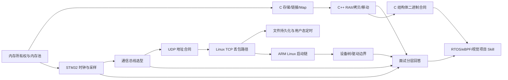

# 嵌入式核心 Skill Index

> 本域有 14 个主域 Skill；为保持跨主题导航，下面另列 3 个以 `linux-systems-tutorial` 为主域的 UDP 合同入口。

## 内容主线

C/C++ 生命周期与二进制合同 → STM32 时钟/采样与 RTOS → UDP/TCP 通信与文件时序 → ARM Linux 启动/驱动 → 面试表达与项目审计。

八股主源、150 题练习、派生合并稿和附件证据的分层见 [`source-boundary.md`](tools/distillation/embedded-core/source-boundary.md)。

## Skills

- [embedded-memory-lifetime-and-pool-design](tools/distillation/skills/embedded-memory-lifetime-and-pool-design/SKILL.md)：选择静态、栈、堆或固定块池，并审计所有权、碎片和长期稳定性。
- [embedded-cpp-resource-lifetime](tools/distillation/skills/embedded-cpp-resource-lifetime/SKILL.md)：分析 C++ RAII、拷贝/移动、智能指针、容器和资源句柄生命周期。
- [embedded-c-storage-linkage-audit](tools/distillation/skills/embedded-c-storage-linkage-audit/SKILL.md)：从 C 存储期、`extern/static`、启动汇编、scatter 文件和 Map 审计符号与镜像布局。
- [stm32-clock-and-sampling-timing](tools/distillation/skills/stm32-clock-and-sampling-timing/SKILL.md)：核对 STM32F1 时钟树、APB 定时器、ADC 采样和 SysTick 时序。
- [embedded-bus-selection](tools/distillation/skills/embedded-bus-selection/SKILL.md)：按工程约束选择 UART、RS232/485、I²C、SPI、CAN。
- [embedded-c-struct-binary-contract-audit](tools/distillation/skills/embedded-c-struct-binary-contract-audit/SKILL.md)：审计 C 结构体的布局、对齐、端序、位域、DMA、寄存器和协议帧合同。
- [embedded-numeric-contract-audit](tools/distillation/skills/embedded-numeric-contract-audit/SKILL.md)：从已定位的原始字段出发，审计位模式/类型、算术溢出、单位缩放、滤波、误差预算和阈值回差；不把 PLC 示例推广成 STM32 实测。
- [linux-udp-datagram-endpoint-routing](tools/distillation/skills/linux-udp-datagram-endpoint-routing/SKILL.md)：按数据报四元组、`bind`、临时端口和 `recvfrom` 来源定位 UDP 回包问题。
- [linux-udp-broadcast-reachability-contract](tools/distillation/skills/linux-udp-broadcast-reachability-contract/SKILL.md)：审计 `SO_BROADCAST`、广播地址、接口、子网和接收端口作用域。
- [linux-udp-multicast-interface-membership-contract](tools/distillation/skills/linux-udp-multicast-interface-membership-contract/SKILL.md)：审计组播出口接口、`IP_ADD_MEMBERSHIP`、端口和多网卡入组。
- [linux-file-persistence-crash-consistency](tools/distillation/skills/linux-file-persistence-crash-consistency/SKILL.md)：区分库缓冲、Page Cache、回写、`fsync` 和突然掉电下的文件一致性。
- [linux-userspace-timer-drift-audit](tools/distillation/skills/linux-userspace-timer-drift-audit/SKILL.md)：选择 `timerfd`/POSIX timer/绝对 deadline，并诊断周期漂移和 overrun。
- [linux-tcp-loss-path-diagnosis](tools/distillation/skills/linux-tcp-loss-path-diagnosis/SKILL.md)：沿应用、TCP 队列、Socket 缓冲、qdisc、网卡和中间链路诊断丢包/断连。
- [linux-virtual-memory-reclaim-path](tools/distillation/skills/linux-virtual-memory-reclaim-path/SKILL.md)：沿虚拟申请、缺页、页类型、watermark、kswapd/direct reclaim、Swap 和 OOM 分析内存压力。
- [embedded-arm-linux-boot-chain](tools/distillation/skills/embedded-arm-linux-boot-chain/SKILL.md)：按最后可信证据定位 ARM Linux 启动阶段。
- [linux-driver-device-tree-boundary](tools/distillation/skills/linux-driver-device-tree-boundary/SKILL.md)：分析设备树匹配、`probe()` 资源、用户态接口和驱动清理边界。
- [embedded-interview-layered-answer](tools/distillation/skills/embedded-interview-layered-answer/SKILL.md)：把知识组织成定义、机制、项目落点、边界和优化的可追问回答。

## 推荐学习顺序

1. 先学内存所有权和分配形态，建立“生命周期—上下文—可验证性”框架。
2. 接着用 C 存储/链接审计把语言语义落到启动代码和 Map 镜像。
3. 再看 C++ 对象生命周期，理解 RAII 与 C 的所有权模型如何衔接。
4. 用 STM32 时钟与采样 Skill 把公式连接到寄存器、外设和任务时间。
5. 用总线选择、UDP 地址合同和 Linux TCP Skill 建立“约束/分层先于协议名称”的通信思维。
6. 补上文件持久化和用户态定时，理解 I/O 完成、稳定存储和周期完成不是同一个承诺。
7. 用 C 结构体二进制合同把协议、DMA 和寄存器映射落到 `sizeof/offsetof` 与已知字节测试。
8. 用 Linux 虚拟内存 Skill 区分缺页/回收压力与高阶 buddy 碎片，再进入 Linux 项目审计。
9. 沿 ARM Linux 启动链进入设备树和驱动边界，避免过早把故障归因于驱动。
10. 用数值合同 Skill 处理“改成 REAL 仍不报警、边界抖动、单位缩放错误”等跨表示层故障；再用面试分层 Skill 组织回答，并组合 RTOS/eBPF/视觉项目 Skill 做源码映射。

## 主题缺口

`source-register.md` 中仍有大量小林图解、C/OS/网络/STM32章节处于 `indexed-only`。本轮已精确回链 C 语言/操作系统中的构建启动材料及五篇 TCP 传输层文章；其余内容仍未形成独立规范 Skill，后续应先按已建立的生命周期、时序、通信和系统边界去重，再决定是否扩展。

完整候选与来源见 `candidates/` 和 [source-map.md](tools/distillation/embedded-core/source-map.md)。规范 Skill 唯一维护位置是 `../skills/`；本域若存在旧 `skills/` 文件夹，仅作历史审计快照。
