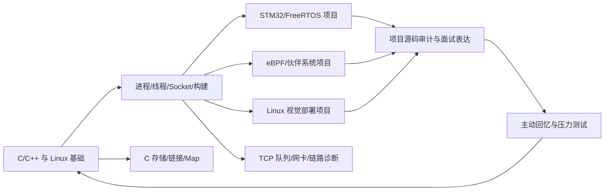

# 全局来源映射

| 跨域结论 | 主要来源 | 规范 Skill | 事实边界 |
|---|---|---|---|
| 先锁定故障/学习问题所在层，再选择动作 | Linux 教程 GCC/Socket/进程章节；RTOS/eBPF/视觉项目复习文档 | `linux-build-debug-chain`、`embedded-arm-linux-boot-chain`、`rtos-task-and-isr-design` | 不是所有相似症状都共享同一运行模型 |
| 资源、状态、事件和输出必须分层 | Linux fd/Socket 章节；RTOS 任务/ISR；eBPF Map；视觉流水线 | `linux-fd-process-io-debugging`、`linux-socket-multiplexing-design`、`rtos-communication-debugging`、`linux-memory-ebpf-pipeline`、`linux-vision-pipeline-and-optimization` | “就绪/事件/输出”不等于数据已完整消费 |
| 文档声称与源码实际行为分开 | Linux 内存源码审计；RTOS IAP/共享状态；视觉路径/性能审计 | `linux-memory-source-audit`、`rtos-project-storytelling`、`linux-vision-project-storytelling` | 个人贡献、硬件验证和性能数字不能臆测 |
| 生命周期、所有权和可验证性共同决定内存方案 | C 堆所有权/碎片/内存池章节；FreeRTOS 任务分配配置；C++ RAII/STL 章节 | `embedded-memory-lifetime-and-pool-design`、`embedded-cpp-resource-lifetime` | 当前 RTOS 有动态堆配置，但没有自定义内存池或长期压力测试证据 |
| STM32 时序必须从时钟树推到外设再由测量闭环 | STM32 时钟/ADC 文章；`system_stm32f10x.c`；`mq2.c`；`delay.c` | `stm32-clock-and-sampling-timing`、`rtos-sensor-acquisition-and-fusion` | `SYSCLK_FREQ_72MHz`、10 次平均和经验公式是配置/源码事实，不等于目标板精度实测 |
| 设备树描述硬件，匹配链和 probe 才构成驱动初始化 | ARM Linux 架构文档；嵌入式 Linux 驱动/应用教程 | `linux-driver-device-tree-boundary`、`embedded-arm-linux-boot-chain` | 本仓库没有对应完整 Linux 驱动源码，教程示例不能冒充个人项目 |
| 高阶连续页失败要区分总量不足和物理碎片 | 物理内存项目文档/`fraginfo.c`/交互测试 | `linux-buddy-fragmentation-diagnosis`、`interactive-lab-fact-boundary-audit` | 教学预设指数不等于目标内核实时值 |
| 虚拟申请、缺页和回收压力必须与高阶物理碎片分开 | 小林图解系统内存管理 4.1–4.7；嵌入式内存管理策略文章 | `linux-virtual-memory-reclaim-path`、`linux-buddy-fragmentation-diagnosis` | 页大小、VMA、watermark、回收计数器、Swap 和 OOM 行为依内核/架构/NUMA/配置而变，需目标机证据 |
| 面试回答按定义→机制→项目映射→边界→优化组织 | 嵌入式八股、三个项目面试/复习文档 | `embedded-interview-layered-answer` 及各项目 storytelling Skill | 项目事实必须有个人经历/源码证据 |
| 算法先约束/结构识别，再状态/不变量，最后主动回忆 | LeetCode 调研、专题、学习中枢、Day 1–14 | `algorithm-problem-framework-selection`、`algorithm-state-and-invariant-derivation`、`algorithm-active-recall-loop` | 不读取空看板推断掌握程度 |
| 交互、Canvas、图表是派生证据 | 4 个 Canvas、HTML/JS 实验及测试 | `interactive-lab-fact-boundary-audit`、`vault-source-boundary-and-derived-artifact-audit` | 页面通过不等于硬件/内核/端到端实测 |
| 主源只读，规范源与客户端副本分层 | `tools/AGENTS.md`、`CLAUDE.md`、`split_dabing_linux.py`、安装记录 | `vault-source-boundary-and-derived-artifact-audit` | 同名目录冲突时不覆盖 |
| C 语言语义必须落到启动和镜像证据 | C 存储/链接笔记；STM32 启动汇编、scatter 文件和 Map | `embedded-c-storage-linkage-audit`、`embedded-memory-lifetime-and-pool-design` | C 标准不规定 `.bss` 段名；Map 只代表某次工具链构建 |
| TCP 传输层状态不等于应用交付 | TCP 队列、异常断连、Keepalive 和端到端丢包文章 | `linux-tcp-loss-path-diagnosis`、`linux-socket-multiplexing-design` | ACK/ESTABLISHED/ping 不能单独证明业务处理、持久化或对端健康 |
| UDP 回包、广播与组播必须使用不同地址合同 | 大丙 UDP 单播/广播/组播章节；嵌入式网络应用笔记 | `linux-udp-datagram-endpoint-routing`、`linux-udp-broadcast-reachability-contract`、`linux-udp-multicast-interface-membership-contract` | `sendto`/`SO_BROADCAST`/`IP_ADD_MEMBERSHIP` 成功不等于网络或应用交付成功 |
| 文件写入完成不等于稳定持久化或业务原子更新 | 文件系统崩溃文章、Linux 应用笔记、视觉文件交换设计 | `linux-file-persistence-crash-consistency`、`linux-vision-file-ipc-lifecycle-audit` | 进程崩溃、内核崩溃、掉电和文件 IPC 半文件是不同故障模型 |
| 用户态周期要区分相对等待、绝对 deadline 和到期次数 | Linux 应用定时器 API、epoll 资料 | `linux-userspace-timer-drift-audit`、`rtos-software-timer-periodic-design`、`stm32-clock-and-sampling-timing` | 周期配置不证明抖动、执行时间和 overrun 已满足目标 |
| C 结构体内存表示不自动等于外部二进制格式 | C/结构体/通信/STM32 资料 | `embedded-c-struct-binary-contract-audit`、`embedded-c-storage-linkage-audit` | ABI 位域、端序、对齐、DMA/cache 和芯片寄存器必须逐项核对 |
| 视觉性能结论必须绑定 source→target→library→model→measurement | LIME 性能、模型对比和 CMake 资料 | `linux-vision-build-provenance-audit`、`linux-vision-pipeline-and-optimization` | 旧 build、同名 target 和文档数字不能独立证明当前可复现 |
| 项目结论必须绑定 source→artifact→runtime observation | RTOS 工程/历史构建产物；Linux 内存/eBPF 源码与 BCC 路径；Linux 视觉 CMake/主链 | `rtos-build-flash-runtime-provenance`、`linux-memory-ebpf-pipeline`、`linux-vision-build-provenance-audit` | 当前专项矩阵只完成文件级/静态核验；Flash、目标内核/BCC attach、摄像头/Qt/ARM 性能和真实客户端路由仍需独立记录 |

## 基础→项目→审计→表达→复习

## 来源等级

1. 目标项目源码、测试和明确测量记录。
2. 项目复习文档和结构化原始笔记。
3. 教程/题解/PDF 模板等外部或归档资料。
4. Canvas、HTML、图表等派生呈现。
5. 仅有文件名、缓存、构建产物或无法核对的抽取内容。
