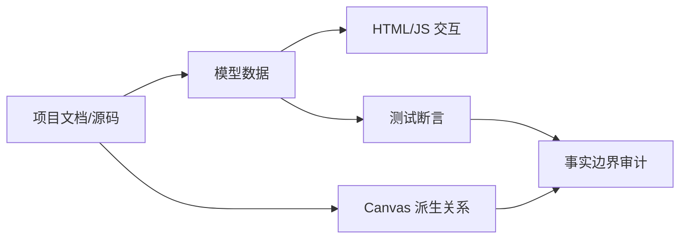

# 交互学习实验索引

## 规范 Skill

- [interactive-lab-fact-boundary-audit](tools/distillation/skills/interactive-lab-fact-boundary-audit/SKILL.md)：审计 HTML/JavaScript 学习实验、Canvas、图表和测验中哪些是源码事实、派生教学模型或待验证结论。

## 使用顺序

1. 先读实验说明和 `source-map.md`，知道每个数据来自哪里。
2. 若历史交互 HTML/JS 已恢复，再读 `project-data.js/app-core.js`，核对公式、状态机和故障模型；当前快照没有这些文件。
3. 最后运行/阅读可用测试，确认测试覆盖结果、来源和边界；历史 27 条测试记录不等于当前可复现测试。

## 四个实验簇

- Linux 物理内存：伙伴分配、碎片指数、eBPF Map 和源码故障。
- RTOS：任务时间线、PID、模式状态机、IAP/CRC 风险。
- Linux 视觉：端到端流水线、LIME、模型路线和 ARM 性能。
- Canvas/PDF：复习关系图和算法模板的结构化证据。
