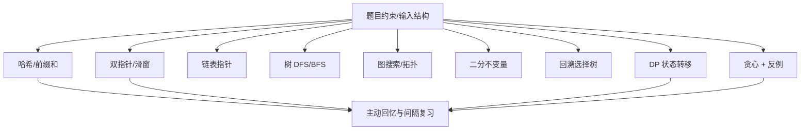

# LeetCode Hot 100 学习索引

## Skills

- [algorithm-problem-framework-selection](tools/distillation/skills/algorithm-problem-framework-selection/SKILL.md)：根据约束、数据形状、操作和目标选择候选题型框架。
- [algorithm-state-and-invariant-derivation](tools/distillation/skills/algorithm-state-and-invariant-derivation/SKILL.md)：在编码前推导 DP 状态、不变量、边界、转移和剪枝。
- [algorithm-active-recall-loop](tools/distillation/skills/algorithm-active-recall-loop/SKILL.md)：用独立尝试、最小提示、复盘和间隔复习闭合学习回路。

## 推荐顺序

1. 先用 `algorithm-problem-framework-selection` 建立题型地图。
2. 遇到二分、DP、回溯、贪心时，用 `algorithm-state-and-invariant-derivation` 先推导再编码。
3. 每题完成后使用 `algorithm-active-recall-loop` 记录掌握等级，并安排无提示重写。

## 题型地图

## 内容层级

- `01-Raw/`：研究、计划和题单原始材料。
- `02-Wiki/专题总结/`：可复用方法的主源。
- `02-Wiki/题目详解/`：案例库，不逐题生成 Skill。
- `03-学习笔记/`：个人学习状态和复盘证据。
- 算法 PDF：独立模板证据，当前仅本地文本抽取。
