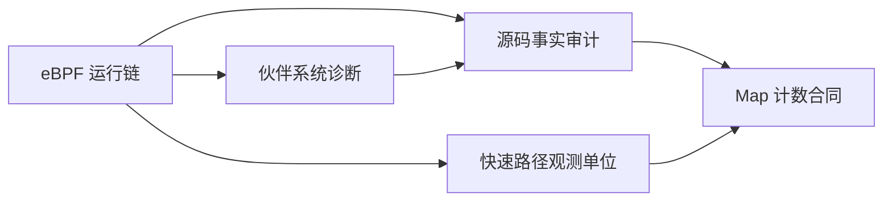

# Linux 物理内存/eBPF Skill Index

## Skills

- [linux-memory-ebpf-pipeline](tools/distillation/skills/linux-memory-ebpf-pipeline/SKILL.md)：Python/BCC 到内核探针、Map 和 TUI。
- [linux-buddy-fragmentation-diagnosis](tools/distillation/skills/linux-buddy-fragmentation-diagnosis/SKILL.md)：node/zone/order 与碎片指标。
- [linux-memory-source-audit](tools/distillation/skills/linux-memory-source-audit/SKILL.md)：源码事实审计和面试边界。
- [linux-memory-fastpath-observation-contract](tools/distillation/skills/linux-memory-fastpath-observation-contract/SKILL.md)：区分 `get_page_from_freelist` 入口样本、上层分配请求和最终成功/失败结果。
- [linux-ebpf-map-counter-contract](tools/distillation/skills/linux-ebpf-map-counter-contract/SKILL.md)：审计 PID 聚合 Map 的 RMW 并发、累计/最近字段混合、精确计数与事件流合同。

主链、环境修复记录、PDF/SVG 和运行证据的边界见 [`source-boundary.md`](tools/distillation/linux-memory-ebpf/source-boundary.md)。

当前可运行性检查见 [`runtime-validation-matrix.md`](runtime-validation-matrix.md)；JSON 版本用于脚本和后续复验。它先记录 import/BPF 路径阻断，再列出目标 BCC/内核环境中的补证顺序。

## 推荐顺序

1. 运行链
2. 伙伴系统与指标
3. 快速路径观测单位
4. Map 聚合计数合同
5. 源码事实审计

## Round 3 事实边界

两个增量 Skill 的静态来源和路由测试均为 6/6；没有目标内核/BCC 参数兼容性、多 CPU 压力、返回点或独立事件计数实测。入口探针不等于请求结果，`lookup→++→update` 不自动等于无丢失精确计数。
