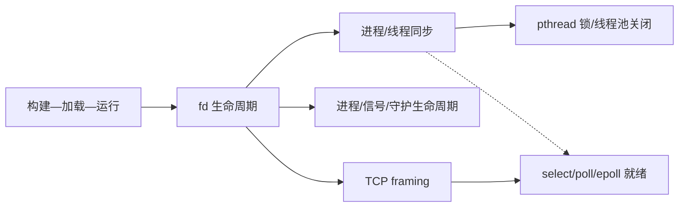

# 大丙 Linux 教程 — 学习索引

> 47 个原始文档蒸馏为 9 个方法 Skill；单个命令/API保留在来源地图和术语表，不单独制造 Skill。

教程分章、合并稿、附件和方法 Skill 的边界见 [`source-boundary.md`](tools/distillation/linux-systems-tutorial/source-boundary.md)。

## Skills

- [linux-build-debug-chain](tools/distillation/skills/linux-build-debug-chain/SKILL.md)：沿预处理、编译、链接、动态加载、启动和 GDB 证据链定位 Linux C/C++ 故障。
- [linux-fd-process-io-debugging](tools/distillation/skills/linux-fd-process-io-debugging/SKILL.md)：审计 fd、管道、fork/exec、mmap/共享内存和线程同步造成的 I/O 问题。
- [linux-process-signal-daemon-lifecycle](tools/distillation/skills/linux-process-signal-daemon-lifecycle/SKILL.md)：分析 fork/exec、信号、子进程回收、守护进程和关闭生命周期。
- [linux-thread-sync-deadlock-diagnosis](tools/distillation/skills/linux-thread-sync-deadlock-diagnosis/SKILL.md)：定位 pthread 共享状态、条件变量、锁顺序和线程池关闭问题。
- [linux-socket-multiplexing-design](tools/distillation/skills/linux-socket-multiplexing-design/SKILL.md)：设计/排查 framing、短读写、select/poll/epoll、非阻塞和连接生命周期。
- [linux-rx-napi-path-diagnosis](tools/distillation/skills/linux-rx-napi-path-diagnosis/SKILL.md)：沿 NIC/DMA/Ring Buffer、硬中断、NAPI、协议栈、Socket 到应用读取核对接收路径。
- [linux-udp-datagram-endpoint-routing](tools/distillation/skills/linux-udp-datagram-endpoint-routing/SKILL.md)：核对 UDP 四元组、bind、临时端口、sendto/recvfrom 来源和回包路由。
- [linux-udp-broadcast-reachability-contract](tools/distillation/skills/linux-udp-broadcast-reachability-contract/SKILL.md)：审计 SO_BROADCAST、广播地址、接口、子网、端口和防火墙作用域。
- [linux-udp-multicast-interface-membership-contract](tools/distillation/skills/linux-udp-multicast-interface-membership-contract/SKILL.md)：审计组播出口接口、IP_ADD_MEMBERSHIP、端口和多网卡入组。

## 推荐顺序

1. `linux-build-debug-chain`：先掌握构建、链接、动态加载和 GDB 证据链。
2. `linux-fd-process-io-debugging`：把文件、进程、线程同步和 fd 生命周期放到同一模型。
3. `linux-process-signal-daemon-lifecycle`：再理解 fork/exec、信号、子进程回收和守护进程环境。
4. `linux-thread-sync-deadlock-diagnosis`：再分析 pthread 共享状态、条件变量、锁环和线程池关闭。
5. `linux-socket-multiplexing-design`：最后理解 framing、连接状态和 select/poll/epoll。
6. `linux-rx-napi-path-diagnosis`：再沿 NIC/DMA/Ring Buffer、硬中断、NAPI poll、NET_RX softirq、协议栈、Socket 到应用读取核对接收路径；UDP 端点/广播/组播问题按上方三个合同分流。

## 关系图

## 资料层次

- 主源：分章 Markdown。
- 派生源：`大丙Linux 教程（Subingwen 专栏合并）-Defuddle提取.md`，用于查漏不重复计数。
- 附件：`assets/Linux教程/` 中的图像，只作说明证据。

## 相关域

- 通用网络/面试表达：`embedded-core`。
- ARM Linux 启动和驱动：`embedded-arm-linux-boot-chain`（不属于本域）。
- RTOS 任务/ISR：`rtos-task-and-isr-design`（模型不同，不直接替换 Linux 线程）。
- 进程生命周期与 pthread 同步是两条不同主线；`fork/exec/wait/signal` 不等于 `pthread_mutex/cond/join`。

## 接收路径增量说明

`linux-rx-napi-path-diagnosis` 沿 NIC/DMA/Ring Buffer、硬中断、NAPI poll、`NET_RX` softirq、`struct sk_buff`、协议栈、Socket 到应用读取建立接收路径证据链。

- 与 `linux-tcp-loss-path-diagnosis` 的边界：本 Skill 定位包是否从网卡接收路径进入 Socket；TCP 重传、ACK、SYN/accept 队列、断连、Keepalive 和端到端业务交付仍由 TCP Skill 负责。
- 与 `linux-socket-multiplexing-design` 的边界：本 Skill 的 NAPI `poll` 是内核接收轮询；TCP framing、短读、`select`/`poll`/`epoll`、非阻塞消费和背压仍由 Socket Skill 负责。
