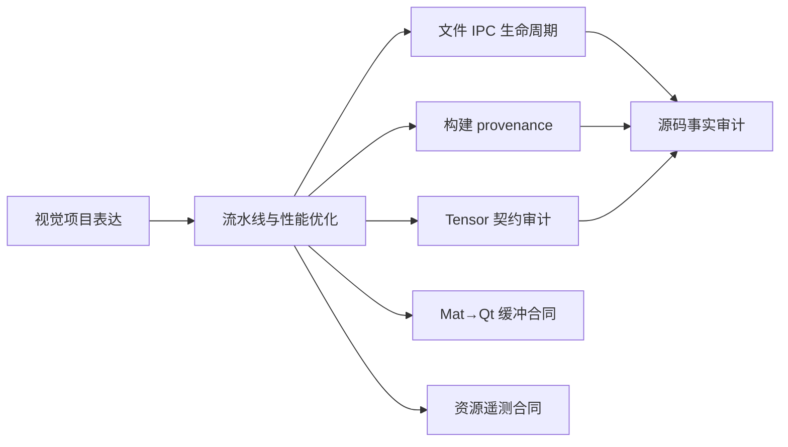

# Linux 视觉感知 Skill Index

## Skills

- [linux-vision-pipeline-and-optimization](tools/distillation/skills/linux-vision-pipeline-and-optimization/SKILL.md)：端到端链路和 ARM 性能优化。
- [linux-vision-file-ipc-lifecycle-audit](tools/distillation/skills/linux-vision-file-ipc-lifecycle-audit/SKILL.md)：审计 QProcess、文件帧交换、编号、完成标记、超时和子进程生命周期。
- [linux-vision-build-provenance-audit](tools/distillation/skills/linux-vision-build-provenance-audit/SKILL.md)：追踪源码、CMake target、库、模型、二进制和性能数字的可复现性。
- [linux-vision-project-storytelling](tools/distillation/skills/linux-vision-project-storytelling/SKILL.md)：项目介绍、贡献边界和面试深挖。
- [vision-model-tensor-contract-audit](tools/distillation/skills/vision-model-tensor-contract-audit/SKILL.md)：审计模型输入输出、HWC/CHW、shape/dtype 和 ONNX/NCNN 主链真实性。
- [qt-event-loop-signal-slot-audit](tools/distillation/skills/qt-event-loop-signal-slot-audit/SKILL.md)：审计 Qt 事件循环阻塞、信号槽连接、QObject 线程归属和 QProcess 生命周期。
- [cmake-source-discovery-incremental-build-audit](tools/distillation/skills/cmake-source-discovery-incremental-build-audit/SKILL.md)：审计 CMake source membership、构建树新鲜度、增量构建和运行时库加载边界。
- [linux-vision-qt-image-buffer-adapter-audit](tools/distillation/skills/linux-vision-qt-image-buffer-adapter-audit/SKILL.md)：审计 `cv::Mat→QImage→QPixmap→QLabel` 的格式、颜色、stride、外部缓冲所有权和消费者映射。
- [linux-vision-resource-telemetry-contract-audit](tools/distillation/skills/linux-vision-resource-telemetry-contract-audit/SKILL.md)：审计 `/proc/stat`、`free -m`、累计差分、字段/单位、错误状态、QTimer 和 51 点图表窗口。

主链候选、vendor/model、历史 build 和媒体证据的分层见 [`source-boundary.md`](tools/distillation/linux-vision/source-boundary.md)。

当前端到端静态核验见 [`main-chain-verification-matrix.md`](main-chain-verification-matrix.md)；它与 provenance、Tensor、Qt、文件 IPC Skill 组合使用，但不替代目标 ARM/Qt/OpenCV 运行验证。

## 推荐顺序

1. 先读技术流水线和优化。
2. 文件帧、QProcess、结果轮询或子进程退出异常时使用文件 IPC 生命周期审计。
3. 二进制对应哪个源码、CMake 是否真的编译优化版、性能数字能否复现时使用 build provenance 审计。
4. 模型输入/输出、路径或主链是否接通时使用 Tensor 契约审计。
5. 图像颜色/灰度/ROI/花屏时使用 Mat→Qt 缓冲 Skill；CPU 第一采样、`free -m` 字段或 51 点时间语义时使用资源遥测 Skill。
6. 再用项目表达 Skill 练习短答和追问；发现文档与源码冲突时保留“声称—实际—待验证”三栏。

## Round 3 事实边界

两个增量 Skill 的静态来源和路由测试均为 6/6；尚未在目标 Qt/OpenCV、摄像头、非连续 Mat、目标发行版 `/proc/stat`/`free -m` 和真实客户端会话中复测。源码存在 `copy()`、`rgbSwapped()` 或图表点，不等于运行时所有权、实时性或性能结论已经成立。

## 增量 Skill 的边界

- `qt-event-loop-signal-slot-audit`：审计 Qt GUI 事件循环阻塞、QProcess signal lifecycle、自动/手动连接重复、QObject 归属和 queued/direct 线程语义。文件路径、帧编号、原子落盘、旧结果和跨进程文件完成合同仍使用 `linux-vision-file-ipc-lifecycle-audit`；项目介绍、面试回答和个人贡献仍使用 `linux-vision-project-storytelling`。
- `cmake-source-discovery-incremental-build-audit`：审计显式 source/glob 是否进入 CMake target、configure/build tree 是否绑定当前源码、同名 target、历史 build 产物、增量构建新鲜度，以及链接期与运行期库加载的分离。通用编译/链接/加载故障使用 `linux-build-debug-chain`；视觉模型、数据、性能和完整可复现性使用 `linux-vision-build-provenance-audit`。

两个 Skill 的规范入口已在上方 Skills 清单中各列一次；这里仅保留组合边界，避免重复导航链接。
