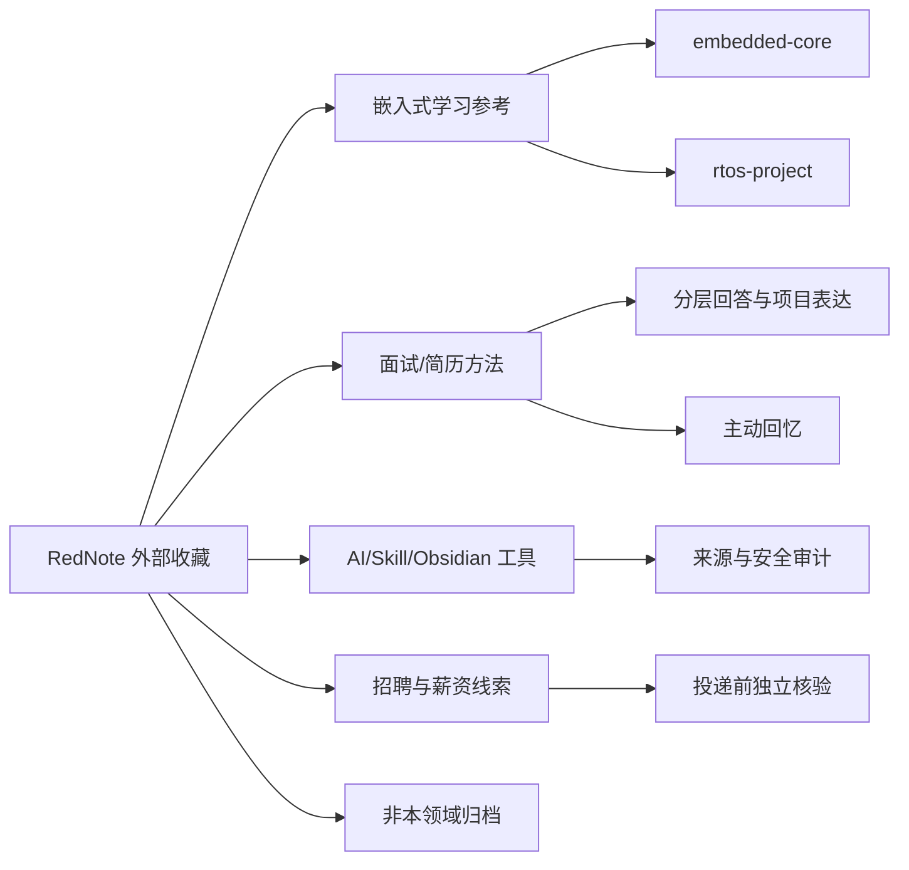

# RedNote 外部参考索引

## 先读什么

1. [DIGEST](tools/distillation/rednote-bookmarks/DIGEST.md)：先看可吸收的方法和不能直接相信的数字。
2. [全量覆盖复核](tools/distillation/rednote-bookmarks/FULL_COVERAGE_REVIEW.md)：核对 1,952 个来源、391 个知识文档、附件、重复和人工队列。
3. [主题摘要](tools/distillation/rednote-bookmarks/TOPIC_DIGEST.md)：查看只读标题/标签/链接抽取后的主题信号，保留外部资料边界。
4. [来源映射](tools/distillation/rednote-bookmarks/source-map.md)：按主题回到原始收藏，不把专辑索引或图片当成独立知识。
5. [证据等级](evidence-levels.md) 和 [限制](limitations.md)：区分登记、外部自述、派生索引、附件与个人事实。
6. [术语表](tools/distillation/rednote-bookmarks/GLOSSARY.md)：理解外部帖子里常见的求职、Skill 和知识库词汇。
7. 回到主知识域：嵌入式技术以 [`embedded-core`](tools/distillation/embedded-core/INDEX.md) 和 [`rtos-project`](tools/distillation/rtos-project/INDEX.md) 为准。

## 主题导航

| 主题 | 参考内容 | 应如何使用 |
|---|---|---|
| 嵌入式学习路线 | C/MCU、RTOS、通信、Linux/驱动、机器人 | 作为复习顺序假设，与自己的 JD 和项目证据对照 |
| 八股与主动输出 | 框架化、口述、错题卡、间隔复习、项目映射 | 可转成个人学习动作；不要把“80%”等数字当实验结论 |
| 项目/简历表达 | 项目背景、个人贡献、结果、追问和事实边界 | 与 `embedded-interview-layered-answer`、`rtos-project-storytelling` 组合 |
| 面试复盘知识库 | 录音转写、弱点记录、Obsidian 链接和变化追踪 | 作为复盘工作流参考，先确认隐私和平台能力 |
| Skill 与工具 | 安装来源、版本、测试、安全、成本和自托管 | 先看仓库/版本/权限，再决定是否安装 |
| 行情与岗位 | 招聘帖、实习个案、薪资样本和行业判断 | 只作线索；投递前重新查官方岗位和原始数据 |
| 非本领域 | 健康、Mac、普通效率、教育史 | 保留收藏，不并入嵌入式知识地图 |

## 关系图

## 来源身份

- `收藏（Bookmarks）/*.md`：第三方帖子正文和元数据，`external-reference`。
- `专辑（Albums）/*/专辑索引.md`：导出索引，`derived-index`。
- `媒体（Media）/`：帖子图片/视频，`evidence-layer`。
- `小红书内容总览.base`：Obsidian Base 视图配置，`derived-index`。
