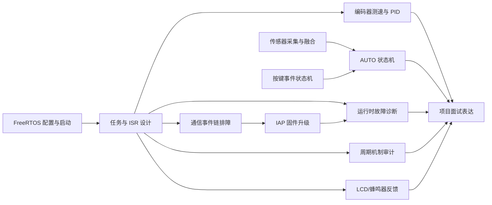

# RTOS 油烟机项目 Skill Index

## 项目主线

复位与硬件初始化 → FreeRTOS 接管 → 周期/事件任务协作 → 传感器/按键/电机控制 → 工作模式状态机 → IAP/故障诊断 → 面试表达。

来源分层见 [`source-boundary.md`](tools/distillation/rtos-project/source-boundary.md)：当前 Keil target、备用 port/启动文件、构建产物和外部/派生材料分开处理。

## Skills

- [rtos-freertos-config-and-boot](tools/distillation/skills/rtos-freertos-config-and-boot/SKILL.md)：FreeRTOS 配置、移植、启动顺序、SysTick/PendSV/SVC、堆和栈单位。
- [rtos-task-and-isr-design](tools/distillation/skills/rtos-task-and-isr-design/SKILL.md)：任务、优先级、同步和 ISR 边界。
- [rtos-communication-debugging](tools/distillation/skills/rtos-communication-debugging/SKILL.md)：UART/DMA/信号量事件链排障。
- [rtos-runtime-fault-diagnosis](tools/distillation/skills/rtos-runtime-fault-diagnosis/SKILL.md)：HardFault、栈/堆、空句柄、锁和 IRQ 现场诊断。
- [rtos-sensor-acquisition-and-fusion](tools/distillation/skills/rtos-sensor-acquisition-and-fusion/SKILL.md)：DHT11、MQ2、有效性、归一化和融合边界。
- [rtos-key-event-state-machine](tools/distillation/skills/rtos-key-event-state-machine/SKILL.md)：按键消抖、短按/长按和事件消费。
- [rtos-motor-pid-control](tools/distillation/skills/rtos-motor-pid-control/SKILL.md)：编码器、RPM、PID、PWM 闭环。
- [rtos-auto-mode-state-machine](tools/distillation/skills/rtos-auto-mode-state-machine/SKILL.md)：AUTO/Cooking Event/Delay-Off 和防回流状态机。
- [rtos-iap-firmware-upgrade](tools/distillation/skills/rtos-iap-firmware-upgrade/SKILL.md)：USART/DMA/CRC32/Flash/APP 跳转及单 APP 边界。
- [rtos-software-timer-periodic-design](tools/distillation/skills/rtos-software-timer-periodic-design/SKILL.md)：审计软件定时器、`vTaskDelayUntil()`、硬件定时器和周期任务选择。
- [rtos-display-buzzer-feedback](tools/distillation/skills/rtos-display-buzzer-feedback/SKILL.md)：核对 LCD/SPI 刷新、UI 任务边界、蜂鸣器反馈和未来报警仲裁。
- [rtos-project-storytelling](tools/distillation/skills/rtos-project-storytelling/SKILL.md)：项目介绍、个人贡献边界和逐层追问。

## 推荐顺序

1. `rtos-freertos-config-and-boot`
2. `rtos-task-and-isr-design`
3. `rtos-sensor-acquisition-and-fusion` + `rtos-key-event-state-machine`
4. `rtos-communication-debugging`
5. `rtos-motor-pid-control` + `rtos-auto-mode-state-machine`
6. `rtos-software-timer-periodic-design` + `rtos-display-buzzer-feedback`
7. `rtos-iap-firmware-upgrade`
8. `rtos-runtime-fault-diagnosis`
9. `rtos-project-storytelling`

## 面试复习顺序

先用启动/任务 Skill 说清系统骨架，再选择一条可核对的业务链（传感器→Cooking Event 或编码器→PID→PWM），最后用 IAP 或真实故障做深挖。个人贡献、硬件实测、性能数字和 IAP 是否启用必须逐项标记证据等级。

## 增量 Skill：构建—烧录—运行证据链

- [rtos-build-flash-runtime-provenance](tools/distillation/skills/rtos-build-flash-runtime-provenance/SKILL.md)：核对 Keil 工程合同、AXF/HEX/MAP 产物身份、J-Link/Flash algorithm、向量与 Reset & Run、串口和运行时证据的 C0-C4 可复现链。

对应的当前静态报告：[artifact-provenance.md](artifact-provenance.md)。它支持 C0/C1 的文件级核对，但不把历史 Build log、下载配置或 MAP/HEX 存在性升级为 C2-C4 硬件实测。

边界：`rtos-freertos-config-and-boot` 解释启动机制和 FreeRTOS port；`rtos-runtime-fault-diagnosis` 隔离 HardFault/复位/栈堆/死锁根因；`rtos-iap-firmware-upgrade` 审计 DMA/CRC/Flash/APP 协议。新 Skill 只证明 provenance 节点，不把文档预期、历史 MAP、IAP 地址规划或串口沉默升级为硬件实测。
