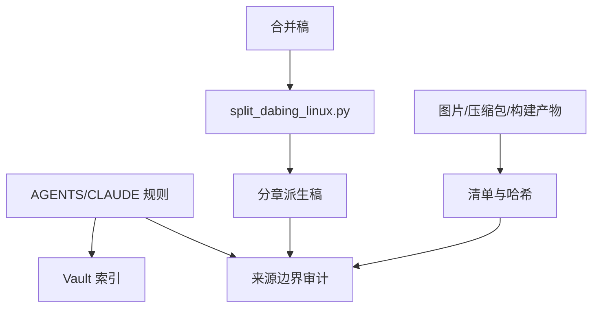

# vault 方法与工具索引

## 规范 Skill

- [vault-source-boundary-and-derived-artifact-audit](tools/distillation/skills/vault-source-boundary-and-derived-artifact-audit/SKILL.md)：区分原始笔记、派生稿、附件、构建产物、重复文件和客户端 Skill 副本。

## 推荐顺序

1. 阅读 [全局理解](tools/distillation/vault-methodology-and-tools/BOOK_OVERVIEW.md)，先明确只读和来源层级。
2. 阅读 [来源映射](tools/distillation/vault-methodology-and-tools/source-map.md)，理解规则、脚本、清单和资产之间的关系。
3. 使用 `vault-source-boundary-and-derived-artifact-audit` 审计新文件，再将结论接入全局覆盖矩阵。

## 文件分层

- 规则：`tools/AGENTS.md`、`tools/CLAUDE.md`。
- 导航/配置：`tools/index.md`、`tools/sortspec.md.md`。
- 转换脚本：`tools/split_dabing_linux.py`。
- 资产清单：`tools/图片当前清单.tsv`、`tools/图片迁移清单.tsv`。
- 外部/待审计资产：根目录 `.skill`、ZIP、临时文件和备份文件。
