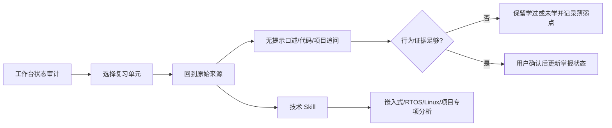

# 学习工作台索引

## 入口

- [BOOK_OVERVIEW.md](tools/distillation/workbench-learning-state/BOOK_OVERVIEW.md)：结构、状态语义和事实边界。
- [DIGEST.md](tools/distillation/workbench-learning-state/DIGEST.md)：高密度使用方法。
- [GLOSSARY.md](tools/distillation/workbench-learning-state/GLOSSARY.md)：状态、来源和复习术语。
- [STATUS_AUDIT.md](STATUS_AUDIT.md)：当前 360 条记录的派生审计。
- [REVIEW_QUEUE.md](REVIEW_QUEUE.md)：按当前状态、主线和模块生成的建议复习队列；只读，不回写原始工作台。
- [records.tsv](records.tsv)：机器可读逐条快照。
- [source-map.md](tools/distillation/workbench-learning-state/source-map.md)：条目到原始主源的映射。
- [verified.md](tools/distillation/workbench-learning-state/verified.md)：候选方法论三重验证。
- [PIPELINE_STATE.md](tools/distillation/workbench-learning-state/PIPELINE_STATE.md)：本域断点状态。
- 规范 Skill：[`embedded-learning-state-and-active-recall`](tools/distillation/skills/embedded-learning-state-and-active-recall/SKILL.md)。

## 推荐使用顺序

1. 先看 `STATUS_AUDIT.md`，确认记录字段和来源都可解析。
2. 用 `records.tsv` 按 `mastery`、`review_flag`、`track` 和 `module` 形成候选队列。
3. 优先处理“学过 + 待回看”，然后处理“未学”中与当前项目或面试目标最相关的单元。
4. 回到 `source_target` 指向的原始文档，不把状态记录当答案。
5. 进行无提示口述、反例追问、代码/项目映射或最小实现；只记录真实发生的结果。
6. 用户确认后再修改工作台原始条目的状态，并在 `学习日志.md` 追加实际学习记录。

## 跨域组合

## 相邻 Skill

- `algorithm-active-recall-loop`：管理算法题的提示、独立 AC、重写和间隔复习；本域管理整个嵌入式工作台和来源状态。
- `embedded-interview-layered-answer`：组织技术或项目面试答案；本域只决定学习记录、复习队列和证据边界。
- `vault-source-boundary-and-derived-artifact-audit`：审计整个 vault 的主源/派生物/附件边界；本域聚焦工作台状态记录。
- 各项目诊断 Skill：负责技术问题本身，本域不应抢占技术排障请求。
