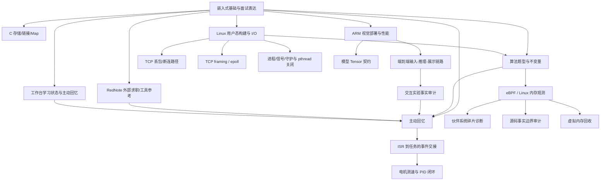

# 嵌入式知识库总索引

## 推荐学习路径

1. [嵌入式核心八股](tools/distillation/embedded-core/INDEX.md)：先建立 C/通信/ARM Linux/面试表达骨架。
2. [RTOS 油烟机项目](tools/distillation/rtos-project/INDEX.md)：理解任务、ISR、同步、控制和升级如何组成完整产品。
3. [Linux 物理内存检测项目](tools/distillation/linux-memory-ebpf/INDEX.md)：从 eBPF 数据链路进入 Linux 内存与源码审计。
4. [Linux 视觉感知项目](tools/distillation/linux-vision/INDEX.md)：练习端到端视觉流水线和 ARM 平台性能优化。
5. [Linux 用户态教程](tools/distillation/linux-systems-tutorial/INDEX.md)：补齐构建、文件描述符、进程线程和 Socket 多路复用。
6. [LeetCode 学习体系](tools/distillation/leetcode-algorithm-learning/INDEX.md)：用约束识别、状态推导和主动回忆训练迁移能力。
7. [交互实验与事实边界](tools/distillation/interactive-learning-labs/INDEX.md)：用模型、源码和测试核对派生教学材料。
8. [vault 方法与工具](tools/distillation/vault-methodology-and-tools/INDEX.md)：学习如何维护来源、去重和同步规范源。
9. [工作台学习状态](tools/distillation/workbench-learning-state/INDEX.md)：把 360 条学习记录、来源和主动回忆状态纳入真实复习闭环。
10. [RedNote 外部参考](tools/distillation/rednote-bookmarks/INDEX.md)：只把第三方收藏当作求职、面试和工具观察材料，先核验再吸收。

项目真实性核验：先看 [项目验证运行手册](PROJECT_VALIDATION_RUNBOOK.md)，再按项目进入 [RTOS provenance](artifact-provenance.md)、[Linux 内存/eBPF 可运行性矩阵](runtime-validation-matrix.md) 或 [Linux 视觉主链核验矩阵](main-chain-verification-matrix.md)。

全仓库覆盖边界：先看 [全量覆盖复核](tools/distillation/FULL_COVERAGE_REVIEW.md)；它把“已登记”“已精确回链”“仅范围覆盖”“未回链”和“过期派生登记”分开统计，不把附件或历史派生物当作已理解知识。

继续蒸馏前先看 [下一轮开放队列](OPEN_QUEUES.md)，其中区分需要用户选择、真实客户端会话和目标环境验证的事项。

本轮候选审查入口：[embedded-core 未回链主题卡](tools/distillation/embedded-core/unlinked-topic-cards.md) 与 [Linux vision 未回链主题卡](tools/distillation/linux-vision/unlinked-topic-cards.md)。它们是待验证的主题聚合，不改变当前 56 个规范 Skill 的数量；分流理由和证据补强队列分别见各域的 `candidate-triage.md` 与 `coverage-improvement-notes.md`。

## 跨域关系

## 工作台与规范 Skill 源

工作台学习状态的派生审计见 [workbench-learning-state/](workbench-learning-state/)，包括 360 条记录、原始来源映射和状态边界；具体复习队列见 [`ACTIVE_RECALL_PLAN.md`](ACTIVE_RECALL_PLAN.md)。算法 PDF 只作为有限证据域使用，逐页主题卡和公式/图片缺口见 [`page-topic-cards.md`](page-topic-cards.md) 与 [`formula-figure-gap-register.tsv`](formula-figure-gap-register.tsv)。

按自然语言触发场景查 Skill： [Skill 触发入口索引](skill-trigger-index.md)；沿相邻 Skill 组合查 [Skill 相关关系索引](skill-related-index.md)。RTOS、UDP、视觉、CMake 和 TCP 的串路由边界见 [混合意图路由对抗矩阵](skill-mixed-intent-matrix.md)。检查 ZCode 活动副本： [客户端逐 Skill 副本审计](client-skill-audit.md)。

如果要记录 ZCode 的真实 Skill 路由，请使用 [客户端真实盲测记录模板](CLIENT_BLIND_TEST_TEMPLATE.md)；静态 6/6 与真实会话命中率分开记录。

## 规范 Skill 源

规范 Skill 数量以 `audit-report.json` 为准（当前基线 56 个；新增候选须通过严格审计），位于 [skills/](./skills/)。嵌入式核心新增的生命周期、二进制合同、UDP、数值合同、文件持久化、用户态定时、C 存储/链接、C++ 生命周期、STM32 采样、Linux TCP、Linux 虚拟内存和 Linux 驱动边界 Skill 见 [embedded-core/INDEX.md](tools/distillation/embedded-core/INDEX.md)；RTOS 周期、显示反馈和 build→flash→runtime provenance，Linux 内存快速路径/Map 计数，Linux 进程/线程/RX/NAPI 接收路径，视觉文件 IPC/build provenance/Tensor 契约/Qt 事件循环/CMake source discovery/Mat→Qt/资源遥测分别见各域索引。同步状态和 ZCode 发现路径说明见 [CLIENT_INSTALL.md](CLIENT_INSTALL.md) 与 [ZCODE_SCOPE.md](ZCODE_SCOPE.md)；每个 Skill 的测试清单见 [压力测试矩阵](skill-pressure-test-matrix.md)。
